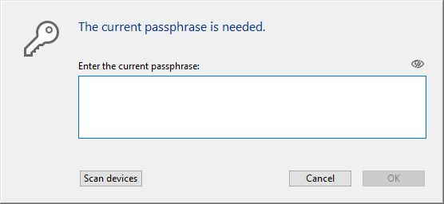

このページを使用して、データベースの各テーブルに対して定義された **暗号化可能** 属性に基づいて、データファイルを暗号化または _復号化_ (つまりデータから暗号化を解除) することができます。

:::info

4D のデータ暗号化についての詳細な情報に関しては、_デザインリファレンス_ マニュアルの [データの暗号化](https://doc.4d.com/4Dv20/4D/20/Encrypting-data.300-6263735.ja.html) の章を参照してください。 また、[A deeper look into 4D data encryption](https://blog.4d.com/a-deeper-look-into-4d-data-encryption/) のブログ記事 (英文) も参照ください。

:::

暗号化/復号化操作をおこなうたびに、新しいフォルダーが作成されます。 そのフォルダーは "Replaced Files (Encrypting) _yyyy-mm-dd hh-mm-ss_" あるいは "Replaced Files (Decrypting) _yyyy-mm-dd hh-mm-ss_" と名前が付けられます。

> 暗号化は [メンテナンスモード](overview.md#メンテナンスモードでの表示) でのみ利用可能です。 標準モードでこの操作を実行しようとすると、警告ダイアログが表示され、アプリケーションを終了してメンテナンスモードで再起動することを知らせます。

**Warning:**

- データファイルの暗号化は時間がかかる操作です。 実行中は (ユーザーによって割り込み可能な) 進捗インジケーターが表示されます。 また、アプリケーションの暗号化操作には必ず圧縮のステップが含まれるという点に注意してください。
- 暗号化操作をおこなうたびに、その操作はデータファイルのコピーを作成し、その結果アプリケーションファイルのサイズは増大します。 アプリケーションのサイズが過剰に増加しな いよう、これを考慮することが大切です (とくに、4Dアプリケーションがパッケージとして表示される macOS の場合)。 パッケージのサイズを小さく保つには、パッケージ内オリジナルファイルのコピーを手動で削除/移動することも役立ちます。

## データを初めて暗号化する場合

MSC でデータファイルを初めて暗号化する場合、以下のような手順を踏む必要があります:

1. ストラクチャーエディターにおいて、データを暗号化したいテーブルに対して **暗号化可能** 属性にチェックを入れます。 詳細は "テーブルプロパティ" の章を参照してください。
2. MSC の暗号化ページを開きます。
   どのテーブルにも **暗号化可能** 属性を付けないでページを開こうとした場合、ページに以下のメッセージが表示されます:
   
   そうでない場合には、以下のメッセージが表示されます:
   

   このメッセージは、少なくとも 1つのテーブルに対して **暗号化可能** 属性のステータスが変更されていて、データファイルがまだ暗号化されていないことを意味します。
   **注:** すでに暗号化されているデータファイル、または復号化されたデータファイルに対して、**暗号化可能** 属性のステータスが変更された場合にも同じメッセージが表示されます (以下参照)。

3. 暗号化ピクチャーボタンをクリックします。\
   \
   データファイル用パスフレーズの入力を促されます:
   
   パスフレーズはデータ暗号化キーを生成するのに使用されます。 パスフレーズはパスワードの強化版のようなもので、大量の文字を含めることができます。 たとえば、"We all came out to Montreux" あるいは "My 1st Great Passphrase!!" のようなパスフレーズを入力することが可能です。
   パスフレーズの安全性は、セキュリティレベルインジケーターによって確認できます:
   
   (濃い緑色は、もっとも安全なレベルであることを示します)。
4. Enter を押して安全なパスフレーズの入力を確定します。

暗号化プロセスがスタートします。 MSC が標準モードで開かれていた場合、アプリケーションはメンテナンスモードで再起動されます。

4D では暗号化キーを保存することができます (以下の [暗号化キーを保存する](#暗号化キーを保存する) の段落を参照してください)。 暗号化キーの保存は、このタイミングか、あるいは後でおこなうこともできます。 また暗号化ログファイルを開くこともできます。

暗号化プロセスが正常に完了した場合、暗号化ページは <a href="#暗号化メンテナンスオペレーション">暗号化メンテナンスオペレーション</a> ボタンを表示します。

**警告**: 暗号化操作の最中、4D は新しい、空のデータファイルを作成したうえで、元のデータファイルからデータを注入します。 "暗号化可能" テーブルに属しているレコードは暗号化後にコピーされ、他のレコードは単にコピーされるだけです (圧縮オペレーションも実行されます)。 操作が正常に完了した場合、もとのデータファイルは "Replaced Files (Encrypting)" フォルダーへ移動されます。 暗号化されたデータファイルを配布する場合、暗号化されていないデーファイルをアプリケーションフォルダーからすべて移動/削除しておくようにしてください。

## 暗号化メンテナンスオペレーション

アプリケーションが暗号化されているとき (上記参照)、暗号化ページでは、標準のシナリオに対応した様々の暗号化メンテナンスオペレーションを提供します。

### カレントの暗号化キーを入力する

セキュリティ上の理由から、すべての暗号化メンテナンスオペレーションはカレントのデータ暗号化キーの入力を要求します。

- データ暗号化キーが既に 4Dキーチェーン (1) に読み込まれている場合、そのキーは 4D によって自動的に再利用されます。
- データ暗号化キーが見つからない場合、それを入力する必要があります。 以下のようなダイアログが表示されます:
  

この段階では 2つの選択肢があります:

- カレントのパスフレーズ (2) を入力し、**OK** をクリックする。
  OR
- USBキーなどのデバイスを接続して、**デバイスをスキャン** ボタンをクリックする。

(1) 4Dキーチェーンは、アプリケーションのセッション中に入力されたすべての有効なデータ暗号化キーを保管します。\
(2) カレントのパスフレーズとは、カレントのデータ暗号化キーを生成するのに使用されたパスフレーズです。

いずれの場合においても、有効なパスフレーズ/暗号化キーが提供されると、4D は (まだメンテナンスモードではなかった場合は) メンテナンスモードで再起動し、選択されたオペレーションを実行します。

### カレントの暗号化キーでデータを再暗号化する

この操作は、データを格納している 1つ以上のテーブルにおいて **暗号化可能** 属性が変更された場合に有用です。 この場合、データの整合性を保つために、4D はアプリケーション内のそのテーブルのレコードへの書き込みアクセスを禁止します。 有効な暗号化ステータスを得るために、データの再暗号化が必要になります。

1. **カレントの暗号化キーでデータを再暗号化** をクリックします。
2. カレントのデータ暗号化キーを入力します。

データファイルがカレントのデータ暗号化キーで正常に再暗号化され、確認メッセージが表示されます:

### パスフレーズを変更してデータを再暗号化する

この操作は、カレントの暗号化データキーを変更したい場合に有用です。 たとえば、セキュリティ上のルール (3ヶ月ごとにパスプレーズを変更する必要があるなど) を遵守するために変更をおこないたいケースが考えられます。

1. **パスフレーズを変更してデータを再暗号化する** をクリックします。
2. カレントのデータ暗号化キーを入力します。
3. 新しいパスフレーズを入力します (セキュリティのため、2度入力します):
   
   新しいキーでデータファイルが暗号化され、確認メッセージが表示されます:
   

### 全データを復号化

この操作は、データファイルからすべての暗号化を取り除きます。 データを暗号化しておきたくない場合、以下の手順に従ってください:

1. **全データを復号化** をクリックします。
2. カレントのデータ暗号化キーを入力します (<a href="#カレントの暗号化キーを入力する">カレントの暗号化キーを入力する</a> 参照)。

データが完全に復号化され、確認メッセージが表示されます:

> データファイルが復号化されると、テーブルの暗号化ステータスは暗号化可能属性と合致しなくなります。 ステータスを合致させるためには、データベースのストラクチャーレベルにおいてすべての **暗号化可能** 属性を選択解除しなければなりません。

## 暗号化キーを保存する

4D ではデータ暗号化キーを専用ファイルに保存しておくことができます。 ファイル名には、`.4DKeyChain` の拡張子が必要です (例: "myKeys.4DKeyChain")。 このファイルを USBキーなどの外部デバイスに保存しておくと、暗号化されたアプリケーションを使うのが簡単になります。なぜならユーザーは暗号化されたデータにアクセスするには、アプリケーションを開く前にデバイスを接続してキーを提供すればよいからです。

新しいパスフレーズが提供されるたびに暗号化キーを保存することができます:

- アプリケーションが最初に暗号化されたとき
- アプリケーションが新しいパスフレーズで再暗号化されたとき

連続した暗号化キーを同じデバイスに保存することが可能です。

:::caution

[自動復元とログの統合](../Backup/settings.md#自動復元とログの統合) 機能を使用する場合、デバイスの一番上の階層にデータ暗号化キーファイルを保存することが必須となります。 復元処理がトリガーされるとき、4D は暗号化キーファイルにアクセスできなくてはなりません。できない場合には、エラーが発生します。

:::

## ログファイル

暗号化オペレーションが完了すると、4D はアプリケーションの Logsフォルダー内にファイルを生成します。 このファイルは XML形式で作成され、"_ApplicationName_Encrypt_Log_yyyy-mm-dd hh-mm-ss.xml_" または "_ApplicationName_Decrypt_Log_yyyy-mm-dd hh-mm-ss.xml_" という名前がつけられます。

新しくログファイルが生成されるたび、MSCページに <strong x-id="1">ログファイルを開く</strong> ボタンが表示されます。

このログファイルには、暗号化/復号化プロセスの間に実行された内部オペレーションがすべて記録されているほか、エラー (あれば) が記録されています。
