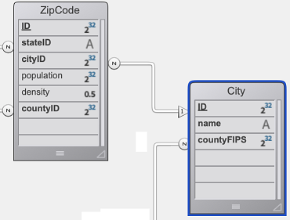
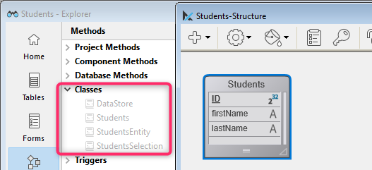
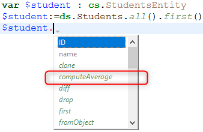

ORDA を使用して、データモデル上に高レベルクラス関数を作成することができます。 これによってビジネス指向のコードを書き、APIのように "公開" することができます。 データストア、データクラス、エンティティ、およびエンティティセレクションはそれぞれ、関数を持つことのできるクラスオブジェクトとして提供されています。

たとえば、選択中の社員より給与の高い社員一覧を返す `getNextWithHigherSalary()` 関数を `EmployeeEntity` クラスに作成したとします。 この関数は簡単に呼び出すことができます:

```4d
$nextHigh:=ds.Employee.get(1).getNextWithHigherSalary()
```

これらの関数はローカルデータストアだけでなく、クライアント/サーバーやリモートアーキテクチャーでも使用することができます:

```4d
 //$cityManager はリモートデータストアへの参照です
Form.comp.city:=$cityManager.City.getCityName(Form.comp.zipcode)
```

この機能により、4D アプルケーションのビジネスロジックをまるごと独立したレイヤーに保存し、高レベルのセキュリティで簡単に管理・利用することができます:

- わかりやすく使いやすい関数のみを公開し、その裏にある構造の複雑性を "隠す" ことができます。

- 構造が発展した場合には影響を受ける関数を適応させるだけで、クライアントアプリケーションは引き続き透過的にそれらを呼び出すことができます。

- デフォルトでは、データモデルクラス関数 ([計算属性関数](#計算属性-1) 含む) および [エイリアス属性](エイリアス属性-1) はすべて、リモートアプリケーションに対して **非公開** に設定されており、RESTリクエストで呼び出すことはできません。 公開する関数やエイリアスは [`exposed`](#公開vs非公開関数) キーワードによって明示的に宣言する必要があります。


各データモデルオブジェクトに関わるクラスは、4D によって [あらかじめ自動的に作成](#クラスの作成) されます。

## アーキテクチャー

ORDA では、**`4D`** [クラスストア](Concepts/classes.md#クラスストア) を介して公開される **汎用クラス** と、**`cs`** [クラスストア](Concepts/classes.md#クラスストア) で公開される **ユーザークラス** が提供されています:


ORDA データモデルクラスはすべて **`cs`** クラスストアのプロパティとして公開されます。 次の ORDA クラスが提供されています:

| クラス                                         | 例                                    | 次によってインスタンス化されます                                                                                                                                                                                                                                                                                                                                                                                                                                                                                                                                                                                                                                                                                                                                                                                                                                                       |
| ------------------------------------------- | ------------------------------------ | ---------------------------------------------------------------------------------------------------------------------------------------------------------------------------------------------------------------------------------------------------------------------------------------------------------------------------------------------------------------------------------------------------------------------------------------------------------------------------------------------------------------------------------------------------------------------------------------------------------------------------------------------------------------------------------------------------------------------------------------------------------------------------------------------------------------------------------------------------------------------- |
| cs.DataStore                | cs.DataStore         | [`ds`](commands/ds.md) command                                                                                                                                                                                                                                                                                                                                                                                                                                                                                                                                                                                                                                                                                                                                                                                                                                         |
| cs.*DataClassName*          | cs.Employee          | [`dataStore.DataClassName`](API/DataStoreClass.md#dataclassname), `dataStore["DataClassName"]`                                                                                                                                                                                                                                                                                                                                                                                                                                                                                                                                                                                                                                                                                                                                                                         |
| cs.*DataClassName*Entity    | cs.EmployeeEntity    | [`dataClass.get()`](API/DataClassClass.md#get), [`dataClass.new()`](API/DataClassClass.md#new), [`entitySelection.first()`](API/EntitySelectionClass.md#first), [`entitySelection.last()`](API/EntitySelectionClass.md#last), [`entity.previous()`](API/EntityClass.md#previous), [`entity.next()`](API/EntityClass.md#next), [`entity.first()`](API/EntityClass.md#first), [`entity.last()`](API/EntityClass.md#last), [`entity.clone()`](API/EntityClass.md#clone)                                                                                                                                                                                                                                                                                                                                                                                                   |
| cs.*DataClassName*Selection | cs.EmployeeSelection | [`dataClass.query()`](API/DataClassClass.md#query), [`entitySelection.query()`](API/EntitySelectionClass.md#query), [`dataClass.all()`](API/DataClassClass.md#all), [`dataClass.fromCollection()`](API/DataClassClass.md#fromcollection), [`dataClass.newSelection()`](API/DataClassClass.md#newselection), [`entitySelection.drop()`](API/EntitySelectionClass.md#drop), [`entity.getSelection()`](API/EntityClass.md#getselection), [`entitySelection.and()`](API/EntitySelectionClass.md#and), [`entitySelection.minus()`](API/EntitySelectionClass.md#minus), [`entitySelection.or()`](API/EntitySelectionClass.md#or), [`entitySelection.orderBy()`](API/EntitySelectionClass.md#or), [`entitySelection.orderByFormula()`](API/EntitySelectionClass.md#orderbyformula), [`entitySelection.slice()`](API/EntitySelectionClass.md#slice), `Create entity selection` |

> ORDA ユーザークラスは通常のクラスファイル (.4dm) としてプロジェクトの Classes サブフォルダーに保存されます [(後述参照)](#クラスファイル)。

ORDA データモデルユーザークラスのオブジェクトインスタンスは、それらの親クラスのプロパティや関数を使うことができます:

- Datastore クラスオブジェクトは、[ORDA Datastore 汎用クラス](API/DataStoreClass.md) の関数を呼び出すことができます。
- DataClass クラスオブジェクトは、[ORDA DataClass 汎用クラス](API/DataClassClass.md) の関数を呼び出すことができます。
- EntitySelection クラスオブジェクトは [ORDA EntitySelection 汎用クラス](API/EntitySelectionClass.md) の関数を呼び出すことができます。
- Entity クラスオブジェクトは [ORDA Entity 汎用クラス](API/EntityClass.md) の関数を呼び出すことができます。

## クラスの説明

<details><summary>履歴</summary>

| リリース  | 内容                                                                   |
| ----- | -------------------------------------------------------------------- |
| 19 R4 | Entity クラスのエイリアス属性                                                   |
| 19 R3 | Entity クラスの計算属性                                                      |
| 18 R5 | データモデルクラス関数は、デフォルトでは REST に公開されません。 新しい `exposed` および `local` キーワード。 |

</details>

### DataStore クラス

4D のデータベースは、自身の DataStore クラスを `cs` クラスストアに公開します。

- **親クラス**: 4D.DataStoreImplementation
- **クラス名**: cs.DataStore

DataStore クラス内には、`ds` オブジェクトを介して使用する関数を作成することができます。

#### 例題

```4d
// cs.DataStore class

Class extends DataStoreImplementation

Function getDesc
  $0:="社員と会社を公開するデータベース"
```

この関数は次のように使えます:

```4d
$desc:=ds.getDesc() //"社員と会社を..."
```

### DataClass クラス

ORDA で公開されるテーブル毎に、DataClass クラスが `cs` クラスストアに公開されます。

- **親クラス**: 4D.DataClass
- **クラス名**: cs.*DataClassName* (*DataClassName* はテーブル名です)
- **例**: cs.Employee

#### 例題

```4D
// cs.Company クラス


Class extends DataClass

// 収益が平均以上の会社を返します
// Company DataClass にリレートしているエンティティセレクションを返します 

Function GetBestOnes()
    $sel:=This.query("revenues >= :1";This.all().average("revenues"));
    $0:=$sel

```

全会社データから平均以上の会社データをエンティティセレクションに抽出するには次を実行します:

```4d
    var $best : cs.CompanySelection
    $best:=ds.Company.GetBestOnes()

```

:::info

[計算属性](#計算属性) は [Entity クラス](#entity-クラス) において定義されます。

:::

#### リモートデータストアの例

次の *City* カタログをリモートデータストアとして公開しています:



`City クラス` は API を提供しています:

```4d
// cs.City class

Class extends DataClass

Function getCityName()
	var $1; $zipcode : Integer
	var $zip : 4D.Entity
	var $0 : Text

	$zipcode:=$1
	$zip:=ds.ZipCode.get($zipcode)
	$0:=""

	If ($zip#Null)
		$0:=$zip.city.name
	End if
```

クライアントはまず、リモートデータストアのセッションを開始します:

```4d
$cityManager:=Open datastore(New object("hostname";"127.0.0.1:8111");"CityManager")
```

クライアントアプリケーションは API を使い、たとえばフォームに入力された郵便番号 (zipcode) に合致する都市を取得することができます:

```4d
Form.comp.city:=$cityManager.City.getCityName(Form.comp.zipcode)


```

### EntitySelection クラス

ORDA で公開されるテーブル毎に、EntitySelection クラスが `cs` クラスストアに公開されます。

- **親クラス**: 4D.EntitySelection
- **クラス名**: *DataClassName*Selection (*DataClassName* はテーブル名です)
- **例**: cs.EmployeeSelection

#### 例題

```4d
// cs.EmployeeSelection class


Class extends EntitySelection

//Extract the employees with a salary greater than the average from this entity selection

Function withSalaryGreaterThanAverage() : cs.EmployeeSelection
	return This.query("salary > :1";This.average("salary")).orderBy("salary")

```

任意の社員エンティティセレクションより、給与が平均以上の社員を取得するには:

```4d
$moreThanAvg:=ds.Company.all().employees.withSalaryGreaterThanAverage()
```

:::info

[エンティティセレクションを制限する](entities.md#制限付エンティティセレクション) フィルターは [DataClass クラス](#dataclass-クラス) 内で定義されます。

:::

### Entity クラス

ORDA で公開されるテーブル毎に、Entity クラスが `cs` クラスストアに公開されます。

- **親クラス**: 4D.Entity
- **クラス名**: *DataClassName*Entity (*DataClassName* はテーブル名です)
- **例**: cs.CityEntity

#### 計算属性

Entity クラスでは、専用のキーワードを使用して **計算属性** を定義することができます:

- `Function get` *attributeName*
- `Function set` *attributeName*
- `Function query` *attributeName*
- `Function orderBy` *attributeName*

詳細については、[計算属性](#計算属性-1) を参照してください。

#### エイリアス属性

Entity クラスでは、`Alias` キーワードを使用して **エイリアス属性** を定義することができます (通常はリレート属性を対象に定義します):

`Alias` *attributeName* *targetPath*

詳細については、[エイリアス属性](#エイリアス属性-1) を参照してください。

#### 例題

```4d
// cs.CityEntity クラス

Class extends Entity

Function getPopulation() : Integer
    return This.zips.sum("population")


Function isBigCity(): Boolean
// 関数 getPopulation() をクラス内で使用することができます
    return This.getPopulation()>50000

```

次のように関数を呼び出すことができます:

```4d
var $cityManager; $city : Object

$cityManager:=Open datastore(New object("hostname";"127.0.0.1:8111");"CityManager")
$city:=$cityManager.City.getCity("Caguas")

If ($city.isBigCity())
    ALERT($city.name + " は大きな町です。")
End if

```

### 定義規則

データモデルクラスを作成・編集する際には次のルールに留意しなくてはなりません:

- 4D のテーブル名は、**cs** [クラスストア](Concepts/classes.md#クラスストア) 内において自動的に DataClass クラス名として使用されるため、**cs** 名前空間において衝突があってはなりません。 特に:
  - 4D テーブルと [ユーザークラス名](Concepts/classes.md#クラス名) に同じ名前を使用してはいけません。 衝突が起きた場合には、ユーザークラスのコンストラクターは使用不可となります (コンパイラーにより警告が返されます)。
  - 4D テーブルに予約語を使用してはいけません (例: "DataClass")。

- クラス定義の際、[`Class extends`](Concepts/classes.md#class-extends-classname) ステートメントに使用する親クラスの名前は完全に合致するものでなくてはいけません (文字の大小が区別されます)。 たとえば、EntitySelection クラスを継承するには `Class extends EntitySelection` と書きます。

- データモデルクラスオブジェクトのインスタンス化に `new()` キーワードは使えません (エラーが返されます)。 上述の ORDA クラステーブルに一覧化されている、通常の [インスタンス化の方法](#アーキテクチャー) を使う必要があります。

- **`4D`** [クラスストア](Concepts/classes.md#クラスストア) のネイティブな ORDA クラス関数を、データモデルユーザークラス関数でオーバーライドすることはできません。

### プリエンプティブ実行

コンパイル済みの状態では、データモデルクラス関数は次のように実行されます:

- シングルユーザーアプリケーションでは、**プリエンプティブまたはコオペラティブプロセス** で実行されます (呼び出し元のプロセスに依存します)。
- クライアント/サーバーアプリケーションでは、**プリエンプティブプロセス** で実行されます (ただし、[`local`](#ローカル関数) キーワードが使用されている場合は、シングルユーザーの場合と同様に、呼び出し元プロセスに依存します)。

クライアント/サーバーで動作するように設計されているプロジェクトでは、データモデルクラス関数のコードがスレッドセーフであることを確認してください。 スレッドセーフでないコードが呼び出された場合、実行時にエラーが発生します (シングルユーザーアプリケーションではコオペラティブ実行がサポートされているため、コンパイル時にはエラーが発生しません)。

## 計算属性

### 概要

計算属性は、計算をマスクするデータ型を持つデータクラス属性です。 [標準的な 4Dクラス](Concepts/classes.md)は、`get` (*ゲッター*) および `set` (*セッター*) [アクセサー関数](Concepts/classes.md#function-get-と-function-set) を用いて、計算プロパティの概念を実装しています。 ORDA のデータクラス属性はこれを利用し、さらに `query` と `orderBy` の 2つの関数で機能を拡張しています。

計算属性には最低限、その値がどのように算出されるかを記述した `get` 関数が必要です。 属性に*ゲッター*関数が定義されている場合、4D は対応するストレージスペースをデータストアに作成せず、代わりに属性がアクセスされるたびに関数のコードを実行します。 属性がアクセスされなければ、コードも実行されません。

計算属性は、その属性に値が割り当てられたときに実行される `set` 関数を実装することもできます。 *セッター*関数は、割り当てられた値をどのように処理するかを記述します。通常は、1つ以上のストレージ属性や、場合によっては他のエンティティにリダイレクトします。

ストレージ属性と同様に、計算属性も **クエリ** に含めることができます。 デフォルトでは、ORDA のクエリで計算属性が使用された場合、その属性はエンティティ毎に一度計算されます。 場合によっては、これで十分です。 しかし、特にクライアント/サーバーにおいてはパフォーマンスを向上させるため、実際のデータクラス属性に基づいた `query` 関数を計算属性に実装することで、それらのインデックスの恩恵を受けることができます。

同様に、計算属性を **並べ替え** に含めることもできます。 デフォルトでは、ORDA の並べ替えで計算属性が使用された場合、その属性はエンティティ毎に一度計算されます。 クエリと同様に、実際のデータクラス属性に基づいた `orderBy` 関数を計算属性に実装することで、パフォーマンスを向上させることができます。

### 計算属性の定義

計算属性を作成するには、データクラスの [**Entity クラス**](#entity-クラス) に `get` アクセサー関数を定義します。 計算属性は、データクラス属性およびエンティティ属性として自動的に利用可能になります。

その他の計算属性の関数 (`set`、`query`、`orderBy`) も、Entityクラスに定義することができます。 これらの関数の定義は任意です。

計算属性の関数内において、[`This`](Concepts/classes.md#this) はエンティティを指します。 計算属性は、他のデータクラス属性と同様に使用することができます。つまり、[Entity クラス](API/EntityClass.md) や [EntitySelection クラス](API/EntitySelectionClass.md) の関数によっても同様に処理されます。

> ORDA の計算属性は、デフォルトでは [**公開**](#公開vs非公開関数) されません。 計算属性を公開するには、**get 関数** の定義に `exposed` キーワードを追加します。

> **get および set関数**は、クライアント/サーバー処理を最適化するために、[**local**](#ローカル関数) プロパティを持つこともできます。

### `Function get <attributeName>`

#### シンタックス

```4d
{local} {exposed} Function get <attributeName>({$event : Object}) -> $result : type
// コード
```

*ゲッター* 関数は、*attributeName* 計算属性を宣言するために必須です。 *attributeName* がアクセスされるたびに、4D は `Function get` のコードを評価し、*$result* 値を返します。

> 計算属性は、他の計算属性の値を使用することができます。 再帰的な呼び出しはエラーになります。

*ゲッター* 関数は、*$result* パラメーターに基づいて、計算属性のデータ型を定義します。 以下の結果の型が可能です:

- スカラー (テキスト、ブール、日付、時間、数値)
- オブジェクト
- ピクチャー
- BLOB
- エンティティ (例: cs.EmployeeEntity)
- エンティティセレクション (例: cs.EmployeeSelection)

*$event* パラメーターは、以下のプロパティが含みます:

| プロパティ         | 型       | 説明                                                |
| ------------- | ------- | ------------------------------------------------- |
| attributeName | Text    | 計算属性の名称                                           |
| dataClassName | Text    | データクラスの名称                                         |
| kind          | Text    | "get"                                             |
| 戻り値           | Variant | 任意。 スカラー属性が Null を返すようにするには、このプロパティを Null値で追加します。 |

#### 例題

- *fullName* 計算属性:

```4d
Function get fullName($event : Object)-> $fullName : Text

  Case of 	
	: (This.firstName=Null) & (This.lastName=Null)
		$event.result:=Null //use result to return Null
	: (This.firstName=Null)
		$fullName:=This.lastName
	: (This.lastName=Null)
		$fullName:=This.firstName
	Else
		$fullName:=This.firstName+" "+This.lastName
	End case
```

- 計算属性は、エンティティにリレートされた属性に基づいて定義することができます。

```4d
Function get bigBoss($event : Object)-> $result: cs.EmployeeEntity
	$result:=This.manager.manager

```

- 計算属性は、エンティティセレクションにリレートされた属性に基づいて定義することができます。

```4d
Function get coWorkers($event : Object)-> $result: cs.EmployeeSelection
    If (This.manager.manager=Null)
        $result:=ds.Employee.newSelection()
    Else
        $result:=This.manager.directReports.minus(this)
    End if
```

### `Function set <attributeName>`

#### シンタックス

```4d

{local} Function set <attributeName>($value : type {; $event : Object})
// コード

```

*セッター* 関数は、属性に値が割り当てられたときに実行されます。 この関数は通常、入力値を処理し、その結果を 1つ以上の他の属性に転送します。

*$value* パラメーターは、属性に割り当てられた値を受け取ります。

*$event* パラメーターは、以下のプロパティが含みます:

| プロパティ         | 型       | 説明               |
| ------------- | ------- | ---------------- |
| attributeName | Text    | 計算属性の名称          |
| dataClassName | Text    | データクラスの名称        |
| kind          | Text    | "set"            |
| value         | Variant | 計算属性によって処理されるべき値 |

#### 例題

```4d
Function set fullName($value : Text; $event : Object)
    var $p : Integer
    $p:=Position(" "; $value)       
    This.firstname:=Substring($value; 1; $p-1)  // "" if $p<0
    This.lastname:=Substring($value; $p+1)

```

### `Function query <attributeName>`

#### シンタックス

```4d
Function query <attributeName>($event : Object)
Function query <attributeName>($event : Object) -> $result : Text
Function query <attributeName>($event : Object) -> $result : Object
// コード
```

このメソッドは 3種類のシンタックスを受け入れます:

- 最初のシンタックスでは、`$event.result` オブジェクトプロパティを通じてクエリ全体を処理します。
- 2番目と 3番目のシンタックスでは、関数は *$result* に値を返します:

  - *$result* がテキストの場合、それは有効なクエリ文字列でなければなりません。
  - *$result* がオブジェクトの場合、次の 2つのプロパティを含まなければなりません:

  | プロパティ                              | 型          | 説明                                                                                     |
  | ---------------------------------- | ---------- | -------------------------------------------------------------------------------------- |
  | $result.query      | Text       | プレースホルダー (:1, :2, など) を使った有効なクエリ文字列 |
  | $result.parameters | Collection | プレースホルダーに渡す値                                                                           |

`query` 関数は、計算属性を使用するクエリが開始されるたびに実行されます。 インデックス付きの属性を利用することで、クエリをカスタマイズしたり最適化したりすることができます。 計算属性に対して `query` 関数が実装されていない場合、検索は常にシーケンシャルにおこなわれます (`get <AttributeName>` 関数によるすべての値の評価に基づきます)。

> 以下の機能はサポートされていません:
>
> - エンティティ、またはエンティティセレクション型の計算属性に対する `query` 関数の呼び出し
> - 結果のクエリ文字列における `order by` キーワードの使用

*$event* パラメーターは、以下のプロパティが含みます:

| プロパティ         | 型       | 説明                                                                                                                                                                                                                                                                                                                                                                                                                                                                                                                                                                                                                                                                                                                    |
| ------------- | ------- | --------------------------------------------------------------------------------------------------------------------------------------------------------------------------------------------------------------------------------------------------------------------------------------------------------------------------------------------------------------------------------------------------------------------------------------------------------------------------------------------------------------------------------------------------------------------------------------------------------------------------------------------------------------------------------------------------------------------- |
| attributeName | Text    | 計算属性の名称                                                                                                                                                                                                                                                                                                                                                                                                                                                                                                                                                                                                                                                                                                               |
| dataClassName | Text    | データクラスの名称                                                                                                                                                                                                                                                                                                                                                                                                                                                                                                                                                                                                                                                                                                             |
| kind          | Text    | "query"                                                                                                                                                                                                                                                                                                                                                                                                                                                                                                                                                                                                                                                                                                               |
| value         | Variant | 計算属性によって処理されるべき値                                                                                                                                                                                                                                                                                                                                                                                                                                                                                                                                                                                                                                                                                                      |
| operator      | Text    | クエリ演算子 ([`query` クラス関数も参照ください](API/DataClassClass.md#query))。 とりうる値:<li>== (と等しい; @ はワイルドカード)</li><li>=== (と等しい; @ はワイルドカードでない)</li><li>!= (と等しくない; @ はワイルドカード)</li><li>!== (と等しくない; @ はワイルドカードでない)</li><li>&lt; (小さい)</li><li><= (less than or equal to)</li><li>&gt; (大きい)</li><li>&gt;= (以上)</li><li>IN (含まれる)</li><li>% (キーワードを含む)</li> |
| 戻り値           | Variant | 計算属性によって処理されるべき値。 4D がデフォルトクエリ (計算属性では常にシーケンシャル) を実行するようにしたい場合は、このプロパティに `Null` を渡します。                                                                                                                                                                                                                                                                                                                                                                                                                                                                                                                                                                                                             |

> 関数が *$result* に値を返し、`$event.result` プロパティにも別の値が割り当てられている場合、`$event.result` が優先されます。

#### 例題

- *fullName* 計算属性のクエリ:

```4d
Function query fullName($event : Object)->$result : Object

	var $fullname; $firstname; $lastname; $query : Text
	var $operator : Text
	var $p : Integer
	var $parameters : Collection

	$operator:=$event.operator
	$fullname:=$event.value

	$p:=Position(" "; $fullname)
	If ($p>0)
		$firstname:=Substring($fullname; 1; $p-1)+"@"
		$lastname:=Substring($fullname; $p+1)+"@"
		$parameters:=New collection($firstname; $lastname) // two items collection
	Else
		$fullname:=$fullname+"@"
		$parameters:=New collection($fullname) // single item collection
	End if

	Case of
	: ($operator="==") | ($operator="===")
		If ($p>0)
			$query:="(firstName = :1 and lastName = :2) or (firstName = :2 and lastName = :1)"
		Else
			$query:="firstName = :1 or lastName = :1"
		End if
	: ($operator="!=")
		If ($p>0)
			$query:="firstName != :1 and lastName != :2 and firstName != :2 and lastName != :1"
		Else
			$query:="firstName != :1 and lastName != :1"
		End if
	End case

	$result:=New object("query"; $query; "parameters"; $parameters)
```

> ユーザーのテキスト入力に基づくクエリでは、セキュリティ上の理由からプレースホルダーを使用することが推奨されています ([`query()` の説明](API/DataClassClass.md#query) 参照)。

呼び出しコードの例:

```4d
$emps:=ds.Employee.query("fullName = :1"; "Flora Pionsin")
```

- この関数は *age (年齢)* 計算属性に対するクエリを処理し、パラメーターを含むオブジェクトを返します:

```4d
Function query age($event : Object)->$result : Object

	var $operator : Text
	var $age : Integer
	var $_ages : Collection

	$operator:=$event.operator

	$age:=Num($event.value)  // integer
	$d1:=Add to date(Current date; -$age-1; 0; 0)
	$d2:=Add to date($d1; 1; 0; 0)
	$parameters:=New collection($d1; $d2)

	Case of

		: ($operator="==")
			$query:="birthday > :1 and birthday <= :2"  // after d1 and before or egal d2

		: ($operator="===")

			$query:="birthday = :2"  // d2 = second calculated date (= birthday date)

		: ($operator=">=")
			$query:="birthday <= :2"

			//... other operators			


	End case


	If (Undefined($event.result))
		$result:=New object
		$result.query:=$query
		$result.parameters:=$parameters
	End if

```

呼び出しコードの例:

```4d
// people aged between 20 and 21 years (-1 day)
$twenty:=people.query("age = 20")  // calls the "==" case

// people aged 20 years today
$twentyToday:=people.query("age === 20") // equivalent to people.query("age is 20")

```

### `Function orderBy <attributeName>`

#### シンタックス

```4d
Function orderBy <attributeName>($event : Object)
Function orderBy <attributeName>($event : Object)-> $result : Text

// コード
```

`orderBy` 関数は、計算属性で並べ替えされるたびに実行されます。 これにより、計算属性で並べ替えることができます。 たとえば、*fullName* を名字、名前の順にソートしたり、逆に名字、名前の順にソートすることができます。
計算属性に対して `orderBy` 関数が実装されていない場合、並べ替えは常にシーケンシャルにおこなわれます (`get <AttributeName>` 関数によるすべての値の評価に基づきます)。

> Entity クラス、または EntitySelection クラス型の計算属性に対する `orderBy` 関数の呼び出しは **サポートされていません**。

*$event* パラメーターは、以下のプロパティが含みます:

| プロパティ         | 型       | 説明                                                   |
| ------------- | ------- | ---------------------------------------------------- |
| attributeName | Text    | 計算属性の名称                                              |
| dataClassName | Text    | データクラスの名称                                            |
| kind          | Text    | "orderBy"                                            |
| value         | Variant | 計算属性によって処理されるべき値                                     |
| operator      | Text    | "desc" または "asc" (デフォルト)          |
| descending    | Boolean | 降順の場合は `true`, 昇順の場合は `false`                        |
| 戻り値           | Variant | 計算属性によって処理されるべき値。 4D にデフォルトソートを実行させるには、`Null` を渡します。 |

> `operator` と `descending` プロパティのどちらを使っても構いません。 これは、基本的にプログラミングのスタイルの問題です (例題参照)。

`orderBy` 文字列は、`$event.result` オブジェクトプロパティまたは関数の戻り値である *$result* のどちらでにも返すことができます。 関数が *$result* に値を返し、`$event.result` プロパティにも別の値が割り当てられている場合、`$event.result` が優先されます。

#### 例題

次のような条件分岐のコードを書くことができます:

```4d
Function orderBy fullName($event : Object)-> $result : Text
    If ($event.descending=True)
        $result:="firstName desc, lastName desc"
    Else
        $result:="firstName, lastName"
    End if
```

また、次のような短縮コードを書くこともできます:

```4d
Function orderBy fullName($event : Object)-> $result : Text
    $result:="firstName "+$event.operator+", "lastName "+$event.operator


```

場合によっては条件分岐のコードが必要です:

```4d
Function orderBy age($event : Object)-> $result : Text

    If ($event.descending=True)
        $result:="birthday asc"
    Else
        $result:="birthday desc"
    End if

```

## エイリアス属性

### 概要

**エイリアス** 属性は、**ターゲット** 属性と呼ばれるデータモデルの別の属性を元に定義されます。 ターゲット属性には、リレートデータクラス (リレートレベルは無制限) または同じデータクラスのものを使用できます。 エイリアス属性はデータではなく、ターゲット属性へのパスを格納します。 データクラスには、必要な数だけエイリアス属性を定義することができます。

エイリアス属性は、N対Nリレーションを扱うのに便利です。 実装の詳細ではなくビジネスの概念を扱ってコードやクエリを作成できるため、これらの可読性が向上します。

### エイリアス属性の定義

データクラス内にエイリアス属性を作成するには、データクラスの [**Entityクラス**](#entity-クラス) において `Alias` キーワードを使用します。

### `Alias <attributeName> <targetPath>`

#### シンタックス

```
{exposed} Alias <attributeName> <targetPath>
```

*attributeName* は、[プロパティ名の命名規則](../Concepts/identifiers.md#オブジェクトプロパティ) に準拠している必要があります。

*targetPath* は、"employee.company.name" のような、1つ以上のレベルを含む属性パスです。 ターゲット属性が同じデータクラスに属している場合、*targetPath* は属性名となります。

エイリアスは、他のエイリアスのパスに使用することができます。

[計算属性](#計算属性-1) もエイリアスパスに使用することができますが、パスの最後のレベルとしてのみ使用できます。そうでない場合は、エラーが返されます。 たとえば、"fullName" 計算属性がある場合、"employee.fullName" というエイリアスパスは有効です。

> ORDA のエイリアス属性は、デフォルトでは **公開されません**。 リモートリクエストでエイリアスを利用するには、`Alias` キーワードの前に [`exposed`](#公開vs非公開関数) キーワードを追加する必要があります。

### エイリアス属性の使用

エイリアス属性は読み取り専用です (同じデータクラスのスカラー属性に基づく場合は例外です; 最後の例題参照)。 エイリアス属性は、次のようなクラス関数において、ターゲット属性パスの代わりに使用することができます:

| Function                                       |
| ---------------------------------------------- |
| `dataClass.query()`, `entitySelection.query()` |
| `entity.toObject()`                            |
| `entitySelection.toCollection()`               |
| `entitySelection.extract()`                    |
| `entitySelection.orderBy()`                    |
| `entitySelection.orderByFormula()`             |
| `entitySelection.average()`                    |
| `entitySelection.count()`                      |
| `entitySelection.distinct()`                   |
| `entitySelection.sum()`                        |
| `entitySelection.min()`                        |
| `entitySelection.max()`                        |
| `entity.diff()`                                |
| `entity.touchedAttributes()`                   |

> エイリアス属性はサーバー上で計算されることに留意してください。 リモート環境において、エンティティのエイリアス属性を更新するには、エンティティをサーバーから再ロードする必要があります。

### エイリアスのプロパティ

エイリアス属性の [`kind`](../API/DataClassClass.md#attributename) プロパティ (属性の種類) は "alias" です。

エイリアス属性は、ターゲット属性の [`type`](../API/DataClassClass.md#attributename) プロパティを継承します。

- ターゲット属性の [`kind`](../API/DataClassClass.md#attributename) プロパティが "storage" の場合、エイリアス属性の `type` はターゲット属性と同じになります。
- ターゲット属性の [`kind`](../API/DataClassClass.md#attributename) が "relatedEntity" または "relatedEntities" の場合、エイリアスの `type` は `4D.Entity` または `4D.EntitySelection` ("*classname*Entity" または "*classname*Selection") になります。

リレーションに基づくエイリアス属性は、そのターゲット属性のパスを格納する専用の [`path`](../API/DataClassClass.md#attributename) プロパティを持ちます。 同じデータクラスの属性に基づくエイリアス属性は、ターゲット属性と同じプロパティを持ちます (`path` プロパティはありません)。

### 例題

以下のモデルがあるとき:


Teacher データクラスに、教師の生徒をすべて返すエイリアス属性を定義します:

```4d
// cs.TeacherEntity クラス

Class extends Entity

Alias students courses.student //relatedEntities
```

Student データクラスには、生徒の教師をすべて返すエイリアス属性を定義します:

```4d
// cs.StudentEntity クラス

Class extends Entity

Alias teachers courses.teacher //relatedEntities
```

Course データクラスには次を定義します:

- "name" 属性を別名で参照するためのエイリアス属性
- 教師の名前を返すエイリアス属性
- 生徒の名前を返すエイリアス属性

```4d
// cs.CourseEntity class

Class extends Entity

Exposed Alias courseName name //scalar
Exposed Alias teacherName teacher.name //scalar value
Exposed Alias studentName student.name //scalar value

```

すると、以下のクエリを実行することができます:

```4d
// Find course named "Archaeology"
ds.Course.query("courseName = :1";"Archaeology")

// Find courses given by the professor Smith
ds.Course.query("teacherName = :1";"Smith")

// Find courses where Student "Martin" assists
ds.Course.query("studentName = :1";"Martin")

// Find students who have M. Smith as teacher
ds.Student.query("teachers.name = :1";"Smith")

// Find teachers who have M. Martin as Student
ds.Teacher.query("students.name = :1";"Martin")
// Note that this very simple query string processes a complex
// query including a double join, as you can see in the queryPlan:   
// "Join on Table : Course  :  Teacher.ID = Course.teacherID,    
//  subquery:[ Join on Table : Student  :  Course.studentID = Student.ID,
//  subquery:[ Student.name === Martin]]"
```

*courseName* エイリアスの値は編集することができます:

```4d
// エイリアス属性を使って、授業の名称を変更します
$arch:=ds.Course.query("courseName = :1";"Archaeology")
$arch.courseName:="Archaeology II"
$arch.save() //courseName と name は "Archaeology II" に変更されます
```

## 公開vs非公開関数

セキュリティ上の理由により、データモデルクラス関数およびエイリアス属性はデフォルトですべて、リモートリクエストに対し **非公開** (つまりプライベート) に設定されています。

リモートリクエストには次のものが含まれます:

- `Open datastore` によって接続されたリモートの 4Dアプリケーションが送信するリクエスト
- RESTリクエスト

> 通常の 4Dクライアント/サーバーリクエストは影響されません。 このアーキテクチャーにおいては、データモデルクラス関数は常に利用可能です。

公開されていない関数はリモートアプリケーションで利用することができず、RESTリクエストによるオブジェクトインスタンスに対して呼び出すこともできません。 リモートアプリケーションが非公開関数をアクセスしようとすると、"-10729 (未知のメンバー機能です)" エラーが返されます。

リモートリクエストによる呼び出しを許可するには、`exposed` キーワードを使ってデータモデルクラス関数を明示的に宣言する必要があります。 シンタックスは次の通りです:

```4d
// 公開関数の宣言
exposed Function <functionName>   

```

> `exposed` キーワードは、データモデルクラス関数に対してのみ利用可能です。 [通常のユーザークラス](Concepts/classes.md) 関数に対して使った場合、キーワードは無視され、コンパイラーはエラーを返します。

### 例題

公開された関数によって、DataClass クラスのプライベート関数を呼び出します:

```4d
Class extends DataClass

// 公開関数
exposed Function registerNewStudent($student : Object) -> $status : Object

var $entity : cs.StudentsEntity

$entity:=ds.Students.new()
$entity.fromObject($student)
$entity.school:=This.query("name=:1"; $student.schoolName).first()
$entity.serialNumber:=This.computeSerialNumber()
$status:=$entity.save()

// 非公開 (プライベート) 関数
Function computeIDNumber()-> $id : Integer
// 新規ID番号を算出します
$id:=...


```

呼び出し元のコードは次の通りです:

```4d
var $remoteDS; $student; $status : Object
var $id : Integer

$remoteDS:=Open datastore(New object("hostname"; "127.0.0.1:8044"); "students")
$student:=New object("firstname"; "Mary"; "lastname"; "Smith"; "schoolName"; "Math school")

$status:=$remoteDS.Schools.registerNewStudent($student) // OK
$id:=$remoteDS.Schools.computeIDNumber() // エラー (未知のメンバー機能です)
```

## onHttpGet keyword

Use the `onHttpGet` keyword to declare functions that can be called through HTTP requests using the `GET` verb. Such functions can return any web contents, for example using the [`4D.OutgoingMessage`](../API/OutgoingMessageClass.md) class.

The `onHttpGet` keyword is available with:

- ORDA Data model class functions
- [Singletons class functions](../Concepts/classes.md#singleton-classes)

シンタックスは次の通りです:

```4d
// declare an onHttpGet function
exposed onHttpGet Function <functionName>(params) : result
```

:::info

The `exposed` keyword must also be added in this case, otherwise an error will be generated.

:::

:::caution

As this type of call is an easy offered action, the developer must ensure no sensitive action is done in such functions.

:::

### params

A function with `onHttpGet` keyword accepts [parameters](../Concepts/parameters.md).

In the HTTP GET request, parameters must be passed directly in the URL and declared using the `$params` keyword (they must be enclosed in a collection).

```
IP:port/rest/<dataclass>/functionName?$params='[<params>]'
```

See the [Parameters](../REST/classFunctions#parameters) section in the REST server documentation.

### 戻り値

A function with `onHttpGet` keyword can return any value of a supported type (same as for REST [parameters](../REST/classFunctions#parameters)).

:::info

You can return a value of the [`4D.OutgoingMessage`](../API/OutgoingMessageClass.md) class type to benefit from properties and functions to set the header, the body, and the status of the answer.

:::

### 例題

You have defined the following function:

```4d
Class extends DataClass

exposed onHTTPGet Function getThumbnail($name : Text; $width : Integer; $height : Integer) : 4D.OutgoingMessage
	
	var $file := File("/RESOURCES/Images/"+$name+".jpg")
	var $image; $thumbnail : Picture
	var $response := 4D.OutgoingMessage.new()
	
	READ PICTURE FILE($file.platformPath; $image)
	CREATE THUMBNAIL($image; $thumbnail; $width; $height; Scaled to fit)
	$response.setBody($thumbnail)	
	$response.setHeader("Content-Type"; "image/jpeg")
	return $response
```

It can be called by the following HTTP GET request:

```
IP:port/rest/Products/getThumbnail?$params='["Yellow Pack",200,200]'
```

## ローカル関数

クライアント/サーバーアーキテクチャーではデフォルトで、ORDA データモデル関数は **サーバー上で** 実行されます。 関数リクエストとその結果だけが通信されるため、通常はベストパフォーマンスが提供されます。

しかしながら、状況によってはその関数はクライアント側で完結するものかもしれません (たとえば、すでにローカルキャッシュにあるデータを処理する場合など)。 そのような場合には、`local` キーワードを使ってサーバーへのリクエストをおこなわないようにし、アプリケーションのパフォーマンスを向上させることができます。 シンタックスは次の通りです:

```4d
// クライアント/サーバーにおいてローカル実行する関数の宣言
local Function <functionName>   

```

このキーワードを使うと、関数は常にクライアントサイドで実行されます。

> `local` キーワードは、データモデルクラス関数に対してのみ利用可能です。 [通常のユーザークラス](Concepts/classes.md) 関数に対して使った場合、キーワードは無視され、コンパイラーはエラーを返します。

最終的にサーバーへのアクセスが必要になっても (ORDAキャッシュが有効期限切れになった場合など) 関数は動作します。 もっとも、それではローカル実行によるパフォーマンスの向上は見込めないため、ローカル関数がサーバー上のデータにアクセスしないことを確認しておくことが推奨されます。 サーバーに対して複数のリクエストをおこなうローカル関数は、サーバー上で実行されて結果だけを返す関数よりも非効率的です。 たとえば、Schools Entityクラスの次の関数を考えます:

```4d
// 2000年以降の生まれの生徒を検索します  
// local キーワードを適切に使用していない例です
local Function getYoungest
	var $0 : Object
    $0:=This.students.query("birthDate >= :1"; !2000-01-01!).orderBy("birthDate desc").slice(0; 5)

```

- `local` キーワードを **使わない** 場合、1つのリクエストで結果が得られます。
- `local` キーワードを **使う** 場合、4つのリクエストが必要になります: Schools エンティティの students エンティティセレクションの取得、`query()` の実行、`orderBy()` の実行、`slice()` の実行。 この例では、`local` キーワードを使用するのは適切ではありません。

### 例題

#### 年齢の計算

*birthDate* (生年月日) 属性を持つエンティティがある場合に、リストボックス内で呼び出すための `age()` 関数を定義します。 この関数をクライアントサイドで実行することで、リストボックスの各行がサーバーへのリクエストを生成するのを防ぎます。

*StudentsEntity* クラス:

```4d
Class extends Entity

local Function age() -> $age: Variant

If (This.birthDate#!00-00-00!)
    $age:=Year of(Current date)-Year of(This.birthDate)
Else
    $age:=Null
End if
```

#### 属性のチェック

クライアントにロードされ、ユーザーによって更新されたエンティティの属性について、サーバーへ保存リクエストを出すまえに、それらの一貫性を検査します。

*StudentsEntity* クラスのローカル関数 `checkData()` は生徒の年齢をチェックします:

```4d
Class extends Entity

local Function checkData() -> $status : Object

$status:=New object("success"; True)
Case of
    : (This.age()=Null)
        $status.success:=False
        $status.statusText:="The birthdate is missing"

    :((This.age() <15) | (This.age()>30) )
        $status.success:=False
        $status.statusText:="The student must be between 15 and 30 - This one is "+String(This.age())
End case
```

呼び出し元のコード:

```4d
var $status : Object

// Form.student は全属性とともにロードされており、フォーム上で更新されました
$status:=Form.student.checkData()
If ($status.success)
    $status:=Form.student.save() // サーバーを呼び出します
End if
```

## 4D IDE (統合開発環境) におけるサポート

### クラスファイル

ORDA データモデルユーザークラスは、クラスと同じ名称の .4dm ファイルを [通常のクラスファイルと同じ場所](Concepts/classes.md#クラスファイル) (つまり、Project フォルダー内の `/Sources/Classes` フォルダー) に追加することで定義されます。 たとえば、`Utilities` データクラスのエンティティクラスは、`UtilitiesEntity.4dm` ファイルによって定義されます。

### クラスの作成

各データモデルオブジェクトに関わるクラスは、4D によってあらかじめ自動的にメモリ内に作成されます。



> 空の ORDA クラスは、デフォルトではエクスプローラーに表示されません。 表示するにはエクスプローラーのオプションメニューより **データクラスを全て表示** を選択します: 

ORDA ユーザークラスは通常のクラスとは異なるアイコンで表されます。 空のクラスは薄く表示されます:


ORDA クラスファイルを作成するには、エクスプローラーで任意のクラスをダブルクリックします。 4D はクラスファイルを作成し、`extends` ステートメントを自動で追加します。 たとえば、Entity クラスを継承するクラスの場合は:

```
Class extends Entity
```

定義されたクラスはエクスプローラー内で濃く表示されます。

### クラスの編集

定義された ORDA クラスファイルを 4Dコードエディターで開くには、ORDA クラス名を選択してエクスプローラーのオブションメニュー、またはコンテキストメニューの **編集...** を使用するか、ORDA クラス名をダブルクリックします:


ローカルデータストア (`ds`) に基づいた ORDA クラスの場合には、4D ストラクチャーウィンドウからも直接クラスコードにアクセスできます:


### コードエディター

4Dコードエディターにおいて、ORDA クラス型として定義された変数は、自動補完機能の対象となります。 Entity クラス変数の例です:


