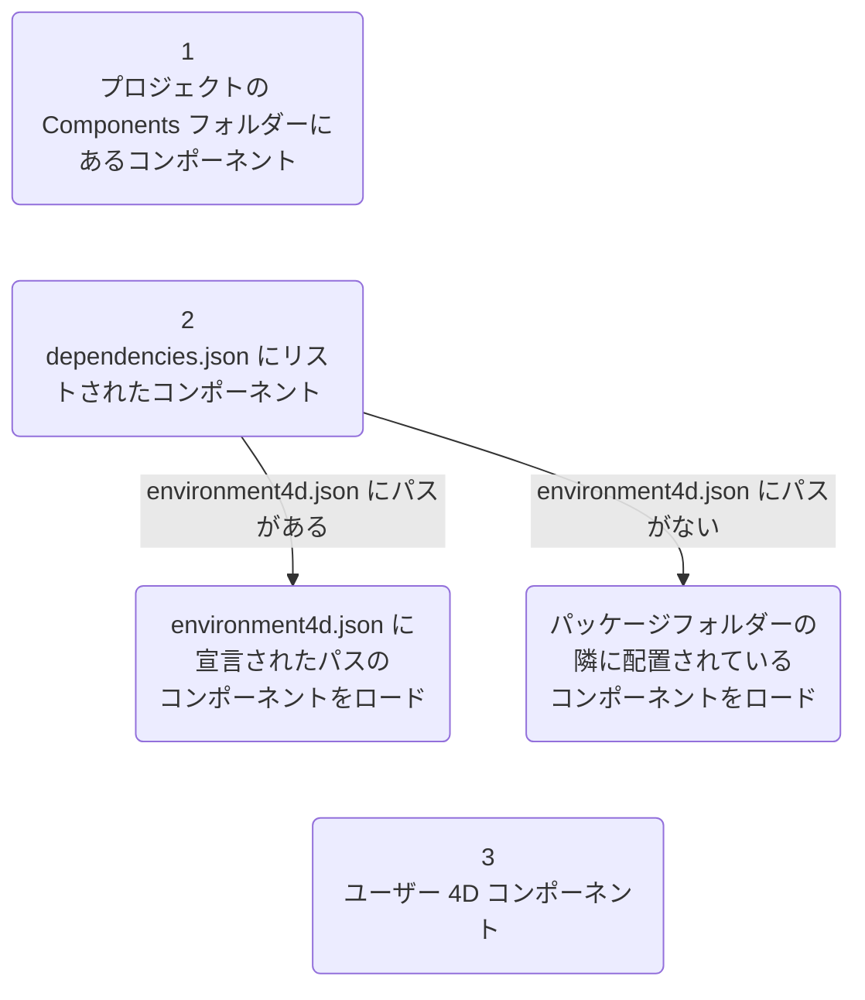
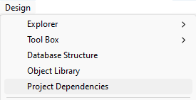
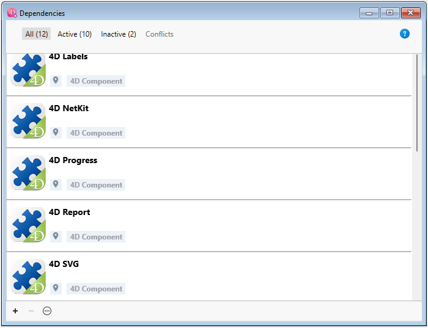
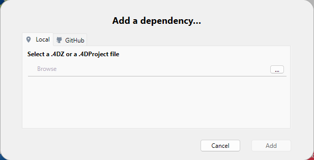
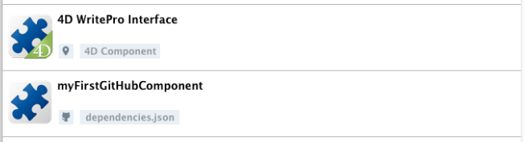

4D のコンポーネントとは、プロジェクトに追加可能な、1つ以上の機能を持つ 4Dコードや 4Dフォームの一式です。 たとえば、[4D SVG](https://github.com/4d/4D-SVG)コンポーネント は、SVGファイルの表示するための高度なコマンドと統合されたレンダリングエンジンを追加します。

独自の 4Dコンポーネントを [開発](../Extensions/develop-components.md) し、[ビルド](../Desktop/building.md) することもできますし、4Dコミュニティによって共有されているパブリックコンポーネントを [GitHubで見つけて](https://github.com/search?q=4d-component\&type=Repositories) ダウンロードすることもできます。

4D で開発する際、コンポーネントファイルはコンピューター上または Githubリポジトリ上に、透過的に保存することができます。

## インタープリターとコンパイル済みコンポーネント

Components can be interpreted or [compiled](../Desktop/building.md). コンポーネントのパッケージフォルダーには以下のいずれかが含まれます:

- プロジェクトフォルダー (インタープリターのコンポーネント)
- または .4DZ ファイル (コンパイル済みコンポーネント)

インタープリターモードで動作する 4Dプロジェクトは、インタープリターまたはコンパイル済みどちらのコンポーネントも使用できます。 コンパイルモードで実行される 4Dプロジェクトでは、インタープリターのコンポーネントを使用できません。 この場合、コンパイル済みコンポーネントのみが利用可能です。

## コンポーネントの読み込み

:::note

このページでは、**4D** と **4D Server** 環境でのコンポーネントの使用方法について説明します。 他の環境では、コンポーネントの管理は異なります:

- [リモートモードの 4D](../Desktop/clientServer.md) では、サーバーがコンポーネントを読み込み、リモートアプリケーションに送信します。
- 統合されたアプリケーションでは、コンポーネントは [ビルドする際に組み込まれます](../Desktop/building.md#プラグインコンポーネントページ)。

:::

### 概要

4Dプロジェクトにコンポーネントを読み込むには、以下の方法があります:

- [プロジェクトの **Components** フォルダー](architecture.md#components) にコンポーネントファイルをコピーします。
- または、プロジェクトの **dependencies.json** ファイルでコンポーネントを宣言します。これは、[**依存関係インターフェースを使用して依存関係を追加**](#依存関係の追加) するときに、ローカルファイルに対して自動的におこなわれます。

**dependencies.json** ファイルで宣言されているコンポーネントは、異なる場所に保存できます:

- 4Dプロジェクトのパッケージフォルダーと同じ階層 (デフォルトの場所です)
- マシン上の任意の場所 (コンポーネントパスは **environment4d.json** ファイル内で宣言する必要があります)
- GitHubリポジトリ (コンポーネントパスは、**dependencies.json** ファイルまたは **environment4d.json** ファイル、あるいはその両方で宣言できます)

同じコンポーネントが異なる場所にインストールされている場合、[優先順位](#優先順位) が適用されます。

### dependencies.json と environment4d.json

#### dependencies.json

**dependencies.json** ファイルは、4Dプロジェクトに必要なすべてのコンポーネントを宣言します。 このファイルは、4Dプロジェクトフォルダーの **Sources** フォルダーに置く必要があります。例:

```
	/MyProjectRoot/Project/Sources/dependencies.json
```

このファイルには次の内容を含めることができます:

- デフォルトパス、または **environment4d.json** ファイルで定義されたパスに [ローカル保存されている](#ローカルコンポーネントの宣言) コンポーネントの名前
- [GitHubリポジトリ](#github保存のコンポーネントの宣言) に保存されているコンポーネントの名前 (パスはこのファイルまたは **environment4d.json** ファイルで定義できます)。

#### environment4d.json

**environment4d.json** ファイルは必須ではありません。 このファイルは、**dependencies.json** ファイル内で宣言された一部またはすべてのコンポーネントのついて、**カスタムパス** を定義するのに使用します。 このファイルは、プロジェクトパッケージフォルダーまたはその親フォルダーのいずれかに保存することができます (ルートまでの任意のレベル)。

このアーキテクチャーの主な利点は次のとおりです:

- **environment4d.json** ファイルをプロジェクトの親フォルダーに保存することで、コミットしないように選択できることです。これにより、ローカルでのコンポーネントの管理が可能になります。
- 複数のプロジェクトで同じ GitHubリポジトリを使用したい場合は、**dependencies.json** ファイルでそれを宣言し、**environment4d.json** ファイルで参照することができます。

### 優先順位

コンポーネントはさまざまな方法でインストールできるため、同じコンポーネントが複数の場所で参照される場合、優先順位が適用されます:

**優先度高**

1. [プロジェクトの **Components** フォルダー](architecture.md#components) に置かれているコンポーネント
2. dependencies.json\*\*ファイルで宣言されたコンポーネント (ローカル環境を構成するために **environment4d.json** で指定されたパスは **dependencies.json** のパスをオーバーライドします)。
3. 内部のユーザー4Dコンポーネント (4D NetKit、4D SVG など)

**優先度低**



同じコンポーネントの別のインスタンス (A) がより高い優先度レベルにあるためにコンポーネント (B) を読み込めない場合、AとBのコンポーネントにはそれぞれ専用の [ステータス](#依存関係のステータス) が付与されます: 読み込まれなかったコンポーネント (B) には *Overloaded* ステータス、読み込まれたコンポーネント (A) には *Overloading* ステータスが与えられます。

### ローカルコンポーネント

ローカルコンポーネントは [**dependencies.json**ファイル](#dependencyjson) にて次のように宣言します:

```json
{
    "dependencies": {
        "myComponent1" : {},
        "myComponent2" : {}
    }
}
```

... 上記の "myComponent1" と "myComponent2" は読み込むコンポーネントの名前です。

デフォルトの (つまり、"myComponent1" と "myComponent2" が [**environment4d.json**](#environment4djson) ファイルで宣言されていない) 場合、4D はコンポーネントのパッケージフォルダー (コンポーネントのプロジェクトルートフォルダーのこと) を 4Dプロジェクトのパッケージフォルダーと同じ階層に探します。例:

```
	/MyProjectRoot/
	/MyProjectComponentRoot/
```

このアーキテクチャーにより、プロジェクトと同じレベルにすべてのコンポーネントにコピーし、**dependencies.json** ファイルで参照することができます。

:::note

**dependencies.json** のアーキテクチャーを利用したくない場合は、[プロジェクトの **Components** フォルダー](architecture.md#components) にコンポーネントをコピーすることで、ローカルコンポーネントをインストールすることもできます。

:::

#### コンポーネントパスのカスタマイズ

ローカルコンポーネントの場所をカスタマイズしたい場合は、プロジェクトフォルダーと同じ階層に保存されていない依存関係のパスを、[**environment4d.json**](#environment4djson) ファイルに定義します。

**相対パス** または **絶対パス** を使用できます (下記参照)。

例:

```json
{
	"dependencies": {
		"myComponent1" : "MyComponent1",
		"myComponent2" : "../MyComponent2",
    "myComponent3" : "file:///Users/jean/MyComponent3"
    }
}
```

:::note

**environment4d.json** ファイルで定義されたコンポーネントのパスが、プロジェクトの開始時に見つからない場合、コンポーネントは読み込まれず、*Not found* [ステータス](#依存関係のステータス) が表示されます。

:::

#### 相対パス vs 絶対パス

パスは、POSIXシンタックスで表します ([POSIXシンタックス](../Concepts/paths#posix-シンタックス) 参照)。

相対パスは、[`environment4d.json`](#environment4djson) ファイルを基準とした相対パスです。 絶対パスは、ユーザーのマシンにリンクされています。

コンポーネントアーキテクチャーの柔軟性と移植性のため、ほとんどの場合、相対パスを使用することが **推奨** されます (特に、プロジェクトがソース管理ツールにホストされている場合)。

絶対パスは、1台のマシンと 1人のユーザーに特化したコンポーネントの場合にのみ使用すべきです。

### GitHub に保存されたコンポーネント

GitHubリリースとして利用可能な 4Dコンポーネントを参照して、4Dプロジェクトに自動で読み込むことができます。

:::note

GitHub に保存されているコンポーネントに関しては、[**dependencies.json**](#dependenciesjson) ファイルと [**environment4d.json**](#environment4djson) ファイルの両方で同じ内容をサポートしています。

:::

#### GitHubリポジトリの設定

GitHub に保存された 4Dコンポーネントを直接参照して使用するには、GitHubコンポーネントのリポジトリを設定する必要があります。

- ZIP形式でコンポーネントファイルを圧縮します。
- GitHubリポジトリと同じ名前をこのアーカイブに付けます。
- このリポジトリの [GitHubリリース](https://docs.github.com/ja/repositories/releasing-projects-on-github/managing-releases-in-a-repository) にアーカイブを統合します。

これらのステップは、4Dコードや GitHubアクションを使用することで簡単に自動化できます。

#### パスの宣言

GitHub に保存されているコンポーネントは [**dependencies.json**ファイル](#dependencyjson) にて次のように宣言します:

```json
{
	"dependencies": {
		"myGitHubComponent1": {
			"github" : "JohnSmith/myGitHubComponent1"
		},
		"myGitHubComponent2": {}
	}
}
```

... 上記の場合、"myGitHubComponent1" は宣言とパス定義の両方がされていますが、"myComponent2" は宣言されているだけです。 そのため、[**environment4d.json**](#environment4djson) ファイルにパスを定義する必要があります:

```json
{
	"dependencies": {
		"myGitHubComponent2": {
			"github" : "JohnSmith/myGitHubComponent2"
		}
	}
}
```

"myGitHubComponent2" は複数のプロジェクトで使用できます。

#### タグとバージョン

GitHub ではリリースを作成するときに、**タグ** と **バージョン** を指定します。

- **タグ** はリリースを一意に参照するテキストです。 [**dependencies.json** ファイル](#dependencyjson) および [**environment4d.json**](#environment4djson) ファイルでは、プロジェクトで使用するリリースタグを指定することができます。 たとえば:

```json
{
	"dependencies": {
		"myFirstGitHubComponent": {
			"github": "JohnSmith/myFirstGitHubComponent",
			"tag": "beta2"
		}
	}
}
```

- リリースは **バージョン** によっても識別されます。 使用されるバージョニング方法は、最も一般的に使用される *セマンティックバージョニング* のコンセプトに基づいています。 各バージョン番号は次のように識別されます: `majorNumber.minorNumber.pathNumber`。 タグと同様に、プロジェクトで使用したいコンポーネントのバージョンを指定することができます。例:

```json
{
	"dependencies": {
		"myFirstGitHubComponent": {
			"github": "JohnSmith/myFirstGitHubComponent",
			"version": "2.1.3"
		}
	}
}
```

バージョンは、使用できるバージョンを定義するために使用します。 [標準的なセマンティックバージョン](https://regex101.com/r/Ly7O1x/3/) を使用します。 範囲は、最小値と最大値を示す 2つのセマンティックバージョンと演算子 ('`< | > | >= | <= | =`') で定義します。 `*` はすべてのバージョンのプレースホルダーとして使用できます。 ~ および ^ の接頭辞は、数字で始まるバージョンを定義し、それぞれ次のメジャーバージョンおよびマイナーバージョンまでの範囲を示します。

以下にいくつかの例を示します:

- "`latest`": GitHubリリースで "latest" バッジを持つバージョン。
- "`*`": リリースされている最新バージョン。
- "`1.*`": メジャーバージョン 1 の全バージョン。
- "`1.2.*`": マイナーバージョン 1.2 のすべてのパッチ。
- "`>=1.2.3`": 1.2.3 を含む、以降の最新バージョン。
- "`>1.2.3`": 1.2.3 を含まない、以降の最新バージョン。
- "`^1.2.3`": バージョン 1.2.3 を含む、以降の最新のバージョン1 (バージョン2未満であること)。
- "`~1.2.3`": バージョン 1.2.3 を含む、以降の最新のバージョン 1.2 (バージョン1.3未満であること)。
- "`<=1.2.3`": 1.2.3 までの最新バージョン。
- "`1.0.0 – 1.2.3`" または ">=1.0.0 <=1.2.3": 1.0.0 から 1.2.3 までのバージョン。
- "`<1.2.3 ||>=2`": 1.2.3 から 2.0.0 未満までを除いたバージョン。

タグやバージョンを指定しない場合、4D は自動的に "latest" バージョンを取得します。

#### プライベートリポジトリ

プライベートリポジトリにあるコンポーネントを統合したい場合は、アクセストークンを使用して接続するよう 4D に指示する必要があります。

これには、GitHubアカウントで **リポジトリ** へのアクセス権を持つ **classic** トークンを作成します。

:::note

詳細については [GitHubトークンのインターフェース](https://github.com/settings/tokens) を参照ください。

:::

次に、[**environment4d.json**](#environment4djson) ファイルに "github" キーを挿入します:

```json
{
	"github": {
		"token": "ghpXXXXXXXXXXXXUvW8x9yZ"
	},
	"dependencies": {

		"mySecondGitHubComponent": {
			"github": "JohnSmith/mySecondGitHubComponent"
		}
	}
}
```

#### 依存関係のローカルキャッシュ

参照された GitHubコンポーネントはローカルのキャッシュフォルダーにダウンロードされ、その後環境に読み込まれます。 ローカルキャッシュフォルダーは以下の場所に保存されます:

- macOs: `$HOME/Library/Caches/<app name>/Dependencies`
- Windows: `C:\Users\<username>\AppData\Local\<app name>\Dependencies`

... 上記で `<app name>` は "4D"、"4D Server"、または "tool4D" となります。

#### dependency-lock.json

プロジェクトの [`userPreferences` フォルダー](architecture.md#userpreferencesusername) に `dependency-lock.json` ファイルが作成されます。

このファイルは、依存関係・パス・url・読み込みエラー・その他の情報などをログに記録します。 これは、コンポーネントの読み込み管理やトラブルシューティングに役立ちます。

## プロジェクトの依存関係の監視

開かれているプロジェクトでは、**依存関係** パネルで依存関係の追加・削除ができるほか、現在の読み込み状態に関する情報を取得することができます。

依存関係パネルを表示するには:

- 4D では、**デザイン/プロジェクト依存関係** メニューアイテムを選択します (開発環境)。<br/>
  

- 4D Server では、**ウインドウ/プロジェクト依存関係** メニューアイテムを選択します。<br/>
  

依存関係パネルが表示されます。 依存関係は ABC順にソートされます。



依存関係インターフェースでは、依存関係を管理することができます (4Dシングルユーザーと4D Server)。 **ローカル** と **GitHub** の依存関係を追加または削除できます。

### ローカルな依存関係の追加

ローカルな依存関係を追加するには、パネルのフッターエリアにある **+** ボタンをクリックします。 次のようなダイアログボックスが表示されます:



**ローカル** タブが選択されていることを確認し、**...** ボタンをクリックします。 標準の "ファイルを開く" ダイアログボックスが表示され、追加するコンポーネントを選択できます。 [**.4DZ**](../Desktop/building.md#コンポーネントをビルド) または [**.4DProject**](architecture.md#applicationname4dproject-ファイル) ファイルを選択できます。

選択した項目が有効であれば、その名前と場所がダイアログボックスに表示されます。


選択された項目が有効でない場合は、エラーメッセージが表示されます。

プロジェクトに依存関係を追加するには、**追加** をクリックします。

- プロジェクトパッケージフォルダーの隣 (デフォルトの場所) にあるコンポーネントを選択すると、[**dependencies.json**](#dependenciesjson)ファイル内で宣言されます。
- プロジェクトのパッケージフォルダーの隣にないコンポーネントを選択した場合、そのコンポーネントは [**dependencies.json**](#dependenciesjson) ファイルで宣言され、そのパスも [**environment4d.json**](#environmen4djson) ファイルで宣言されます (注記参照)。 依存関係パネルでは、[相対パスまたは絶対パス](#相対パス-vs-絶対パス) のどちらを保存するか尋ねられます。

:::note

この段階で [**environment4d.json**](#environmen4djson) ファイルがまだプロジェクトに定義されていない場合、プロジェクトのパッケージフォルダー内 (デフォルトの場所) に自動的に作成されます。

:::

この依存関係は、[非アクティブな依存関係のリスト](#依存関係のステータス) に **Available after restart** (再起動後に利用可能) というステータスで追加されます。 このコンポーネントはアプリケーションの再起動後にロードされます。

### GitHubの依存関係の追加

[GitHubの依存関係](#github-に保存されたコンポーネント) を追加するには、パネルのフッターエリアにある **+** ボタンをクリックし、**GitHub** タブを選択します。


依存関係の GitHubリポジトリのパスを入力します。 **リポジトリURL** または **GitHubアカウント名/リポジトリ名 の文字列** が使えます。例:


接続が確立されると、入力エリアの右側に GitHubアイコン  が表示されます。 このアイコンをクリックすると、既定のブラウザーでリポジトリを開くことができます。

:::note

もしコンポーネントが [GitHub のプライベートリポジトリ](#プライベートリポジトリ) に保存されていて、必要なパーソナルアクセストークン (personal access token) がない場合はエラーメッセージが表示され、**パーソナルアクセストークンを追加...** ボタンが表示されます ([GitHubアクセストークンの提供](#githubアクセストークンの提供) 参照)。

:::

次に、依存関係の [タグとバージョン](#タグとバージョン) オプションを定義することができます。


- **最新**: (デフォルト) 最新の安定版バージョンとしてタグ付けされたリリースをダウンロードします。
- **次のメジャーバージョンまで上げる**: [セマンティックバージョニングの範囲](#タグとバージョン)を定義して、更新を次のメジャーバージョンまでに制限します。
- **次のマイナーバージョンまで上げる**: 上と同様に、更新を次のマイナーバージョンまでに制限します。
- **バージョンを指定 (Tag)**: 利用可能なリストから [特定のタグ](#セマンティックバージョン範囲]) を選択するか、手動で入力します。

プロジェクトに依存関係を追加するには、**追加** ボタンをクリックします。

すると、GitHub 依存関係は [**dependencies.json**](#dependenciesjson) ファイルに宣言され、[非アクティブな依存関係のリスト](#依存関係のステータス) に **Available after restart** (再起動後に利用可能) というステータスで追加されます。 このコンポーネントはアプリケーションの再起動後にロードされます。

#### GitHubアクセストークンの提供

コンポーネントが [GitHub のプライベートリポジトリ](#プライベートリポジトリ) に保存されている場合には、パーソナルアクセストークン (personal access token) を依存関係マネージャーに提供する必要があります。 これをおこなうには:

- "依存関係を追加..." ダイアログボックスで、GitHub のプライベートリポジトリパスを入力した後に表示される \*\*パーソナルアクセストークンを追加... \*\* ボタンをクリックします。
- または、依存関係マネージャーのメニューで、**GitHubパーソナルアクセストークンを追加...** をいつでも選択できます。


すると、パーソナルアクセストークンを入力することができます:


パーソナルアクセストークンは 1つしか入力できません。 入力されたトークンは編集することができます。

### 依存関係の削除

依存関係パネルから依存関係を削除するには、対象の依存関係を選択し、パネルの **-** ボタンをクリックするか、コンテキストメニューから **依存関係の削除...** を選択します。 依存関係は複数選択することができ、その場合、操作は選択したすべての依存関係に適用されます。

:::note

依存関係パネルを使用して削除できるのは、[**dependencies.json**](#dependenciesjson) ファイルで宣言されている依存関係に限られます。 選択した依存関係を削除できない場合、**-** ボタンは無効化され、**依存関係の削除...** メニュー項目は非表示になります。

:::

確認用のダイアログボックスが表示されます。 依存関係が **environment4d.json** ファイルで宣言されている場合、以下のオプションでそれを削除することができます:


ダイアログボックスを確定すると、削除された依存関係の [ステータス](#依存関係のステータス) には "Unloaded after restart" (再起動時にアンロード) フラグが自動的に付きます。 このコンポーネントはアプリケーションの再起動時にアンロードされます。

### 依存関係のオリジン

依存関係パネルには、各依存関係のオリジン (由来) にかかわらず、プロジェクトの依存関係すべてがリストされます。 依存関係のオリジンは、名前の下に表示されるタグによって判断することができます:


以下のオリジンがありえます:

| オリジンタグ                            | 説明                                                              |
| --------------------------------- | --------------------------------------------------------------- |
| 4Dコンポーネント                         | 4Dアプリケーションの `Components` フォルダーに保存されているビルトインの 4Dコンポーネント          |
| dependencies.json | [`dependencies.json`](#dependenciesjson) ファイルで宣言されているコンポーネント    |
| 環境                                | [`environment4d.json`](#environment4djson) ファイルで宣言されているコンポーネント  |
| プロジェクトコンポーネント                     | [`Components`](architecture.md#components) フォルダー内に置かれているコンポーネント |

依存関係の行で **右クリック** し、**ディスク上に表示** を選択すると、依存関係の保管場所が表示されます:


:::note

依存関係が非アクティブの場合は、ファイルが見つからないためこの項目は表示されません。

:::

コンポーネントアイコンとロケーションロゴが追加情報を提供します:

- コンポーネントロゴは、それが 4D またはサードパーティーによる提供かを示します。
- ローカルコンポーネントと GitHubコンポーネントは、小さなアイコンで区別できます。



### 依存関係のフィルタリング

デフォルトでは、依存関係マネージャーによって識別されたすべての依存関係は、それらの [ステータス](#依存関係のステータス) に関係なくリストされます。 依存関係パネル上部のタブを選択することで、依存関係のステータスに応じてリストの表示をフィルタリングできます:


- **アクティブ**: プロジェクトに読み込まれ、使用できる依存関係。 実際にロードされた *Overloading* な依存関係が含まれます。 *Overloaded* である方の依存関係は、その他の競合している依存関係とともに **コンフリクト** パネルに表示されます。
- **非アクティブ**: プロジェクトに読み込まれておらず、利用できない依存関係。 このステータスには様々な理由が考えられます: ファイルの欠落、バージョンの非互換性など…
- **コンフリクト**: プロジェクトに読み込まれてはいるものの、先に読み込まれた [優先度](#優先順位) の高い依存関係と競合している依存関係。 *Overloaded* な依存関係も表示されるため、競合の原因を確認し、適切に対処することができます。

### 依存関係のステータス

デベロッパーの注意を必要とする依存関係は、行の右側の **ステータスラベル** と背景色で示されます。


使用されるステータスラベルは次のとおりです:

- **Overloaded**: 依存関係は読み込まれていません。より上位の [優先順位](#優先順位) において、同じ名前の依存関係がすでに読み込まれています。
- **Overloading**: 依存関係は読み込まれていますが、下位の [優先順位](#優先順位) において読み込まれなかった同じ名前の依存関係が存在します。
- **Not found**: dependencies.jsonファイルで依存関係が宣言されていますが、見つかりません。
- **Inactive**: プロジェクトと互換性がないため、依存関係は読み込まれていません (例: 現在のプラットフォーム用にコンポーネントがコンパイルされていない、など)。
- **Duplicated**: 依存関係は読み込まれていません。同じ名前を持つ別の依存関係が同じ場所に存在し、すでに読み込まれています。
- **Available after restart**: [インターフェースによって](#プロジェクトの依存関係の監視) 依存関係の参照が追加されました。この依存関係は、アプリケーションの再起動後に読み込まれます。
- **Unloaded after restart**: [インターフェースによって](#プロジェクトの依存関係の監視) 依存関係の参照が削除されました。この依存関係は、アプリケーションの再起動時にアンロードされます。

依存関係の行にマウスオーバーするとツールチップが表示され、ステータスに関する追加の情報を提供します:


