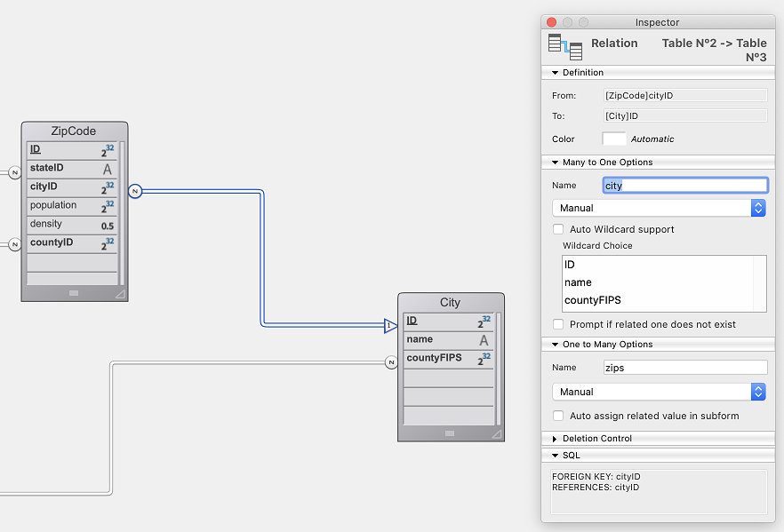

You can call [data model class functions](ORDA/ordaClasses.md) defined for the ORDA Data Model and [singleton class functions]($singleton.md) through REST requests, so that you can benefit from the exposed API of the targeted 4D application.

Functions can be called in two ways:

- using **POST requests**, with data parameters passed in the body of the request.
- using **GET requests**, with parameters directly passed in the URL.

POST requests provide a better security level because they avoid running sensitive code through an action as simple as clicking on a link. However, GET requests can be more compliant with user experience, allowing to call functions by entering an URL in a browser (note: the developer must ensure no sensitive action is done in such functions).

## 関数の呼び出し

The following ORDA and singleton functions can be called in REST:

| クラス関数                                                          | シンタックス                                                                                                           |
| -------------------------------------------------------------- | ---------------------------------------------------------------------------------------------------------------- |
| [DataStore クラス](ORDA/ordaClasses.md#datastore-クラス)             | `/rest/$catalog/DataStoreClassFunction`                                                                          |
| [DataClass クラス](ORDA/ordaClasses.md#dataclass-クラス)             | `/rest/\{dataClass\}/DataClassClassFunction`                                                                   |
| [EntitySelection クラス](ORDA/ordaClasses.md#entityselection-クラス) | `/rest/\{dataClass\}/EntitySelectionClassFunction`                                                             |
|                                                                | `/rest/{dataClass}/EntitySelectionClassFunction/$entityset/entitySetNumber`                                      |
|                                                                | `/rest/{dataClass}/EntitySelectionClassFunction/$filter`                                                         |
|                                                                | `/rest/{dataClass}/EntitySelectionClassFunction/$orderby`                                                        |
| [Entity クラス](ORDA/ordaClasses.md#entity-クラス)                   | `/rest/{dataClass}(key)/EntityClassFunction/`                                                                    |
| [シングルトンクラス](../Concepts/classes.md#シングルトンクラス)                  | `/rest/$singleton/SingletonClass/SingletonClassFunction` ([$singleton ページ]($singleton.md) 参照) |

:::note

`/rest/{dataClass}/Function` can be used to call either a dataclass or an entity selection function (`/rest/{dataClass}` returns all entities of the DataClass as an entity selection). EntitySelection クラスの関数が先に探されます。 見つからない場合に、DataClassクラスを探します。 つまり、同じ名称の関数が DataClassクラスと EntitySelectionクラスの両方に定義されている場合、DataClassクラスの関数が実行されることはありません。

:::

Functions are simply called on the appropriate ORDA interface or singleton class, without (). [Parameters](#parameters) are passed either in the body of the POST request (`POST` calls) or in the `params` collection in the URL (`GET` calls).

たとえば、City DataClassクラスに `getCity()` 関数を定義した場合、次のリクエストで呼び出すことができます:

#### POST request

`/rest/City/getCity`

POST リクエストのボディに関数に渡す引数を含めます: `["Aguada"]`

#### GET request

`/rest/City/getCity?$params='["Aguada"]'`

:::note

The `getCity()` function must have been declared with the `onHttpGet` keyword (see [Function configuration](#function-configuration) below).

:::

この呼び出しは、4Dランゲージでは次のステートメントに相当します:

```4d
$city:=ds.City.getCity("Aguada")
```

## Function configuration

### `exposed`

All functions allowed to be called directly from HTTP REST requests (`POST` or `GET`) must be declared with the `exposed` keyword. 例:

```4d
exposed Function getSomeInfo() : 4D.OutgoingMessage
```

See [Exposed vs non-exposed functions](../ORDA/ordaClasses.md#exposed-vs-non-exposed-functions) section.

### `onHttpGet`

Functions allowed to be called from HTTP `GET` requests must also be specifically declared with the [`onHttpGet` keyword](../ORDA/ordaClasses.md#onhttpget-keyword). 例:

```4d
//allowing GET requests
exposed onHttpGet Function getSomeInfo() : 4D.OutgoingMessage
```

### Thread-safe

プロジェクトがコンパイル済みモードで実行される場合、RESTサーバーは常にプリエンプティブプロセスを使用するため、RESTリクエストから呼び出されるすべての 4Dコードは **スレッドセーフでなければなりません** ([*プリエンプティブプロセスを使用* の設定値](../WebServer/preemptiveWeb.md#webサーバーにおいてプリエンプティブモードを有効化する) は、RESTサーバーによって無視されます)。

:::info

You can restrict calls to specific ORDA functions by configuring appropriate privileges in the [**roles.json**](../ORDA/privileges.md#rolesjson-file) file.

:::

## 引数

You can send parameters to functions defined in ORDA user classes or singletons. サーバーサイドでこれらの引数は、クラス関数の [宣言されたパラメーター](../Concepts/parameters.md#パラメーターの宣言) に受け渡されます。

次のルールが適用されます:

- In functions called through POST requests, parameters must be passed **in the body of the POST request**.
- In functions called through GET requests, parameters must be passed **in the URL with "?$params=" syntax**.
- Parameters must be enclosed within a collection (JSON format).
- JSON コレクションがサポートしているスカラーなデータ型はすべて引数として渡せます。
- エンティティやエンティティセレクションも引数として受け渡せます。 The parameter list must contain specific attributes used by the REST server to assign data to the corresponding ORDA objects: `__DATACLASS`, `__ENTITY`, `__ENTITIES`, `__DATASET`.

[エンティティを引数として受け取る例題](#エンティティを引数として受け取る) と [エンティティセレクションを引数として受け取る例題](#エンティティセレクションを引数として受け取る) を参照ください。

### スカラー値の引数

Scalar value parameter(s) must simply be enclosed in a collection. 引数としてサポートされるのは、JSONポインターを含むすべての JSON のデータ型です。 日付は ISO 8601形式の文字列として渡せます (例: "2020-08-22T22:00:000Z")。

For example, with a  dataclass function `getCities()` receiving text parameters:

#### POST request

`/rest/City/getCities`

**ボディの引数:** ["Aguada","Paris"]

#### GET request

`/rest/City/getCities?$params='["Aguada","Paris"]'`

### エンティティ引数

引数として渡されたエンティティは、キー (__KEY プロパティ) によってサーバー上で参照されます。 If the key parameter is omitted in a request, a new entity is loaded in memory on the server.
エンティティが持つ属性について、値を受け渡すことも可能です。 サーバー上でこれらの値は自動的に当該エンティティ用に使用されます。

> サーバー上の既存エンティティについて変更された属性値をリクエストが送信した場合、呼び出した ORDAデータモデル関数は自動的に変更後の値で実行されます。 この機能によって、たとえばエンティティに対する処理の、すべてのビジネスルールを適用した後の結果をクライアントアプリケーションから確認することが可能です。 その結果をもとにエンティティをサーバー上で保存するかどうかを判断できます。

| プロパティ                                                 | 型                                    | 説明                                   |
| ----------------------------------------------------- | ------------------------------------ | ------------------------------------ |
| エンティティの属性                                             | mixed                                | 任意 - 変更する値                           |
| __DATACLASS | Text                                 | 必須 - エンティティのデータクラスを指定します             |
| __ENTITY    | Boolean                              | 必須 - true は引数がエンティティであることをサーバーに通知します |
| __KEY       | 混合 (プライマリーキーと同じ型) | 任意 - エンティティのプライマリーキー                 |

- If `__KEY` is not provided, a new entity is created on the server with the given attributes.
- If `__KEY` is provided, the entity corresponding to `__KEY` is loaded on the server with the given attributes

See examples for [creating](#creating-an-entity) or [updating](#updating-an-entity) entities with POST requests.
See an example of [contents downloading using an entity](#using-an-entity-to-download-contents) with a GET request.

#### リレートエンティティ引数

[エンティティ引数](#エンティティ引数) と同じプロパティを持ちます。 異なる点は、リレートエンティティは存在していなければならないため、プライマリーキーを格納する __KEY を省略できません。

リレートエンティティを持つエンティティを [作成](#リレートエンティティを持つエンティティを作成する) または [更新](#リレートエンティティを持つエンティティを更新する) する例題を参照ください。

### エンティティセレクション引数

引数として渡すエンティティセレクションはあらかじめ [$method=entityset]($method.md#methodentityset) によって定義されている必要があります。

> 変更されたエンティティセレクションをリクエストがサーバーに送信した場合、呼び出した ORDAデータモデル関数は自動的に変更後のエンティティセレクションで実行されます。

| プロパティ                                                | 型       | 説明                                                      |
| ---------------------------------------------------- | ------- | ------------------------------------------------------- |
| エンティティの属性                                            | mixed   | 任意 - 変更する値                                              |
| __DATASET  | Text    | 必須 - エンティティセレクションのエンティティセットID (UUID) |
| __ENTITIES | Boolean | 必須 - true は引数がエンティティセレクションであることをサーバーに通知します              |

See example for [receiving an entity selection](#receiving-an-entity-selection-as-parameter) with a POST request.
See example for [getting a list built upon an entity selection](#using-an-entity-selection-to-get-a-list) with a GET request.

## POST request examples

このデータベースは、localhost (ポート8111) 上でリモートデータストアーとして公開されています。



### データストアークラス関数を使用する

US_Cities `DataStore`クラスは API を提供しています:

```
// DataStore クラス

Class extends DataStoreImplementation

exposed Function getName() : Text
    return "US cities and zip codes manager"
```

次のリクエストを実行します:

**POST** `127.0.0.1:8111/rest/$catalog/getName`

#### 戻り値

```
{
"result": "US cities and zip codes manager"
}
```

### DataClassクラス関数を使用する

`City` の DataClassクラスは、引数として受け取った名前をもとに City エンティティを返す API を提供しています:

```
// Cityクラス

Class extends DataClass

exposed Function getCity($city : Text ) : cs.CityEntity
    return This.query("name = :1";$city).first()

```

次のリクエストを実行します:

**POST** `127.0.0.1:8111/rest/City/getCity`

リクエストのボディ: ["Aguada"]

#### 戻り値

結果は、次のエンティティです:

```
{
    "__entityModel": "City",
    "__DATACLASS": "City",
    "__KEY": "1",
    "__TIMESTAMP": "2020-03-09T08:03:19.923Z",
    "__STAMP": 1,
    "ID": 1,
    "name": "Aguada",
    "countyFIPS": 72003,
    "county": {
        "__deferred": {
            "uri": "/rest/County(72003)",
            "__KEY": "72003"
        }
    },
    "zips": {
        "__deferred": {
            "uri": "/rest/City(1)/zips?$expand=zips"
        }
    }
}
```

### Entityクラス関数を使用する

`CityEntity` の Entityクラスは API を提供しています:

```
// CityEntityクラス

Class extends Entity

exposed Function getPopulation()
    return This.zips.sum("population")
```

次のリクエストを実行します:

**POST** `127.0.0.1:8111/rest/City(2)/getPopulation`

#### 戻り値

```
{
    "result": 48814
}
```

### EntitySelectionクラス関数を使用する

`CitySelection` の EntitySelectionクラスは API を提供しています:

```
// CitySelection クラス

Class extends EntitySelection

exposed Function getPopulation()
    return This.zips.sum("population")
```

次のリクエストを実行します:

**POST** `127.0.0.1:8111/rest/City/getPopulation/?$filter="ID<3"`

#### 戻り値

```
{
    "result": 87256
}
```

### EntitySelectionクラス関数とエンティティセットを使用する

`StudentsSelection` クラスは `getAgeAverage` 関数を持ちます:

```
// StudentsSelection クラス

Class extends EntitySelection

exposed Function getAgeAverage : Integer
    var $sum : Integer
    var $s : Object

    $sum:=0
    For each ($s;This)
        $sum:=$sum+$s.age()
    End for each
    return $sum/This.length

```

あらかじめ作成した既存のエンティティセットを使い、次のリクエストを実行します:

**POST** `127.0.0.1:8044/rest/Students/getAgeAverage/$entityset/17E83633FFB54ECDBF947E5C620BB532`

#### 戻り値

```
{
    "result": 34
}
```

### EntitySelectionクラス関数と orderBy を使用する

`StudentsSelection` クラスは `getLastSummary` 関数を持ちます:

```
// StudentsSelection クラス


Class extends EntitySelection

exposed Function getLastSummary : Text
    var $last : Object

    $last:=This.last()
    return =$last.firstname+" - "+$last.lastname+" is ... "+String($last.age())

```

次のリクエストを実行します:

**POST** `127.0.0.1:8044/rest/Students/getLastSummary/$entityset/?$filter="lastname=b@"&$orderby="lastname"`

#### 戻り値

```
{
    "result": "Wilbert - Bull is ... 21"
}
```

### サーバー上に作成されるエンティティを使用する

`Students` DataClassクラスは、データを含むエンティティをクライアントから受け取る `pushData()` 関数を持ちます。 `checkData()` メソッドはいくつかの検証を実行します。 問題がなければ、エンティティは保存されて返されます。

```
// Students クラス

Class extends DataClass

exposed Function pushData($entity : Object) : Object
    var $status : Object

    $status:=checkData($entity) // $status is an object with a success boolean property

    If ($status.success)
        $status:=$entity.save()
       If ($status.success)
           return $entity
      End if
    End if

    return $status


```

次のリクエストを実行します:

**POST** `http://127.0.0.1:8044/rest/Students/pushData`

リクエストのボディ:

```
[{
"__DATACLASS":"Students",
"__ENTITY":true,
"firstname":"Ann",
"lastname":"Brown"
}]
```

`__KEY` が提供されていないため、サーバー上では **クライアントから受け取った属性を持つ** 新規の Studentsエンティティが読み込まれます。 `pushData()` 関数が `save()` を実行するため、この新規エンティティは保存されます。

#### 戻り値

```
{
    "__entityModel": "Students",
    "__DATACLASS": "Students",
    "__KEY": "55",
    "__TIMESTAMP": "2020-06-16T10:54:41.805Z",
    "__STAMP": 1,
    "ID": 55,
    "firstname": "Ann",
    "lastname": "BROWN",
    "schoolID": null,
    "school": null
}
```

### エンティティを更新する

__KEY 属性を使って、上の例題と同じことをおこなうと、エンティティを更新します。

次のリクエストを実行します:

**POST:**`http://127.0.0.1:8044/rest/Students/pushData`

リクエストのボディ:

```
[{
"__DATACLASS":"Students",
"__ENTITY":true,
"lastname":"Brownie",
"__KEY":55
}]
```

`__KEY` が提供されているため、**クライアントから受け取った lastname属性値を持つ** プライマリーキーが 55 の Studentsエンティティが読み込まれます。 pushData() 関数が `save()` を実行するため、このエンティティは更新されます。

#### 戻り値

```
{
    "__entityModel": "Students",
    "__DATACLASS": "Students",
    "__KEY": "55",
    "__TIMESTAMP": "2020-06-16T11:10:21.679Z",
    "__STAMP": 3,
    "ID": 55,
    "firstname": "Ann",
    "lastname": "BROWNIE",
    "schoolID": null,
    "school": null
}
```

### リレートエンティティを持つエンティティを作成する

プライマリーキー 2 を持つ Schoolsエンティティをリレートエンティティとして、新規 Studentsエンティティを作成します。

次のリクエストを実行します:

**POST:**`http://127.0.0.1:8044/rest/Students/pushData`

リクエストのボディ:

```
[{
"__DATACLASS":"Students",
"__ENTITY":true,
"firstname":"John",
"lastname":"Smith",
"school":{"__KEY":2}
}]
```

#### 戻り値

```
{
    "__entityModel": "Students",
    "__DATACLASS": "Students",
    "__KEY": "56",
    "__TIMESTAMP": "2020-06-16T11:16:47.601Z",
    "__STAMP": 1,
    "ID": 56,
    "firstname": "John",
    "lastname": "SMITH",
    "schoolID": 2,
       "school": {
        "__deferred": {
            "uri": "/rest/Schools(2)",
            "__KEY": "2"
        }
    }
}
```

### リレートエンティティを持つエンティティを更新する

既存の Schools エンティティを既存の Studentsエンティティに紐付けます。 `StudentsEntity` クラスは次の API を提供しています:

```
// cs.StudentsEntity クラス

Class extends Entity

exposed Function putToSchool()
    var $1, $school , $0, $status : Object

        // $1 は Schools エンティティ
    $school:=$1
        // Schools リレートエンティティをカレントの Students エンティティに紐付けます
    This.school:=$school // このとき、school は N対1リレーション名です

    $status:=This.save()

    $0:=$status

```

You run this request, called on a Students entity : **POST** `http://127.0.0.1:8044/rest/Students(1)/putToSchool` Body of the request:

```
[{
"__DATACLASS":"Schools",
"__ENTITY":true,
"__KEY":2
}]
```

#### 戻り値

```
{
    "result": {
        "success": true
    }
}
```

### エンティティセレクションを引数として受け取る

`Students` DataClassクラスは、受け取ったエンティティセレクション ($1) を更新する `setFinalExam()` 関数を持ちます。 実際には、エンティティセレクション内の各エンティティの *finalExam* 属性値を、2つ目に渡した引数 ($2) に更新します。 最後に、更新されたエンティティのプライマリーキーを返します。

```
// Students class

Class extends DataClass

exposed Function setFinalExam()


    var $1, $es, $student, $status : Object
    var $2, $examResult : Text

    var $keys, $0 : Collection

      //Entity selection
    $es:=$1

    $examResult:=$2

    $keys:=New collection()

      //Loop on the entity selection
    For each ($student;$es)
        $student.finalExam:=$examResult
        $status:=$student.save()
        If ($status.success)
            $keys.push($student.ID)
        End if
    End for each

    $0:=$keys
```

次のようなリクエストでエンティティセットをあらかじめ作成します:

`http://127.0.0.1:8044/rest/Students/?$filter="ID<3"&$method=entityset`

次のリクエストを実行します:

**POST** `http://127.0.0.1:8044/rest/Students/setFinalExam`

リクエストのボディ:

```
[
{
"__ENTITIES":true,
"__DATASET":"9B9C053A111E4A288E9C1E48965FE671"
},
"Passed"
]


```

#### 戻り値

プライマリーキー 1と2 のエンティティが更新されました:

```
{
    "result": [
        1,
        2
    ]
}
```

### クライアント側で更新されたエンティティセレクションを使用する

[前述](#EntitySelectionクラス関数とエンティティセットを使用する) の `getAgeAverage()` 関数を使います。

```4d
var $remoteDS, $newStudent, $students : Object
var $ageAverage : Integer

$remoteDS:=Open datastore(New object("hostname";"127.0.0.1:8044");"students")

// $newStudent は処理する Studentsエンティティです
$newStudent:=...
$students:=$remoteDS.Students.query("school.name = :1";"Math school")
// We add an entity to the $students entity selection on the client
$students.add($newStudent)

// We call a function on the StudentsSelection class returning the age average of the students in the entity selection
// The function is executed on the server on the updated $students entity selection which included the student added from the client
$ageAverage:=$students.getAgeAverage()

```

## GET request examples

### Returning a document

You want to propose a link to download the user manual for a selected product with several formats available. You write a `getUserManual()` function of the Products dataclass. You return an object of the [`OutgoingMessage` class](../API/OutgoingMessageClass.md).

```4d
// Product dataclass
exposed onHTTPGet Function getUserManual($productId : Integer; $type : Text) : 4D.OutgoingMessage
	
var $file : 4D.File
var $response:=4D.OutgoingMessage.new()
var $doc:="/RESOURCES/User manuals/product_"+String($productId)

Case of 
	: ($type="pdf")
		$file:=File($doc+".pdf")
                $response.setBody($file.getContent()) // This is binary content 
		$response.setHeader("Content-Type"; "application/pdf")
			
	: ($type="jpeg")
		$file:=File($doc+".jpeg")
                $response.setBody($file.getContent()) // This is binary content 
		$response.setHeader("Content-Type"; "image/jpeg")
End case 
	
return $response

```

You can call the function using a request like:

**GET** `http://127.0.0.1:8044/rest/Products/getUserManual?$params='[1,"pdf"]'`

### Using an entity to download a PDF document

Same example as above but you want to pass an entity as parameter to the datastore function.

```4d
// Product dataclass
exposed onHTTPGet Function getUserManual($product : cs.ProductEntity) : 4D.OutgoingMessage
	
	var $file : 4D.File
	var $response := 4D.OutgoingMessage.new()
	
	$file:=File("/RESOURCES/User manuals/"+$product.name+".pdf")
	$response.setBody($file.getContent())
	$response.setHeader("Content-Type"; "application/pdf")
	
	return $response
```

You can call the function using this request:

**GET** `http://127.0.0.1:8044/rest/Product/getUserManual?$params='[{"__DATACLASS":"Product","__ENTITY":true,"__KEY":41}]'`

### Using an entity selection to get a list

You want to send an entity selection as parameter to a singleton function using a REST GET request and return a list using an object of the [`OutgoingMessage` class](../API/OutgoingMessageClass.md).

```4d
shared singleton Class constructor()
	
exposed onHTTPGet Function buildShoppingList($products : cs.ProductSelection) : 4D.OutgoingMessage
	
	var $p : cs.ProductsEntity
	var $content : Text
	var $response := 4D.OutgoingMessage.new()
	
	$content:=""
	
	For each ($p; $products)
		$content:=$content+" "+$p.manufacturer+" - "+$p.name
		$content:=$content+Char(Carriage return)
	End for each 
	
	$response.setBody($content)
	$response.setHeader("Content-Type"; "text/plain")
	
	return $response
```

You can call the function using this request:

**GET** `http://127.0.0.1:8044/rest/$singleton/Shopping/buildShoppingList?$params='[{"__DATASET":"8DB0556854HDK52FR5974F","__ENTITIES":true}]'`
