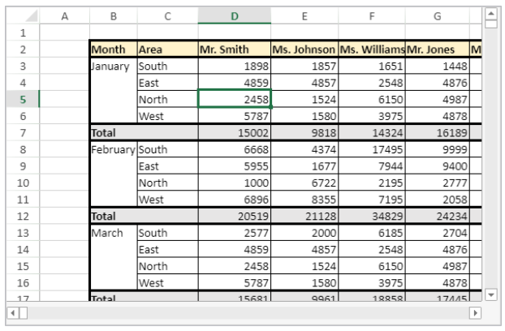

<!-- REF #_method_.VP SET ACTIVE CELL.Syntax -->

**VP SET ACTIVE CELL** ( *rangeObj* : Object) <!-- END REF -->

<!-- REF #_method_.VP SET ACTIVE CELL.Params -->

| 引数       | 型      |    | 説明        |                  |
| -------- | ------ | -- | --------- | ---------------- |
| rangeObj | Object | -> | レンジオブジェクト | <!-- END REF --> |

#### 説明

`VP SET ACTIVE CELL` コマンドは、<!-- REF #_method_.VP SET ACTIVE CELL.Summary -->指定したセルをアクティブセルにします<!-- END REF -->。

*rangeObj* 引数には、単独のセルを格納するレンジオブジェクトを渡します ([VP Cell](vp-cell.md) 参照)。 *rangeObj* 引数のレンジが単独セルのレンジでない場合、あるいは複数レンジを指定している場合、最初のレンジの先頭セルが使用されます。

#### 例題

カラム D、行 5 のセルをアクティブセルに設定します:

```4d
$activeCell:=VP Cell("myVPArea";3;4)
VP SET ACTIVE CELL($activeCell)
```



#### 参照

[VP ADD SELECTION](vp-add-selection.md)<br/>
[VP Get active cell](vp-get-active-cell.md)<br/>
[VP Get selection](vp-get-selection.md)<br/>
[VP RESET SELECTION](vp-reset-selection.md)<br/>
[VP SET SELECTION](vp-set-selection.md)<br/>
[VP SHOW CELL](vp-show-cell.md)
