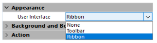
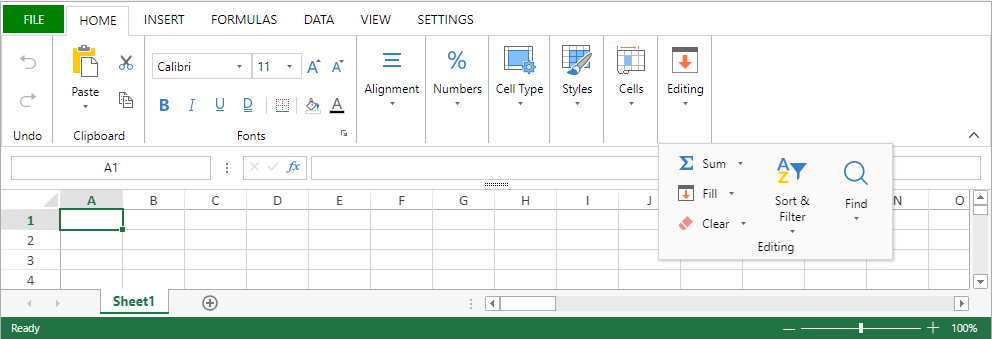

4D View Pro エリアのプロパティは、プロパティリストを利用して設定することが可能です。 スプレッドシートプロパティはランゲージにより設定します。

## フォームエリアプロパティ

**オブジェクト名**、[**変数あるいは式**](#4d-view-pro-フォームオブジェクト変数)、**アピアランス**、**アクション**、**イベント** などの [4D View Pro オブジェクトプロパティ](FormObjects/viewProArea_overview.md#プロパティ一覧) は、エリアのプロパティリストを使って設定できます。


### ユーザーインターフェースの選択

4D View Pro のフォームエリアで使用するインターフェースは、**プロパティリスト** の **アピアランス** から選択できます:



> また、[`userInterface`](FormObjects/properties_Appearance.md#ユーザーインターフェース) および [`withFormulaBar`](FormObjects/properties_Appearance.md#フォーミュラバーを表示) ("ツールバー" インターフェースのみ) の JSONプロパティを使用することもできます。

インターフェースにより、基本的な編集とデータ操作がおこなえます。 ユーザーによる編集は、ユーザーによってドキュメントが保存されたときに 4D View Pro オブジェクトに保存されます。

#### リボン



#### ツールバー

ツールバー型インターフェースを有効化すると [**フォーミュラバーを表示**](FormObjects/properties_Appearance.md#フォーミュラバーを表示) オプションが表示されます。 これを選択すると、ツールバーのすぐ下にフォーミュラバーが表示されます。

フォーミュラバーが表示された状態:


#### 機能

リボン型、ツールバー型のいずれのインターフェースでも、関連機能はタブにグループ分けされます:

| タブ     | アクション           | リボン型インターフェース | ツールバー型インターフェース |
| ------ | --------------- | :----------: | :------------: |
| ファイル   | ファイル操作          |       X      |                |
| ホーム    | テキストの書式など       |       X      |        X       |
| 挿入     | アイテムの追加         |       X      |        X       |
| フォーミュラ | フォーミュラの計算とライブラリ |       X      |        X       |
| データ    | データ操作           |       X      |        X       |
| 表示     | 表示の設定           |       X      |        X       |
| 設定     | スプレッドシートの設定     |       X      |                |

## フォームイベント

4D View Pro エリアのプロパティリスト内では、以下のフォームイベントが利用可能です。

一部のイベントは (すべてのアクティブオブジェクトで利用可能な) 標準のフォームイベントであり、一部は 4D View Pro 専用のフォームイベントです。 また一部の標準フォームイベントは、4D View Pro エリアにおいて生成された場合、[`FORM Event`](https://doc.4d.com/4dv19/help/command/ja/page1606.html) コマンドが返すオブジェクトに追加の情報を提供します。 以下の表は標準イベントと、4D View Pro 専用または追加情報を提供するイベントの一覧です:

| 標準の 4Dイベント                                      | 4D View Pro 専用、または追加情報を返すイベント                         |
| ----------------------------------------------- | ----------------------------------------------------- |
| [On Load](../Events/onLoad.md)                  | [On VP Ready](../Events/onVpReady.md)                 |
| [On Getting Focus](../Events/onGettingFocus.md) | [On Clicked](../Events/onClicked.md)                  |
| [On Losing Focus](../Events/onLosingFocus.md)   | [On Double Clicked](../Events/onDoubleClicked.md)     |
| [On Unload](../Events/onUnload.md)              | [On Header Click](../Events/onHeaderClick.md)         |
|                                                 | [On After Edit](../Events/onAfterEdit.md)             |
|                                                 | [On Selection Change](../Events/onSelectionChange.md) |
|                                                 | [On Column Resize](../Events/onColumnResize.md)       |
|                                                 | [On Row Resize](../Events/onRowResize.md)             |
|                                                 | [On VP Range Changed](../Events/onVpRangeChanged.md)  |

## シートオプション

4D View Pro シートオプションオブジェクトを使って、4D View Pro エリアの様々なオプションをコントロールすることができます。 このオブジェクトは以下のコマンドで操作します:

- [VP SET SHEET OPTIONS](commands/vp-set-sheet-options.md)
- [VP Get sheet options](commands/vp-get-sheet-options.md)

### シートのアピアランス

| プロパティ                |                        | 型       | 説明                                                                                                                                                                                                                                                                                                    |
| -------------------- | ---------------------- | ------- | ----------------------------------------------------------------------------------------------------------------------------------------------------------------------------------------------------------------------------------------------------------------------------------------------------- |
| allowCellOverflow    |                        | ブール     | セルに収まらないデータを隣の空のセルにはみ出し表示するかどうかを指定します                                                                                                                                                                                                                                                                 |
| sheetTabColor        |                        | string  | シートタブの色を指定するカラー文字列 (例: "red"、"#FFFF00"、"rgb(255,0,0)"、"Accent 5")                                                                                                                                                                               |
| frozenlineColor      |                        | string  | 固定化された線の色を指定するカラー文字列 (例: "red"、"#FFFF00"、"rgb(255,0,0)"、"Accent 5")                                                                                                                                                                             |
| clipBoardOptions     |                        | longint | クリップボードオプション。 利用可能な値: `vk clipboard paste options all`, `vk clipboard paste options formatting`, `vk clipboard paste options formulas`, `vk clipboard paste options formulas and formatting`, `vk clipboard paste options values`, `vk clipboard paste options values and formatting` |
| gridline             |                        | object  | 枠線のオプション                                                                                                                                                                                                                                                                                              |
|                      | color                  | string  | 枠線の色を表すカラー文字列 (例: "red"、"#FFFF00"、"rgb(255,0,0)"、"Accent 5")                                                                                                                                                                                    |
|                      | showVerticalGridline   | ブール     | 垂直の枠線を表示するかどうかを指定します。                                                                                                                                                                                                                                                                                 |
|                      | showHorizontalGridline | ブール     | 水平の枠線を表示するかどうかを指定します。                                                                                                                                                                                                                                                                                 |
| rowHeaderVisible     |                        | ブール     | 行ヘッダーを表示するかどうかを指定します。                                                                                                                                                                                                                                                                                 |
| colHeaderVisible     |                        | ブール     | 列ヘッダーを表示するかどうかを指定します。                                                                                                                                                                                                                                                                                 |
| rowHeaderAutoText    |                        | longint | 行ヘッダーが文字を表示するか、数字を表示するか、あるいは空かを指定します。 利用可能な値: `vk header auto text blank`, `vk header auto text letters`, `vk header auto text numbers`                                                                                                                                               |
| colHeaderAutoText    |                        | longint | 列ヘッダーが文字を表示するか、数字を表示するか、あるいは空かを指定します。 利用可能な値: `vk header auto text blank`, `vk header auto text letters`, `vk header auto text numbers`                                                                                                                                               |
| selectionBackColor   |                        | string  | シートにおける選択範囲の背景色。 (RGBAフォーマット推奨)                                                                                                                                                                                                                                                    |
| selectionBorderColor |                        | string  | シートにおける選択範囲の枠線の色。                                                                                                                                                                                                                                                                                     |
| sheetAreaOffset      |                        | object  | シートエリアのオフセットオプション                                                                                                                                                                                                                                                                                     |
|                      | left                   | longint | シートの、ホストからの左オフセット                                                                                                                                                                                                                                                                                     |
|                      | top                    | longint | シートの、ホストからの上オフセット                                                                                                                                                                                                                                                                                     |

> いずれのプロパティも任意です。

### シートの保護

シート全体をロック (保護) するには、*isProtected* プロパティを **true** に設定するだけです。 その上で、[locked](#レイアウト) セルスタイルプロパティを個別に設定することで、特定のセルをロック解除することができます。

| プロパティ             |                          | 型      | 説明                                                                        |
| ----------------- | ------------------------ | ------ | ------------------------------------------------------------------------- |
| isProtected       |                          | ブール    | シート上で保護状態とされているセルが編集可能かどうかを指定します。                                         |
| protectionOptions |                          | object | ユーザーにより編集可能な要素を指定します。 null の場合、protectionOptions パラメーターはリセットされます。         |
|                   | allowSelectLockedCells   | ブール    | ロックされたセルをユーザーが選択できるかどうかを指定します (任意)。 デフォルトは true。       |
|                   | allowSelectUnlockedCells | ブール    | ロック解除されたセルをユーザーが選択できるかどうかを指定します (任意)。 デフォルトは true。     |
|                   | allowSort                | ブール    | ユーザーによるレンジの並べ替えが可能かどうかを指定します (任意)。 デフォルトは false。       |
|                   | allowFilter              | ブール    | ユーザーによるレンジのフィルタリングが可能かどうかを指定します (任意)。 デフォルトは false。    |
|                   | allowEditObjects         | ブール    | フローティングオブジェクトをユーザーが編集できるかどうかを指定します (任意)。 デフォルトは false。 |
|                   | allowResizeRows          | ブール    | ユーザーが行をリサイズできるかどうかを指定します (任意)。 デフォルトは false。           |
|                   | allowResizeColumns       | ブール    | ユーザーが列をリサイズできるかどうかを指定します (任意)。 デフォルトは false。           |
|                   | allowDragInsertRows      | ブール    | ユーザーがドラッグ操作で行を挿入できるかどうかを指定します (任意)。 デフォルトは false。      |
|                   | allowDragInsertColumns   | ブール    | ユーザーがドラッグ操作で列を挿入できるかどうかを指定します (任意)。 デフォルトは false。      |
|                   | allowInsertRows          | ブール    | ユーザーが行を挿入できるかどうかを指定します (任意)。 デフォルトは false。             |
|                   | allowInsertColumns       | ブール    | ユーザーが列を挿入できるかどうかを指定します (任意)。 デフォルトは false。             |
|                   | allowDeleteRows          | ブール    | ユーザーが行を削除できるかどうかを指定します (任意)。 デフォルトは false。             |
|                   | allowDeleteColumns       | ブール    | ユーザーが列を削除できるかどうかを指定します (任意)。 デフォルトは false。             |

> いずれのプロパティも任意です。

## セルフォーマット

フォーマットパターン (表示形式) を定義することで、4D View Pro ドキュメントのコンテンツを想定通りに表示することができます。 フォーマットは、選択された 4D View Pro の [インターフェース](#ユーザーインターフェースの選択) を使用するか、[VP SET VALUE](commands/vp-set-value.md) または [VP SET NUM VALUE](commands/vp-set-num-value.md) コマンドを使用して設定します。

4D View Pro には数値、日付、時間、そしてテキスト用のビルトインのフォーマットがありますが、カスタムパターンを作成することで、特殊文字やコードを使ったフォーマットでセルのコンテンツを表示することができます。

たとえば、請求書において [VP SET VALUE](commands/vp-set-value.md) あるいは [VP SET NUM VALUE](commands/vp-set-num-value.md) コマンドを使用して金額を入力している場合、数値の桁数とは関係なく (つまり金額が $5.00 だろうと $5,000.00 だろうと) 通貨記号 ($, €, ¥, など)を同じ位置に整列させたい場合があるかもしれません。 この場合、フォーマット文字を使用してパターン *($\* #,##0.00)* を指定することで、以下のように表示させることができます:


カスタムのフォーマットパターンを作成する場合、データの表示 のみが変更されるという点に注意してください。 データの値そのものは変わりません。

### 数値とテキストのフォーマット

数値フォーマットはすべての数値型 (例: 正の数、負の数、ゼロ) に対して適用されます。

| 文字                                                            | 説明                                                                                                             | 例題                                                                                                                                                                                                                                                                                                                                   |
| ------------------------------------------------------------- | -------------------------------------------------------------------------------------------------------------- | ------------------------------------------------------------------------------------------------------------------------------------------------------------------------------------------------------------------------------------------------------------------------------------------------------------------------------------ |
| 0                                                             | ゼロを表示する桁のプレースホルダー                                                                                              | #.00 は 1.1 を 1.10 と表示します。                                                                                                                                                                                                                                                            |
| .                                             | 小数点を表示します                                                                                                      | 0.00 は 1999 を 1999.00 と表示します。                                                                                                                                                                                                                                                                        |
| ,                                                             | 数値内に千区切りのカンマを表示します。 数値記号 "#" あるいはゼロに挟まれたカンマがフォーマットに含まれる場合、3桁ごとにカンマで区切られます。 桁のプレースホルダーの後にくるカンマは、数値を 1000 で割ります。 | #,0 は 12200000 を 12,200,000 と表示します。                                                                                                                                                                                                                                                                                                  |
| \_                                      | アンダーバーに続く文字の幅をスキップします。                                                                                         | \_( のようにカッコなどと組み合わせることで、左や右にスペースを追加します。                                                                                                                                                                                                                                                     |
| @                                                | テキストのフォーマット文字。 セル内のすべてのテキストにフォーマットを適用します。                                                                      | "\[Red]@" はテキスト値に対して赤のフォントカラーを適用します。                                                                                                                                                                                                                               |
| \*                                                            | 列幅いっぱいまで、後に続く文字を繰り返します。                                                                                        | 0\*- は、数値の後にセルの幅いっぱいまでダッシュを繰り返します。対して、\*0 をフォーマットの前につけると、先頭に 0 が複数表示されます。                                                                                                                                                                                                                                                            |
| " "                                                           | 引用符にはさまれたテキストを、解釈せずにそのまま表示します。                                                                                 | "8%" は 8% と表示されます。                                                                                                                                                                                                                                                                                                                   |
| %                                                             | 数値を百分率で表示します。                                                                                                  | 8% は、.08 として表示されます。                                                                                                                                                                                                                                                                                                  |
| \#                                                           | 追加のゼロを表示しない、桁のプレースホルダー。 もしプレースホルダーの数以上に小数点以下の桁数があった場合、それらの数字は丸められます。                                           | #.# は 1.54 を 1.5 として表示します。                                                                                                                                                                                                                                                           |
| ?                                                             | 追加のゼロの分のスペースを残すが、そのゼロは表示しない桁のプレースホルダー。 通常、数値を小数点の位置で揃えるために使用されます。                                              | $?? は最低 2桁のスペースを確保し、1桁の数値が混じっていても 2桁の場所に $記号が並ぶように指定します。                                                                                                                                                                                                                                                                             |
| \                                                            | 後に続く文字を表示します。                                                                                                  | #.00\? は 123 を 123.00? として表示します。                                                                                                                                                                                                                                                                    |
| /                                                             | 数値に対して使用した場合、分数として表記します。 テキスト、日付、時刻に対して使用した場合、それらをそのまま表示します。                                                   | #/# は .75 を 3/4 として表示します。                                                                                                                                                                                                                                                                                            |
| \[ ]     | 条件つき書式を作成します。                                                                                                  | \[>100]\[GREEN]#,##0;\[`<=-100`]\[YELLOW]#,##0;\[BLUE]#,##0 |
| E                                                             | 指数表記のフォーマット。                                                                                                   | #E+# - は 1,500,500 を 2E+6 として表示します。                                                                                                                                                                                                                                                                                                  |
| \[color] | テキストまたは数値を指定カラーで表示します。                                                                                         | \[Green]###.##\[Red]-###.###                                                                                                                                                               |

#### 例題

```4d
// セルの値を $125,571.35 と表示する設定
VP SET VALUE(VP Cell("ViewProArea";3;2);New object("value";125571.35;"format";"_($* #,##0.00_)")
```

### 日付と時間のフォーマット

4D View Pro では IS0 8601 の日付と時間パターンを示す以下の定数を提供しています:

| 定数                                        | 値                                    | 説明                                                                                                                                                                          |
| ----------------------------------------- | ------------------------------------ | --------------------------------------------------------------------------------------------------------------------------------------------------------------------------- |
| `vk pattern full date time`               | "*fullDateTimePattern*"              | カレント言語設定における ISO 8601 フォーマットの完全な日付と時間。アメリカ合衆国でのデフォルトパターン: "dddd, dd MMMM yyyy HH:mm:ss"                                     |
| `vk pattern long date`                    | "*longDatePattern*"                  | カレント言語設定における ISO 8601 フォーマットの完全な日付。アメリカ合衆国でのデフォルトパターン: "dddd, dd MMMM yyyy"                                                                                 |
| `vk pattern long time`                    | "*longTimePattern*"                  | カレント言語設定における ISO 8601 フォーマットの時間。アメリカ合衆国でのデフォルトパターン: "HH:mm:ss"                                                              |
| `vk pattern month day`                    | "*monthDayPattern*"                  | カレント言語設定における ISO 8601 フォーマットの月日の日付。アメリカ合衆国でのデフォルトパターン: "MMMM dd"                                                                                            |
| `vk pattern short date`                   | "*shortDatePattern*"                 | カレント言語設定における省略形の ISO 8601 フォーマットの日付。アメリカ合衆国でのデフォルトパターン: "MM/dd/yyyy"                                                                                        |
| `vk pattern short time`                   | "*shortTimePattern*"                 | カレント言語設定における省略形の ISO 8601 フォーマットの時間。アメリカ合衆国でのデフォルトパターン: "HH:mm"                                                                             |
| `vk pattern sortable date time`           | "*sortableDateTimePattern*"          | カレント言語設定における、並べ替え可能な ISO 8601 フォーマットの日付と時間。アメリカ合衆国でのデフォルトパターン: "yyyy\'-\'MM\'-\'dd\'T\'HH\':\'mm\':\'ss"          |
| `vk pattern universal sortable date time` | "*universalSortableDateTimePattern*" | カレント言語設定における、UTCを使用した並べ替え可能な ISO 8601 フォーマットの日付と時間。アメリカ合衆国でのデフォルトパターン: "yyyy\'-\'MM\'-\'dd HH\':\'mm\':\'ss\'Z\'" |
| `vk pattern year month`                   | "*yearMonthPattern*"                 | カレント言語設定における ISO 8601 フォーマットの年月。アメリカ合衆国でのデフォルトパターン: "yyyy MMMM"                                                                                             |

#### 例題

```4d
// セルの値を特定の日付と時間として表示する設定
VP SET VALUE(VP Cell("ViewProArea";3;9);New object("value";!2024-12-18!);"time";?14:30:10?;"format";vk pattern full date time))
```

### カスタムの日付と時間のフォーマット

カレント言語設定における日付と時間のカスタムパターンを作成したい場合、以下のコードを組み合わせて使用することができます:

|      | コード<br/>(文字の大小の区別なし)                    | 説明                            | 例題                                                              |
| ---- | ---------------------------------------------------------- | ----------------------------- | --------------------------------------------------------------- |
| Date |                                                            |                               | (January 1, 2019)                            |
|      | m                                                          | 先頭のゼロなしの月表示                   | 1                                                               |
|      | mm                                                         | 先頭のゼロありの月表示                   | 01                                                              |
|      | mmm                                                        | 短い月名                          | 1月                                                              |
|      | mmmm                                                       | 長い月名                          | 1月                                                              |
|      | d                                                          | 先頭のゼロなしの日付表示                  | 1                                                               |
|      | dd                                                         | 先頭のゼロありの日付表示                  | 01                                                              |
|      | ddd                                                        | 短い曜日名                         | 火                                                               |
|      | dddd                                                       | 長い曜日名                         | 火曜日                                                             |
|      | yy                                                         | 短い年表示                         | 19                                                              |
|      | yyyy                                                       | 長い年表示                         | 2019                                                            |
| Time |                                                            |                               | (2:03:05 PM) |
|      | h                                                          | 先頭のゼロなしの時間。 0-23の値            | 2                                                               |
|      | hh                                                         | 先頭のゼロありの時間。 00-23の値           | 02                                                              |
|      | m                                                          | 先頭のゼロなしの分数。 0-59の値            | 3                                                               |
|      | mm                                                         | 先頭のゼロありの分数。 00-59の値           | 03                                                              |
|      | s                                                          | 先頭のゼロなしの秒数。 0-59の値            | 5                                                               |
|      | ss                                                         | 先頭のゼロありの秒数。 00-59の値           | 05                                                              |
|      | \[h]  | 経過時間の時間数                      | 14 (24 を超える表示も可能)                            |
|      | \[mm] | 経過時間の分数                       | 843                                                             |
|      | \[ss] | 経過時間の秒数                       | 50585                                                           |
|      | AM/PM                                                      | 午前/午後。 省略された場合、24時間表記が適用されます。 | PM                                                              |

> 'm' のコードはその位置とパターンに応じて解釈されます。 'h' または 'hh' の直後、あるいは 's' または 'ss' の直前に位置する場合には分を表すと解釈されますが、それ以外の場合には月を表すと解釈されます。

### 追加の記号

上記で説明されている特殊文字とコードに加えて、フォーマットパターンに使用可能な追加の文字と記号があります。 これらの追加文字と記号は \ または "" を必要とせず、フォーマットパターンの解釈に影響することはありません。 これらはパターン内において "そのまま" 表示されます。

| 文字                     | 説明                                   | 例題                                           |
| ---------------------- | ------------------------------------ | -------------------------------------------- |
| + と -                  | プラス記号およびマイナス記号                       | ### + ### = ###,##\#                         |
| ( ) | 左と右のカッコ記号                            | (-###.##) |
| :      | コロン                                  | hh:mm:ss     |
| ^                      | キャレット                                | #\^#                                        |
| '                      | アポストロフィー                             | '######                                      |
| { }                    | 中カッコ                                 | {###,###,###}                                |
| `< >`                  | 小なり大なり                               | ## >#\#                                      |
| =                      | 等号                                   | #+#=##                                       |
| /                      | フォワードスラッシュ。 数値に対して使用した場合、分数として表記します。 | mm/dd/yyyy                                   |
| !                      | 感嘆符                                  | $###.00!                     |
| &  | アンパサンド                               | "Hello" & "Welcome"      |
| ~      | チルダ                                  | ~##                          |
|                        | スペース文字                               |                                              |
| €                      | ユーロ                                  | €###.00                      |
| £                      | 英ポンド                                 | £###.00                      |
| ¥                      | 日本円                                  | ¥###.00                      |
| $                      | ドル記号                                 | $###.00                      |
| ¢                      | セント記号                                | .00¢                         |

## 印刷属性

4D View Pro 印刷属性を使って、4D View Pro エリアの印刷に関するすべての項目を管理することができます。 これらの属性は以下のコマンドによって操作します:

- [VP SET PRINT INFO](commands/vp-set-print-info.md)
- [VP Get print info](commands/vp-get-print-info.md)

### カラム / 行

カラム属性と行属性を使って、カラムと行の始まり、終わり、そして繰り返しについて指定します。

| プロパティ             | 型       | 説明                                                                |
| ----------------- | ------- | ----------------------------------------------------------------- |
| columnEnd         | longint | セルレンジ内で印刷する最後のカラム。 デフォルト値 = -1 (全カラム)          |
| columnStart       | longint | セルレンジ内で印刷する最初のカラム。 デフォルト値 = -1 (全カラム)          |
| repeatColumnEnd   | longint | 各ページの左に印刷するカラムのレンジの、最後のカラム。 デフォルト値 = -1 (全カラム) |
| repeatColumnStart | longint | 各ページの左に印刷するカラムのレンジの、最初のカラム。 デフォルト値 = -1 (全カラム) |
| repeatRowEnd      | longint | 各ページの上に印刷する行のレンジの、最後の行。 デフォルト値 = -1 (すべての行)    |
| repeatRowStart    | longint | 各ページの上に印刷する行のレンジの、最初の行。 デフォルト値 = -1 (すべての行)    |
| rowEnd            | longint | セルレンジ内で印刷する最後の行。 デフォルト値 = -1 (すべての行)           |
| rowStart          | longint | セルレンジ内で印刷する最初の行。 デフォルト値 = -1 (すべての行)           |

### ヘッダー / フッター

ヘッダー属性とフッター属性は、ヘッダー/フッターセクションの左・右・センターのテキストまたは画像を指定するのに使用されます。

| プロパティ             | 型                 | 説明                         |
| ----------------- | ----------------- | -------------------------- |
| footerCenter      | テキスト              | 印刷ページのセンターフッターのテキストとフォーマット |
| footerCenterImage | picture \| text\* | フッターのセンターセクションの画像          |
| footerLeft        | テキスト              | 印刷ページの左フッターのテキストとフォーマット    |
| footerLeftImage   | picture \| text\* | フッターの左セクションの画像             |
| footerRight       | テキスト              | 印刷ページの右フッターのテキストとフォーマット    |
| footerRightImage  | picture \| text\* | フッターの右セクションの画像             |
| headerCenter      | テキスト              | 印刷ページのセンターヘッダーのテキストとフォーマット |
| headerCenterImage | picture \| text\* | ヘッダーのセンターセクションの画像          |
| headerLeft        | テキスト              | 印刷ページの左ヘッダーのテキストとフォーマット    |
| headerLeftImage   | picture \| text\* | ヘッダーの左セクションの画像             |
| headerRight       | テキスト              | 印刷ページの右ヘッダーのテキストとフォーマット    |
| headerRightImage  | picture \| text\* | ヘッダーの右セクションの画像             |

\* テキスト型を使用する場合には、画像のファイルパス (絶対パスまたは相対パス) を渡します。 相対パスを渡す場合、ファイルはデータベースのストラクチャーファイルのと階層に置かれてなければなりません。 Windows では、ファイル拡張子も含めて渡します。 画像指定に使用するデータ型にかかわらず、4D View Pro エリアには (参照ではなく) 画像そのものが保存され、[VP Get print info](commands/vp-get-print-info.md) によって返されます。

### 特殊文字

以下の特殊文字を使用すると、4D View Pro エリアが印刷される際にヘッダーとフッター内に自動で情報を追加およびフォーマットすることができます。

| 文字                    | 説明                                            | 例題                                                                                                                                                    | 戻り値                                                  |   |
| --------------------- | --------------------------------------------- | ----------------------------------------------------------------------------------------------------------------------------------------------------- | ---------------------------------------------------- | - |
| & | エスケープ文字                                       | (以下の例を参照)                                                                                                                          |                                                      |   |
| P                     | カレントページ                                       | printInfo.headerLeft:="これは &P ページ目です"                                                             | これは 5 ページ目です                                         |   |
| N                     | ページ数                                          | printInfo.headerLeft:="&N ページあります"                                                                | 10 ページあります                                           |   |
| D                     | カレント日付 (yyyy/mm/dd フォーマット) | printInfo.headerLeft:="日付は &D です"                                                                 | 日付は 2015/6/19 です                                     |   |
| T                     | 現在の時刻                                         | printInfo.headerLeft:="時刻は &T です"                                                                 | 時刻は 16:30:36 です      |   |
| G                     | ピクチャー                                         | printInfo.headerLeftImage:=smiley<br/>printInfo.headerLeft:="&G"  |  |   |
| S                     | 打ち消し線                                         | printInfo.headerLeft:="&Sこれはテキストです"                                                               | ~~これはテキストです~~                                        |   |
| U                     | 下線                                            | printInfo.headerLeft:="&Uこれはテキストです"                                                               | これはテキストです (下線)                    |   |
| B                     | 太字                                            | printInfo.headerLeft:="&Bこれはテキストです"                                                               | **これはテキストです**                                        |   |
| I                     | イタリック                                         | printInfo.headerLeft:="&Iこれはテキストです"                                                               | *これはテキストです*                                          |   |
| "                     | フォント指定                                        | printInfo.headerLeft:="&\"Lucida Console\"&14This is text." |  |   |
| K                     | 文字カラー指定                                       | printInfo.headerLeft:="&KFF0000これはテキストです"                                                         | これはテキストです (赤字)。                   |   |
| F                     | ワークブック名                                       | printInfo.headerLeft:="&F"                                                                        | 2019 Monthly Revenue Forecasts                       |   |
| A                     | スプレッドシート名                                     | printInfo.headerLeft:="&A"                                                                        | June 2019 revenue forecast                           |   |

### マージン

マージン属性は、印刷時の 4D View Pro エリアのマージンを指定するために使用されます。 100分の1インチ単位で表現されます。

| プロパティ  |        | 型       | 説明                                  |
| ------ | ------ | ------- | ----------------------------------- |
| margin |        | object  | 印刷マージン                              |
|        | top    | longint | 上部マージン、100分の1インチ単位。 デフォルト値 = 75     |
|        | bottom | longint | 下部マージン、100分の1インチ単位。 デフォルト値 = 75     |
|        | left   | longint | 左マージン、100分の1インチ単位。 デフォルト値 = 70      |
|        | right  | longint | 右マージン、100分の1インチ単位。 デフォルト値 = 70      |
|        | header | longint | ヘッダーのオフセット、100分の1インチ単位。 デフォルト値 = 30 |
|        | footer | longint | フッターのオフセット、100分の1インチ単位。 デフォルト値 = 30 |

### 方向

向き属性は、印刷ページレイアウトの方向を指定するのに使用されます。

> この属性はレンダリング情報のみを定義します。

| プロパティ       | 型       | 説明                                                                                                                                    |
| ----------- | ------- | ------------------------------------------------------------------------------------------------------------------------------------- |
| orientation | longint | ページの向き。 とりうる値: `vk print page orientation landscape`, `vk print page orientation portrait` (デフォルト) |

### ページ

ページ属性は、一般的なドキュメント印刷設定を指定するのに使用されます。

| プロパティ           | 型       | 説明                                                                                                                                                                                                      |
| --------------- | ------- | ------------------------------------------------------------------------------------------------------------------------------------------------------------------------------------------------------- |
| blackAndWhite   | ブール     | 白黒で印刷します。 <p>デフォルト値 = false</p><p>**注**: PDF はこの属性に影響されません。 PDF のカラーはそのままです。</p>                                                                                                        |
| centering       | longint | 印刷ページ上でコンテンツをどのように中央揃えするかを指定します。 とりうる値: `vk print centering both`, `vk print centering horizontal`, `vk print centering none` (デフォルト), `vk print centering vertical` |
| firstPageNumber | longint | 最初のページに印刷するページ番号。デフォルト値 = 1                                                                                                                                                                             |
| pageOrder       | longint | ページの印刷順。 とりうる値: `vk print page order auto` (デフォルト), `vk print page order down then over`, `vk print page order over then down`.                      |
| pageRange       | テキスト    | 印刷されるページの範囲                                                                                                                                                                                             |
| qualityFactor   | longint | 印刷の品質指定 (1 - 8)。  高ければ印刷の質は高くなりますが、印刷のパフォーマンスに影響する可能性があります。<p>デフォルト値 = 2</p>                                                                                                         |
| useMax          | ブール     | データのあるカラムと行のみが印刷されます。<p>デフォルト値 = true</p>                                                                                                                                                               |
| zoomFactor      | real    | 印刷ページの拡大/縮小率。<p>デフォルト値 = 1</p>                                                                                                                                                                          |

### 用紙サイズ

用紙サイズ属性は印刷に使用する用紙の寸法や規格サイズを指定します。 用紙サイズを定義するには 2つの方法があります:

- カスタムサイズ - height と width 属性を使用
- 規格サイズ - kind 属性を使用

| プロパティ     |        | 型       | 説明                                                                                                                  |
| --------- | ------ | ------- | ------------------------------------------------------------------------------------------------------------------- |
| paperSize |        | object  | 印刷に使用する用紙の寸法 (height、width) または規格 (kind)                                      |
|           | height | longint | 用紙の高さ、100分の1インチ単位                                                                                                   |
|           | width  | longint | 用紙の幅、100分の1インチ単位                                                                                                    |
|           | kind   | テキスト    | 用紙の規格サイズの名前 (例: A2、A4、legal、など)。 `GET PRINT OPTION` によって返されます。 デフォルト値 = "letter" |

- `height` と `width` プロパティで用紙サイズを指定した場合、[`VP Get print info`](./commands/vp-get-print-info.md) が返す用紙サイズ属性の `kind` プロパティ値は `custom` です。

- `kind` プロパティで用紙サイズを設定する場合、以下のいずれかを使用することができます:
  - [ SpreadJS のフォーマットリスト](https://developer.mescius.com/spreadjs/api/enums/GC.Spread.Sheets.Print.PaperKind) のフォーマット
  - [`PRINT OPTION VALUES`](https://doc.4d.com/4dv19/help/command/ja/page785.html) コマンドで返されるフォーマット。
    この場合、[`VP Get print info`](./commands/vp-get-print-info.md) は対応するフォーマットを高さと幅とともに返します。

### スケール

スケール属性は印刷の最適化と調整のために使用されます。

| プロパティ          | 型       | 説明                                                            |
| -------------- | ------- | ------------------------------------------------------------- |
| bestFitColumns | ブール     | 印刷時、カラムの幅はテキストの最大幅に合うように調整されます。 デフォルト値 = false                |
| bestFitRows    | ブール     | 印刷時、行の高さはテキストの最大高さに合うように調整されます。 デフォルト値 = false                |
| fitPagesTall   | longint | 最適化印刷時、チェックする垂直方向 (縦向き) のページ数。 デフォルト値 = -1 |
| fitPagesWide   | longint | 最適化印刷時、チェックする水平方向 (横向き) のページ数。 デフォルト値 = -1 |

### 表示 / 非表示

表示 / 非表示属性は 4D View Pro エリア要素の表示 (印刷) 状態を指定するのに使用されます。

| プロパティ            | 型       | 説明                                                                                                                                                                                     |
| ---------------- | ------- | -------------------------------------------------------------------------------------------------------------------------------------------------------------------------------------- |
| showBorder       | ブール     | 外枠の境界線を印刷します。デフォルト値 = true                                                                                                                                                             |
| showColumnHeader | longint | カラムヘッダーの印刷設定。 とりうる値: `vk print visibility hide`, `vk print visibility inherit` (デフォルト), `vk print visibility show`, `vk print visibility show once` |
| showGridLine     | ブール     | 枠線を印刷します。 デフォルト値 = false                                                                                                                                                               |
| showRowHeader    | longint | 行ヘッダーの印刷設定。 とりうる値: `vk print visibility hide`, `vk print visibility inherit` (デフォルト), `vk print visibility show`, `vk print visibility show once`   |

### ウォーターマーク

ウォーターマーク属性は 4D View Pro エリアに透かしとして、テキストまたは画像を重ねて表示するために使用されます。

| プロパティ     |                                                                                    | 型                 | 説明                                                                                                                                |
| --------- | ---------------------------------------------------------------------------------- | ----------------- | --------------------------------------------------------------------------------------------------------------------------------- |
| watermark |                                                                                    | collection        | ウォーターマーク設定のコレクション。  デフォルト値: undefined                                                                             |
|           | \[ ].height   | longint           | ウォーターマークのテキスト/画像の高さ。                                                                                                              |
|           | \[ ].imageSrc | picture \| text\* | ウォーターマークのテキスト/画像。                                                                                                                 |
|           | \[ ].page     | テキスト              | ウォーターマークが印刷されるページ。 全ページに印刷: "all"。 特定のページ: カンマで区切られたページ番号またはページの範囲。 例: "1,3,5-12" |
|           | \[ ].width    | longint           | ウォーターマークのテキスト/画像の幅。                                                                                                               |
|           | \[ ].x        | longint           | ウォーターマークのテキスト/画像の左上端の水平方向の座標                                                                                                      |
|           | \[ ].y        | longint           | ウォーターマークのテキスト/画像の左上端の垂直方向の座標                                                                                                      |

\* テキスト型を使用する場合には、画像のファイルパス (絶対パスまたは相対パス) を渡します。 相対パスを渡す場合、ファイルはデータベースのストラクチャーファイルのと階層に置かれてなければなりません。 Windows では、ファイル拡張子も含めて渡します。 画像指定に使用するデータ型にかかわらず、4D View Pro エリアには (参照ではなく) 画像そのものが保存され、[VP Get print info](commands/vp-get-print-info.md) によって返されます。

## スタイルオブジェクト

4D View Pro スタイルオブジェクトとスタイルシートを使用すると、4D View Pro ドキュメントのグラフィカル要素や見た目を管理することができるようになります。

### スタイルオブジェクトとスタイルシート

スタイルオブジェクトには、スタイル設定が格納されます。 これらはスタイルシートで使用するか、あるいはそのまま使用することができます。 スタイルオブジェクトはスタイルシートと組み合わせて使用することもでき、ドキュメントの他の部分に影響を及ぼすことなく個別のセルレンジに異なる設定を指定することもできます。 [VP SET CELL STYLE](commands/vp-set-cell-style.md) および [VP SET DEFAULT STYLE](commands/vp-set-default-style.md) コマンドでは、スタイルオブジェクトを直接使用することができます。 [VP SET TABLE THEME](commands/vp-set-table-theme.md) または [VP CREATE TABLE](commands/vp-create-table.md) コマンドを使用してカスタムテーブルテーマを定義する場合にも、スタイル オブジェクトが使用できます。

**スタイルシート** は、プロパティの組み合わせをスタイルオブジェクトにまとめたもので、それによって 4D View Pro ドキュメントのすべてのセルの見た目を指定します。 ドキュメントとともに保存されたスタイルシートを使用して、単一のシート、複数のシート、あるいはワークブック全体に対してプロパティを設定することができます。 4D View Pro スタイルシートは作成時に名前が与えられ、この名前はスタイルシートの "name" プロパティに保存されます。 これによりスタイルシートの使用が容易になり、また注意深く命名することで、その定義と目的を分かりやすくすることもできます (例: Letterhead_internal、Letterhead_external、など)。

スタイルシートは [VP ADD STYLESHEET](commands/vp-add-stylesheet.md) コマンドで作成され、[VP SET DEFAULT STYLE](commands/vp-set-default-style.md) あるいは [VP SET CELL STYLE](commands/vp-set-cell-style.md) コマンドで適用されます。 スタイルシートは [VP REMOVE STYLESHEET](commands/vp-remove-stylesheet.md) コマンドで削除できます。

[VP Get stylesheet](commands/vp-get-stylesheet.md) コマンドを使用することでスタイルシートのスタイルオブジェクトを取得できます。また、[VP Get stylesheets](commands/vp-get-stylesheets.md) コマンドを使用して複数のスタイルシートのスタイルオブジェクトのコレクションを取得することもできます。

### スタイルオブジェクトプロパティ

例:

```4d
 $style:=New object
 $style.hAlign:=vk horizontal align left
 $style.font:="12pt papyrus"
 $style.backColor:="#E6E6FA" // 薄紫色
 
VP SET DEFAULT STYLE("myDoc";$style)

```

#### 背景色と文字色

| プロパティ                 | 型             | 説明                | とりうる値                                                                                                                                                                                                                                                                                      |
| --------------------- | ------------- | ----------------- | ------------------------------------------------------------------------------------------------------------------------------------------------------------------------------------------------------------------------------------------------------------------------------------------ |
| backColor             | テキスト          | 背景色を定義します。        | CSSカラー "#rrggbb" シンタックス (推奨シンタックス)、CSSカラー "rgb(r,g,b)" シンタックス (代替シンタックス)、CSSカラーネーム (代替シンタックス)                                                                                                                  |
| backgroundImage       | picture, text | 背景画像を指定します。       | 直接指定するか、または画像パス (フルパス、またはファイル名のみ) で指定することができます。 ファイル名のみを使用する場合、ファイルはデータベースのストラクチャーファイルと同じ階層に置かれている必要があります。 指定の方法 (ピクチャーまたはテキスト) に関わらず、ピクチャーはドキュメントとともに保存されます。 画像のサイズが大きい場合、ドキュメントのサイズに影響する場合があります。 Windows での注意: ファイル拡張子も含める必要があります。 |
| backgroundImageLayout | longint       | 背景画像のレイアウトを定義します。 | `vk image layout center`, `vk image layout none`, `vk image layout stretch`, `vk image layout zoom`                                                                                                                                                                                        |
| foreColor             | テキスト          | 文字のカラーを定義します。     | CSSカラー "#rrggbb" シンタックス (推奨シンタックス)、CSSカラー "rgb(r,g,b)" シンタックス (代替シンタックス)、CSSカラーネーム (代替シンタックス)                                                                                                                  |

#### 境界線

| プロパティ                                                                      |       | 型       | 説明                                                     | とりうる値                                                                                                                                                                                                                                                                                                                                                            |
| -------------------------------------------------------------------------- | ----- | ------- | ------------------------------------------------------ | ---------------------------------------------------------------------------------------------------------------------------------------------------------------------------------------------------------------------------------------------------------------------------------------------------------------------------------------------------------------- |
| borderBottom, borderLeft, borderRight, borderTop, diagonalDown, diagonalUp |       | object  | それぞれに対応する境界線を定義します。                                    |                                                                                                                                                                                                                                                                                                                                                                  |
|                                                                            | color | テキスト    | 境界線のカラーを定義します。 デフォルト = black                           | CSSカラー "#rrggbb" シンタックス (推奨シンタックス)、CSSカラー "rgb(r,g,b)" シンタックス (代替シンタックス)、CSSカラーネーム (代替シンタックス)                                                                                                                                                                                        |
|                                                                            | style | longint | 境界線のスタイルを定義します。 デフォルト = empty。 null または未定義をとることはできません。 | `vk line style dash dot`, `vk line style dash dot dot`, `vk line style dashed`, `vk line style dotted`, `vk line style double`, `vk line style empty`, `vk line style hair`, `vk line style medium`, `vk line style medium dash dot`, `vk line style medium dash dot dot`,`vk line style medium dashed`, `vk line style slanted dash dot`, `vk line style thick` |

#### フォントとテキスト

| プロパティ           |            | 型       | 説明                                                                                                                                                                                                                                                                                                                                                                                        | とりうる値                                                                                                                                                                                                   |
| --------------- | ---------- | ------- | ----------------------------------------------------------------------------------------------------------------------------------------------------------------------------------------------------------------------------------------------------------------------------------------------------------------------------------------------------------------------------------------- | ------------------------------------------------------------------------------------------------------------------------------------------------------------------------------------------------------- |
| font            |            | テキスト    | フォントの特徴を CSS の fontショートハンドで指定します ("font-style font-variant font-weight font-size/line-height font-family")。 例: "14pt Century Gothic"。 フォントサイズ (font-size) とフォントファミリー (font-family) の値は必須です。 その他の値が省略された場合には、そのデフォルト値が使用されます。 注: フォント名にスペースが含まれる場合、その名前は引用符 ("") で括られる必要があります。 | CSS fontショートハンド。 4D ではフォントの特徴をオブジェクトとして管理するためのユーティリティコマンドを提供しています: [`VP Font to object`](commands/vp-font-to-object.md) および [`VP Object to font`](commands/vp-object-to-font.md)        |
| formatter       |            | テキスト    | 値や日時に対するパターン                                                                                                                                                                                                                                                                                                                                                                              | 数値/テキスト/日付/時間フォーマット、特殊文字など。 [セルフォーマット](#セルフォーマット) 参照。                                                                                                                                                   |
| isVerticalText  |            | ブール     | テキストの向きを指定します。                                                                                                                                                                                                                                                                                                                                                                            | true = 縦方向のテキスト, false = 横方向のテキスト                                                                                                                                                                       |
| labelOptions    |            | object  | セルラベルのオプションを定義します (ウォーターマークオプション)                                                                                                                                                                                                                                                                                                                                      |                                                                                                                                                                                                         |
|                 | alignment  | longint | セルラベルの位置を指定します。 任意プロパティです。                                                                                                                                                                                                                                                                                                                                                                | `vk label alignment top left`, `vk label alignment bottom left`, `vk label alignment top center`, `vk label alignment bottom center`, `vk label alignment top right`, `vk label alignment bottom right` |
|                 | visibility | longint | セルラベルの表示状態を指定します。 任意プロパティです。                                                                                                                                                                                                                                                                                                                                                              | `vk label visibility auto`, `vk label visibility hidden`, `vk label visibility visible`                                                                                                                 |
|                 | foreColor  | テキスト    | 文字のカラーを定義します。 任意プロパティです。                                                                                                                                                                                                                                                                                                                                                                  | CSSカラー "#rrggbb" シンタックス (推奨シンタックス)、CSSカラー "rgb(r,g,b)" シンタックス (代替シンタックス)、CSSカラーネーム (代替シンタックス)                               |
|                 | font       | テキスト    | フォントの特徴を CSS の fontショートハンドで指定します ("font-style font-variant font-weight font-size/line-height font-family")。 フォントサイズ (font-size) とフォントファミリー (font-family) の値は必須です。                                                                                                                                                                |                                                                                                                                                                                                         |
| textDecoration  |            | longint | テキストに追加する装飾を指定します。                                                                                                                                                                                                                                                                                                                                                                        | `vk text decoration double underline`, `vk text decoration line through`, `vk text decoration none`, `vk text decoration overline`, `vk text decoration underline`                                      |
| textIndent      |            | longint | テキストのインデントを定義します。 1 = 8ピクセル                                                                                                                                                                                                                                                                                                                                                               |                                                                                                                                                                                                         |
| textOrientation |            | longint | セル内のテキストの回転角度を定義します。 -90 から 90 の数値                                                                                                                                                                                                                                                                                                                                                        |                                                                                                                                                                                                         |
| watermark       |            | テキスト    | ウォーターマーク (セルラベル) のコンテンツを定義します。                                                                                                                                                                                                                                                                                                                                         |                                                                                                                                                                                                         |
| wordWrap        |            | ブール     | テキストを折り返すかどうかを指定します。                                                                                                                                                                                                                                                                                                                                                                      | true = テキストを折り返す、false = テキストを折り返さない                                                                                                                                                                    |

#### レイアウト

| プロパティ       | 型       | 説明                                                                    | とりうる値                                                                                                                |
| ----------- | ------- | --------------------------------------------------------------------- | -------------------------------------------------------------------------------------------------------------------- |
| cellPadding | テキスト    | セルのパッディングを定義します                                                       |                                                                                                                      |
| hAlign      | longint | セルコンテンツの水平方向の揃え方を定義します                                                | `vk horizontal align center`, `vk horizontal align general`, `vk horizontal align left`, `vk horizontal align right` |
| locked      | ブール     | セルの保護状態を指定します。 ただし、[シートの保護](#シートの保護) が有効化されている場合にのみ利用可能である点に注意してください。 | true = ロックされている、false = ロック解除                                                                                        |
| shrinkToFit | ブール     | セルのコンテンツが縮小されるかどうかを指定します。                                             | true = コンテンツ縮小、false = 縮小なし                                                                                          |
| tabStop     | ブール     | Tabキーを使用してセルにフォーカスできるかどうかを指定します。                                      | true = Tabキーでフォーカス可、false = Tabキーでフォーカス不可                                                                            |
| vAlign      | longint | セルコンテンツの垂直方向の揃え方を定義します                                                | `vk vertical align bottom`, `vk vertical align center`, `vk vertical align top`                                      |

#### スタイル情報

| プロパティ      | 型    | 説明                                                                                                                      |
| ---------- | ---- | ----------------------------------------------------------------------------------------------------------------------- |
| name       | テキスト | スタイルの名前を定義します。                                                                                                          |
| parentName | テキスト | カレントスタイルの元となっているスタイルを指定します。 まず親スタイルの値が適用され、次にカレントスタイルの値が適用されます。 カレントスタイルの変更は親スタイルには反映されません。 これはスタイルシートを使用している時のみ利用可能です。 |

## 4D View Pro オブジェクト

4D View Pro [オブジェクト](Concepts/dt_object.md) はスプレッドシートの中身をすべて保存します。 このオブジェクトは 4D View Pro によって自動的に管理されます。 [VP IMPORT FROM OBJECT](commands/vp-import-from-object.md) および [VP Export to object](commands/vp-export-to-object.md) コマンドによって、このオブジェクトを設定したり取得したりできます。

このオブジェクトには次のプロパティが含まれます:

| プロパティ        | 値の型       | 説明                    |
| ------------ | --------- | --------------------- |
| version      | Integer   | 内部コンポーネントのバージョン       |
| dateCreation | Timestamp | 作成日                   |
| dateModified | Timestamp | 最終更新日                 |
| meta         | Object    | 4Dデベロッパー専用の任意コンテンツ    |
| spreadJS     | Object    | 4D View Pro コンポーネント専用 |

## 4D View Pro フォームオブジェクト変数

The 4D View Pro フォームオブジェクト変数は、4D View Pro フォームエリアに紐づけられた [オブジェクト](Concepts/dt_object.md) 変数のことです。 この変数は、4D View Pro オブジェクトが使用する情報を管理します。

> 4D View Pro フォームオブジェクト変数は、情報目的 (例: デバッグなど) のためだけに存在します。 どのような状況においてもこれを編集してはいけません。

このオブジェクトには次のプロパティが含まれます:

| プロパティ                                  | 値の型        | 説明                                                                                                                                                                                                               |
| -------------------------------------- | ---------- | ---------------------------------------------------------------------------------------------------------------------------------------------------------------------------------------------------------------- |
| ViewPro.area           | Text       | 4D View Pro エリア名                                                                                                                                                                                                 |
| ViewPro.callbacks      | Object     | インポートやエクスポートなど、コールバックを必要とするコマンドが使用するための一時的な情報を保存します。                                                                                                                                                             |
| ViewPro.commandBuffers | Collection | メソッドによって呼び出されるコマンドを順番に保存し、メソッド終了時、あるいはコマンドが値を返した時、あるいは [VP FLUSH COMMANDS](commands/vp-flush-commands.md) が呼び出された時に、それらのコマンドを (個別にではなく) バッチとして実行します。 この機構によって、送信されるリクエスト数が抑えられ、パフォーマンスが向上します。 |
| ViewPro.events         | Object     | [イベント](Events/overview.md) リスト。                                                                                                                                                                                  |
| ViewPro.formulaBar     | Boolean    | フォーミュラバーが表示されているかどうかを示します。 "toolbar" インターフェースにおいてのみ利用可能です。                                                                                                                                                       |
| ViewPro.inited         | Boolean    | 4D View Pro エリアが初期化されたかどうかを示します([On VP Ready](Events/onVpReady.md) 参照)。                                                                                                                       |
| ViewPro.interface      | Text       | ユーザーインターフェースのタイプを指定します: "ribbon"、"toolbar"、"none"。                                                                                                                                               |
