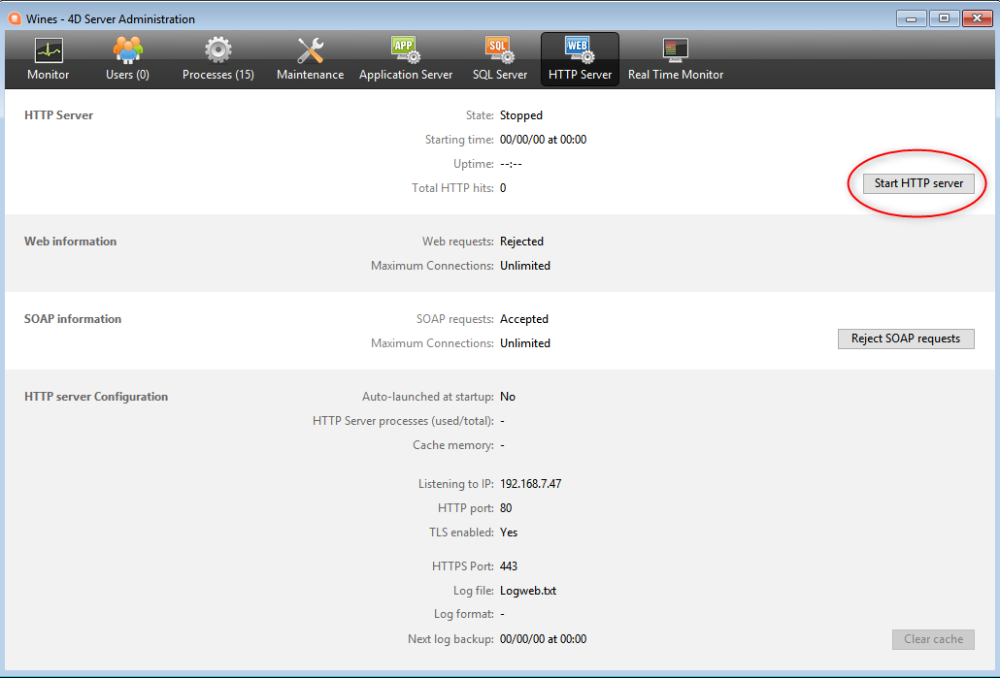

4Dには、統合された Webサーバーを起動・停止・監視するためのツールがいくつか用意されています。

## 4D Webサーバーの開始

> 4D や 4D Server の Webサーバーを起動するには、"4D Web Application" ライセンスが必要です。 詳細については [4D Webサイト](https://www.4d.com) を参照ください。

4Dプロジェクトは、メイン (ホスト) アプリケーションおよび、ホストされた各コンポーネントの Webサーバーを起動して監視することができます。

4D Webサーバーは複数の方法で起動できます:

- ボタン/メニューコマンドの使用。
  - 4D: **実行 ＞ Webサーバー開始** メニュー 
  - 4D Server: HTTPサーバーページの **HTTPサーバー開始** ボタン 

- 4Dアプリケーション開始時に Webサーバーを自動起動。 これには、ストラクチャー設定の **Web/設定**ページを表示し、**開始時にWebサーバーを起動** オプションを有効にします: 

- [`webServer.start()`](API/WebServerClass.md#start) 関数または `WEB START SERVER` コマンドを呼び出してプログラムで開始。

コンポーネントの Webサーバーは、コンポーネントの WebServer オブジェクトに対して [`webServer.start()`](API/WebServerClass.md#start) 関数を呼び出すことで開始できます。

> Webサーバーを開始したり停止したりするために、4Dアプリケーションを再起動する必要はありません。

## 4D Webサーバーの停止

4D Webサーバーは複数の方法で停止できます:

- 4D の **実行 ＞ Webサーバー停止** メニューを使用するか、 4D Server にて HTTPサーバーページの **HTTPサーバー停止** ボタンを使用する (いずれも、サーバー開始前は **…開始** と表示されています)。

- [`webServer.stop()`](API/WebServerClass.md#stop) 関数または `WEB STOP SERVER` コマンドを呼び出してプログラムで停止。

コンポーネントの Webサーバーは、コンポーネントの WebServer オブジェクトに対して `webServer.stop()` 関数を呼び出すことで停止できます。

## 4D Webサーバーのテスト

**Webサーバーテスト** メニューコマンドを使用してビルトインの Webサーバーが正しく実行されているか確認できます (4Dのみ)。 このメニューは Webサーバーが実行されているときに **実行** メニューからアクセスできます:

このコマンドを選択すると、4Dアプリケーションが公開している Webサイトのホームページが、デフォルト Webブラウザーに表示されます:

このコマンドで Webサーバーの動作や、ホームページの表示などを検証できます。 ページは、Webブラウザーが実行されているマシンの IPアドレスを指定する標準のショートカットである、*ローカルホスト* の URL を使用して呼び出されます。 コマンドはストラクチャー設定で指定された [TCP 公開ポート](webServerConfig.md#http-ポート) 番号を考慮に入れます。

## キャッシュクリア

いつでもページやイメージをキャッシュからクリアできます (たとえば、スタティックページを更新し、キャッシュにそれをリロードさせたい場合)。

これをおこなうには:

- 4D: ストラクチャー設定の [Web / オプション (I) ページ](../settings/web.md) の **キャッシュクリア** ボタンをクリックします。
- 4D Server: 4D Server 管理ウィンドウ の HTTPサーバーページにて、**キャッシュクリア** ボタンをクリックします。

キャッシュは即座にクリアされます。

> 特殊なURL [/4DCACHECLEAR](#4dcacheclear) を使用することもできます。

## ランタイムエクスプローラー

Webサーバーに関連する情報は、ランタイムエクスプローラーにある **ウォッチ** ページ (**Web** 項目内) に表示されます。

- **Webキャッシュ使用**: Webキャッシュに存在するページ数とその使用率を示します。 Webサーバーがアクティブでキャッシュサイズが 0 より大きい場合のみ、この情報が利用できます。

- **Webサーバー経過時間**: Webサーバーの使用時間を (時間 : 分: 秒 フォーマットで) 示します。 Webサーバーがアクティブである場合のみ、この情報が利用できます。

- **Webヒット数**: Webサーバーが起動してから受け取った HTTPリクエストの総数と、毎秒のリクエスト数を示します (ランタイムエクスプローラーの更新の間で測定) 。 Webサーバーがアクティブである場合のみ、この情報が利用できます。

## 管理用 URL

Webサイト管理用の URL を使用して、サーバー上に公開している Webサイトをコントロールできます。 4D Webサーバーは、*/4DSTATS*、*/4DHTMLSTATS*、*/4DCACHECLEAR* と */4DWEBTEST* の 4つの URL を受け入れます。

> */4DSTATS*、*/4DHTMLSTATS* と */4DCACHECLEAR* はデータベースの設計者と管理者のみが利用可能です。 4D のパスワードシステムが起動されていないと、これらの URL はすべてのユーザーに対して利用可能となります。 <em x-id="3">/4DWEBTEST</em> は、常に利用可能です。

### /4DSTATS

**/4DSTATS** URL は以下の情報を (ブラウザーで表示可能な) HTML の表形式で返します:

| 項目                   | 説明                                                   |
| -------------------- | ---------------------------------------------------- |
| 現在のキャッシュサイズ          | Webサーバーの現在のキャッシュサイズ (バイト単位)       |
| 最大キャッシュサイズ           | キャッシュの最大サイズ (バイト単位)               |
| キャッシュされたオブジェクトの最大サイズ | キャッシュされたオブジェクト中で最も大きなもの (バイト単位)   |
| 使用キャッシュ              | キャッシュ使用率                                             |
| キャッシュされているオブジェクト     | キャッシュされているオブジェクトの数 (**ピクチャー含む**)。 |

この情報を用いて、サーバーの機能を確認することができ、最終的には対応するパラメーターを適合させます。

> `WEB GET STATISTICS` コマンドを使用して、スタティックページに対してキャッシュがどのように使用されているかに関する情報を入手することが可能です。

### /4DHTMLSTATS

*/4DHTMLSTATS* URL は、*/4DSTATS* URLと同じ情報を HTML表形式で返します。 その違いは **キャッシュされているオブジェクト** に HTMLページの情報のみが返され、ピクチャーファイルをカウントしないことです。 さらにこの URL は **フィルターされたオブジェクト** の情報を返します。

| 項目                   | 説明                                                         |
| -------------------- | ---------------------------------------------------------- |
| 現在のキャッシュサイズ          | Webサーバーの現在のキャッシュサイズ (バイト単位)             |
| 最大キャッシュサイズ           | キャッシュの最大サイズ (バイト単位)                     |
| キャッシュされたオブジェクトの最大サイズ | キャッシュされたオブジェクト中で最も大きなもの (バイト単位)         |
| 使用キャッシュ              | キャッシュ使用率                                                   |
| キャッシュされているオブジェクト     | キャッシュされているオブジェクトの数 (**ピクチャーを除く**)。      |
| フィルターされたオブジェクト       | URL でカウントされないキャッシュ中のオブジェクトの数 (特にピクチャー)。 |

### /4DCACHECLEAR

*/4DCACHECLEAR* URLは、スタティックページとイメージのキャッシュを即座に消去します。 そのため、修正されたページを "強制的に" 更新することができます。

### /4DWEBTEST

*/4DWEBTEST* URLは、Webサーバーの状態を確認するために設計されています。 このURLが呼び出されると、4D は以下の HTTPフィールドを記したテキストファイルを返します。

| HTTPフィールド  | 説明                                   | 例題                                                                                                                                                                                                                                                                                                                                                 |
| ---------- | ------------------------------------ | -------------------------------------------------------------------------------------------------------------------------------------------------------------------------------------------------------------------------------------------------------------------------------------------------------------------------------------------------- |
| Date       | RFC 822 フォーマットでの現在の日付                | Mon, 7 Dec 2020 13:12:50 GMT                                                                                                                                                                                                                                                                                       |
| Server     | 4D/バージョン番号                           | 4D/18.5.0 (Build 18R5.257368)                                                                                                                                                                                                                                                   |
| User-Agent | 名前とバージョン @ IPクライアントアドレス | Mozilla/5.0 (Windows NT 10.0; Win64; x64) AppleWebKit/537.36 (KHTML, like Gecko) Chrome/86.0.4240.183 Safari/537.36 @ 127.0.0.1 |

## ログ

4Dでは、Webリクエストのログを2種類作成することができます:

- Webサーバーの開発段階で有用なデバッグログ (*HTTPDebugLog.txt*)。
- おもに統計目的で使用される、標準化された Webリクエストログ (*logweb.txt*)。

両方のログファイルは、アプリケーションプロジェクトの **Logs** フォルダーに自動的に作成されます。

### HTTPDebugLog.txt

[`WebServer` オブジェクト](webServerObject.md) または `WEB SET OPTION` コマンドを使って、[http デバッグファイル](webServerConfig.md#デバッグログ) を有効化することができます。

このログファイルは、各 HTTPリクエストとそれぞれのレスポンスを rawモードで記録します。 ヘッダーを含むリクエスト全体が記録され、オプションでボディ部分も記録することができます。

リクエストとレスポンスの両方に対して以下のフィールドが記録されます:

| フィールド名         | 説明                                                     |
| -------------- | ------------------------------------------------------ |
| SocketID       | 通信に使用されたソケットの ID                                       |
| PeerIP         | ホスト (あるいはクライアント) の IPv4アドレス         |
| PeerPort       | ホスト (あるいはクライアント) が使用したポート番号         |
| TimeStamp      | (システムが開始されてからの) ミリ秒単位でのタイムスタンプ      |
| ConnectionID   | 接続UUID (通信に使用された VTCPSocket の UUID) |
| SequenceNumber | ログセッション内で固有かつシーケンシャルなオペレーション番号                         |

### logweb.txt

[`WebServer` オブジェクト](webServerObject.md)、`WEB SET OPTION` コマンド、またはストラクチャー設定の **Web/ログ (タイプ)** ページを使って、[Webログファイル](webServerConfig.md#ログの記録) を有効化することができます。 ログのフォーマットを選択する必要があります。

#### CLF/DLF

それぞれのリクエストが行単位でファイル内に表示されます: *host rfc931 user [DD/MMM/YYYY:HH:MM:SS] "request" state length*。各フィールドはスペースによって区切られ、各行は CR/LF シーケンス (character 13、character 10) で終わります。

DLF (Combined Log Format) フォーマットは CLF (Common Log Format) フォーマットと類似していて、まったく同じ構造を使用します。 さらに、各リクエストの最後に2つのHTTPフィールド、Referer と User-agent を追加します。 CLF/DLF フォーマット (カスタマイズ不可) についての説明です:

| フィールド名                                                               | 説明                                                                                                                                                                                                   |
| -------------------------------------------------------------------- | ---------------------------------------------------------------------------------------------------------------------------------------------------------------------------------------------------- |
| host                                                                 | クライアントの IPアドレス (例: 192.100.100.10)                                                                                |
| rfc931                                                               | 4Dによって作成されない情報。常に - (マイナス記号) です。                                                                                                                                                  |
| user                                                                 | 認証されているユーザー名、あるいは、- (マイナス記号) 。 ユーザー名にスペースが含まれると、_ (下線) に置き換わります。                                                                          |
| DD/MMM/YYYY:HH:MM:SS | DD: 日、MMM: 月を表す3文字の略号 (Jan、Febなど)、YYYY: 年、HH: 時間、MM: 分、SS: 秒。 日付と時間はサーバーのローカルタイム。 |
| request                                                              | クライアントによって送られたリクエスト (例: GET /index.htm HTTP/1.0) 。                                                                                |
| state                                                                | サーバーの返答。                                                                                                                                                                                             |
| length                                                               | 返されたデータ (HTTPヘッダー以外) のサイズまたは 0                                                                                                                                                    |
| Referer                                                              | DLF のみ - リクエストされたドキュメントを指しているページの URL を含みます。                                                                                                                                                         |
| User-agent                                                           | DLF のみ - リクエストのオリジンにおけるクライアントのブラウザーまたはソフトウェアの名前とバージョンを含みます。                                                                                                                                          |

#### ELF/WLF

ELF (Extended Log Format) フォーマットは HTTPブラウザー界で広く普及しています。 そして、特別なニーズに応える洗練されたログを構築します。 この理由により、ELFフォーマットはカスタマイズされます。記録するフィールドやそのフィールドをファイルへ挿入する順番を選択することが可能です。

WLF (WebStar Log Format) フォーマットは 4D WebSTAR サーバー用として特別に開発されました。

##### フィールドの設定

ELF または WLF を選択すると、選択されたフォーマットに対して利用可能なフィールドが "Weg Log Token Selection" エリアに表示されます。 ログに含む各フィールドを選択する必要があります。 これには、選択するフィールドにチェックを入れます。

> 同じフィールドを 2度選択することはできません。

各フォーマットで利用可能なフィールド (アルファベット順) とその内容を以下のテーブルに示します:

| フィールド                                                  | ELF | WLF | 値                                                                                                                           |
| ------------------------------------------------------ | --- | --- | --------------------------------------------------------------------------------------------------------------------------- |
| BYTES_RECEIVED                    |     | X   | サーバーが受け取ったバイト数                                                                                                              |
| BYTES_SENT                        | X   | X   | サーバーがクライアントに送ったバイト数                                                                                                         |
| C_DNS                             | X   | X   | DNS の IPアドレス (ELF: C_IP フィールドと同一のフィールド)                             |
| C_IP                              | X   | X   | クライアントの IPアドレス (例: 192.100.100.10)       |
| CONNECTION_ID                     |     | X   | 接続ID番号                                                                                                                      |
| CS(COOKIE)                          | X   | X   | HTTPリクエストに格納されている cookie に関する情報                                                                                             |
| CS(HOST)                            | X   | X   | HTTPリクエストの Hostフィールド                                                                                                        |
| CS(REFERER)                         | X   | X   | リクエストされたドキュメントを指すページの URL                                                                                                   |
| CS(USER_AGENT) | X   | X   | クライアントのソフトウェアとオペレーティングシステムに関する情報                                                                                            |
| CS_SIP                            | X   | X   | サーバーの IPアドレス                                                                                                                |
| CS_URI                            | X   | X   | リクエストが作成された URI                                                                                                             |
| CS_URI_QUERY | X   | X   | リクエストのクエリ引数                                                                                                                 |
| CS_URI_STEM  | X   | X   | クエリ引数のないリクエストのパート                                                                                                           |
| DATE                                                   | X   | X   | DD: 日、MMM: 月を表す3文字の略号 (Jan、Febなど)、YYYY: 年                |
| METHOD                                                 | X   | X   | サーバーへ送られたリクエスト用の HTTPメソッド                                                                                                   |
| PATH_ARGS                         |     | X   | CGI引数: "$" の後に続く文字列                                                                                         |
| STATUS                                                 | X   | X   | サーバーの返答                                                                                                                     |
| TIME                                                   | X   | X   | HH: 時間、MM: 分、SS: 秒                                                          |
| TRANSFER_TIME                     | X   | X   | 返答を作成するためにサーバーが要求した時間                                                                                                       |
| USER                                                   | X   | X   | 認証されているユーザー名、あるいは、- (マイナス記号) 。 ユーザー名にスペースが含まれると、_ (下線) に置き換わります。 |
| URL                                                    |     | X   | クライアントがリクエストした URL                                                                                                          |

> 日付と時間は GMTで表されます。

#### 周期的なバックアップ

*logweb.txt* ファイルはかなり膨大になることがあるため、自動のアーカイブメカニズムを構築することが可能です。 バックアップはある周期 (時間、日、週、月単位) または、ファイルのサイズに基づいて起動します。設定の期限 (またはファイルサイズ) に近づくと、4D は自動的にカレントのログファイルを閉じてアーカイブします。そして新たにファイルを作成します。

Web のログファイル用のバックアップが起動すると、ログファイルは "Logweb Archives" という名前のフォルダーにアーカイブされます。このフォルダーは、*logweb.txt* ファイルと同じ階層に作成されます。

アーカイブされたファイルは、以下の例に基づいて名称変更されます: "DYYYY_MM_DD_Thh_mm_ss.txt"。 たとえば、ファイルがアーカイブされた時間が September 4, 2020 at 3:50 p.m. and 7 seconds である場合、"D2020_09_04_T15_50_07.txt" になります。

#### バックアップパラメーター

logweb.txt の自動バックアップパラメーターは、ストラクチャー設定の **Web/ログ (バックアップ)** ページで設定します:

最初に、頻度 (日、週などの単位)  またはファイルサイズの上限に対応するラジオボタンをクリックして選択します。 必要に応じて、バックアップする正確な時間を指定します。

- **バックアップしない**: 周期的なバックアップ機能が無効になっています。

- **X 時間ごと**: 1時間単位でバックアップをプログラムする際、このオプションを使用します。 1 から 24 の値を入力します。
  - **開始時刻**: 最初のバックアップ開始時間の設定に使用します。

- **X 日ごと**: 1日単位でバックアップをプログラムする際、このオプションを使用します。 バックアップを毎日実行するには、1を入力します。 このオプションをチェックすると、バックアップの開始時間を指定しなければなりません。

- **X 週ごと**: 1週間単位でバックアップをプログラムする際、このオプションを使用します。 たとえば、毎週バックアップをおこなうには 1 と設定します。 このオプションをチェックすると、バックアップを開始する曜日と時間を指定しなければなりません。 複数の曜日を選択することもできます。 たとえば、毎週水曜日と金曜日にバックアップをするようプログラムできます。

- **X 月ごと**: 1ヶ月単位でバックアップをプログラムする際、このオプションを使用します。 たとえば、毎月バックアップをおこなうには 1 と設定します。 このオプションをチェックすると、バックアップ開始月の日時を設定しなければなりません。

- **X MB** (サイズ指定): カレントのリクエストログのファイルサイズに基づいてバックアップをプログラムする際、このオプションを使用します。 ファイルが指定サイズに達すると、バックアップが自動的に起動します。 サイズ制限は 1、10、100 または 1000MB ごとに設定可能です。
