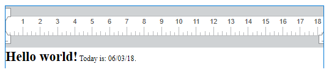

<!--REF #_command_.WP Get text.Syntax-->**WP Get text** ( *targetObj* {; *expressions*} ) -> 戻り値<!-- END REF-->
<!--REF #_command_.WP Get text.Params-->
| 引数 | 型 |  | 説明 |
| --- | --- | --- | --- |
| targetObj | Object | &#8594;  | レンジ または 要素 または4D Write Pro ドキュメント |
| expressions | Number | &#8594;  | 式の評価の指定 |
| 戻り値 | Text | &#8592; | targetObjのテキスト |

<!-- END REF-->

#### 説明 

<!--REF #_command_.WP Get text.Summary-->**WP Get text** コマンドは*targetObj* 引数で指定した4D Write Pro ドキュメントのテキストのコンテンツを取得します。<!-- END REF-->

**WP Get text** は標準テキストのみを返します。適用されたスタイル(太字、イタリック、など)は全て無視されます。

*targetObj* 引数には、以下のいずれかを格納したオブジェクトを渡します:

* レンジ
* 要素(表 / 段落 / 本文 / ヘッダー / フッター / セクション / サブセクション)
* 4D Write Pro ドキュメント

**注:**

* *targetObj* 引数に4D Write Pro ドキュメントを渡した場合、コマンドはドキュメントの*本文*要素の部分のテキストしか返しません。
* *targetObj* 引数にサブセクションを渡した場合、コマンドはその親セクションのテキストを返します。

*expressions* 任意の引数は、*targetObj* 引数の中にある4D 式の評価の仕方を定義します(詳細な情報については、*フォーミュラの管理* のページを参照してください)。指定できるオプションは以下のとおりです:

| 定数                       | コメント                                      |
| ------------------------ | ----------------------------------------- |
| wk expressions as source | 4D 式参照の元の文字列が返されます。                       |
| wk expressions as space  | 各参照は、ノンブレークスペース文字として返されます。                |
| wk expressions as value  | 4D 式参照は評価された形式で返されます(オプションが渡されない際のデフォルト)。 |

**重要**: WP や ST コマンドで使用されるテキストレンジインデックスと同じになるのは、標準テキストにwk expressions as space を使用した場合のみです。WP やST コマンドでは常に式のサイズ=1 文字とみなすからです。

**注**: 

* *targetObj* 引数のオブジェクトにピクチャーが含まれる場合、そのピクチャーは無視され、スペース文字(" ")が返されます。
* *targetObj* 引数のオブジェクトに表が含まれる場合、各セルのコンテンツが個別の段落として扱われ、タブ区切りされたテキストとして返されます。行はキャリッジリターンで分割されます。

#### 例題 

以下のドキュメント内のテキストを取得したい場合を考えます:



以下のように書くことができます:

```4d
 $range:=WP Text range(myDoc2;wk start text;wk end text)
 vText:=WP Get text($range;wk expressions as value) // "Hello world! Today is: 06/03/18." を返す
 vText2:=WP Get text($range;wk expressions as source) // "Hello world! Today is: Current date." を返す
 vText3:=WP Get text($range;wk expressions as space) // "Hello world! Today is:  ." を返す
```

#### 参照 

[WP SET TEXT](wp-set-text.md)  
*フォーミュラの管理*  