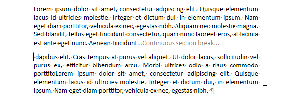

<!--REF #_command_.WP INSERT BREAK.Syntax-->**WP INSERT BREAK** ( *targetObj* ; *breakType* ; *mode* {; *rangeUpdate*} )<!-- END REF-->
<!--REF #_command_.WP INSERT BREAK.Params-->
| 引数 | 型 |  | 説明 |
| --- | --- | --- | --- |
| targetObj | Object | &#8594;  | レンジまたは要素または4D Write Pro ドキュメント |
| breakType | Integer | &#8594;  | 挿入するブレークの型 |
| mode | Integer | &#8594;  | 挿入モード |
| rangeUpdate | Integer | &#8594;  | レンジ更新モード |

<!-- END REF-->

## 説明 

<!--REF #_command_.WP INSERT BREAK.Summary-->**WP INSERT BREAK** コマンドは*mode* 引数や*rangeUpdate* 引数で指定された形で、*targetObj* 引数で指定されたレンジ内に*breakType* 引数で指定された型の新しいブレークを挿入します。<!-- END REF-->

*targetObj* 引数には、以下のいづれかを渡すことができます:

* レンジ
* 要素(表 / 行 / 段落 / 本文 / ヘッダー / フッター / インラインピクチャー / セクション / サブセクション)
* 4D Write Pro ドキュメント

*breakType* 引数には、*4D Write Pro*テーマからの以下の定数のどれか一つを渡し、挿入するブレークのタイプを定義します:

| 定数                          | 型    | 値 | コメント                                                          |
| --------------------------- | ---- | - | ------------------------------------------------------------- |
| wk column break             | 倍長整数 | 3 | カラムブレーク:カラムブレークを挿入します                                         |
| wk continuous section break | 倍長整数 | 5 | 継続したセクションブレークを定義します(一般的には新しいページに移らずにページ内でカラムの数を変更するために使用されます) |
| wk line break               | 倍長整数 | 0 | (同じ段落内での)改行                                                   |
| wk page break               | 倍長整数 | 2 | 改ページ：新しいページを定義します。                                            |
| wk paragraph break          | 倍長整数 | 4 | 段落ブレーク: 新しい段落を定義します。                                          |
| wk section break            | 倍長整数 | 1 | セクションブレーク:新しいセクションを定義します。                                     |

*mode* 引数には、対象となる*targetObj* レンジ内で使用されるブレークの挿入モードを指定する定数を渡します:

| 定数         | 型    | 値 | コメント                 |
| ---------- | ---- | - | -------------------- |
| wk append  | 倍長整数 | 2 | コンテンツをターゲットの終わりに挿入する |
| wk prepend | 倍長整数 | 1 | コンテンツをターゲットの始めに挿入する  |
| wk replace | 倍長整数 | 0 | ターゲットのコンテンツを置き換える    |

任意の*rangeUpdate* 引数内には、以下の定数のいずれか一つを渡し、挿入したコンテンツが挿入後のレンジに含まれるかどうかを指定します:

| 定数                    | 型    | 値 | コメント                      |
| --------------------- | ---- | - | ------------------------- |
| wk exclude from range | 倍長整数 | 1 | 更新されたレンジには、以前のコンテンツのみを含める |
| wk include in range   | 倍長整数 | 0 | 更新されたレンジに挿入コンテンツを含める      |

* *targetObj* がレンジである場合、任意の*rangeUpdate* 引数に以下の定数のいづれか一つを渡すことで挿入されたコンテンツが結果のレンジに含まれるかどうかを指定することができます:  
    
| 定数                    | 型    | 値 | コメント                      |  
| --------------------- | ---- | - | ------------------------- |  
| wk exclude from range | 倍長整数 | 1 | 更新されたレンジには、以前のコンテンツのみを含める |  
| wk include in range   | 倍長整数 | 0 | 更新されたレンジに挿入コンテンツを含める      |  
    
引数を渡さなかった場合、デフォルトでは挿入されたコンテンツは結果のレンジに含まれます。
* *targetObj* がレンジでない場合、*rangeUpdate* 引数は無視されます。

## 例題 1 

請求書を作成する際、最後のページを除いてページブレーク(改ページ)を挿入したい場合を考えます:

```4d
 $nbInvoices:=Records in selection([INVOICE])
 For($j;1;$nbInvoices)
    ... //請求書を処理
    If($j#$nbInvoices) //最後のページを除いて改ページを挿入
       WP INSERT BREAK($buildRange;wk page break;wk append;wk exclude from range)
    End if
 End for
```

## 例題 2 

同じページ内に連続したセクションブレークを単一カラムセクションと2カラムセクションとの間に挿入したい場合を考えます。

1. セレクション位置に継続したセクションブレークを挿入して新しいセクションを作成します:  
    
```4d  
 $range:=WP Selection range(*;"WParea")  
 WP INSERT BREAK($range;wk continuous section break;wk append)  
```  
    
    

2. 最初のセクションに対してカラム数を2に設定します:  
    
```4d  
 $section:=WP Get section(WParea;1)  
 WP SET ATTRIBUTES($section;wk column count;2)  
```  
    
    


## 参照 

[WP Get breaks](wp-get-breaks.md)  
[WP INSERT DOCUMENT](wp-insert-document.md)  