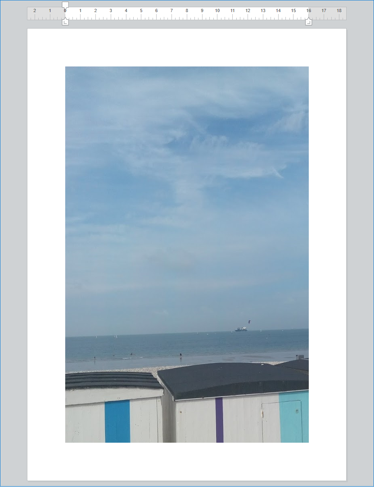

<!--REF #_command_.WP SET ATTRIBUTES.Syntax-->**WP SET ATTRIBUTES** ( *targetObj* ; *attribName* ; *attribValue* {; *attribName2* ; *attribValue2* ; ... ; *attribNameN* ; *attribValueN*} )<!-- END REF-->
<!--REF #_command_.WP SET ATTRIBUTES.Params-->
| 引数 | 型 |  | 説明 |
| --- | --- | --- | --- |
| targetObj | Object | &#8594;  | 4D Write Pro ドキュメント、レンジ または要素 |
| attribName | Text | &#8594;  | 設定する属性名 |
| attribValue | Text, Number, Object, Collection, Picture, Date | &#8594;  | 新しい属性の値 |

<!-- END REF-->

## 説明 

<!--REF #_command_.WP SET ATTRIBUTES.Summary-->**WP SET ATTRIBUTES**コマンドを使ってレンジ、要素、あるいはドキュメントのあらゆる属性の値を設定することができます。<!-- END REF-->このコマンドを使ってあらゆる4D Write Pro内部の属性(文字、段落、ドキュメント、またはピクチャー)にアクセスすることができます。

第一引数には、以下のいずれかを渡すことができます:

* レンジ
* 要素(ヘッダー / フッター / 本文 / 表 / 行 / 段落 / アンカーされた画像あるいはインライン画像 / セクション / サブセクション / スタイルシート)
* 4D Write ドキュメント

*attribName*には設定する属性名を、*attribValue*には設定する値を渡します。*attribName*引数に渡す属性の包括的な一覧と、それに対応する値については、*4D Write Pro属性*の章を参照してください。

受け渡すことのできる *attribName* / *attribValue* ペアの数に制限はありません。

**注:** 同じ対象について複数の属性を設定する場合、**WP SET ATTRIBUTES** を複数回呼び出すよりも、一回の呼び出しで複数の*attribName* / *attribValue* ペアを一括指定するほうが処理が最適化されます。

## 例題 1 

この4D Write Proエリアにて、以下のように単語を選択した場合を考えます:


以下のコードを実行した場合:

```4d
 $range:=WP Get selection(*;"WParea") //選択されたレンジを取得
 
  // 選択されたテキストに対して影のオフセットをpt単位で設定
 WP SET ATTRIBUTES($range;wk text shadow offset;1)
  //段落のパッディングを設定
 WP SET ATTRIBUTES($range;wk padding;1)
  //10 ptの境界線を定義
 WP SET ATTRIBUTES($range;wk border style;wk solid;wk border width;10)
  //境界線カラーを設定
 WP SET ATTRIBUTES($range;wk border color;"blue";wk border color bottom;"#00FA9A";wk border color right;"#00FA9A")
```

以下の様な結果が得られます:


## 例題 2 

以下の例では、wk insideとwk outside定数の使用を説明します:

```4d
 $wpRange:=WP Get selection(writeProdoc)
 WP SET ATTRIBUTES($wpRange;wk border style+wk inside;wk dotted)
 WP SET ATTRIBUTES($wpRange;wk border style+wk outside;wk solid)
 WP SET ATTRIBUTES($wpRange;wk border color+wk outside;"#00FA9A")
```

ドキュメント全体が選択されていた場合、結果は以下のようになります:


## 例題 3 

ドキュメントに対して背景画像を設定したい場合を考えます:

```4d
 var WParea : Object
 WParea:=WP New
 
 READ PICTURE FILE("C:\\Pictures\\boats.jpg";$picture)
 
 WP SET ATTRIBUTES(WParea;wk background image;$picture)
```

結果は以下のようになります:



背景画像を、印刷可能エリア全体に対して設定したい場合を考えます:

```4d
 var WParea : Object
 WParea:=WP New
 
 READ PICTURE FILE("C:\\Pictures\\boats.jpg";$picture)
 
 WP SET ATTRIBUTES(WParea;wk background image;$picture)
 WP SET ATTRIBUTES(WParea;wk background clip;wk paper box)
 WP SET ATTRIBUTES(WParea;wk background origin;wk paper box)
```

結果は以下のようになります:


**注**: paper box の値はドキュメントあるいはセクションに対してのみ適用可能です。

## 例題 4 

異なる間隔のタブを設定し、別々の文字を先頭文字として定義したい場合を考えます:

```4d
 var WParea : Object
 
 ARRAY TEXT(_position;0)
 ARRAY LONGINT(_type;0)
 ARRAY TEXT(_leadings;0)
 
 APPEND TO ARRAY(_position;"3cm")
 APPEND TO ARRAY(_type;wk left)
 APPEND TO ARRAY(_leadings;".")
 
 APPEND TO ARRAY(_position;"7.5cm")
 APPEND TO ARRAY(_type;wk right)
 APPEND TO ARRAY(_leadings;".")
 
 APPEND TO ARRAY(_position;"9cm")
 APPEND TO ARRAY(_type;wk center)
 APPEND TO ARRAY(_leadings;".")
 
 APPEND TO ARRAY(_position;"12cm")
 APPEND TO ARRAY(_type;wk decimal)
 APPEND TO ARRAY(_leadings;"~")
 
 APPEND TO ARRAY(_position;"2cm")
 APPEND TO ARRAY(_type;wk left)
 APPEND TO ARRAY(_leadings;"")
 
 $range:=WP Get selection(WParea)
 WP SET ATTRIBUTES($range;wk tab stop offsets;_position)
 WP SET ATTRIBUTES($range;wk tab stop types;_type)
 WP SET ATTRIBUTES($range;wk tab stop leadings;_leadings)
```

結果は以下のようになります:


## 参照 

*4D Write Pro属性*  
[WP GET ATTRIBUTES](wp-get-attributes.md)  
[WP RESET ATTRIBUTES](../commands/wp-reset-attributes.md)  