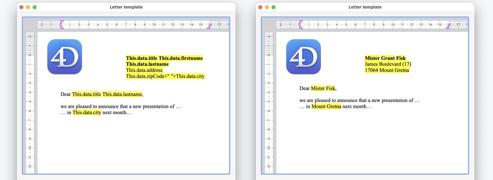

<!--REF #_command_.WP SET DATA CONTEXT.Syntax-->**WP SET DATA CONTEXT** ( *wpDoc* ; *contextData* )<!-- END REF-->
<!--REF #_command_.WP SET DATA CONTEXT.Params-->
| 引数 | 型 |  | 説明 |
| --- | --- | --- | --- |
| wpDoc | Object | &#8594;  | 4D Write Pro ドキュメント |
| contextData | Object | &#8594;  | コンテキストに入れるデータ |

<!-- END REF-->

*このコマンドはスレッドセーフではないため、プリエンプティブなコードには使えません。*


#### 説明 

<!--REF #_command_.WP SET DATA CONTEXT.Summary-->**WP SET DATA CONTEXT** コマンドは、*contextData* 引数で指定したオブジェクトを、*wpDoc* 引数で指定した4D Write Pro ドキュメントのデータコンテキストとして設定します。<!-- END REF-->新しいコンテキスト設定した場合には、ドキュメントの既存のコンテキストは全て上書きされます。

*wpDoc* 引数には、データコンテキストを受け取る4D Write Pro ドキュメントを渡します。

*contextData* 引数には、データコンテキストの中身を決定するオブジェクトを渡します。4D オブジェクトであればどんな物でも渡すことができます。これには4D.Entity などのORDA クラスに属するオブジェクトも含まれます。コンテキストをリセットするには、*null* オブジェクトを渡します。

4D Write Pro データコンテキストは揮発性のものです。つまり以下のようなことを意味します: 

* ランタイムにおいて、4D Write Pro ドキュメント内からアクセス可能です。
* 他の4D Write Pro プロパティとは異なり、4D Write Pro ドキュメン内には保存されません。

これにより、同じドキュメントを、異なるプロセスで、各プロセスごとに異なるコンテキストで使用することが可能です。

データコンテキストが設定されると、そのデータは4D Write Pro エリア内において**This.data** というフォーミュラを用いて利用可能になります。

**注意:** 表組のデータソースを使用している場合には**This** を通して追加のフォーミュラを利用することができます。詳細は*This を使用した式* を参照してください。

データコンテキストは、それが定義されたプロセス内においてのみ使用可能です:

* 異なるプロセスからの計算されたフォーミュラ内でデータコンテキストを使用した場合、それは*null* となり、**This.data** は未定義になります。
* 他のプロセスにおいて同じドキュメントに対して定義されたデータコンテキストを設定した場合、エラーとなります。

異なるプロセスにおいて異なるデータコンテキストのフォーミュラを計算したい場合(例:同じテンプレートのドキュメントから異なる請求書を生成した場合など)、エラーを避けるためにそれぞれのプロセスにおいて [WP New](wp-new.md) を使用してドキュメントを複製することが推奨されます。ドキュメントを複製してもデータコンテキストはコピーされないという点に注意してください。

#### 例題 1 

4D Write Pro ドキュメントのコンテキストにオブジェクトを挿入し、その情報をページ上に表示させたい場合を考えます: 

```4d
 var $person;$info: Object
 
  // person オブジェクトを作成する
 $person:=New object()
 $person.firstName:="John"
 $person.lastName:="Doe"
 
  // person オブジェクトを使用してコンテキストを設定する
 WP SET DATA CONTEXT(WParea;$person)
 
  // "This" キーワードを使用してコンテキストデータにアクセスする
 $info:=Formula(This.data.firstName+" "+This.data.lastName)
 
  // ページ上にコンテキストデータを表示する
 WP INSERT FORMULA(WParea;$info;wk replace) // ページ上に "John Doe" を表示する
```

上記のコードを実行した結果は以下のようになります:


#### 例題 2 

テンプレートのドキュメントを使用している場合、それとコンテキストデータを組み合わせることでページにデータを流し込むことができます。これは例えばメールキャンペーンなどにおいて有用と言えます。

テンプレートがロードされてコンテキストが設定されれば、以下のようにテンプレートを活用することができます:



以下のコードは、エンティティセレクション内をループし、各エンティティに対して印刷プレビューを作成します:

```4d
 var $person: 4D.Entity
 var $people: 4D.EntitySelection
 
 SET PRINT PREVIEW(True)
 $people:=ds.People.all()
 For each($person;$people)
    WP SET DATA CONTEXT(WParea;$person)
    WP PRINT(WParea)
 End for each
```

#### 参照 

  
[WP COMPUTE FORMULAS](wp-compute-formulas.md)  
[WP Get data context](wp-get-data-context.md)  