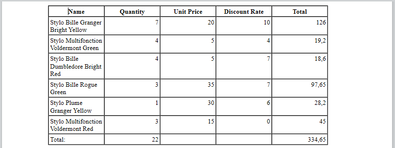

<!--REF #_command_.WP Table append row.Syntax-->**WP Table append row** ( *tableRef* ; *value* {; *value2* ; ... ; *valueN*} )  -> 戻り値<!-- END REF-->
<!--REF #_command_.WP Table append row.Params-->
| 引数 | 型 |  | 説明 |
| --- | --- | --- | --- |
| tableRef | Object | &#8594;  | テーブル参照オブジェクト |
| value | Text, Number, Time, Date, Picture | &#8594;  | 追加行の各セルに設定する値 |
| 戻り値 | Object | &#8592; | 行レンジオブジェクト |

<!-- END REF-->

## 説明 

<!--REF #_command_.WP Table append row.Summary-->**WP Table append row**コマンドは *tableRef* で指定したテーブルの最後に新規行を追加し、各セルに*value*で指定した値を設定して、当該行レンジオブジェクトを戻り値として返します。<!-- END REF--> 

*value*に受け渡した引数の件数分のセルが、このコマンドによって追加されます。様々な型の値を引数として渡すことができ、その件数に制限はありません。セル内のデフォルト水平位置は値の型に依存します:

* テキスト: 左揃え
* ピクチャー: 中央揃え
* その他 (数値、日付、時間): 右揃え

**注:** 配列型の値には対応していません。

このコマンドは新規追加行を行レンジオブジェクトとして返します。 

## 例題 1 

新規テーブルを作成し、様々な大きさの行を複数追加します:

```4d
 var $wpTable;$wpRange;$wpRow1;$wpRow2;$wpRow3 : Object
 $wpRange:=WP Text range(WParea;wk start text;wk end text)
 $wpTable:=WP Insert table($wpRange;wk append)
 $wpRow1:=WP Table append row($wpTable;"Paul";"Smith";25)
 $wpRow2:=WP Table append row($wpTable;"John";"Richmond";40)
 $wpRow3:=WP Table append row($wpTable;"Mary";"Trenton";18;"New!")
```


## 例題 2 

請求書において、関連する請求項目のテーブルを自動作成します:

```4d
 var $wpTable;$wpRange : Object
 
 $wpRange:=WP Text range(4DWPArea;wk start text;wk end text)
 
 $wpTable:=WP Insert table($wpRange;wk append) // テーブルを作成します
 
  // ヘッダー行を追加します
 $row:=WP Table append row($wpTable;"Name";"Quantity";"Unit Price";"Discount Rate";"Total")
 WP SET ATTRIBUTES($row;wk font bold;wk true;wk text align;wk center)
 
  // apply to selection コマンドを使います
 APPLY TO SELECTION([INVOICE_LINES];WP Table append row($wpTable;[INVOICE_LINES]ProductName;[INVOICE_LINES]Quantity;[INVOICE_LINES]ProductUnitPrice;[INVOICE_LINES]DiscountRate;[INVOICE_LINES]Total))
 
  // フッター行を追加します
 $row:=WP Table append row($wpTable;"Total:";Sum([INVOICE_LINES]Quantity);"";"";Sum([INVOICE_LINES]Total))
 
  // テーブルの書式を設定します
 $range:=WP Table get columns($wpTable;1;5)
 WP SET ATTRIBUTES($range;wk width;"80pt")
 WP SET ATTRIBUTES($wpTable;wk font size;10)
```



## 参照 

[WP Insert table](wp-insert-table.md)  
[WP Table get rows](wp-table-get-rows.md)  