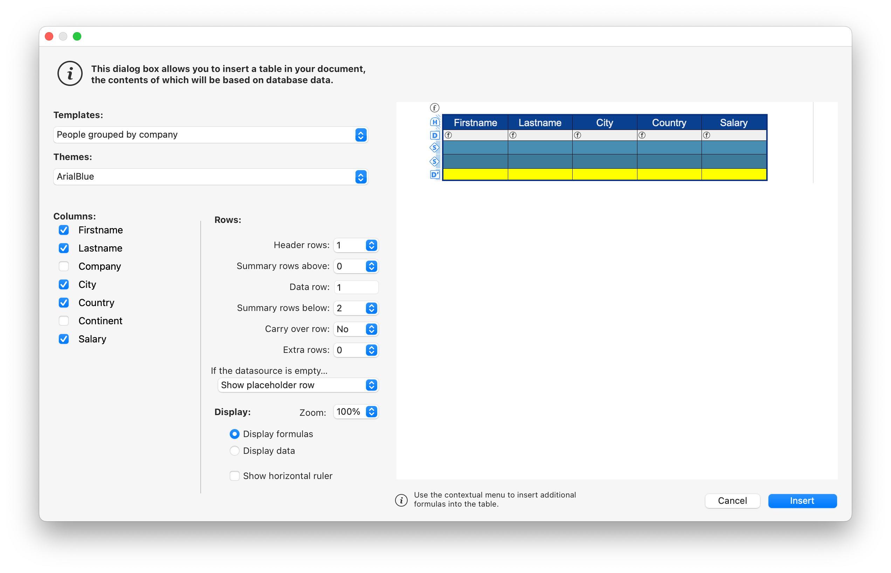
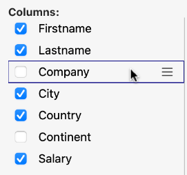

4D WritePro インターフェースは、エンドユーザーが 4D Write Proドキュメントを簡単にカスタマイズできるパレットを提供します。

4D のデベロッパーは、これらのパレットをアプリケーションに簡単に実装することができます。 それにより、エンドユーザーは、フォントやテキストの揃え方向、ブックマーク、表レイアウト、フレームなど、4D Write Pro のプロパティをすべて管理することができます。

インターフェースのマニュアルについては、*4D デザインリファレンス* の [4D Write Pro エリアのドキュメント](https://doc.4d.com/4Dv20/4D/20/Entry-areas.300-6263967.ja.html) を参照ください。

表ウィザードの設定に関するドキュメントは以下のとおりです。

## 表ウィザード

表ウィザードは、コンテキスト、データソース、およびフォーミュラを使用した、データベースのデータに基づく表組みの作成をさらに簡素化します。

エンドユーザーがアクセスできる表ウィザードは、4D デベロッパーが設定し提供するテンプレートをロードします。 これにより、デベロッパーはユーザーの特定のユースケースやビジネス要件に応じてテンプレートをカスタマイズすることができます。

表ウィザードには、デフォルトのテンプレートおよびテーマが用意されており、デベロッパーはそれらを、アプリケーションで必要とされる内容に適合させることができます。

アプリケーションに表ウィザードを実装するために、デベロッパーはテンプレートファイルを作成し、設定することができます。

### WP表ウィザードのインターフェース

ユーザーは、4D Write Pro インタフェースツールバーとサイドバーの "表を挿入" メニューボタンから表ウィザードダイアログを開きます。



このインターフェースで、ユーザーは最初のドロップダウンリストからテンプレートまたはテーブルを選択し、2番目のドロップダウンリストからテーマを選択します。

##### 列について:



テンプレートまたはテーブルの選択に応じて、テンプレートに保存されているフィールドのリストが表示されます (BLOB およびオブジェクト型は自動的に除外されます)。 表の列として表示させたいフィールドは、フィールド名の左にあるチェックボックスで選択します。また、表示する列の順序はフィールドをドラッグしてリスト内を移動させることで変更することができます。

##### 行について:


表ウィザードでは、ヘッダー行と追加の行の数 (それぞれ 0～5) を定義したり、[ブレーク行](https://doc.4d.com/4Dv20/4D/20/Handling-tables.200-6229469.ja.html#6233076) (小計行) を繰り返し行の上または下に設定したり、[キャリーオーバー行](https://doc.4d.com/4Dv20/4D/20/Handling-tables.200-6229469.ja.html#6236686) の表示/非表示を選択したりすることもできます。

さらに、次のオプションを使用して、データソースが空の場合の表組みの動作を選択できます: データ行を表示、データ行を非表示、表を非表示、プレースホルダー行を表示。

##### 表示について:


ユーザーは、ドロップダウンリストから希望するオプションを選択することで、好みのズームレベルを調整し、ラジオボタンを使ってフォーミュラまたはデータを表示し、チェックボックスを使って水平ルーラーを表示するかどうかを選択します。

表の作成とカスタマイズが完了したら、**挿入** ボタンをクリックして、WPドキュメントに表組みを追加することができます。

ドキュメントに表が統合されると、ユーザーはそのスタイルをカスタマイズできます。 ツールバーやサイドバーの書式設定ツールはすべて利用可能です。

### WP表ウィザードのテンプレートの設定

テンプレートの設定には以下が含まれます:

- [テンプレートファイル](#テンプレートファイル): テーブルとフィールドを定義し、アプリケーションに適合したフォーミュラを用意します。
- [トランスレーションファイル](#トランスレーションファイル): テーブル、フィールド、フォーミュラの翻訳名を指定します。
- [テーマファイル](#テーマファイル): グラフィックスタイルとテーマをデザインしカスタマイズします。

表ウィザードを設定するにあたって、これら 3種類のファイルにはそれぞれ明確な役割がありますが、いずれも必須ではありません。

#### テンプレートファイル

テンプレートファイルを使って、以下のことが定義できます:

- 表のデータソースとして使用されるエンティティセレクションを返すフォーミュラ
- ブレーク行のフォーミュラ (ブレーク行を挿入できる場合)
- 表の列として使用できるデータクラス属性
- ブレーク行、キャリーオーバー行、プレースホルダー行、追加の行において、コンテキストメニューから選択可能なフォーミュラ

テンプレートファイルはプロジェクトの "[`Resources`](../Project/architecture.md#resources)/4DWP_Wizard/Templates" フォルダーに保存する必要があります。

JSON形式のテンプレートファイルには、以下の属性が含まれます:

| 属性                                   | 型          | 必須 | 説明                                                                          |
| :----------------------------------- | :--------- | :- | :-------------------------------------------------------------------------- |
| tableDataSource                      | Text       | ○  | 表のデータソースのフォーミュラ                                                             |
| columns                              | Collection | ○  | 表の列のコレクション                                                                  |
| columns.check        | Text       | ○  | 表ウィザードであらかじめチェックされている場合は true。 列のチェックをあらかじめ外しておく場合は false。                  |
| columns.header       | Text       | ○  | ユーザーに提示する表示名                                                                |
| columns.source       | Text       | ○  | フォーミュラ                                                                      |
| breaks                               | Collection |    | ブレークオブジェクトのコレクション。 ブレークの順番は重要です。 この順番は、ドキュメント内でブレーク行が繰り返し行の上にある場合の順番に対応します。 |
| breaks.label         | Text       | ○  | ユーザーに提示する表示名                                                                |
| breaks.source        | Text       | ○  | フォーミュラ                                                                      |
| breakFormulas                        | Collection |    | ブレーク行に適用可能なフォーミュラオブジェクトのコレクション                                              |
| breakFormulas.label  | Text       | ○  | ユーザーに提示する表示名                                                                |
| breakFormulas.source | Text       | ○  | フォーミュラ                                                                      |
| bcorFormulas                         | Collection |    | 下部キャリーオーバー行に適用可能なフォーミュラオブジェクトのコレクション                                        |
| bcorFormulas.label   | Text       | ○  | ユーザーに提示する表示名                                                                |
| bcorFormulas.source  | Text       | ○  | フォーミュラ                                                                      |
| extraFormulas                        | Collection |    | 追加の行に適用可能なフォーミュラオブジェクトのコレクション                                               |
| extraFormulas.label  | Text       | ○  | ユーザーに提示する表示名                                                                |
| extraFormulas.source | Text       | ○  | フォーミュラ                                                                      |
| placeholderFormulas                  | Collection |    | プレースホルダー行に挿入されるフォーミュラオブジェクトのコレクション                                          |

:::note フランス語のランゲージについて

もし、4Dランゲージがフランス語に設定された環境で実行される可能性があるのであれば、ランゲージ設定に関わらず正しく解釈されるよう、フォーミュラに [トークン](https://doc.4d.com/4Dv20/4D/20/Using-tokens-in-formulas.300-6237731.ja.html) を使用するようにしてください。

:::

##### 例題

JSONファイルの簡単な一例を以下に示します:

```json
{
    "tableDataSource": "ds.People.all().orderBy(\"toCompany.name asc, continent asc, country asc, city asc\")",
    "columns": [{
            "check": true,
            "header": "Firstname",
            "source": "This.item.firstname"
        }, {
            "check": true,
            "header": "Lastname",
            "source": "This.item.lastname"
        }, {
            "check": true,
            "header": "Salary",
            "source": "String(This.item.salary;\"###,###.00\")"
        }
    ],
    "breaks": [{
            "label": "Company",
            "source": "This.item.toCompany.name"
        }
    ],
    "breakFormulas": [{
            "label": "Company",
            "source": "This.item.toCompany.name"
    }, {
            "label": "Sum of salaries",
            "source": "String(This.breakItems.sum(\"salary\"); \"###,###.00\")"
        }
    ],
    "bcorFormulas": [{
            "label": "Sum of salaries",
            "source": "String(This.tableData.sum(\"salary\"); \"###,###.00\")"
        }
    ],
    "extraFormulas": [{
            "label": "Sum of salaries",
            "source": "String(This.tableData.sum(\"salary\"); \"###,###.00\")"
        }
    ]
}


```

#### トランスレーションファイル

トランスレーションファイルは、テンプレート、テーマ、テーブル、フィールド、およびフォーミュラの翻訳名を指定します。 これらのファイルはプロジェクトの "[`Resources`](../Project/architecture.md#resources)/4DWP_Wizard/Translations" フォルダーに追加します。

各トランスレーションファイルには、対応する言語コード (英語なら "en"、日本語なら "ja" など) のファイル名を付けます。

JSON形式のトランスレーションファイルには、以下の属性が含まれます:

| 属性        | 型          | 必須 | 説明                                                              |
| :-------- | :--------- | :- | :-------------------------------------------------------------- |
| テーブル      | Collection |    | 翻訳されたテーブルオブジェクトのコレクション                                          |
| fields    | Collection |    | 翻訳されたフィールドオブジェクトのコレクション                                         |
| formulas  | Collection |    | 翻訳されたフォーミュラオブジェクトのコレクション                                        |
| fileNames | Collection |    | 翻訳された fileNameオブジェクトのコレクション (テーマとテンプレート名に適用) |

これら属性に含まれるコレクションの各オブジェクト要素は以下の属性を含みます:

| 属性          | 型    | 必須 | 説明         |
| :---------- | :--- | :- | :--------- |
| original    | Text | ○  | 翻訳の対象となる原文 |
| translation | Text | ○  | 原文を翻訳したもの  |

これらの属性を定義することで、原文と翻訳されたコンテンツ間の適切な対応が確保されます。

テンプレート名やフォーミュラ名 (ブレーク行、キャリーオーバー行、追加の行) がトランスレーションファイルに存在する場合、表ウィザードではその翻訳が表示されます。 また、トランスレーションファイル内で定義されたテーブルだけが表ウィザードに (翻訳されて) 表示されます。

ユーザーがインターフェースでテーブルを選択したときには、トランスレーションファイルは追加の役割を果たします。 具体的には、ユーザーに提案されるテーブルやフィールドをフィルターします。 たとえば、テーブルID を非表示にするなど、この動作は `SET TABLE TITLES` や `SET FIELD TITLES` コマンドに似ています。

##### 例題

```json
{
    "tables": [{
            "original": "People",
            "translation": "従業員"
        }
    ],
    "fields": [{
            "original": "lastname",
            "translation": "名字"
        }, {
            "original": "firstname",
            "translation": "名前"
        }, {
            "original": "salary",
            "translation": "給与"
        }, {
            "original": "company",
            "translation": "会社"
        }
    ],
    "formulas": [{
            "original": "Sum of salary",
            "translation": "給与の合計"
        }
    ]
}


```

#### テーマファイル

4D WritePro Interface コンポーネントには、"Arial"、"CourierNew"、"YuGothic" などのテーマがデフォルトで用意されており、"Blue" や "Green" など複数のバリエーションが用意されています。 しかし、プロジェクト内の "[`Resources`](../Project/architecture.md#resources)/4DWP_Wizard/Themes" フォルダーにテーマファイルを配置することで、独自のテーマを作成することができます。

JSON形式のテーマファイルには、以下の属性が含まれます:

| 属性          | 型      | 必須 | 説明                                                              |
| :---------- | :----- | :- | :-------------------------------------------------------------- |
| default     | Object |    | すべての行に適用されるデフォルトスタイルを格納したオブジェクト。                                |
| table       | Object |    | 表組みに適用されるスタイル定義を格納したオブジェクト。                                     |
| rows        | Object |    | すべての行に適用されるスタイル定義を格納したオブジェクト。                                   |
| cells       | Object |    | すべてのセルに適用されるスタイル定義を格納したオブジェクト。                                  |
| header1     | Object |    | 先頭のヘッダー行に適用されるスタイル定義を格納したオブジェクト。                                |
| header2     | Object |    | 2つ目のヘッダー行に適用されるスタイル定義を格納したオブジェクト。                               |
| header3     | Object |    | 3つ目のヘッダー行に適用されるスタイル定義を格納したオブジェクト。                               |
| header4     | Object |    | 4つ目のヘッダー行に適用されるスタイル定義を格納したオブジェクト。                               |
| header5     | Object |    | 5つ目のヘッダー行に適用されるスタイル定義を格納したオブジェクト。                               |
| headers     | Object |    | header1、header2など専用のスタイル定義がない場合に、ヘッダー行に 適用されるスタイル定義を格納したオブジェクト。 |
| data        | Object |    | 繰り返し行に適用されるスタイル定義を格納したオブジェクト。                                   |
| break1      | Object |    | 1つ目のブレーク行に適用されるスタイル定義を格納したオブジェクト。                               |
| break2      | Object |    | 2つ目のブレーク行に適用されるスタイル定義を格納したオブジェクト。                               |
| break3      | Object |    | 3つ目のブレーク行に適用されるスタイル定義を格納したオブジェクト。                               |
| break4      | Object |    | 4つ目のブレーク行に適用されるスタイル定義を格納したオブジェクト。                               |
| break5      | Object |    | 5つ目のブレーク行に適用されるスタイル定義を格納したオブジェクト。                               |
| breaks      | Object |    | break1、break2など専用のスタイル定義がない場合に、ブレーク行に 適用されるスタイル定義を格納したオブジェクト。   |
| bcor        | Object |    | 下部キャリーオーバー行に適用されるスタイル定義を格納したオブジェクト。                             |
| placeholder | Object |    | プレースホルダー行に適用されるデフォルトスタイルを格納したオブジェクト。                            |

JSONファイルで設定する各属性に対して、以下の WP属性を定義することができます ([対応する WP定数](https://doc.4d.com/4Dv20/4D/20/4D-Write-Pro-Attributes.300-6229528.ja.html) を指定します):

| WP 属性           | 対応する WP定数           |
| :-------------- | :------------------ |
| textAlign       | wk text align       |
| backgroundColor | wk background color |
| borderColor     | wk border color     |
| borderStyle     | wk border style     |
| borderWidth     | wk border width     |
| font            | wk font             |
| color           | wk font color       |
| fontFamily      | wk font family      |
| fontSize        | wk font size        |
| padding         | wk padding          |

##### 例題

```json
{
    "default": {
           "backgroundColor": "#F0F0F0",
           "borderColor": "#101010",
           "borderStyle": 1,
           "borderWidth": "0.5pt",
           "font": "Times New Roman",
           "color": "#101010",
           "fontFamily": "Times New Roman",
           "fontSize": "7pt",
           "padding": "2pt"
    },
    "table": {
           "backgroundColor": "#E1EAF3"
    },
    "header1": {
           "textAlign": 2,
           "borderColor": "#41548F",
           "borderWidth": "1.5pt",
           "backgroundColor": "#979BA9",
           "color": "#F4F4FF",
           "font": "Times New Roman Bold"
    },
    "data": {
           "fontSize": "13pt",
           "textAlign": 0
    },
    "break1": {
           "textAlign": 2,
           "fontSize": "15pt"
    }
}


```

#### 参照

[4D Write Pro - 表ウィザード (チュートリアル動画)](https://www.youtube.com/watch?v=2ChlTju-mtM)
