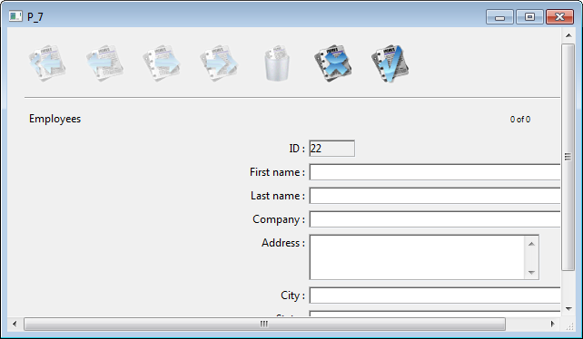

<!--REF #_command_.ADD RECORD.Syntax-->**ADD RECORD** ( {*aTable*}{;}{*} )<!-- END REF-->
<!--REF #_command_.ADD RECORD.Params-->
| 引数 | 型 |  | 説明 |
| --- | --- | --- | --- |
| aTable | Table | &#8594;  | データ入力に使用するテーブル, または 省略した場合デフォルトテーブル |
| * | Operator |  &#8594;  | スクロールバーを隠す |

<!-- END REF-->

#### 互換性に関する注意 

<!--REF #_command_.ADD RECORD.Summary-->*このコマンドは4D の初期のリリースに実装されたものでプロトタイプや基本的な開発には引き続き有用です。<!-- END REF-->しかしながら、ビルドされ、カスタマイズされた現代的なインターフェースにおいては、データフローに関してより高度な機能とコントロールを提供する* *[DIALOG](dialog.md) コマンドに基づいた一般的なフォームを使用することが推奨されます。*

#### 説明 

**ADD RECORD** コマンドは、データベースのテーブル*aTable*または*aTable*が省略された場合デフォルトテーブルに、ユーザが新規レコードを追加できるようにします。

**ADD RECORD** は新しいレコードを作成、それをカレントプロセスのカレントレコードとし、カレントの入力フォームを表示します。アプリケーションモードにおいて、ユーザが新しいレコードを受け入れると、新しいレコードがカレントセレクションにある唯一のレコードになります。

次の図は、典型的なデータ入力フォームです。



このフォームはこのプロセスの最前面のウインドウに表示されます。ウインドウには、スクロールバーとサイズボックスがあります。オプションの *\** 引数を指定すると、スクロールバーがないウインドウを描画され、フォームウィンドウは縮小することができなくなります


**ADD RECORD** は、ユーザがレコードを受け入れるか取り消すまでフォームを表示します。ユ－ザが複数のレコ－ドを追加する場合は、新しいレコードごとに1回ずつコマンドを実行しなければなりません。

ユーザが保存ボタンをクリック、またはenterキーを押す、または[ACCEPT](accept.md)コマンドが実行されると、レコードが保存されます。

ユーザがキャンセルボタンをクリック、またはキャンセルキーコンビネーション (WindowsではCtrl-ピリオド、Mac OSではCommand-ピリオド) を押す、または[CANCEL](cancel.md) コマンドが実行されると、レコードは保存されません。

**注:** このコマンドでは、*aTable* に渡したテーブルが読み書き可能モードである必要はありません。テーブルが読み込みのみモードの場合でも使用する事ができます(*レコードのロック*を参照して下さい)。

**ADD RECORD** の呼び出し後、システム変数OKにはレコードが受け入れられると1が、キャンセルされると0が設定されます。

**Note:** キャンセルされた場合でも、レコードはメモリ上に残されたままとなります。カレントレコードポインタが変更される前に[SAVE RECORD](save-record.md)コマンドを実行すれば、レコードは保存されます。

#### 例題 1 

次の例は、データベースに新しいレコードを追加する際によく使われるループです: 

```4d
 FORM SET INPUT([Customers];"Std Input") // [Customers] テーブルの入力フォームを設定
 REPEAT // ユーザがキャンセルするまでループ
    ADD RECORD([Customers];*) // [Customers] テーブルにレコードを追加
 Until(OK=0) // ユーザがキャンセルするまで
```

#### 例題 2 

次の例は、顧客データを検索し、その検索結果により、2つのステートメントうちの1つを実行します。顧客が全く見つからない場合、ユーザはADD RECORDコマンドで新しい顧客を追加できます。少なくとも1つの顧客レコードが見つかった場合は、[MODIFY RECORD](modify-record.md "MODIFY RECORD")により最初のレコードが表示され、このレコードを修正できます: 

```4d
 READ WRITE([Customers])
 FORM SET INPUT([Customers];"Input") // 入力フォームを設定
 vlCustNum:=Num(Request("顧客番号を入力:")) // 顧客番号を取得
 If(OK=1)
    QUERY([Customers];[Customers]CustNo=vlCustNum) // 顧客を検索
    If(Records in selection([Customers])=0) // 顧客が見つからなければ…
       ADD RECORD([Customers]) // 新規に顧客を追加
    Else
       If(Not(Locked([Customers])))
          MODIFY RECORD([Customers]) // レコードを更新
          UNLOAD RECORD([Customers])
       Else
          ALERT("レコードは現在使用中です。")
       End if
    End if
 End if
```

#### システム変数およびセット 

レコードを受け入れるとOKシステム変数が1に、キャンセルすると0に設定されます。OKシステム変数はレコードが受け入れられたかキャンセルされた後に設定されます。

#### 参照 

[ACCEPT](accept.md)  
[CANCEL](cancel.md)  
[CREATE RECORD](create-record.md)  
[MODIFY RECORD](modify-record.md)  
[SAVE RECORD](save-record.md)  

#### プロパティ
|  |  |
| --- | --- |
| コマンド番号 | 56 |
| スレッドセーフである | &check; |
| システム変数を更新する | OK |
| カレントレコードを変更する ||
| カレントセレクションを変更する ||
| サーバー上での使用は不可 ||


