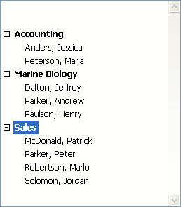

<!--REF #_command_.APPEND TO LIST.Syntax-->**APPEND TO LIST** ( *list* ; *itemText* ; *itemRef* {; *sublist* ; *expanded*} )<!-- END REF-->
<!--REF #_command_.APPEND TO LIST.Params-->
| 引数 | 型 |  | 説明 |
| --- | --- | --- | --- |
| list | Integer | &#8594;  | リスト参照番号 |
| itemText | Text | &#8594;  | 新規リスト項目のテキスト |
| itemRef | Integer | &#8594;  | 新規リスト項目の参照番号 |
| sublist | Integer | &#8594;  | 新規リスト項目に付属するオプションのサブリスト |
| expanded | Boolean | &#8594;  | オプションのサブリストの展開/折りたたみ |

<!-- END REF-->

*このコマンドはスレッドセーフではないため、プリエンプティブなコードには使えません。*


#### 説明 

<!--REF #_command_.APPEND TO LIST.Summary-->**APPEND TO LIST** コマンドは、*list*に渡した参照番号を持つ階層リストに新規項目を追加します。<!-- END REF-->

*itemText*には項目テキストを渡します。20億文字までのテキスト式を渡すことができます。4D v16 R4以降で、項目に標準アクションが設定されている場合には、ak standard action title定数を*itemText*に受け渡すとローカライズされたアクション名が自動的に採用されます。詳細については *標準アクション* を参照ください。

*itemRef*にはユニークな項目参照番号 (倍長整数型) を渡します。この番号はユニーク値と見なされますが、実際には任意の値を渡すことができます。*itemRef*についての詳細は *階層リストの管理*を参照ください。

項目にサブ項目を設定するには、*sublist*にサブ階層リストの有効なリスト参照を渡します。この場合、*expanded* 引数を渡さなければなりません。この引数に[True](true.md "True") または [False](false.md "False")を渡すと、それに応じてサブリストが展開あるいは折りたたまれて表示されます。

*sublist*に渡されたリスト参照は既存のリストを参照しなければなりません。既存のリストは1階層あるいはサブリストを持つリストのいずれでも構いません。新規項目にサブリストを添付しない場合は、この引数を省略するか0を渡します。サブリストを添付する場合、*sublist* と *expanded*は両方とも渡さなければなりません。

**Tips:**

* リストに新規項目を挿入するには、 [INSERT IN LIST](insert-in-list.md)コマンドを使用します。既存の項目のテキストや、そのサブリスト、展開または縮小状態の変更を行うには、 [SET LIST ITEM](set-list-item.md)コマンドを使用します。
* 新たに追加された項目のアピアランスを変更するには、[SET LIST ITEM PROPERTIES](set-list-item-properties.md)コマンドを使用します。

#### 例題 

以下は、データベースストラクチャの一部です:


\[Departments\] と \[Employees\] テーブルには以下のレコードが含まれています:


ここで、*hlList*という名前の階層リストを表示します。この階層リストは、部門を表示するとともに、各部門についてその部門で働いている従業員のサブリストを表示します。*hlList*のオブジェクトメソッドは以下のようになります:

```4d
  // hlList 階層リストオブジェクトメソッド
 
 var $event_l : Integer
 var hlList;$hSubList;$vlDepartment;$vlEmployee;$vlDepartmentID : Integer
 
 $event_l:=FORM Event
 
 Case of
 
    :($event_l=On Load)
  // 空の階層リストを新規に作成
       hlList:=New list
  // [Departments]テーブルの全レコードを選択
       ALL RECORDS([Departments])
  // 部門毎に
       For($vlDepartment;1;Records in selection([Departments]))
  // この部門の従業員を選択
          RELATE MANY([Departments]Name)
  // 何人いるか
          $vlNbEmployees:=Records in selection([Employees])
  // 部門に最低１人いるか
          If($vlNbEmployees>0)
  // 部門項目の子リストを作成
             $hSubList:=New list
  // 従業員毎に
             For($vlEmployee;1;Records in selection([Employees]))
  // サブリストに従業員を追加
  // [Employees]レコードのIDフィールドを
  // 項目参照番号として使用する
                APPEND TO LIST($hSubList;[Employees]Last Name+", "+
                [Employees]First Name;[Employees]ID)
  // 次の[Employees]レコードへ
                NEXT RECORD([Employees])
             End for
          Else
  // 従業員がいない場合、部門項目に子リストを追加しない
             $hSubList:=0
          End if
  // メインリストに部門項目を追加
  // [Departments]レコードのIDフィールドを
  // 項目参照番号として使用する。The bit #31
  // トップビットを1に設定することで部門と従業員を
  // 見分けることができる。詳細は後述の説明を参照
          APPEND TO LIST(hlList;[Departments]Name;
          [Departments]ID?+31;$hSublist;$hSubList#0)
  //階層を強調するために 部門項目を太字にする
          SET LIST ITEM PROPERTIES(hlList;0;False;Bold;0)
  // 次の部門レコード
          NEXT RECORD([Departments])
       End for
  // リスト全体を昇順にソート
       SORT LIST(hlList;>)
  // Windowsスタイルを使用してリストを表示
  // 行の最低の高さを14ポイントにする
       SET LIST PROPERTIES(hlList;Ala Windows;Windows node;14)
 
    :($event_l=On Unload)
  // リストはもう必要ない。メモリの解放を忘れずに
       CLEAR LIST(hlList;*)
 
    :($event_l=On Double Clicked)
  // ダブルクリックされた
  // 選択された項目の位置を取得
       $vlItemPos:=Selected list items(hlList)
  // 念のため位置を確認
       If($vlItemPos#0)
  // リスト項目の情報を取得
          GET LIST  ITEM(hlList;$vlItemPos;$vlItemRef;$vsItemText;$vlItemSubList;$vbItemSubExpanded)
  //項目は部署か？ ?
          If($vlItemRef??31)
  // そうであれば部署項目がダブルクリックされた
             ALERT("部署項目 "+Char(34)+$vsItemText+Char(34)+" をダブルクリックしました。")
          Else
  // そうでなければ従業員項目がダブルクリックされた
  // 親項目IDを使用して[Departments]レコードを検索できる
             $vlDepartmentID:=List item parent(hlList;$vlItemRef)?-31
             QUERY([Departments];[Departments]ID=$vlDepartmentID)
  // 従業員が働いている部署と上司を表示する
             ALERT("従業員 "+Char(34)+$vsItemText+Char(34)+" をダブルクリックしました。"
             "この人は部署 "+Char(34)+[Departments]Name+Char(34)+
             " で働いていて上司は "+Char(34)+[Departments]Manager+Char(34)+" です。")
          End if
       End if
 
 End case
 
  // Note: 4Dはテーブル毎に10億のレコードを格納できます。
  // この例題では使用されない31番目のビットを用いて
  // 従業員と部署を区別しています。
```

この例では、\[Departments\]項目と\[Employees\]項目を区別する理由は1つだけです: 

1\. レコードIDを項目参照番号に格納しており、\[Departments\]項目は\[Employees\]項目と同じ項目参照番号を持つ可能性があります。

2\. [List item parent](list-item-parent.md "List item parent")コマンドを使用して、選択した項目の親項目を取得しています。対応するレコードIDが10の\[Employees\]項目をクリックし、同じレコードIDを持つ \[Departments\]項目も存在する場合、項目参照番号を渡して項目を検索すると、[List item parent](list-item-parent.md "List item parent")コマンドは\[Departments\]項目を見つけます。つまりこのコマンドは\[Employees\]項目の親ではなく、\[Departments\]項目の親を返します。

そのようなわけで一意の項目参照番号を作成しましたが、これはユニークな項目参照番号が必要なのではなく、\[Departments\]と\[Employees\]レコードを区別する必要があったからです。

フォームを実行すると、リストは以下のように表示されます:



**Note:** 上記の例は、比較的少ないレコードを扱う場合には、ユーザインターフェイスとして役立ちます。リストはメモリに置かれるので、何百万という項目を持つ階層リストでユーザインターフェイスを作成すべきではありません。

#### 参照 

[INSERT IN LIST](insert-in-list.md)  
[SET LIST ITEM](set-list-item.md)  
[SET LIST ITEM PARAMETER](set-list-item-parameter.md)  
[SET LIST ITEM PROPERTIES](set-list-item-properties.md)  