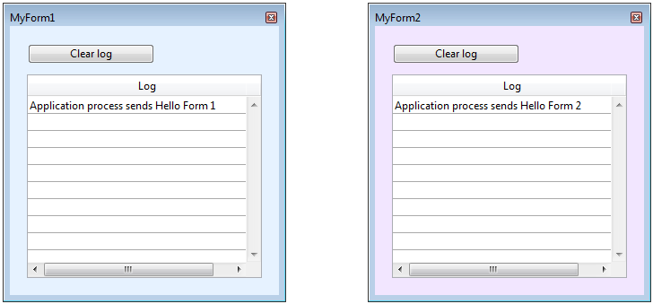

<!--REF #_command_.CALL FORM.Syntax-->**CALL FORM** ( *window* ; *formula* {; *param*}{; *param2* ; ... ; *paramN*} )<!-- END REF-->
<!--REF #_command_.CALL FORM.Params-->
| 引数 | 型 |  | 説明 |
| --- | --- | --- | --- |
| window | Integer | &#8594;  | ウィンドウ参照番号 |
| formula | Object, Text | &#8594;  | 実行するプロジェクトメソッドの名前、または Formulaオブジェクト |
| param | Expression | &#8594;  | メソッドに渡す引数 |

<!-- END REF-->

#### エラー管理 

<!--REF #_command_.CALL FORM.Summary-->**CALL FORM** コマンドは、*window* に指定したウィンドウに表示されているフォームのコンテキストにおいて、*formula* 引数のフォーミュラで指定された4D コードを、任意の *param* パラメーターを使って実行します。<!-- END REF-->どのプロセスがそのフォームを持っているかは、問題になりません。

ワーカーを利用したプロセス間通信 (*ワーカーについて* 参照) の機能は、ワーカーが持つメッセージボックスに基づいて設計されていますが、ウィンドウも同様にメッセージボックスを持っており、ウィンドウがフォームを表示した後に (On Load フォームイベントの後) に使用することができます。**CALL FORM** はフォーミュラとその引数をカプセル化し、メッセージの形でウィンドウが持つメッセージボックスに受け渡します。フォームは自身のプロセスにおいて、そのメッセージを実行します。このコマンドはコオペラティブおよびプリエンプティブ・プロセスの両方で使用できるため、プリエンプティブ・プロセスとフォーム間の情報共有をも可能にします。

*window* には呼び出すフォームを表示しているウィンドウの参照番号を渡します。

*formula* 引数では、*window* の親プロセスのコンテキストで実行される4D コードを指定します。以下のいずれかを渡すことができます:

* **フォーミュラオブジェクト**(*Formula オブジェクト* 参照)。ォーミュラオブジェクトは実行可能な式であればどんな式も格納することができます。これには関数やプロジェクトメソッドなども含まれます。
* プロジェクトメソッド名を格納した**文字列**。

また*formula* 引数で指定したフォーミュラへの引数を*param* 引数に1つ以上渡すことができます。*順番引数* を使用することもできますし、フォーミュラの式が関数またはプロジェクトメソッドの場合には*名前付き引数* を使用することもできます。フォームのコンテキスト内で実行が開始されたとき、プロセスフォーミュラは引数の値を名前付きで受け取るか、 *$1*、 *$2*、 の順番に受け取ります。配列は引数としては渡せないという点に注意して下さい。それに加えて**CALL FORM** コマンドのコンテキストにおいては、以下の追加の制約についても注意する必要があります:

* テーブルまたはフィールドへのポインターは使用できます。
* 変数へのポインター、具体的にはローカル変数またはプロセス変数へのポインターは推奨されていません。これらの値はプロセスメソッドによってアクセスされた瞬間には未定義である可能性があるからです。
* オブジェクトまたはコレクション型の引数鵜を渡したとき、**CALL FORM** コマンドを呼び出したプロセスとフォームのプロセスが異なる場合には、4D は指定先のプロセス内においてそのオブジェクトまたはコレクションの(参照ではなく)コピーを作成します。

#### 例題 1 

**CALL FORM** コマンドを利用することで、プロセス変数を使わずにフォームにカスタム設定 (規定値など) を受け渡すことができます:

```4d
 $win:=Open form window("form")
 CALL FORM($win;"configure";param1;param2)
 DIALOG("form")
```

#### 例題 2 

メイン・フォームに設置されたボタンをクリックすると、背景色とメッセージの異なる二つのフォームウィンドウが同時に開くようにします。また、この子ウィンドウのメッセージは、後から違う内容を送信して表示を変更できるようにします。

まず、メイン・フォームのボタンに設定するオブジェクトメソッドです:

```4d
  // 子ウィンドウを作成し、フォームを表示させます
  // 一つ目の子ウィンドウ
 formRef1:=Open form window("FormMessage";Palette form window;On the left)
 SET WINDOW TITLE("MyForm1";formRef1)
 DIALOG("FormMessage";*)
 SHOW WINDOW(formRef1)
 
  // 二つ目の子ウィンドウ
 formRef2:=Open form window("FormMessage";Palette form window;On the left+500)
 SET WINDOW TITLE("MyForm2";formRef2)
 DIALOG("FormMessage";*)
 SHOW WINDOW(formRef2)
 
  // 背景色の指定
 CALL FORM(formRef1;"doSetColor";0x00E6F2FF)
 CALL FORM(formRef2;"doSetColor";0x00F2E6FF)
  // メッセージの表示
 CALL FORM(formRef1;"doAddMessage";Current process name;"Hello Form 1")
 CALL FORM(formRef2;"doAddMessage";Current process name;"Hello Form 2")
```

*doAddMessage* メソッドは "FormMessage" フォームのリストボックスに行を追加します:

```4d
 var $1 : Text // コール元のプロセス名
 var $2 : Text // 表示するメッセージ
  // $2 からメッセージを取得し、リストボックスにメッセージを記録します
 $p:=OBJECT Get pointer(Object named;"Column1")
 INSERT IN ARRAY($p->;1)
 $p->{1}:=$1+" sends "+$2
```

ランタイムでは次のような結果になります:



**CALL FORM** コマンドを繰り返し実行することで、メッセージを追加していくことができます:

```4d
 CALL FORM(formRef1;"doAddMessage";Current process name;"Hello 2 Form 1")
 CALL FORM(formRef2;"doAddMessage";Current process name;"Hello 2 Form 2")
```


#### 参照 

  
[CALL WORKER](call-worker.md)  
[DIALOG](dialog.md)  

#### プロパティ

|  |  |
| --- | --- |
| コマンド番号 | 1391 |
| スレッドセーフである | &check; |


