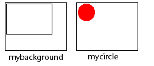
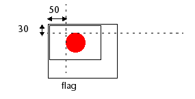

<!--REF #_command_.COMBINE PICTURES.Syntax-->**COMBINE PICTURES** ( *resultingPict* ; *pict1* ; *operator* ; *pict2* {; *horOffset* ; *vertOffset*} )<!-- END REF-->
<!--REF #_command_.COMBINE PICTURES.Params-->
| 引数 | 型 |  | 説明 |
| --- | --- | --- | --- |
| resultingPict | Picture | &#8592; | 重ね合わせた結果のピクチャ |
| pict1 | Picture | &#8594;  | 重ね合わせる1つ目のピクチャ |
| operator | Integer | &#8594;  | 重ね合わせのタイプ |
| pict2 | Picture | &#8594;  | 重ね合わせる2つ目のピクチャ |
| horOffset | Integer | &#8594;  | 重ね合わせの横オフセット |
| vertOffset | Integer | &#8594;  | 重ね合わせの縦オフセット |

<!-- END REF-->

#### 説明 

<!--REF #_command_.COMBINE PICTURES.Summary-->COMBINE PICTURES コマンドは*pict1*と*pict2* ピクチャを、*operator*モードで結合させ、3つめの*resultingPict*ピクチャを得るために使用します。<!-- END REF-->結果のピクチャは複合型で、ソースピクチャのすべての特性を保持します。

**Note:** このコマンドはピクチャ演算子 (+/等、の節参照) により提供される機能を拡張します。これらの演算子は4D v11でも引き続き利用できます。

*operator*には適用する結合のタイプを指定します。“” テーマの定数にある3タイプの結合が使用できます:

* Horizontal concatenation (1): *pict2*が*pict1*に追加され、*pict2*の左上隅が*pict1*の右上隅の位置に置かれます。
* Vertical concatenation (2): *pict2*が*pict1*に追加され、*pict2*の左上隅が*pict1*の左下隅の位置に置かれます。
* Superimposition (3): *pict2*は*pict1*の上に置かれ、*pict2*の左上隅が*pict1*の左上隅の位置に置かれます。

オプションの*horOffset*と*vertOffset*引数が使用されると、重ね合わせの前に *pict2* に対する解釈が適用されます。*horOffset* と *vertOffset*に渡される値はピクセル単位でなければなりません。正数を渡すと右あるいは下方向へのオフセット、負数を渡すと左あるいは上方向へのオフセットとなります。

**Note:** COMBINE PICTURES コマンドで実行される重ね合わせは、& と | 演算子で提供される (ORやXORの) 重ね合わせとは異なります。COMBINE PICTURES コマンドは結果ピクチャ中にソースピクチャの特性を保持しますが、& と | 演算子はそれぞれのピクセルを処理してビットマップピクチャを生成します。これらの演算子はもともと白黒画像を処理するためのものであり、現在は廃止予定です。

#### 例題 

以下のピクチャがある時: 



```4d
 COMBINE PICTURES(flag;mybackground;Superimposition;mycircle;50;30)
```

結果は:



#### 参照 

[TRANSFORM PICTURE](transform-picture.md)  