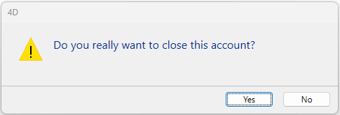

<!--REF #_command_.CONFIRM.Syntax-->**CONFIRM** ( *message* {; OK button title {; cancel button title}} )<!-- END REF-->
<!--REF #_command_.CONFIRM.Params-->
| 引数 | 型 |  | 説明 |
| --- | --- | --- | --- |
| message | Text | &#8594;  | 確認ダイアログボックスに表示するメッセージ |
| OK button title | 文字 | &#8594;  | OKボタンのタイトル |
| cancel button title | 文字 | &#8594;  | キャンセルボタンのタイトル |

<!-- END REF-->

#### 説明 

<!--REF #_command_.CONFIRM.Summary-->CONFIRM コマンドは、注意アイコンとメッセージ、OKボタン、キャンセルボタンで構成される確認ダイアログボックスを表示します。<!-- END REF-->引数には表示するメッセージを渡します。

デフォルトでは、OKボタンのタイトルは“OK”で、キャンセルボタンのタイトルは"キャンセル"です。これらのボタンタイトルを変更するには、オプションの*okButtonTitle* や*cancelButtonTitle* 引数に新しいカスタムボタンタイトルを指定します。必要であれば、渡したカスタムタイトルの幅に応じて、ボタンの幅を左方向にリサイズします。

OKボタンは[デフォルトボタン](https://developer.4d.com/docs/ja/FormObjects/propertiesAppearance/#%E3%83%87%E3%83%95%E3%82%A9%E3%83%AB%E3%83%88%E3%83%9C%E3%82%BF%E3%83%B3) プロパティを持ちます。。ユーザがOKボタンをクリックするかEnterキーを押してダイアログを受け入れると、OKシステム変数が1に設定されます。ユーザがキャンセルボタンをクリックしてダイアログをキャンセルすると、OKシステム変数は0に設定されます。

**Tip:** フォームあるいはオブジェクトメソッド中で、On Activate や On Deactivateを処理するセクションからCONFIRM コマンドを呼ばないでください。これは永久ループを引き起こします。

#### 例題 1 

以下のコードを実行すると:

```4d
 CONFIRM("WARNING: You will not be able to revert this operation.")
 If(OK=1)
    ALL RECORDS([Old Stuff])
    DELETE SELECTION([Old Stuff])
 Else
    ALERT("Operation canceled.")
 End if
```

以下のような確認ダイアログボックスを表示します(Windows環境):


#### 例題 2 

このコードを実行すると:

```4d
 CONFIRM("Do you really want to close this account?";"Yes";"No")
```

Windowsにおいて以下のような確認ダイアログボックスを表示します:



#### 例題 3 

国際的なマーケットを考慮した4Dアプリケーションを書くとします。インターフェースの文字列とともに、ターゲット言語の翻訳文をXLIFF ファイルに書き込んだとします。その場合、以下のコードを実行すると:

```4d
 var $title;$yes;$no : Text
 $title:=Localized string("add_Memo")
 $yes:=Localized string("yes")
 $no:=Localized string("no")
 CONFIRM($title;$yes;$no)
```

以下のようなフランス語の確認ダイアログを(Windows 環境下において)表示することができます:


**注:** xliff を使用したデータベースのローカライズについての詳細な情報については、*付録 B: XLIFFアーキテクチャー* の章を参照してください。

#### 例題 4 

このコードを実行すると:

```4d
 CONFIRM("WARNING: If your pursue this operation, some records will be "+"irremediably affected."+\
 Char(13)+"What do you want to do?";"Do NOT continue";"Continue")
```

以下のような確認ダイアログボックスを表示します(Windows環境):  
  


#### 参照 

[ALERT](alert.md)  
[Request](request.md)  

#### プロパティ

|  |  |
| --- | --- |
| コマンド番号 | 162 |
| スレッドセーフである | &check; |
| システム変数を更新する | OK |


