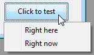

<!--REF #_command_.CONVERT COORDINATES.Syntax-->**CONVERT COORDINATES** ( *xCoord* ; *yCoord* ; *from* ; *to* )<!-- END REF-->
<!--REF #_command_.CONVERT COORDINATES.Params-->
| 引数 | 型 |  | 説明 |
| --- | --- | --- | --- |
| xCoord | Integer | &#8594;  | 点の水平方向の座標(変換前) |
| &#8592; | 点の水平方向の座標(変換後) |
| yCoord | Integer | &#8594;  | 点の垂直方向の座標(変換前) |
| &#8592; | 点の垂直方向の座標(変換後) |
| from | Integer | &#8594;  | 変換前の座標系 |
| to | Integer | &#8594;  | 変換後の座標系 |

<!-- END REF-->

*このコマンドはスレッドセーフではないため、プリエンプティブなコードには使えません。*


#### 説明 

<!--REF #_command_.CONVERT COORDINATES.Summary-->**CONVERT COORDINATES**コマンドは、ある点の(x;y)座標を一つの座標系から別の座標系へと変換します。<!-- END REF-->サポートされる入力・出力座標系はフォーム(およびサブフォーム)、ウィンド、そしてスクリーンです。例えば、このコマンドを使用して、メインフォーム内にある、サブフォームに属しているオブジェクトの座標を取得する事ができます。これにより、どんなカスタムオプションに対してもコンテキストメニューを作成する事が容易になります。

*xCoord*と*yCoord*引数には、変換したい(x;y)座標を変数として渡します。コマンド実行後、これらの変数には返還後の値が渡されます。

*from*引数には、入力の点が使用している元の座標系を渡します。そして*to*引数には、変換後の座標系を渡します。どちらの引数も、"*Windows*"テーマに追加された以下の定数値からどれか一つを使用する事ができます。

| 定数                | 型    | 値 | コメント                                                                |
| ----------------- | ---- | - | ------------------------------------------------------------------- |
| XY Current form   | 倍長整数 | 1 | 原点はカレントフォームの左上端                                                     |
| XY Current window | 倍長整数 | 2 | 原点はカレントウィンドウの左上端                                                    |
| XY Main window    | 倍長整数 | 4 | Windows:原点はメインウィンドウの左上端 OS X:XY Screenと同じ                           |
| XY Screen         | 倍長整数 | 3 | 原点はメインスクリーンの左上端([SCREEN COORDINATES](screen-coordinates.md)コマンドと同じ) |

このコマンドがサブフォームまたはサブフォームのオブジェクトから呼び出され、セレクターのどれか一つがXY Current formであった場合、座標系はサブフォーム自身に対して相対的であり、親フォームに対して相対的ではありません。

フォームウィンドウの位置を変換、または位置へ変換する場合(例えば[GET WINDOW RECT](get-window-rect.md)の結果を変換する場合、または[Open form window](open-form-window.md)に渡された値へ変換する場合)、この座標系はWindowsマシンのウィンドウコマンドで使用されているものであるため、XY Main windowを使用する必要があります。これはOS Xにおいてもこの目的で使用する事ができ、その場合はXY Screenと同等になります。

*from* 引数がXY Current formであり、点がリストフォームのボディセクション内にある場合、コマンドの実行コンテキストによって結果が変化します:

* コマンドがOn Display Detailイベント内で呼び出されていた場合、出力点はスクリーン上で描画されているレコード内の表示内に位置します。
* コマンドがOn Display Detailイベント内で、レコードが編集中に呼び出されていた場合、出力点は編集中のレコード内の表示内に位置します。
* それ以外の場合には、出力点は銭湯レコードの表示内に位置します。

#### 例題 1 

"MyObject"というオブジェクト内の左下端にポップアップメニューを開きたい場合を考えます。

```4d
  // OBJECT GET COORDINATES はカレントフォーム座標系に対して働きます
  // ダイナミックポップアップメニューはカレントウィンドウ座標系を使用します
  // そのためこの値を変換する必要があります
 var $left;$top;$right;$bottom : Integer
 var $menu : Text
 OBJECT GET COORDINATES(*;"MyObject";$left;$top;$right;$bottom)
 CONVERT COORDINATES($left;$bottom;XY Current form;XY Current window)
 $menu:=Create menu
 APPEND MENU ITEM($menu;"Right here")
 APPEND MENU ITEM($menu;"Right now")
 Dynamic pop up menu($menu;"";$left;$bottom)
 RELEASE MENU($menu)
```



#### 例題 2 

マウスカーソルの位置にポップアップウィンドウを開きたい場合を考えます。Windowsにおいては、[MOUSE POSITION](mouse-position.md)コマンド(\* 引数を使用)はMDIウィンドウの位置に基づいた値を返すため、座標系を変換する必要があります:

```4d
 var $mouseX;$mouseY;$mouseButtons : Integer
 var $window : Integer
 MOUSE POSITION($mouseX;$mouseY;$mouseButtons)
 CONVERT COORDINATES($mouseX;$mouseY;XY Current window;XY Main window)
 $window:=Open form window("PopupWindowForm";Pop up form window;$mouseX;$mouseY)
 DIALOG("PopupWindowForm")
 CLOSE WINDOW($window)
```

#### 参照 

[GET WINDOW RECT](get-window-rect.md)  
[OBJECT GET COORDINATES](object-get-coordinates.md)  
[OBJECT SET COORDINATES](object-set-coordinates.md)  
[SET WINDOW RECT](set-window-rect.md)  