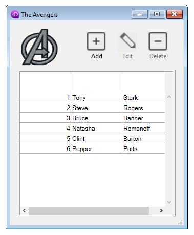

<!--REF #_command_.DIALOG.Syntax-->**DIALOG** ( {*aTable* ;} *form* {; *formData*}{; *} )<!-- END REF-->
<!--REF #_command_.DIALOG.Params-->
| 引数 | 型 |  | 説明 |
| --- | --- | --- | --- |
| aTable | Table | &#8594;  | フォームの属するテーブルまたは 省略した場合デフォルトテーブルまたは プロジェクトフォームを使用 |
| form | Text, Object | &#8594;  | プロジェクトフォームまたはテーブルフォームのフォーム名(文字列)、<br/>あるいはフォームを定義した.jsonファイルへのPOSIXパス(文字列)、<br/>あるいは開くフォームを定義したオブジェクト |
| formData | Object | &#8594;  | フォームに渡すデータ |
| * | 演算子 | &#8594;  | 同じプロセスを使用 |

<!-- END REF-->

#### 説明 

<!--REF #_command_.DIALOG.Summary-->**DIALOG**コマンドはユーザーに対して*form*に*formData*変数のデータ(オプション)を表示します。<!-- END REF-->このコマンドは、変数を用いてユーザーから情報を取得したり、処理を実行する際のオプションなど情報をユーザーに表示するために、使用されます。

このコマンドはフォームに基づいた、カスタマイズされた高度なユーザーインターフェースに使用されるよう設計されています。このコマンドを使用してデータベースから、あるいは他の場所からの情報を表示したり、データ入力機能を提供したりすることができます。[ADD RECORD](add-record.md) や[MODIFY RECORD](modify-record.md) コマンド等とは異なり、**DIALOG** はフォーム、フォーム上のコンテンツおよびナビゲーション・評価ボタン等を完全にコントロールことができます。

このコマンドは一般的に[Open form window](open-form-window.md) コマンドと合わせて使用することで、以下の例題のように洗練されたフォームを表示します:


表示や取得しなければならない情報が複雑で、[ALERT](alert.md)、[CONFIRM](confirm.md)、または [Request](request.md)などのコマンドで処理しきれない場合、**DIALOG** を代わりに使用して置き換えることができます。

**注:** 変換されたデータベースにおいては、データベース設定の互換性ページにあるオプションを使用してダイアログボックスへのデータ入力を禁止し、変数にのみ入力可とすることができます。この制約は、以前のバージョンの4Dでの動作に相当します。

*form* 引数には、以下のいづれかを渡すことができます:

* 使用するフォーム名(プロジェクトフォームあるいはテーブルフォーム)
* 使用するフォームの詳細を格納している有効な.josn ファイルへのパス(POSIX シンタックス、*フォームファイルパス* 参照)
* フォームの詳細を格納しているオブジェクト

オプションとして、*form* 引数で指定したフォームに*formData* オブジェクトを使用して引数を渡すことができます。*formData* オブジェクト内のプロパティであればどれも[Form](form.md) コマンドを使用することでフォームコンテキストから利用可能になります。例えば、*formData* 引数に{"version","12"} というプロパティを格納するオブジェクトを渡した場合、以下のように呼び出しをすることで"Version"プロパティの値を取得することが可能です:

```4d
 $v:=Form.version //"12"
```

*formData* 引数にローカル引数を使用することで、呼び出しコンテキストにかかわらず、引数をフォームに安全に渡すことが可能になります。具体的には、同じプロセスの異なる場所から同じフォームが呼び出された場合、[Form](form.md).myProperty を呼び出すことで特定の値へといつでもアクセスすることが可能になります。さらには、オブジェクトは参照によって渡されることから、ユーザーがフォーム内の値を変更した場合には、その値はオブジェクト自身に自動的に保存されます。  
*formData* オブジェクトと[Form](form.md) コマンドを組み合わせることで、フォームに引数を渡したり、フォームから引数を取得したりと言ったことが、見やすくて安全なコードでいつでも可能になります。

**注:** *formData* 引数を渡さなかった場合、あるいは未定義のオブジェクトを渡した場合、**DIALOG** コマンドは[Form](form.md) コマンドでアクセス可能な、*form* で指定されたフォームにバインドされている新しい空のオブジェクトを、自動的に作成します。

ユーザーが"OK"アクション(ak accept 標準アクション、Enterキーを押す、あるいは[ACCEPT](accept.md) コマンド等によってトリガー)、あるいは"キャンセル"アクション(ak cancel 標準アクション、Escape キー、あるいは[CANCEL](cancel.md) コマンド等によってトリガー)をするとダイアログは閉じられます。OKアクションはOKシステム変数を1設定する一方、キャンセルアクションはOK変数を0に設定します。

ダイアログが受け入れられたからと行って、保存がされるわけではないという点に注意してください。ダイアログにフィールドが含まれる場合、変更されたデータを保存するためには[SAVE RECORD](save-record.md) コマンドを明示的に呼び出さなければいけません。

オプションの *\** 引数を渡すと、フォームはカレントプロセスで最後に開かれたウィンドウにロードされ、フォームをスクリーン上でアクティブにしたままこのコマンドは実行を終了します。  
このフォームはユーザーアクションに対し通常通り反応し、標準アクションまたはフォームに関連する4Dコード (オブジェクトメソッドやフォームメソッド) が [CANCEL](cancel.md) や [ACCEPT](accept.md) コマンドを呼び出すと閉じられます。カレントプロセスが終了すると、この方法で作成されたフォームは、[CANCEL](cancel.md) コマンドが呼ばれたかのように自動で閉じられます。  
この開き方では別にプロセスを開始する必要がないため、ドキュメントと一緒にフローティングパレットを表示するのに特に便利です。

**DIALOG**の呼び出し後、システム変数OKにはダイアログが受け入れられると1が、キャンセルされると0が設定されます。

**注:**

* **DIALOG**(form;\*) シンタックスとコマンド[CALL FORM](call-form.md) を組み合わせることによってフォーム間で通信をすることができます。
* **DIALOG**(form;\*) をコールする前に、あらかじめウィンドウが作成されている必要があります (プロセスのカレントダイアログウィンドウや、各プロセスにデフォルトで作成されるウィンドウは使用できません)。でなければ、エラー -9909 が生成されます。
* オプションの *\** 引数を使用する場合、標準アクションまたは [CANCEL](cancel.md) や [ACCEPT](accept.md) コマンドを呼び出すと、ウィンドウは自動的に閉じられます。ウィンドウ自身の終了を別途操作する必要はありません。

#### 例題 1 

以下の例題はツールパレットを作成するために使用できます:

```4d
  //ツールパレットの表示
 $palette_window:=Open form window("tools";Palette form window)
 DIALOG("tools";*) //即座にコントロールを返す
  //メインのドキュメントウィンドウを表示
 $document_window:=Open form window("doc";Plain form window)
 DIALOG("doc")
```

#### 例題 2 

人物のレコードを表示しているフォームにおいて、"Check children" ボタンを押すとその人物の子供の名前と年齢を検証あるいは変更するダイアログが開く場合を考えます:


**注:** "Children" オブジェクトフィールドはこの例題においての構造を示すために表示されているだけです。

検証フォームにおいて、[Form](form.md) オブジェクトプロパティを変数へと割り当てているものとします:


"Check children" ボタンの中身のコードは以下のようになります:

```4d
 var $win;$n;$i : Integer
 var $save : Boolean
 ARRAY OBJECT($children;0)
 OB GET ARRAY([Person]Children;"children";$children) //children 配列を取得
 $save:=False //save 引数を初期化
 
 $n:=Size of array($children)
 If($n>0)
    $win:=Open form window("Edit_Children";Movable form dialog box)
    SET WINDOW TITLE("Check children for "+[Person]Name)
    For($i;1;$n) //各子供に対して
       DIALOG("Edit_Children";$children{$i}) //値を含んだダイアログを表示
       If(OK=1) //ユーザーはOKをクリックした
          $save:=True
       End if
    End for
    If($save=True)
       [Person]Children:=[Person]Children //強制的にオブジェクトフィールドを更新
    End if
    CLOSE WINDOW($win)
 Else
    ALERT("No child to check.")
 End if
```

**注:** この例題ではデータベース内においてオブジェクト記法が有効化されていることが前提となります(*互換性ページ* を参照してください)。

フォームはそれぞれの子供についての情報を表示します:


値が変更されてOKボタンがクリックされた場合、フィールドは更新されます(その後、親のレコードも保存される必要があります)。

#### 例題 3 

以下の例では、.json フォームへのパスを使用して従業員リスト内のレコードを表示する場合を考えます:

```4d
 Open form window("/RESOURCES/OutputPersonnel.json";Plain form window)
 ALL RECORDS([Personnel])
 DIALOG("/RESOURCES/OutputPersonnel.json";*)
```

結果は以下のようになります:


#### 例題 4 

以下の例では.json ファイルをオブジェクトとして使用していくつかのプロパティを変更する場合を考えます:

```4d
 var $form : Object
 $form:=JSON Parse(Document to text(Get 4D folder(Current resources folder)+"OutputPersonnel.json"))
 $form.windowTitle:="The Avengers"
 $form.pages[1].objects.logo.picture:="/RESOURCES/Images/Avengers.png"
 $form.pages[1].objects.myListBox.borderStyle:="double"
 Open form window($form;Plain form window)
 DIALOG($form;*)
```

変更されたフォームが、新しいタイトル、ロゴ、そして境界線とともに返されます:



#### システム変数およびセット 

DIALOGの呼び出し後ダイアログが受け入れられればOKに1が、キャンセルされれば0が設定されます。

#### 参照 

[ACCEPT](accept.md)  
[ADD RECORD](add-record.md)  
[CALL FORM](call-form.md)  
[CANCEL](cancel.md)  
[Form](form.md)  
[Open window](open-window.md)  

#### プロパティ
|  |  |
| --- | --- |
| コマンド番号 | 40 |
| スレッドセーフである | &check; |
| システム変数を更新する | OK、error |
| サーバー上での使用は不可 ||


