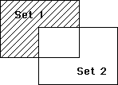

<!--REF #_command_.DIFFERENCE.Syntax-->**DIFFERENCE** ( *set* ; *subtractSet* ; *resultSet* )<!-- END REF-->
<!--REF #_command_.DIFFERENCE.Params-->
| 引数 | 型 |  | 説明 |
| --- | --- | --- | --- |
| set | Text | &#8594;  | セット |
| subtractSet | Text | &#8594;  | 取り除くセット |
| resultSet | Text | &#8594;  | 結果のセット |

<!-- END REF-->

#### 説明 

<!--REF #_command_.DIFFERENCE.Summary-->DIFFERENCEコマンドは、*set*と*subtractSet*を比較し、*subtractSet*に格納されている全てのレコードを*set*から取り除きます。<!-- END REF-->つまり、*set*にだけ存在し、*subtractSet*には存在しないレコードのみを*resultSet*に格納します。以下の表に、DIFFERENCEコマンドで考えられるすべての組み合わせを示します。

| **Set1** | Set2 | 結果セット |
| -------- | ---- | ----- |
| ○        | ×    | ○     |
| ○        | ○    | ×     |
| ×        | ○    | ×     |
| ×        | ×    | ×     |

以下の図に、集合差異演算の処理結果を図で示します。塗りつぶした部分が結果のセットです。



*resultSet*は、DIFFERENCEコマンドで作成されます。*resultSet*と同じ名前のセット (*set*, *subtractSet*も含めて) が既に存在していた場合、*resultSet*に置き換えられます。*set*と*subtractSet*は同じテーブルに属していなければなりません。*resultSet*も*set*と*subtractSet*と同じテーブルに属します。

**4D Server:** クライアント/サーバモードにおいて、セットはタイプ (インタープロセス、プロセスおよびローカル) およびそれらがどこで作成されたか (サーバまたはクライアント) によって、アクセス可能かどうかが決定されます。DIFFERENCEでは3つのセットが同じマシン上でアクセスできる必要があります。詳細は4D Server Referenceマニュアルの*4D Server: セットと命名セレクション*に関する説明を参照してください。

#### 例題 

以下の例は、表示したセレクションからユーザが選択したレコードを排除します。このレコードリストは、以下のステートメントで画面に表示されます。

```4d
 DISPLAY SELECTION([Customers]) //customers をリスト表示
```

レコードリストの下部には、オブジェクトメソッド付きのボタンがあります。このオブジェクトメソッドはユーザが選択したレコード (UserSet) を排除し、新しいセットを表示します。

```4d
 CREATE SET([Customers];"$Current") //カレントセレクションのセットを作る
 DIFFERENCE("$Current";"UserSet";"$Current") //選択したレコードを除外する
 USE SET("$Current") //新しいセットを使用する
 CLEAR SET("$Current") //セットを消去する
```

#### 参照 

[INTERSECTION](intersection.md)  
[UNION](union.md)  