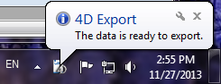
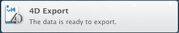

<!--REF #_command_.DISPLAY NOTIFICATION.Syntax-->**DISPLAY NOTIFICATION** ( *title* ; *text* {; *duration*} )<!-- END REF-->
<!--REF #_command_.DISPLAY NOTIFICATION.Params-->
| 引数 | 型 |  | 説明 |
| --- | --- | --- | --- |
| title | Text | &#8594;  | 通知タイトル |
| text | Text | &#8594;  | 通知テキスト |
| duration | Integer | &#8594;  | 表示時間 (秒) |

<!-- END REF-->

*このコマンドはスレッドセーフではないため、プリエンプティブなコードには使えません。*


#### 説明 

<!--REF #_command_.DISPLAY NOTIFICATION.Summary-->DISPLAY NOTIFICATION コマンドは ユーザーへの通知メッセージを表示します。<!-- END REF-->

通常、このタイプのメッセージは、OSやアプリケーションがユーザに外部イベント (ネットワーク切断、アップグレードの提供等) を知らせるために使用されます。

* Windows環境下では、メッセージはタスクバーの通知領域に表示されます:  

* OS X環境下(10.8以降)では、メッセージはスクリーンの右上隅にスライドしてくる小さなウィンドウ内に表示されます。  
  
Appleの仕様に基づけ、通知メッセージは、アプリケーションが前面にない場合にのみ表示されるという点に注意して下さい。しかしながら、メッセージは通知センターのには表示されます。

*title*と*text*には、表示するメッセージのタイトルとテキストを渡します (上記の例では、タイトルは“4D Export”です)。255桁までの文字を入力することができます。

Windows 環境下では、メッセージウィンドウは何らかの動作がマシンで確認できるか、ユーザーが閉じるボタンをクリックするまで表示され続けます。任意の *duration* 引数を使用するとデフォルトの表示時間を設定することができます。通知の表示はシステム環境設定によるという点に注意して下さい。

#### 例題 

```4d
 DISPLAY NOTIFICATION("4D Export";"The data is ready to export.")
```

#### 参照 

[ALERT](alert.md)  