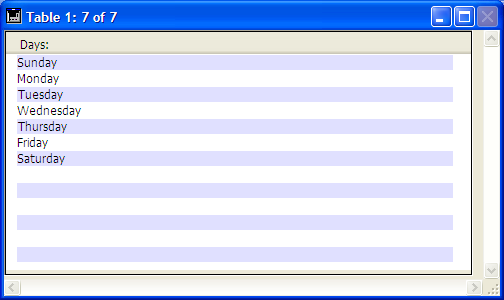

<!--REF #_command_.Displayed line number.Syntax-->**Displayed line number**  : Integer<!-- END REF-->
<!--REF #_command_.Displayed line number.Params-->
| 引数 | 型 |  | 説明 |
| --- | --- | --- | --- |
| 戻り値 | Integer | &#8592; | 表示中の行番号 |

<!-- END REF-->

#### 説明 

<!--REF #_command_.Displayed line number.Summary-->Displayed line number コマンドはOn Display Detailフォームイベントでのみ機能します。<!-- END REF-->このコマンドはレコードリストまたはリストボックスで画面に行が表示される際、処理中の行の番号を返します。Displayed line numberがリストまたはリストボックス表示以外の場面で呼び出されると、0を返します。

レコードリストの場合、表示された行が空でなければ (行がレコードに関連付けられている場合)、Displayed line numberから返される値は[Selected record number](selected-record-number.md "Selected record number")から返される値と同じです。

[Selected record number](selected-record-number.md "Selected record number")と同様、Displayed line numberは1から始まります。このコマンドは、空の行も含め、画面上に表示されたリストフォームやリストボックスの各行を処理したい場合に役立ちます。

#### 例題 

次の例題により、画面上に表示されるリストフォームに対し、レコードが表示されない行に対しても代替色を割り当てることができます:

```4d
  // リストフォームメソッド
 If(Form event code=On Display Detail)
    If(Displayed line number% 2=0)
  // 偶数行は白地に黒
       OBJECT SET RGB COLORS([Table1]Field1;-1;0x00FFFFFF)
    Else
  // 奇数行は明るい青地に黒
       OBJECT SET RGB COLORS([Table1]Field1;-1;0x00E0E0FF)
    End if
 End if
```



#### 参照 

[Form event code](../commands/form-event-code.md)"  
[Selected record number](selected-record-number.md)  

#### プロパティ

|  |  |
| --- | --- |
| コマンド番号 | 897 |
| スレッドセーフである | &cross; |


