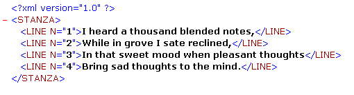

<!--REF #_command_.DOM GET XML ATTRIBUTE BY NAME.Syntax-->**DOM GET XML ATTRIBUTE BY NAME** ( *elementRef* ; *attribName* ; *attribValue* )<!-- END REF-->
<!--REF #_command_.DOM GET XML ATTRIBUTE BY NAME.Params-->
| 引数 | 型 |  | 説明 |
| --- | --- | --- | --- |
| elementRef | Text | &#8594;  | XML要素参照 |
| attribName | Text | &#8594;  | 属性名 |
| attribValue | Variable | &#8592; | 属性値 |

<!-- END REF-->

#### 説明 

<!--REF #_command_.DOM GET XML ATTRIBUTE BY NAME.Summary-->DOM GET XML ATTRIBUTE BY NAME コマンドを使用して、属性名に対応する属性値を取得できます。<!-- END REF-->に要素参照を、*attribName*には属性値を取得したい属性の名前を渡します。値は*attribValue* 引数に返されます。4Dは取得した値を渡した変数と同じ型に変換します。変数の型が定義されていない場合、値はデフォルトでテキスト型で返されます。

*attribName* 属性がXML要素中に存在しない場合、エラーが返されます。複数の同じ名前を持つ属性がXML要素中に存在する場合、最初の属性のみが返されます。

#### 例題 

このメソッドは名前を指定してXML属性を取得するために使用します:

```4d
 var myBlobVar : Blob
 var $xml_Parent_Ref;$xml_Child_Ref : Text
 var $LineNum : Integer
 
 $xml_Parent_Ref:=DOM Parse XML variable(myBlobVar)
 $xml_Child_Ref:=DOM Get first child XML element($xml_Parent_Ref)
 DOM GET XML ATTRIBUTE BY NAME($xml_Child_Ref;"N";$LineNum)
```

このメソッドを以下の例題に適用すると、$LineNumには1が返されます:



#### システム変数およびセット 

コマンドが正しく実行されるとシステム変数OKに1が設定され、エラーが発生すると0が設定されます。

#### 参照 

[DOM GET XML ATTRIBUTE BY INDEX](dom-get-xml-attribute-by-index.md)  
[DOM REMOVE XML ATTRIBUTE](dom-remove-xml-attribute.md)  

#### プロパティ
|  |  |
| --- | --- |
| コマンド番号 | 728 |
| スレッドセーフである | &check; |
| システム変数を更新する | OK、error |
| サーバー上での使用は不可 ||


