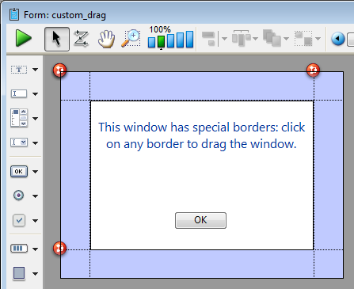

<!--REF #_command_.DRAG WINDOW.Syntax-->**DRAG WINDOW**<!-- END REF-->
<!--REF #_command_.DRAG WINDOW.Params-->
| このコマンドは引数を必要としません |  |
| --- | --- |

<!-- END REF-->

*このコマンドはスレッドセーフではないため、プリエンプティブなコードには使えません。*


#### 説明 

<!--REF #_command_.DRAG WINDOW.Summary-->DRAG WINDOW コマンドは、ユーザがマウスのクリックと移動を行うと、ウィンドウをドラッグします。<!-- END REF-->通常このコマンドは (非表示ボタンなど) マウスクリックに瞬時に反応するオブジェクトのオブジェクトメソッドから呼び出します。

#### 例題 

以下のフォームには、それぞれの側に非表示ボタンが上に置かれたス色付きのフレームがあります:



それぞれのボタンには以下のメソッドが書かれています:

```4d
 DRAG WINDOW //クリックされたらウィンドウをドラッグし始める
```

以下のプロジェクトメソッドを実行後、:

```4d
 $winRef:=Open form window("custom_drag";Modal form dialog box)
 DIALOG("custom_drag")
 CLOSE WINDOW
```

以下のようなウィンドウが表示されます:


フレームをクリックして、ウィンドウをドラッグすることができます。

#### 参照 

[GET WINDOW RECT](get-window-rect.md)  
[SET WINDOW RECT](set-window-rect.md)  