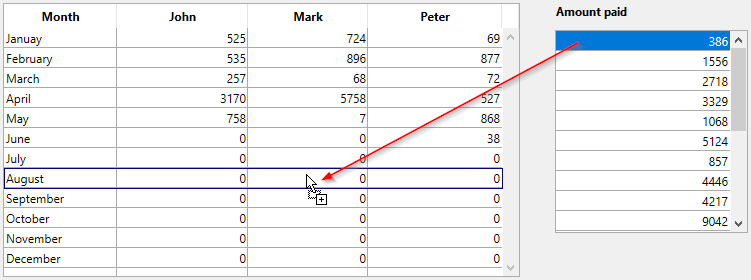

<!--REF #_command_.Drop position.Syntax-->**Drop position** {( columnNumber | pictPosY )} : Integer<!-- END REF-->
<!--REF #_command_.Drop position.Params-->
| 引数 | 型 |  | 説明 |
| --- | --- | --- | --- |
| columnNumber &#124; pictPosY | 倍長整数 | &#8592; | リストボックス列番号 (ドロップ位置が最後の列を超えた場合-1)、またはピクチャーの場合Y座標の位置 |
| 戻り値 | Integer | &#8592; | ・数値 (配列/リストボックス) または・位置 (階層リスト) または・ドロップ先項目の文字列中の位置 (テキスト/コンボボックス) または・最後の配列要素やリスト項目を超えてドロップされた場合-1 または・ピクチャー中のX座標の位置 |

<!-- END REF-->

#### 説明 

<!--REF #_command_.Drop position.Summary-->**Drop position**コマンドは、 “複合” オブジェクトに対して行われたドロップのドロップ位置を知るために使用します。<!-- END REF-->

特に階層リスト、リストボックス、テキスト、ピクチャフィールドまたは4D Write Proエリアに対して発生したドラッグ&ドロップイベントを処理するのに**Drop position**を使用します。

* ドロップ先オブジェクトがリストボックスの場合、このコマンドは行番号を返します。この場合、オプションの*columnNumber*引数には列番号が返されます。。
* ドロップ先オブジェクトが階層リストの場合、この関数は項目位置を返します。
* ドロップ先オブジェクトがテキストフィールドや変数、あるいはコンボボックスの場合、コマンドは文字列中の文字位置を返します。  
いずれの場合も、ソースオブジェクトが最後の配列要素または最後のリスト項目を超えてドロップされた場合、このコマンドは-1を返します。
* ドロップ先オブジェクトがピクチャ型の変数やフィールドの場合、コマンドはクリックの縦位置と、オプションの*pictPosY*引数にクリックの横位置を返します。返される値はローカルの座標システムに対し相対で、ピクセルで表現されます。

リストボックス、コンボボックス、階層リスト、テキスト、ピクチャーまたは4D Write Pro エリアに対してドラッグ&ドロップイベント以外で**Drop position**を呼び出すと、コマンドは-1を返します。

**重要**: フォームオブジェクトに**ドロップ可**プロパティが選択されている場合、ドロップされたデータを受け付けます。また、そのオブジェクトメソッドは、On Drag Over またはOn Drop あるいはその両方に対して、これらのイベントを処理するためにアクティブにする必要があります。

#### 例題 

以下の例では、支払額のリストが人ごとかつ月ごとに分割されます。これは二つのリストボックス間でドラッグ&ドロップをすることで実行されます:



右の(ソース)リストボックスのオブジェクトメソッドには以下のようなコードが書かれています:

```4d
 If(Form event code=On Begin Drag Over) //イベントはリストボックスで有効化されている必要あり
    var $tomove : Blob
    var $val : Text
    LISTBOX GET CELL POSITION(*;"LBPaid";$col;$row)
    $val:=PaidCol{$row}
    VARIABLE TO BLOB($val;$tomove)
    APPEND DATA TO PASTEBOARD("mydrag";$tomove) //カスタムのキーを使用
 End if
```

左の(ドロップ先)リストボックスのオブジェクトメソッドには以下のようなコードが書かれています:

```4d
 Case of
 
    :(Form event code=On Drag Over) //イベントはリストボックスで有効化されている必要あり
       var $toGet : Blob
       var $rownum : Integer
       $rownum:=Drop position($colnum)
       GET PASTEBOARD DATA("mydrag";$toGet) //データを取得
       If(Pasteboard data size("mydrag")>0)&($colnum#1)) //データがペーストボードに入っていたら
          $0:=0 //ドロップを受け入れ
       Else
          $0:=-1 //ドロップを拒否
       End if
 
    :(Form event code=On Drop) //イベントはリストボックスで有効化されている必要あり
       var $toGet : Blob
       var $rownum;$val : Integer
       $rownum:=Drop position($colnum)
       GET PASTEBOARD DATA("mydrag";$toGet)
       BLOB TO VARIABLE($toGet;$val) //値を取得
       If(Pasteboard data size("mydrag")>0))
          If($colnum=1)
             BEEP
          Else
             Case of //ドロップされた値を追加
                :($colnum=2)
                   John{$rownum}:=John{$rownum}+$val
                :($colnum=3)
                   Mark{$rownum}:=Mark{$rownum}+$val
                :($colnum=4)
                   Peter{$rownum}:=Peter{$rownum}+$val
             End case
             DELETE FROM ARRAY(PaidCol;Find in array(PaidCol;$val)) //ソースのリストボックスを更新
          End if
       End if
 End case
```

#### 参照 

*ドラッグ＆ドロップ*  

#### プロパティ
|  |  |
| --- | --- |
| コマンド番号 | 608 |
| スレッドセーフである | &check; |
| サーバー上での使用は不可 ||


