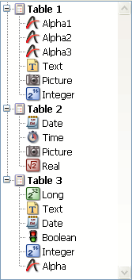

<!--REF #_command_.Find in list.Syntax-->**Find in list** ( {* ;} *list* ; *value* ; *scope* {; *itemsArray* {; *}} ) : Integer<!-- END REF-->
<!--REF #_command_.Find in list.Params-->
| 引数 | 型 |  | 説明 |
| --- | --- | --- | --- |
| * | 演算子 | &#8594;  | 指定した場合, listはオブジェクト名 (文字列) 省略した場合, listはリスト参照番号 |
| list | Integer, Text | &#8594;  | リスト参照番号 (* 省略時) リストオブジェクト名 (* 指定時) |
| value | Text | &#8594;  | 検索する値 |
| scope | Integer | &#8594;  | 0=メインリスト, 1=サブリスト |
| itemsArray | Integer array | &#8592; | 2番目の * 省略時: 見つけた項目の位置配列 - 2番目の * 指定時: 見つけた項目の項目参照番号配列 |
| * | 演算子 | &#8594;  | - 省略時: 項目位置を使用 - 指定時: 項目参照番号使用 |
| 戻り値 | Integer | &#8592; | - 2番目の * 省略時: 見つけた項目の位置 - 2番目の * 指定時: 見つけた項目の項目参照番号 |

<!-- END REF-->

#### 説明 

<!--REF #_command_.Find in list.Summary-->Find in list コマンドは、*value*に渡した文字列と同じ値を持つ項目を*list*リスト中で検索し、最初に見つけた項目の位置または項目参照番号を返します。<!-- END REF-->複数の項目を見つけた場合、コマンドは *itemsArray* 配列にそれらの一または項目参照番号を返します。

1番目の \* 引数を渡した場合、*list* 引数はフォーム中のリストオブジェクトのオブジェクト名 (文字列) です。この引数を渡さない場合、*list* 引数はリスト参照番号 ([ListRef](# "階層リストへの参照")) です。1つしかフォーム上でリストオブジェクトを使用しない場合や、2番目の \* を渡して項目参照番号を扱う場合は、いずれのシンタックスも使用できます。対して複数のリストオブジェクトがフォーム上にあり、2番目の \* を省略して項目位置を扱う場合は、リストオブジェクトごとに項目位置が異なるため、オブジェクト名に基づくシンタックスを使用しなければなりません。

**Note:** オブジェクト名に@文字を使用し、フォーム上にこれに合致するリストオブジェクトが複数ある場合、Find in list コマンドは最初に見つけたリストオブジェクトを検索の対象とします。

2番目の \* 引数は項目の位置を取得するか (この引数を省略時)、項目参照を取得するか (この引数指定時) を指示します。

*value*には検索する文字列を渡します。検索は完全一致で行います。つまり“wood”を検索すると“wooden”は見つかりません。しかしワイルドカード文字を使用して (@ ) 前方一致や後方一致、含む検索などを行うことができます。

*scope* 引数を使用して、検索対象をリストのトップレベルに限定するか、サブリストを含めるか指定できます。リストの第一レベルに限定するには0を渡します。1を渡すとサブリスト内も検索されます。

*value*に一致するすべての位置あるいは参照番号を取得したい場合、倍長整数配列をオプションの*itemsArray* 引数に渡します。必要であればコマンドが配列を作成しリサイズします。コマンドは見つけた項目の、2番目の \* が省略されていれば位置を、省略されていなければ項目参照番号を返します。

位置はメインリストの先頭項目からの相対位置です。その時点でのサブリストの展開/折りたたみ状況が考慮されます。

*value* に対応する値が見つからない場合、コマンドは0を返し、*itemsArray*配列は空になります。

#### 例題 

以下の階層リストにおいて:



```4d
 $vlItemPos:=Find in list(hList;"P@";1;$arrPos)
  //$vlItemPos は 6
  //$arrPos{1} は 6 で $arrPos{2} は 11
 $vlItemRef:=Find in list(hList;"P@";1;$arrRefs;*)
  //$vlItemRef は 7
  //$arrRefs{1} は 7 で $arrRefs{2} は 18
 $vlItemPos:=Find in list(hList;"Date";1;$arrPos)
  //$vlItemPos は9
  //$arrPos{1} は9 で$arrPos{2} は16
 $vlItemRefFind in list(hList;"Date";1;$arrRefs;*)
  //$vlItemRef は11
  //$arrRefs{1} は11 で$arrRefs{2} は23
 $vlItemPos:=(hList;"Date";0;*)
  //$vlItemPos は0
```


#### プロパティ
|  |  |
| --- | --- |
| コマンド番号 | 952 |
| スレッドセーフである | &check; |
| サーバー上での使用は不可 ||


