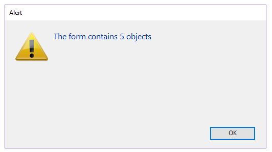

<!--REF #_command_.FORM LOAD.Syntax-->**FORM LOAD** ( {*aTable* ;} *form* {; *formData*}{; *} )<!-- END REF-->
<!--REF #_command_.FORM LOAD.Params-->
| 引数 | 型 |  | 説明 |
| --- | --- | --- | --- |
| aTable | Table | &#8594;  | ロードするテーブルフォーム(省略時はプロジェクトフォームをロード) |
| form | Text, Object | &#8594;  | (プロジェクトまたはテーブル)フォーム名(文字列)、あるいはフォームを定義した.jsonファイルへのPOSIXパス(文字列)、あるいは開くフォームを定義したオブジェクト |
| formData | Object | &#8594;  | フォームに割り当てるデータ |
| * | 演算子 | &#8594;  | 指定時、コマンドはコンポーネントから実行した場合にホストのデータベースコマンドが適応されます(それ以外の場合は無視されます)。 |

<!-- END REF-->

#### 説明 

<!--REF #_command_.FORM LOAD.Summary-->**FORM LOAD**コマンドを使用してデータ印刷・コンテンツ解析のために *form* 引数で指定したフォームをカレントプロセスにおいて*formData* 引数のデータ(オプション)とともにメモリーにロードします。<!-- END REF-->1つのプロセスにつきカレントフォームは1つしか指定できません。

*form* 引数には、以下のいづれかを渡すことができます:

* フォーム名
* 使用するフォームの詳細を格納している有効な.josn ファイルへのパス(POSIX シンタックス、*フォームファイルパス*参照)
* フォームの詳細を格納しているオブジェクト

コマンドがコンポーネントから呼び出された場合、デフォルトではコマンドはコンポーネントのフォームをロードします。 *\** 引数を渡した場合、メソッドはホストデータベースのフォームをロードします。

##### formData 

オプションとして、*formData* オブジェクト引数を使用して*form* 引数で指定したフォームへとパラメーターを渡すことができます。*formData* オブジェクトのプロパティであれば、フォームコンテキスト内から[Form](form.md) コマンドを通して利用することができるようになります。例えば、*formData* 引数に{"version","12"} を格納しているオブジェクトを渡した場合、フォーム内から以下のコードを呼び出すことで、"version" プロパティの値を取得したり設定したりすることができます:

```4d
 $v:=Form.version //"12"
 Form.version:=13
```

*formData* オブジェクトは、On Load フォームイベント内で利用可能です。

*formData* 引数を使用することで、呼び出しコンテキストに関わらず、フォームに安全にパラメーターを渡すことができるようになります。具体的には、同じプロセス内の異なる場所から同じフォームが呼び出されている場合、[Form](form.md).myProperty と呼び出すだけでその特定の値へと常にアクセスすることができるからです。

**注意:** 引数を渡さなかった場合、あるいは未定義のオブジェクトを渡した場合、**FORM LOAD** は[Form](form.md) コマンドを通して利用可能な、*form* 引数で指定したフォームに割り当てられた新しい空のオブジェクトを自動的に作成します。

##### データの印刷 

このコマンドを使用するには、 [OPEN PRINTING JOB](open-printing-job.md) コマンドを使って印刷ジョブを事前に開いておく必要があります。 [OPEN PRINTING JOB](open-printing-job.md) は [FORM UNLOAD](form-unload.md) を暗示的に呼び出すため、このコンテキストでは改めて [FORM LOAD](form-load.md) コマンドを使用する必要があります。ロードされた *form* はカレントの印刷フォームとなります。 [Print object](print-object.md) コマンドを含む、すべてのオブジェクト管理コマンドはこのフォームに対して動作します。

**FORM LOAD** コマンドを呼び出す前に、別の印刷フォームがロードされていた場合には、そのフォームは閉じられ、*form* に置き換えられます。ひとつの印刷セッション内で複数のプロジェクトフォームを開いたり閉じたりすることができます。**FORM LOAD** で印刷フォームを変更してもページブレークは生成されません。ページブレークは別途指定する必要があります。

プロジェクトフォーム (またはフォームのオブジェクトメソッド) を開く際には、On Load フォームイベントのみが実行されます。他のフォームイベントは無視されます。印刷の終わりには On Unload フォームイベントが実行されます。

フォームのグラフィックな一貫性を保持するために、プラットフォームにかかわらず"印刷"アピアランスプロパティを適用することをお勧めします。 

[CLOSE PRINTING JOB](close-printing-job.md)コマンドが呼び出されると、カレント印刷フォームは自動で閉じられます。

##### コンテンツの解析 

データ解析のためにスクリーン外にフォームをロードするには、印刷ジョブ外のコンテキストで **FORM LOAD** を呼び出します。この場合、フォームイベントは実行されません。

**FORM LOAD** を [FORM GET OBJECTS](form-get-objects.md) や [OBJECT Get type](object-get-type.md) コマンドと併せて使用して、フォームコンテンツを任意に処理することができます。その後、フォームをメモリから解放するために [FORM UNLOAD](form-unload.md) コマンドを呼び出す必要があります。

いずれの場合においても、スクリーン上のフォームはロードされたままであるため (**FORM LOAD** コマンドに影響されない)、 [FORM UNLOAD](form-unload.md) コマンドを呼び出した後にこれらをリロードする必要はありません。

**注:** メモリオーバーフローのリスクを回避するため、スクリーン外でフォームを使用した場合には [FORM UNLOAD](form-unload.md) を必ずコールしてください。

#### 例題 1 

印刷ジョブにプロジェクトフォームを呼び出す場合:

```4d
 OPEN PRINTING JOB
 FORM LOAD("print_form")
  // イベントとオブジェクトメソッドの実行
```

#### 例題 2 

印刷ジョブにテーブルフォームを呼び出す場合:

```4d
 OPEN PRINTING JOB
 FORM LOAD([People];"print_form")
  // イベントとオブジェクトメソッドの実行
```

#### 例題 3 

フォームの内容を解析してテキスト入力エリアに何らかの処理をする場合:

```4d
 FORM LOAD([People];"my_form")
  // イベントやメソッドを実行することなくフォームを選択
 FORM GET OBJECTS(arrObjNames;arrObjPtrs;arrPages;*)
 For($i;1;Size of array(arrObjNames))
    If(OBJECT Get type(*;arrObjNames{$i})=Object type text input)
  //… 処理
    End if
 End for
 FORM UNLOAD //フォームをunloadするのを忘れないこと
```

#### 例題 4 

以下の例では、JSON ファイルで定義されたフォーム上にあるオブジェクトの数を返します:

```4d
 ARRAY TEXT(objectsArray;0) //フォームのオブジェクトを並べ替えて入れる配列
 ARRAY POINTER(variablesArray;0)
 ARRAY INTEGER(pagesArray;0)
 
 FORM LOAD("/RESOURCES/OutputForm.json") //フォームを読み込む
 FORM GET OBJECTS(objectsArray;variablesArray;pagesArray;Form all pages+Form inherited)
 
 ALERT("The form contains "+String(size of array(objectsArray))+" objects") //オブジェクトの数を返す
```

結果は以下のように表示されます:



#### 例題 5 

リストボックスを格納しているフォームを印刷したい場合を考えます。*on load* イベント中に、リストボックスのコンテンツを変更したいとします。

1\. 印刷メソッド内に、以下のように書きます:

```4d
 var $formData : Object
 var $over : Boolean
 var $full : Boolean
 
 OPEN PRINTING JOB
 $formData:=New object
 $formData.LBcollection:=New collection()
 ... // コレクションにデータを入れます
 
 FORM LOAD("GlobalForm";$formData) // $formData 経由でコレクションをフォームに渡します
 $over:=False
 Repeat
    $full:=Print object(*;"LB") // この"LB" はリストボックスで、Form.LBcollectionをデータソースとして持つとします。
    LISTBOX GET PRINT INFORMATION(*;"LB";lk printing is over;$over)
    If(Not($over))
       PAGE BREAK
    End if
 Until($over)
 FORM UNLOAD
 CLOSE PRINTING JOB
```

2\. フォームメソッド内には以下のように書きます:

```4d
 var $o : Object
 Case of
    :(Form event code=On Load)
       For each($o;Form.LBcollection) // ここでLBcollection は利用可能です
          $o.reference:=Uppercase($o.reference)
       End for each
 End case
```

#### 参照 

[Current form name](current-form-name.md)  
[FORM UNLOAD](form-unload.md)  
[LISTBOX GET OBJECTS](listbox-get-objects.md)  
[OBJECT Get type](object-get-type.md)  
[Print object](print-object.md)  

#### プロパティ
|  |  |
| --- | --- |
| コマンド番号 | 1103 |
| スレッドセーフである | &check; |
| サーバー上での使用は不可 ||


