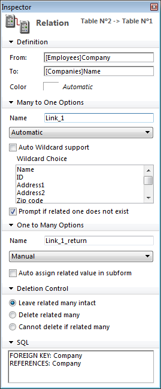

<!--REF #_command_.GET FIELD RELATION.Syntax-->**GET FIELD RELATION** ( *manyField* ; *one* ; *many* {; *} )<!-- END REF-->
<!--REF #_command_.GET FIELD RELATION.Params-->
| 引数 | 型 |  | 説明 |
| --- | --- | --- | --- |
| manyField | Field | &#8594;  | リレート開始フィールド |
| one | Integer | &#8592; | n対1リレートの状態 |
| many | Integer | &#8592; | 1対nリレートの状態 |
| * | 演算子 | &#8594;  | 指定時: oneとmanyにはリレーション の現在の状態が返る (値は2または3のみ) 省略時 (デフォルト): プログラムでリレーションが 変更されていなければ、oneとmanyに1が返される |

<!-- END REF-->

#### 説明 

<!--REF #_command_.GET FIELD RELATION.Summary-->GET FIELD RELATIONを使用すると、カレントプロセスの、*manyField*から開始するリレートの自動/マニュアルのステータスを調べることができます。<!-- END REF-->ストラクチャウィンドウで設定した自動リレートをはじめとして、あらゆるリレートを調べることができます。

* *manyField*には、状態を調べようとするリレートが開始するnテーブルのフィールド名を渡します。フィールド*manyField*から開始するリレートが存在しない場合、引数*one*と*many*には0が返されます。またエラーが返されて、システム変数OKには0が代入されます (後述)。
* コマンドの実行後、引数*one*には、指定したn対1リレートが自動に設定されているかどうかを示す値が格納されます:  
0 = *manyField*から始まるリレートが存在しません。シンタックスエラー16 (“このフィールドにはリレートが設定されていません。”) が生成され、システム変数OKには0が代入されます。  
1 = 指定されたn対1リレートの自動/マニュアルのステータスは、デザインモードのリレートプロパティ内の**自動1対1リレート**オプションにより設定されたものです (プログラムにより変更されていない)。  
2 = そのプロセスのn対1のリレートはマニュアルです。  
3 = そのプロセスのn対1のリレートは自動です。
* コマンドの実行後、引数*many*には、指定した1対nリレートが自動に設定されているかどうかを示す値が格納されます:  
0 = *manyField*から始まるリレートが存在しません。シンタックスエラー16 (“このフィールドにはリレートが設定されていません。”) が生成され、システム変数OKには0が代入されます。  
1 = 指定された1対nリレートの自動/マニュアルのステータスは、デザインモードのリレートプロパティ内の**自動1対nリレート**オプションにより設定されたものです (プログラムにより変更されていない)。  
2 = そのプロセスの1対nのリレートはマニュアルです。  
3 = そのプロセスの1対nのリレートは自動です。

*one*および*many*引数に返された値は、“” テーマの定数と比較することができます: 

| 定数                      | 型    | 値 | コメント                                    |
| ----------------------- | ---- | - | --------------------------------------- |
| Automatic               | 倍長整数 | 3 | カレントプロセスに対し、リレートを自動に設定する。               |
| Manual                  | 倍長整数 | 2 | カレントプロセスに対し、リレートをマニュアルに設定する。            |
| No relation             | 倍長整数 | 0 |                                         |
| Structure configuration | 倍長整数 | 1 | アプリケーションのストラクチャウインドウで指定されたリレートの設定を使用する。 |

* オプションの引数 *\** を使用すると、プログラムから修正されていない場合でも、リレートのカレントステータスを“強制的に”読み込むことができます。言い換えれば引数 *\** を渡した場合、引数*one*および*many*には値2または3だけが返されます。

#### 例題 

以下のようなストラクチャがあります:


\[Employees\]Companyフィールドから\[Companies\]Nameフィールドへリンクするリレートのプロパティは次の通りです:



次のコードはGET FIELD RELATION、[GET AUTOMATIC RELATIONS](get-automatic-relations.md "GET AUTOMATIC RELATIONS")、[SET FIELD RELATION](set-field-relation.md "SET FIELD RELATION")、および[SET AUTOMATIC RELATIONS](set-automatic-relations.md "SET AUTOMATIC RELATIONS")により提供されるさまざまな機能とともに、その効果を示します:

```4d
 GET AUTOMATIC RELATIONS(one;many) //False, Falseを返す
 GET FIELD RELATION([Employees]Company;one;many) //1,1を返す
 GET FIELD RELATION([Employees]Company;one;many;*) //3,2を返す
 
 SET FIELD RELATION([Employees]Company;2;0) //n対1リレーションをマニュアルに変更
 
 GET FIELD RELATION([Employees]Company;one;many) //2,1を返す
 GET FIELD RELATION([Employees]Company;one;many;*) //2, 2を返す
 
 SET FIELD RELATION([Employees]Company;1;0) //デザインモードで設定された
  //n対1リレーションに戻す
 
 GET FIELD RELATION([Employees]Company;one;many) //1,1を返す
 GET FIELD RELATION([Employees]Company;one;many;*) //3,2を返す
 
 SET AUTOMATIC RELATIONS(True;True) //すべてのテーブルのすべてのリレーションを自動に設定
 
 GET AUTOMATIC RELATIONS(one;many) //True, Trueを返す
 GET FIELD RELATION([Employees]Company;one;many) //1,1を返す
 GET FIELD RELATION([Employees]Company;one;many;*) //3,3を返す
```

#### 参照 

[GET AUTOMATIC RELATIONS](get-automatic-relations.md)  
[GET RELATION PROPERTIES](get-relation-properties.md)  
[SET AUTOMATIC RELATIONS](set-automatic-relations.md)  
[SET FIELD RELATION](set-field-relation.md)  

#### プロパティ

|  |  |
| --- | --- |
| コマンド番号 | 920 |
| スレッドセーフである | &check; |


