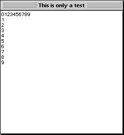

<!--REF #_command_.GOTO XY.Syntax-->**GOTO XY** ( *x* ; *y* )<!-- END REF-->
<!--REF #_command_.GOTO XY.Params-->
| 引数 | 型 |  | 説明 |
| --- | --- | --- | --- |
| x | Integer | &#8594;  | x カーソルの水平位置 |
| y | Integer | &#8594;  | y カーソルの垂直位置 |

<!-- END REF-->

#### 説明 

<!--REF #_command_.GOTO XY.Summary-->GOTO XY コマンドは、[Open window](open-window.md "Open window")で開いたウインドウに[MESSAGE](message.md "MESSAGE")コマンドでメッセージを表示する際に使用できます。<!-- END REF-->  
  
GOTO XY は、文字カーソル（見えないカーソル）の位置を指定して、ウインドウに表示される以降のメッセージの位置を設定します。

ウインドウの左上隅の位置が0,0です。カーソルは、ウインドウを開いたときと、[ERASE WINDOW](erase-window.md "ERASE WINDOW")コマンドを実行した後には、自動的に0.0に置かれます。

GOTO XY コマンドでカーソルの位置を指定してから、[MESSAGE](message.md "MESSAGE")コマンドでウインドウに文字を表示することができます。

#### 例題 1 

[MESSAGE](message.md "MESSAGE")コマンドの例題参照

#### 例題 2 

[Milliseconds](milliseconds.md "Milliseconds")コマンドの例題参照

#### 例題 3 

以下の例題は:

```4d
 Open window(50;50;300;300;5;"This is only a test")
 For($vlRow;0;9)
    GOTO XY($vlRow;0)
    MESSAGE(String($vlRow))
 End for
 For($vlLine;0;9)
    GOTO XY(0;$vlLine)
    MESSAGE(String($vlLine))
 End for
 $vhStartTime:=Current time
 Repeat
 Until((Current time-$vhStartTime)>?00:00:30?)
```

30秒間以下のようなダイアログを表示します:



#### 参照 

[MESSAGE](message.md)  

#### プロパティ
|  |  |
| --- | --- |
| コマンド番号 | 161 |
| スレッドセーフである | &check; |
| サーバー上での使用は不可 ||


