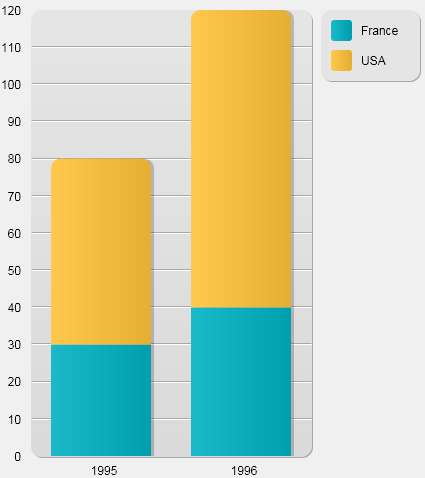
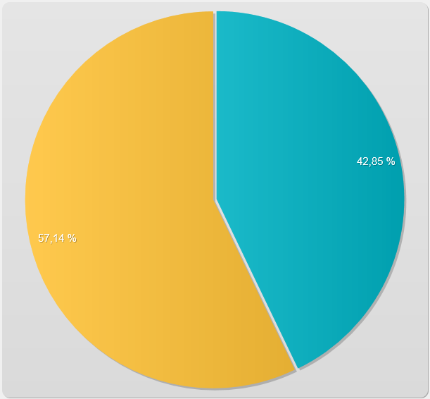
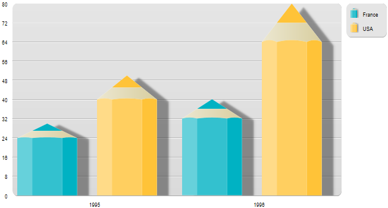

<!--REF #_command_.GRAPH.Syntax-->**GRAPH** ( *graphArea* ; *graphNumber* ; *xLabels* {; *yElements*} {; *yElements2* ; ... ; *yElementsN*} )<!-- END REF-->
<!--REF #_command_.GRAPH.Params-->
| 引数 | 型 |  | 説明 |
| --- | --- | --- | --- |
| graphArea | Picture | &#8594;  | ピクチャー変数 |
| graphNumber | Integer, Object | &#8594;  | 倍長整数:グラフタイプ番号 オブジェクト(64-bit版のみ):グラフ設定 |
| xLabels | Array | &#8594;  | X軸ラベル |
| yElements | Array | &#8594;  | グラフにするデータ (最大8個) |

<!-- END REF-->

#### 説明 

<!--REF #_command_.GRAPH.Summary-->**GRAPH**コマンドは、ピクチャー変数に、配列のデータを使用してグラフを作成します。<!-- END REF-->

このコマンドで生成されるグラフは、統合されたSVGレンダリングエンジンを使用して描画されます。グラフにはピクチャー変数に関連付けられたインターフェース機能があります。 (表示フォーマットの設定などに使用できる) アプリケーションモードのコンテキストメニュー、スクロールバー等。

**注:** SVG (Scalable Vector Graphics) はグラフィックファイルフォーマット (.svg 拡張子) です。XMLに基づき、このフォーマットは広く使用され、特にWebブラウザで表示できます。詳細は以下のWebサイトを参照してください: <http://www.w3.org/Graphics/SVG/>。[SVG EXPORT TO PICTURE](svg-export-to-picture.md) コマンドを使用して、統合されたSVGエンジンを利用することもできます。

*graphPicture* 引数にはフォーム中でグラフを表示するピクチャー変数名を渡します。

第二引数は、描画されるグラフタイプを指定します。これには二つのオプションがあります:

* Longint型である *graphNumber*引数を渡す (全てのバージョンの4Dで可能): この場合、1から8までの数値を渡す必要があります。グラフタイプについては例題1 に説明があります。グラフ描画後、*graphNum*を変更し、**GRAPH** コマンドをもう一度実行することでタイプを変更することができます。その後 [GRAPH SETTINGS](graph-settings.md) コマンドを呼び出す事で特定のグラフ特性を修正することができます。例題1を参照してください。
* Object型である *graphSettings*引数を渡す (ただしWindows用4D Serverではサポートされません): この場合、定義する様々なグラフ特性を含んだオブジェクトを渡す必要があります。このためには、"*Graph Parameters*" テーマ内にある定数を使用することができます (以下参照)。このシンタックスでは一回の呼び出しで、グラフタイプと同時に特定の設定 (凡例、xmin、等) を定義する事ができます。これにより、ユーザーは生成されたグラフを通常のSVGピクチャーとして保存し、FireFox、Chrome、IE、Safariなどの標準のブラウザーを使用してそれらを表示する事ができるようにします(生成されたグラフはブラウザーに埋め込まれているSVGスタンダードに追従します)。それに加え、このシンタックスではその他の様々な設定を変更できるため、例えばバーの間のスペース、マージン、バーの色等をカスタマイズすることができます。これについては例題2、3、4を参照して下さい。**警告**: このシンタックスを使用する場合、[GRAPH SETTINGS](graph-settings.md) コマンドは呼び出してはいけません。

引数 *xLabels* は、X軸（グラフの一番下）に使用するラベルを定義します。このデータは文字列、日付、時間、数値タイプのいずれでも構いません。 *xLabels* と*yElements*の配列要素数はそれぞれ同じでなければなりません。

引数*yElements*で指定するデータは、グラフにするデータです。このデータは数値でなければなりません。最大8つのデータセットをグラフ化することができます。円グラフは、最初の*yElements*のみをグラフ化します。

##### 自動ID 

SVGグラフ中で見つけられる要素には自動で特定のIDが割り当てられます:

| **ID**                                       | **説明**            |
| -------------------------------------------- | ----------------- |
| ID\_graph\_1 \~ ID\_graph\_8                 | 棒、折れ線、面...        |
| ID\_graph\_shadow\_1 \~ ID\_graph\_shadow\_8 | グラフの影...          |
| ID\_bullet\_1 \~ ID\_bullet\_8               | 点 (折れ線および散布図のみ)   |
| ID\_pie\_label\_1 \~ ID\_pie\_label\_8       | 円グラフのラベル (円グラフのみ) |
| ID\_legend                                   | 凡例                |
| ID\_legend\_1 \~ ID\_legend\_8               | 凡例のタイトル           |
| ID\_legend\_border                           | 凡例の境界線            |
| ID\_legend\_border\_shadow                   | 凡例境界線の影           |
| ID\_x\_values                                | X軸の値              |
| ID\_y\_values                                | Y軸の値              |
| ID\_y0\_axis                                 | Z軸の値              |
| ID\_background                               | 背景                |
| ID\_background\_shadow                       | 背景の影              |
| ID\_x\_grid                                  | X軸のグリッド           |
| ID\_x\_grid\_shadow                          | X軸のグリッドの影         |
| ID\_y\_grid                                  | Y軸のグリッド           |
| ID\_y\_grid\_shadow                          | Y軸のグリッドの影         |

##### graphSettings属性 

*graphSettings*引数を使用する場合、そこに定義したい様々なプロパティを含んだオブジェクトを渡します。"*Graph Parameters*"定数テーマ内にある、以下の定数を使用する事ができます:

| 定数                                | 型   | 値                          | コメント                                                                                                                                                                                                                                                                                                                                                                                                                                                                                                                                               |
| --------------------------------- | --- | -------------------------- | -------------------------------------------------------------------------------------------------------------------------------------------------------------------------------------------------------------------------------------------------------------------------------------------------------------------------------------------------------------------------------------------------------------------------------------------------------------------------------------------------------------------------------------------------- |
| Graph background color            | 文字列 | graphBackgroundColor       | **とりうる値**: SVG で使用可能な色名やRGB値 (テキスト)。<br/>例: "#7F8E00"、"Pink"、"#0a1414"                                                                                                                                                                                                                                                                                                                                                                                                                                                                     |
| Graph background opacity          | 文字列 | graphBackgroundOpacity     | **とりうる値**: 0-100 の整数<br/>**デフォルトの値**: 100                                                                                                                                                                                                                                                                                                                                                                                                                                                                                                  |
| Graph background shadow color     | 文字列 | graphBackgroundShadowColor | **とりうる値**: SVG で使用可能な色名やRGB値 (テキスト)。<br/>例: "#7F8E00"、"Pink"、"#0a1414"                                                                                                                                                                                                                                                                                                                                                                                                                                                                     |
| Graph bottom margin               | 文字列 | bottomMargin               | **とりうる値**: 実数<br/>**デフォルトの値**: 12                                                                                                                                                                                                                                                                                                                                                                                                                                                                                                          |
| Graph colors                      | 文字列 | colors                     | **とりうる値**: テキスト配列。各グラフシリーズのカラー。<br/>**デフォルト値**: Blue-green (#19BAC9), Yellow (#FFC338), Purple (#573E82), Green (#4FA839), Orange (#D95700), Blue (#1D9DF2), Yellow-green (#B5CF32), Red (#D43A26)                                                                                                                                                                                                                                                                                                                                         |
| Graph column gap                  | 文字列 | columnGap                  | **とりうる値**: 倍長整数<br/>**デフォルト値**: 12<br/>棒の間の空白を設定します。<br/>タイプ1、2、3のみ                                                                                                                                                                                                                                                                                                                                                                                                                                                        |
| Graph column width max            | 文字列 | columnWidthMax             | **とりうる値**: 実数<br/>**デフォルトの値**: 200<br/>タイプ1、2、3のみ                                                                                                                                                                                                                                                                                                                                                                                                                                                                                  |
| Graph column width min            | 文字列 | columnWidthMin             | **とりうる値**: 実数<br/>**デフォルトの値**: 10<br/>タイプ1、2、3のみ                                                                                                                                                                                                                                                                                                                                                                                                                                                                                   |
| Graph default height              | 文字列 | defaultHeight              | ****とりうる値:** 実数**<br/>デフォルトの値:** 400。graphType=7 (円グラフ) の場合は 600。                                                                                                                                                                                                                                                                                                                                                                                                                                                                          |
| Graph default width               | 文字列 | defaultWidth               | ****とりうる値:** 実数**<br/>デフォルトの値:** 600。graphType=7 (円グラフ) の場合は 800。                                                                                                                                                                                                                                                                                                                                                                                                                                                                          |
| Graph display legend              | 文字列 | displayLegend              | **とりうる値**: ブール<br/>**デフォルトの値**: True                                                                                                                                                                                                                                                                                                                                                                                                                                                                                                       |
| Graph document background color   | 文字列 | documentBackgroundColor    | **とりうる値**: SVG準拠のカラー表現(テキスト)、例えば"#7F8E00", "Pink", あるいは "#0a1414"など。<br/>グラフとして保存されているSVGピクチャーが他で開かれた場合、ドキュメントの背景カラーはSVGレンダリングエンジンが*SVG tiny 1.2* 標準をサポートする場合に限り表示されます(IE、FirefoxではサポートされていますがChromeではサポートされていません)。                                                                                                                                                                                                                                                                                                                        |
| Graph document background opacity | 文字列 | documentBackgroundOpacity  | **とりうる値**: 0-100の間の整数値(デフォルトの値: 100)。SVGとして保存されているグラフが他で開かれた場合、ドキュメントの背景の透明度は、SVGレンダリングエンジンが *SVG tiny 1.2* をサポートする場合に限り表示されます(IE、Firefox、ではサポートされますがChromeではサポートされません)。                                                                                                                                                                                                                                                                                                                                                                           |
| Graph font color                  | 文字列 | fontColor                  | **とりうる値**: SVG で使用可能な色名やRGB値 (テキスト)。<br/>例: "#7F8E00"、"Pink"、"#0a1414"                                                                                                                                                                                                                                                                                                                                                                                                                                                                     |
| Graph font family                 | 文字列 | fontFamily                 | **取りうる値**: フォントファミリー名<br/>**デフォルト値**: "Arial"                                                                                                                                                                                                                                                                                                                                                                                                                                                                                              |
| Graph font size                   | 文字列 | fontSize                   | **とりうる値**: 倍長整数値<br/>**デフォルトの値**: 12。 graphType=7 (円グラフ)の場合、はGraph pie font sizeを参照して下さい。                                                                                                                                                                                                                                                                                                                                                                                                                                                  |
| Graph left margin                 | 文字列 | leftMargin                 | **とりうる値**: 実数<br/>**デフォルトの値**: 12                                                                                                                                                                                                                                                                                                                                                                                                                                                                                                          |
| Graph legend font color           | 文字列 | legendFontColor            | **とりうる値**: SVG で使用可能な色名やRGB値 (テキスト)。<br/>例: "#7F8E00"、"Pink"、"#0a1414"                                                                                                                                                                                                                                                                                                                                                                                                                                                                     |
| Graph legend icon gap             | 文字列 | legendIconGap              | **とりうる値**: 実数値<br/>**デフォルトの値**: Graph legend icon height/2                                                                                                                                                                                                                                                                                                                                                                                                                                                                                 |
| Graph legend icon height          | 文字列 | legendIconHeight           | **とりうる値**: 実数<br/>**デフォルトの値**: 20                                                                                                                                                                                                                                                                                                                                                                                                                                                                                                          |
| Graph legend icon width           | 文字列 | legendIconWidth            | **とりうる値**: 実数<br/>**デフォルトの値**: 20                                                                                                                                                                                                                                                                                                                                                                                                                                                                                                          |
| Graph legend labels               | 文字列 | legendLabels               | **とりうる値**: テキスト配列。ない場合、4Dはテキストなしのアイコンを表示します。                                                                                                                                                                                                                                                                                                                                                                                                                                                                                                       |
| Graph line width                  | 文字列 | lineWidth                  | **とりうる値**: 実数<br/>**デフォルトの値**: 2<br/>タイプ4のみ                                                                                                                                                                                                                                                                                                                                                                                                                                                                                        |
| Graph number format               | 文字列 | numberFormat               | **取りうる値**: 数値フォーマット文字列。例: "###,###,##0"**<br/>** **デフォルトの値**: "" (フォーマットなし)                                                                                                                                                                                                                                                                                                                                                                                                                                                                |
| Graph pie direction               | 文字列 | pieDirection               | **取り得る値**: 1 あるいは -1<br/>**デフォルトの値**: 1<br/>1は時計回り方向を意味し、-1は反時計回りを意味します                                                                                                                                                                                                                                                                                                                                                                                                                                                            |
| Graph pie font size               | 文字列 | pieFontSize                | **とりうる値**: 実数<br/>**デフォルトの値**: 16<br/>タイプ7のみ                                                                                                                                                                                                                                                                                                                                                                                                                                                                                       |
| Graph pie shift                   | 文字列 | pieShift                   | **とりうる値**: 実数<br/>**デフォルトの値**: 8<br/>タイプ7のみ                                                                                                                                                                                                                                                                                                                                                                                                                                                                                        |
| Graph pie start angle             | 文字列 | pieStartAngle              | **取り得る値**: 実数値(正または負)<br/>**デフォルト値**: 0、つまり開始角度は0° (上向き方向)を意味します。<br/>正の値はカレントのパイの方向と同じ方向を表します。負の値はカレントのパイの方向と逆の方向を表します。                                                                                                                                                                                                                                                                                                                                                                                                           |
| Graph plot height                 | 文字列 | plotHeight                 | **とりうる値**: 実数<br/>**デフォルトの値**: 12<br/>タイプ4のみ                                                                                                                                                                                                                                                                                                                                                                                                                                                                                       |
| Graph plot radius                 | 文字列 | plotRadius                 | **とりうる値**: 実数<br/>**デフォルトの値**: 12<br/>タイプ6のみ                                                                                                                                                                                                                                                                                                                                                                                                                                                                                       |
| Graph plot width                  | 文字列 | plotWidth                  | **とりうる値**: 実数<br/>**デフォルトの値**: 12<br/>タイプ4のみ                                                                                                                                                                                                                                                                                                                                                                                                                                                                                       |
| Graph right margin                | 文字列 | rightMargin                | **とりうる値**: 実数<br/>**デフォルトの値**: 2                                                                                                                                                                                                                                                                                                                                                                                                                                                                                                           |
| Graph top margin                  | 文字列 | topMargin                  | **とりうる値**: 実数<br/>**デフォルトの値**: 2                                                                                                                                                                                                                                                                                                                                                                                                                                                                                                           |
| Graph type                        | 文字列 | graphType                  | **とりうる値**: 倍長整数 \[1から8\] 1 = 棒グラフ, 2 = 比率棒グラフ, 3 = 積み上げ棒グラフ, 4 =線グラフ , 5 = 面グラフ, 6 = 点グラフ, 7 = 円グラフ, 8 = ピクチャーグラフ <br/>**デフォルトの値**: 1<br/><br/>nullの場合、グラフは描画されず、エラーメッセージが表示されます。範囲外の場合も、グラフは描画されず、エラーメッセージが表示されます。<br/><br/>ピクチャータイプのグラフ(値=8)を編集する場合、4D/Resources/GraphTemplates/Graph\_8\_Pictures/のフォルダをデータベースののResourcesフォルダにコピーし、必要な編集を行う必要があります。4Dファイルではなく、ローカルのピクチャーファイルが使用されます。<br/>ピクチャーの名前には特にパターンはありません。4Dはフォルダ内に含まれるファイルを並べ替えし、最初のファイルを最初のグラフに割り当てます。これらのファイルはSVGまたは画像タイプのファイルが使用可能です。 |
| Graph xGrid                       | 文字列 | xGrid                      | **とりうる値**: ブール値<br/>**デフォルト値**: True<br/>タイプ7以外の全て                                                                                                                                                                                                                                                                                                                                                                                                                                                                                 |
| Graph xMax                        | 文字列 | xMax                       | **とりうる値**: 数値、日付、時間(*xLabels* 引数と同じ型です)<br/>グラフ上ではxMaxより低い値のみが描画されます。xMaxは4、5、またはxPop=trueである6のグラフタイプに対してのみ、*xLabels*引数が数値、日付、時間のいずれかの型であった場合にのみ使用されます。これがない場合、あるいはxMin>xMaxであった場合、4Dは自動的にxMaxの値を計算します。                                                                                                                                                                                                                                                                                                                                    |
| Graph xMin                        | 文字列 | xMin                       | **とりうる値**: 数値、日付、時間(*xLabels* 引数と同じ型です)<br/>グラフ上ではxMinより高い値のみが描画されます。xMinは4、5、またはxPop=trueである6のグラフタイプに対してのみ、*xLabels*引数が数値、日付、時間のいずれかの型であった場合にのみ使用されます。これがない場合、あるいはxMin>xMaxであった場合、4Dは自動的にxMinの値を計算します。                                                                                                                                                                                                                                                                                                                                    |
| Graph xProp                       | 文字列 | xProp                      | **とりうる値**: ブール値<br/>**デフォルトの値**: False<br/>x軸が比例する場合にはTrue、標準のx軸の場合にはFalseを返します。xPropはグラフタイプ4,5,6に対してのみ使用されます。                                                                                                                                                                                                                                                                                                                                                                                                                     |
| Graph yGrid                       | 文字列 | yGrid                      | **とりうる値**: ブール<br/>**デフォルトの値**: True<br/>タイプ7以外の全て                                                                                                                                                                                                                                                                                                                                                                                                                                                                                 |
| Graph yMax                        | 文字列 | yMax                       | **とりうる値**: 数値<br/>ない場合、4Dは自動的にyMaxの値を計算します。<br/>タイプ7以外の全て                                                                                                                                                                                                                                                                                                                                                                                                                                                                          |
| Graph yMin                        | 文字列 | yMin                       | **とりうる値**: 数値<br/>ない場合、4Dは自動的にyMinの値を計算します。<br/>タイプ7以外の全て                                                                                                                                                                                                                                                                                                                                                                                                                                                                          |

#### 例題 1 

*graphNumber*を使用するシンタックス: 以下の例は、グラフィックエンジンを使用して得ることのできる異なるグラフタイプを示します。コードはフォームメソッドあるいはオブジェクトメソッドに記述されます:

```4d
 var vGraph : Picture // SVG エンジンを使用する場合に指定する
 ARRAY TEXT(X;2) // X軸の配列を作成
 X{1}:="1995" // X ラベル#1
 X{2}:="1996" // X ラベル#2
 ARRAY REAL(A;2) // Y軸の配列を作成
 A{1}:=30 // データ挿入
 A{2}:=40
 ARRAY REAL(B;2) // Y軸の配列を作成
 B{1}:=50 // データ挿入
 B{2}:=80
 vType:=1 // グラフタイプを初期化
 GRAPH(vGraph;vType;X;A;B) // グラフ描画
 GRAPH SETTINGS(vGraph;0;0;0;0;False;False;True;"France";"USA") // グラフの凡例をセット
```

以下の図はレンダリングエンジンごとのグラフの結果を示します。

* vType=1: **棒グラフ**  

* vType=2: ****比率棒グラフ**  

* vType=3: ****積上げ棒グラフ**  

* vType=4: **線グラフ**  

* vType=5: **面グラフ**  

* vType=6: **点グラフ**  

* vType=7: **円グラフ**  

* vType=8: **ピクチャーグラフ**  


#### 例題 2 

*graphSettings*を使用するシンタックス: 以下の例では、時間の値に基づいた、シンプルな線グラフを描画する場合を考えます:

```4d
 var vGraph : Picture //グラフ変数
 ARRAY TIME(X;3) //X軸の配列を作成
 X{1}:=?05:15:10? //X ラベル #1
 X{2}:=?07:15:10? //X ラベル #2
 X{3}:=?12:15:55? //X ラベル #3
 
 ARRAY REAL(A;3) //Y軸の配列を作成
 A{1}:=30 //何かデータを挿入
 A{2}:=22
 A{3}:=50
 
 ARRAY REAL(B;3) //Y軸の配列をもう一つ作成
 B{1}:=50 //何かデータを挿入
 B{2}:=80
 B{3}:=10
 
 var vSettings : Object //グラフ設定を初期化
 
 OB SET(vSettings;Graph type;4) //線タイプ
 
 ARRAY TEXT(aLabels;2) //グラフの凡例を設定
 aLabels{1}:="Mary"
 aLabels{2}:="John"
 OB SET ARRAY(vSettings;Graph legend labels;aLabels)
 
 GRAPH(vGraph;vSettings;X;A;B) //グラフを描画
```


#### 例題 3 

同じ値を使いながら、カスタムの設定を追加することで異なるビューを得ることができます:

```4d
 var vGraph : Picture //グラフ変数
 ARRAY TIME(X;3) //X軸の配列を作成
 X{1}:=?05:15:10? //X ラベル #1
 X{2}:=?07:15:10? //X ラベル #2
 X{3}:=?12:15:55? //X ラベル #3
 
 ARRAY REAL(A;3) //Y軸の配列を作成
 A{1}:=30 //何かデータを挿入
 A{2}:=22
 A{3}:=50
 
 ARRAY REAL(B;3) //Create another array for the y-axis
 B{1}:=50 //何かデータを挿入
 B{2}:=80
 B{3}:=10
 
 var vSettings : Object //グラフ設定を初期化
 
 OB SET(vSettings;Graph type;4) //線型
 
 ARRAY TEXT(aLabels;2) //グラフの凡例を設定
 aLabels{1}:="Mary"
 aLabels{2}:="John"
 OB SET ARRAY(vSettings;Graph legend labels;aLabels)
 
  //options
 OB SET(vSettings;Graph xProp;True) //プロポーショナルに設定
 OB SET(vSettings;Graph xGrid;False) //垂直グリッドを除去
 OB SET(vSettings;Graph xMin;?03:00:00?) //境界線を定義
 OB SET(vSettings;Graph xMax;?20:00:00?)
 
 GRAPH(vGraph;vSettings;X;A;B) //グラフを描画
```


#### 例題 4 

この例では、いくつかの設定をカスタマイズする場合を考えます:

```4d
 var vGraph : Picture //グラフ変数
 ARRAY TEXT(X;5) //X軸の配列を作成
 X{1}:="Monday" //X ラベル #1
 X{2}:="Tuesday" //X ラベル #2
 X{3}:="Wednesday" //X ラベル #3
 X{4}:="Thursday" //X ラベル #4
 X{5}:="Friday" //X ラベル #5
 
 ARRAY LONGINT(A;5) //Y軸の配列を作成
 A{1}:=30 //何かデータを挿入
 A{2}:=22
 A{3}:=50
 A{4}:=45
 A{5}:=55
 
 ARRAY LONGINT(B;5) //Y軸の配列をもう一つ作成
 B{1}:=50 //何かデータを挿入
 B{2}:=80
 B{3}:=10
 B{4}:=5
 B{5}:=72
 
 var vSettings : Object //グラフ設定を初期化
 
 OB SET(vSettings;Graph type;1) //バー型
 
 ARRAY TEXT(aLabels;2) //グラフの凡例を設定
 aLabels{1}:="Mary"
 aLabels{2}:="John"
 OB SET ARRAY(vSettings;Graph legend labels;aLabels)
 
  //オプション
 OB SET(vSettings;Graph yGrid;False) //垂直グリッドを除去
 OB SET(vSettings;Graph background color;"#573E82") //背景色を設定
 OB SET(vSettings;Graph background opacity;40)
 ARRAY TEXT($aTcols;2) //グラフの色を設定
 $aTcols{1}:="#B5CF32"
 $aTcols{2}:="#D43A26"
 OB SET ARRAY(vSettings;Graph colors;$aTcols)
 GRAPH(vGraph;vSettings;X;A;B) //グラフを描画
```


#### 参照 

  
*Graph Parameters*  
[GRAPH SETTINGS](graph-settings.md)  
[SVG EXPORT TO PICTURE](svg-export-to-picture.md)  