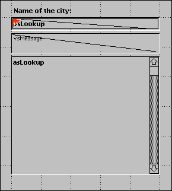
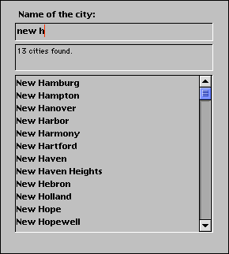

<!--REF #_command_.Keystroke.Syntax-->**Keystroke**  : Text<!-- END REF-->
<!--REF #_command_.Keystroke.Params-->
| 引数 | 型 |  | 説明 |
| --- | --- | --- | --- |
| 戻り値 | Text | &#8592; | ユーザが入力した文字 |

<!-- END REF-->

#### 説明 

<!--REF #_command_.Keystroke.Summary-->Keystroke はユーザがフィールドや入力可能エリアに入力した文字を返します。<!-- END REF-->

通常、KeystrokeはOn Before Keystrokeフォームイベントを処理するフォーム/オブジェクトメソッドで使用します。キーストロークイベントを検知するには、[Form event](form-event.md "Form event")コマンドを使用します。 

ユーザが実際に入力した文字を置き換えるには、[FILTER KEYSTROKE](filter-keystroke.md "FILTER KEYSTROKE")コマンドを使用します。

**Note:** Keystroke 関数はサブフォームでは動作しません。

**重要**: 編集中の入力可エリアの現在値や新しく入力された値を使用して逐次処理を行う場合、スクリーン上に表示されているテキストは、編集中のデータソース フィールドや変数の値にまだなっていないことに注意してください。データソースフィールドや変数には、タブで他のエリアに移動したりボタンをクリックする などして、データ入力が確定された後に値が代入されます。変数へのデータ入力を途中で変数に取得し、この値を処理することは開発者に任されています。特定 の処理を行うために現在のテキスト値を所得しなければならない場合、この作業を行う必要があります。なお[Get edited text](get-edited-text.md "Get edited text")も使用できます。 

Keystroke コマンドは以下の目的で使用します:

* カスタマイズされた方法で文字をフィルタする
* データ入力フィルタで実現できないフィルタを実装する
* ダイナミックなルックアップやタイプアヘッドを実装する

#### 例題 1 

[FILTER KEYSTROKE](filter-keystroke.md "FILTER KEYSTROKE")コマンドの例を参照

#### 例題 2 

On Before Keystroke イベントを処理する際、(カーソルがある) 現在のテキストエリアの編集中の値を扱います。このエリアのデータソース (フィールドまたは変数) の将来の値ではありません。Handle keystroke プロジェクトメソッドはテキストエリアのデータ入力を2つ目の変数にコピーします。この変数を使用して、入力中の文字に基づく処理を行うことができます。 第1引数にはエリアのデータソースへのポインタを渡します。2番目の引数にはコピー先の変数へのポインタを渡します。メソッドはコピー先変数にテキストエ リアの新しい値を返し、そして最後に入力された文字が挿入された値と異なっていれば[True](true.md "True")を返します。 

```4d
  // Handle keystroke プロジェクトメソッド
  // Handle keystroke ( Pointer ; Pointer ) -> Boolean
  // Handle keystroke ( -> srcArea ; -> curValue ) -> Is new value
 
 var $1;$2 : Pointer
 var $vtNewValue : Text
 
  // 入力エリアで現在選択されている範囲を取得
 GET HIGHLIGHT($1->;$vlStart;$vlEnd)
  // 現在の値を処理する
 $vtNewValue:=$2->
  // 押されたキーや入力された文字に基づき、
  // 適切な動作を行う
 Case of
 
  // Backspace (Delete) キーが押されたら
    :(Character code(Keystroke)=Backspace)
  // 選択されたテキストまたはテキストカーソルの左の文字を削除
       $vtNewValue:=Substring($vtNewValue;1;$vlStart-1-Num($vlStart=$vlEnd))
       +Substring($vtNewValue;$vlEnd)
 
  // 入力可能な文字が入力されたら
    :(Position(Keystroke;"abcdefghjiklmnopqrstuvwxyz -0123456789")>0)
       If($vlStart#$vlEnd)
  // 1つ以上の文字が選択されていれば、入力された文字で置き換える
          $vtNewValue:=Substring($vtNewValue;1;$vlStart-1)
          +Keystroke+Substring($vtNewValue;$vlEnd)
       Else
  // カーソルが置かれているだけなら
          Caes of
  // カーソルがテキストの先頭にある
       :($vlStart<=1)
  // 文字をテキストの先頭に挿入
          $vtNewValue:=Keystroke+$vtNewValue
  // カーソルがテキストの最後にある
       :($vlStart>=Length($vtNewValue))
  // 文字をテキストに追加
          $vtNewValue:=$vtNewValue+Keystroke
       Else
  // カーソルがテキスト中にある。新しい文字を挿入する
          $vtNewValue:=Substring($vtNewValue;1;$vlStart-1)+Keystroke
          +Substring($vtNewValue;$vlStart)
    End case
 End if
 
  // 矢印キーが押された
  // 何もせず、キーストロークを受け入れる
:(Character code(Keystroke)=Left arrow key)
:(Character code(Keystroke)=Right arrow key)
:(Character code(Keystroke)=Up arrow key)
:(Character code(Keystroke)=Down arrow key)
  `
Else
  // 文字、数字、ダッシュ以外のキーストロークを受け付けない
 FILTER KEYSTROKE("")
End case
  // 値が異なっているか?
$0:=($vtNewValue#$2->)
  // 次回のキーストローク処理のために値を返す
$2->:=$vtNewValue
```

このプロジェクトメソッドがプロジェクトに追加されたら、以下のように使用できます:

```4d
  // myObject enterable area オブジェクトメソッド
 Case of
    :(Form event code=On Load) //v17 以前ではForm event を使用すること
       MyObject:=""
       MyShadowObject:=""
    :(Form event code=On Before Keystroke) //v17 以前ではForm event を使用すること
       If(Handle keystroke(->MyObject;->MyShadowObject))
  // MyShadowObjectに格納された値に基づき、適切なアクションを行う
       End if
 End case
```

以下のフォームを見てみましょう:



このフォームには以下のオブジェクトが置かれています: *vsLookup*入力エリア、*vsMessage*入力不可エリア、*asLookup*スクロールエリア。*vsLookup*に文字を入力する間、オブジェクトメソッドが\[US Zip Codes\]テーブルの検索を実行し、年の最初の文字を入力すると、USの都市が検索されます。

*vsLookup* オブジェクトメソッドは以下のようになります:

```4d
  // vsLookup 入力エリアオブジェクトメソッド
 Case of
    :(Form event code=On Load) //v17 以前ではForm event を使用すること
       vsLookup:=""
       vsResult:=""
       vsMessage:="検索する都市の最初の文字を入力してください。"
       CLEAR VARIABLE(asLookup)
    :(Form event code=On Before Keystroke) //v17 以前ではForm event を使用すること
       If(Handle keystroke(->vsLookup;->vsResult))
          If(vsResult#"")
             QUERY([US Zip Codes];[US Zip Codes]City=vsResult+"@")
             MESSAGES OFF
             DISTINCT VALUES([US Zip Codes]City;asLookup)
             MESSAGES ON
             $vlResult:=Size of array(asLookup)
             Case of
                :($vlResult=0)
                   vsMessage:="都市が見つかりませんでした。"
                :($vlResult=1)
                   vsMessage:="1つの都市が見つかりました。"
                Else
                   vsMessage:=String($vlResult)+" cities found."
             End case
          Else
             DELETE FROM ARRAY(asLookup;1;Size of array(asLookup))
             vsMessage:="検索する都市の最初の文字を入力してください。"
          End if
       End if
 End case
```

フォームを実行:



4Dのプロセス間通信を使用することで、レコードを編集するプロセスと通信するフローティングウィンドウに同様の機能を実装することができます。

#### 参照 

[FILTER KEYSTROKE](filter-keystroke.md)  
[Form event code](form-event-code.md)  
[Get edited text](get-edited-text.md)  

#### プロパティ
|  |  |
| --- | --- |
| コマンド番号 | 390 |
| スレッドセーフである | &check; |
| サーバー上での使用は不可 ||


