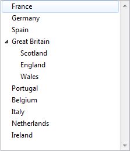

<!--REF #_command_.LIST TO ARRAY.Syntax-->**LIST TO ARRAY** ( *list* ; *array* {; *itemRefs*} )<!-- END REF-->
<!--REF #_command_.LIST TO ARRAY.Params-->
| 引数 | 型 |  | 説明 |
| --- | --- | --- | --- |
| list | Text, Integer | &#8594;  | 一番目の項目をコピーするコピー元のリスト |
| array | Array | &#8592; | コピー先の配列 |
| itemRefs | Array | &#8592; | リスト項目の参照番号 |

<!-- END REF-->

#### 説明 

<!--REF #_command_.LIST TO ARRAY.Summary-->LIST TO ARRAY コマンドは、*list* で指定したリストまたは選択リストの第一レベルの項目で、配列*array*を作成または上書きします。<!-- END REF-->

*list* 引数には、選択リストの名前(文字列)、または階層リストへの参照([ListRef](# "階層リストへの参照"))を渡すことが出来ます。

コピー先の配列を文字またはテキスト型として事前に設定をしていなかった場合、 LIST TO ARRAY は自動的に新しいテキスト配列をデフォルトで作成します。

**注:** コンパイルされたモードでは、*array* 引数の配列は事前に定義されている必要があり、型を変換することはできません。

オプションの*itemRefs*引数(数値配列)には、リスト項目の参照番号が返されます。

引き続き LIST TO ARRAY コマンドを使い、階層リストの第一レベル要素に基づく配列を構築できます。しかしこのコマンドは子項目を返しません。階層リストで作業する場合、階層リストコマンド、特に [Load list](load-list.md) の使用が推奨されます。

#### 例題 1 

以下の例は、リストRegionsの項目を配列*atRegions*にコピーします:

```4d
 LIST TO ARRAY("Regions";atRegions)
```

#### 例題 2 

以下のように定義された階層リストについて考えます:

```4d
 myList2:=New list
 APPEND TO LIST(myList2;"Scotland";1)
 APPEND TO LIST(myList2;"England";2)
 APPEND TO LIST(myList2;"Wales";3)
 myList1:=New list
 APPEND TO LIST(myList1;"France";1)
 APPEND TO LIST(myList1;"Germany";2)
 APPEND TO LIST(myList1;"Spain";3)
 APPEND TO LIST(myList1;"Great Britain";4;myList2;True)
 APPEND TO LIST(myList1;"Portugal";5)
 APPEND TO LIST(myList1;"Belgium";6)
 APPEND TO LIST(myList1;"Italy";7)
 APPEND TO LIST(myList1;"Netherlands";8)
 APPEND TO LIST(myList1;"Ireland";9)
```

このリストは以下の様に表示されます:



これに対し以下の宣言を実行すると、:

```4d
 LIST TO ARRAY(myList1;$MyArray)
```

......結果は以下の様になります。

```4d
 $MyArray{1}="France"
 $MyArray{2}="Germany"
 $MyArray{3}="Spain"
 $MyArray{4}="Great Britain"
 $MyArray{5}="Portugal"
 ...
```

#### 参照 

[ARRAY TO LIST](array-to-list.md)  
[Load list](load-list.md)  
[SAVE LIST](save-list.md)  

#### プロパティ
|  |  |
| --- | --- |
| コマンド番号 | 288 |
| スレッドセーフである | &check; |
| サーバー上での使用は不可 ||


