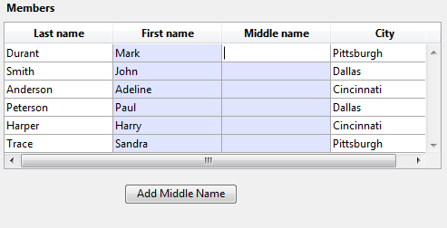

<!--REF #_command_.LISTBOX DUPLICATE COLUMN.Syntax-->**LISTBOX DUPLICATE COLUMN** ( {* ;} *object* ; *colPosition* ; *colName* ; *colVariable* ; *headerName* ; *headerVar* {; *footerName* ; *footerVar*} )<!-- END REF-->
<!--REF #_command_.LISTBOX DUPLICATE COLUMN.Params-->
| 引数 | 型 |  | 説明 |
| --- | --- | --- | --- |
| * | 演算子 | &#8594;  | 指定時、 Object はオブジェクト名 (文字列) 省略時、 Object は変数 |
| object | any | &#8594;  | 複製したい列のオブジェクト名( * 指定時)、 または変数 ( * 省略時) |
| colPosition | Integer | &#8594;  | 新しく複製した列の位置 |
| colName | Text | &#8594;  | 新しい列の名前 |
| colVariable | Array, Field, Variable, Pointer | &#8594;  | 列の配列変数またはフィールド、変数 |
| headerName | Text | &#8594;  | 列のヘッダーのオブジェクト名 |
| headerVar | Integer, Pointer | &#8594;  | 列のヘッダーの変数 |
| footerName | Text | &#8594;  | 列のフッターのオブジェクト名 |
| footerVar | Variable, Pointer | &#8594;  | 列のフッターの変数 |

<!-- END REF-->

*このコマンドはスレッドセーフではないため、プリエンプティブなコードには使えません。*


#### 説明 

<!--REF #_command_.LISTBOX DUPLICATE COLUMN.Summary-->**LISTBOX DUPLICATE COLUMN**コマンドは、 *object* と *\** 演算子によって指定された列を、プログラムによって実行中のフォームにおいて複製します。<!-- END REF-->(アプリケーションモード)

**注:** 列を複製する機能は以前の4D にもありましたが、デザインモードにおいてフォームエディターのコンテキストメニューの中にある列複製コマンドを使用することによってのみ可能、というものでした。

複 製元となる列においてプロパティリストやオブジェクト管理コマンド (*\_o\_OBJECT SET COLOR* 等) を使用して設定されたスタイルオプション(サイズ、背景色、書式等)は、複製先の列にも反映されます。また、フォームのオブジェクトメソッド、スタイルと カラー配列やイベントなどといったものも複製されます。  
しかしながら、データソース (リストボックスに定義されたソースにより、配列またはセレクション) に加えてスタイル配列、カラー配列は複製されません。列を複製した際には、デベロッパが新しい列にてそれらのデータを定義しなおさなければなりません。

*object* と *\** 演算子を使用して複製する列を指定します。任意の *\** 演算子を渡した場合、 *object* 引数でオブジェクト名を文字列で指定します。省略時には *object* 引数で列変数を指定します。 

**注:** このコマンドは階層リストボックスの最初の列を指定した場合には何もしません。

複製した列は、 *colPosition* 引数で指定した位置の一つ前に置かれます。 *colPosition* が列全体の総数より大きい場合、複製した列は最後の列の後ろに置かれます。

*colName* 引数と *colVariable* 引数には、オブジェクト名と、新しく複製された列の変数を渡します。

* 配列型のリストボックスの場合、*colVariable* は列に表示される配列の名前です。動的なコンテキストにおいてはNil (->\[\]) ポインターを渡す事もできます(以下を参照の事)。
* セレクション型のリストボックスの場合、 *colVariable* 引数で指定したフィールドまたは変数の値が列に表示されます。これはリストボックスに関連付けられたセレクションのレコードごとに評価された値となりま す。この型の内容をしようするためには、リストボックスの「データソース」プロパティがカレントセレクションか命名セレクションに設定されている必要があ ります。
* コレクションまたはエンティティセレクション型のリストボックスの場合、*colVariable* にNil ポインター(->\[\])を渡します。その後、データソース式を指定するために[LISTBOX SET COLUMN FORMULA](listbox-set-column-formula.md) コマンドを呼び出す必要があります。

繰り返しになりますが、オリジナルの列のデータソースまでは複製されないことにご注意ください。複製された列に対し、新たにソースとなる変数、配列、フィールド、あるいは式を設定してあげる必要があります。

*headerName* と *headerVariable* 引数には、新たに作成する列のヘッダーのオブジェクト名と変数を渡します。同様に、*footerName* 引数と *footerVariable* 引数にオブジェクト名と変数を渡してあげることで新しい列のフッターを設定することもできます。 *footerVariable* 引数省略時には 4D はフォーム変数を割り当てます。

**Note:** オブジェクト名は、フォーム内において固有でなければなりません。*colName* 引数、*headerName* 引数、 *footerName* 引数などで渡す名前がこれまでに使用されていないことを確認して下さい。重複していた場合、複製は行われず、エラーが発生します。

このコマンドはフォーム表示中に使用される必要があります。通常、フォームの On Load イベント内か、ユーザーのアクションへの反応(On Clicked イベント) にて使用されます。

##### 動的な複製 

リストボックスカラムを動的に複製すると、必要な変数(カラム、フッター、ヘッダー)の定義を4Dに自動的に行わせることができます。

これを可能にするため、**LISTBOX DUPLICATE COLUMN** は*colVariable* (配列型およびコレクション/エンティティセレクション型リストボックスのみ)、*headerVar*、*footerVar* において**Nil** (**\->\[\]**) ポインターを引数として受け入れるようになりました。Nilポインターを渡してコマンドを実行すると、4Dは必要な変数を動的に作成します(詳細に関しては、 のセクションを参照して下さい)。

ヘッダー変数とフッター変数は常に特定のタイプで作成されるという点に注意して下さい(ヘッダーは倍長整数、フッターはテキスト)。反対に、カラム変数は作成時にタイプを指定することはできません。リストボックスはカラム変数に対して、異なるタイプの配列(テキスト配列、倍長整数配列、等々)を受け入れることができるからです。これはつまり配列のタイプを手動で設定しなければならないという事です(例題2を参照して下さい)。こういったタイプの指定は、配列に新しい要素を挿入するために[LISTBOX INSERT ROWS](listbox-insert-rows.md) などのコマンドを呼び出す前に実行しなければなりません。その他には、 [APPEND TO ARRAY](append-to-array.md) を使用して配列の型を指定し、要素を挿入することができます。

#### 例題 1 

以下のような配列型のリストボックスの中で、 "First Name" の列を複製して入力できるようにしたい場合:


ボタンのコードは以下のようになります:

```4d
 ARRAY TEXT(arrFirstNames2;Records in table([Members]))
 LISTBOX DUPLICATE COLUMN(*;"column2";3;"col2bis";arrFirstNames2;"FirstNameA";vHead2A)
 OBJECT SET TITLE(*;"FirstNameA";"Middle Name")
 EDIT ITEM(*;"col2A";0)
```

ボタンをクリックすると、リストボックスは以下のようになります:



#### 例題 2 

ブール型のカラムを追加し、そのタイトルを変えます:

```4d
 var $ptr : Pointer
 LISTBOX DUPLICATE COLUMN(*;"boolCol";3;"duplBoolCol";$ptr;"duplBoolHeader";$ptr;"duplBoolFooter";$ptr)
 colprt:=OBJECT Get pointer(Object named;"duplBoolCol")
 ARRAY BOOLEAN(colprt->;10)
 headprt:=OBJECT Get pointer(Object named;"duplBoolHeader")
 OBJECT SET TITLE(headprt->;"New duplicated column")
```

#### 参照 

[LISTBOX MOVE COLUMN](listbox-move-column.md)  