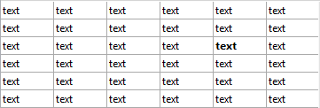

<!--REF #_command_.LISTBOX SET ROW FONT STYLE.Syntax-->**LISTBOX SET ROW FONT STYLE** ( {* ;} *object* ; *row* ; *style* )<!-- END REF-->
<!--REF #_command_.LISTBOX SET ROW FONT STYLE.Params-->
| 引数 | 型 |  | 説明 |
| --- | --- | --- | --- |
| * | 演算子 | &#8594;  | 指定時:objectはオブジェクト名(文字列)省略時:objectは変数 |
| object | any | &#8594;  | オブジェクト名(*指定時)、または変数(*省略時) |
| row | Integer | &#8594;  | 列番号 |
| style | Integer | &#8594;  | フォントスタイル |

<!-- END REF-->

#### 説明 

<!--REF #_command_.LISTBOX SET ROW FONT STYLE.Summary-->**注:** このコマンドは配列型のリストボックスに対してのみ有効です。<!-- END REF-->

**LISTBOX SET ROW FONT STYLE**コマンドは、 *object* and *\** によって指定された配列型リストボックスの、行またはセルのフォントスタイルを設定します。

任意の *\** 演算子を渡した場合、*object* 引数でオブジェクト名を文字列で指定します。省略時には *object* 引数で列変数を指定します。

対象がリストボックスなのか列なのかを、 *object* 引数で指定します。

* *object* がリストボックスを指定するとき、コマンドはその中で指定した行全体に反映されます。
* *object* がリストボックスの列を指定するとき、コマンドはその列内の、指定された行にある単一のセルに対して反映されます。

*row* 引数には、新しいスタイルを反映させたい列を指定する番号を渡します。

**注:** このコマンドは列の表示/非表示の状態は無視します。

*style* 引数には、指定したいスタイルの値を渡します。指定する際には *Font Styles* テーマ内にある、以下の定数のどれか一つ、あるいはその組み合わせを指定して下さい。

| 定数        | 型    | 値 |
| --------- | ---- | - |
| Bold      | 倍長整数 | 1 |
| Italic    | 倍長整数 | 2 |
| Plain     | 倍長整数 | 0 |
| Underline | 倍長整数 | 4 |

リストボックスや列にフォントスタイル配列が設定されている場合、指定された列の要素に関してのみ変更されます。言い換えると、この場合コマンドを実行するのはフォントスタイル配列の要素を変更するのと同等の効果があります。  
リストボックスや列にフォントスタイル配列が何も設定されていない場合、このコマンドが使用されたときに作成されます。この配列には[LISTBOX Get array](listbox-get-array.md) コマンドを使用することによってアクセス可能です。

他のリストボックスプロパティ(一般のプロパティ、行スタイル配列など)によって、このコマンドと異なるフォントスタイルが指定された場合、4D内の優先順位に応じて処理されます。この優先順位の詳細に関しては、 *Design Reference* マニュアルを参照して下さい。

**注:** リストボックス全体に対するスタイルの指定より単一の列に対するスタイルの方が優先されるので、リストボックス全体に対してこのコマンドは、列に対するスタイル配列が設定されていない場合のみ有効です。

#### 例題 

ある配列リストボックスに以下のスタイルを適用する場合を考えます。

* フォントスタイル配列がリストボックス全体に適用されているとします。(*ArrGlobalStyle*)
* フォントスタイル配列が、5行目に適用されているとします。 (*ArrCol5Style*)
* 他の列にはスタイル配列は適用されていません。

```4d
 LISTBOX SET ROW FONT STYLE(*;"Col5";3;Bold)
  // ArrCol5Style{3}:=Bold と同様の効果
```



```4d
 LISTBOX SET ROW FONT STYLE(*;"List Box";3;Italic+Underline)
  // ArrGlobalStyle{3}:=Italic+Underline と同様の効果
```


2つ目のコマンドの後、3行目のセルは下線付きのイタリックになりましたが、5列目のセルだけは太字のままになっています(列スタイル配列の方がリストボックス配列より優先されるからです)。

#### 参照 

[LISTBOX Get row font style](listbox-get-row-font-style.md)  
[LISTBOX SET ROW COLOR](listbox-set-row-color.md)  

#### プロパティ
|  |  |
| --- | --- |
| コマンド番号 | 1268 |
| スレッドセーフである | &check; |
| サーバー上での使用は不可 ||


