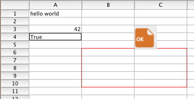

<!--REF #_command_.Load 4D View document.Syntax-->**Load 4D View document** ( *4DViewDocument* ) : Object<!-- END REF-->
<!--REF #_command_.Load 4D View document.Params-->
| 引数 | 型 |  | 説明 |
| --- | --- | --- | --- |
| 4DViewDocument | Blob | &#8594;  | 4D View ドキュメント |
| 戻り値 | Object | &#8592; | 4D View ドキュメントの情報を格納したオブジェクト |

<!-- END REF-->

#### 説明 

<!--REF #_command_.Load 4D View document.Summary-->**Load 4D View document** コマンドを使用すると、4D View ドキュメントを4D オブジェクトへと変換することができます。<!-- END REF--> 

このコマンドには、お使いの環境の中に4D View ライセンスも、あるいは旧4D View プラグインのインスタンスも必要ありません。

*4DViewDocument* 引数に変換したい4D View ドキュメントを格納しているBLOB 変数あるいはフィールドを渡します。コマンドは4D View ドキュメント内に元々保存されている全ての情報を格納している4D object を返し、これには以下のような情報が含まれます:

* ドキュメント構造(行数やカラム数)、型と情報(バージョン、題名、など)
* セル属性(セルの型、値、フォーミュラ、名前、スタイル、セキュリティ、など)
* カラム属性(幅、スタイル、型、セキュリティ、表示状態、ブレーク、など)
* 行属性(高さ、スタイル、型、セキュリティ、表示状態、ブレーク、など)
* スタイル、境界線、ペイン

このコマンドを使用すると、4D View ドキュメントに保存されていたあらゆるデータを復元し、オープンなフォーマットで管理することができます。

**注**: 4D View から4D View Pro へとドキュメントを変換したい場合、専用の コマンドの使用が推奨されます。こちらの方が直接的かつ透過な変換を行えます。

#### 例題 

ディスク上に保存された4D View ドキュメントを読み込んで変換したい場合を考えます:

```4d
 var $blob : Blob
 var $object : Object
 DOCUMENT TO BLOB("document.4PV";$blob)
 $object:=Load 4D View document($blob)
 ALERT("Document title is "+$object.title)
```

例えば、以下のドキュメントを変換した場合:



以下の結果を取得します(文字列化されたオブジェクト):

```json
{
    "version": 9,
    "title": "4D View test",
    "subject": "",
    "author": "",
    "company": "",
    "note": "",
    "creationDate": "2017-06-13",
    "creationTime": 63230,
    "modificationDate": "2017-06-13",
    "modificationTime": 63295,
    "columnCount": 2048,
    "rowCount": 65535,
    "columnHeaderHeight": 380,
    "rowHeaderWidth": 1180,
    "columnWidth": 2160,
    "rowHeight": 320,
    "noExternalCall": false,
    "columns": [],
    "rows": [],
    "cells": [
        {
            "kind": "value",
            "value": "hello world",
            "valueType": "string",
            "column": 1,
            "row": 1
        },
        {
            "kind": "value",
            "value": 42,
            "valueType": "real",
            "column": 1,
            "row": 3
        },
        {
            "kind": "value",
            "value": true,
            "valueType": "bool",
            "column": 1,
            "row": 4
        }
    ],
    "cellNames": [],
    "customFormats": [],
    "rowEdges": [
        {
            "style": 13,
            "color": 15597568,
            "left": 2,
            "top": 6,
            "right": 3,
            "bottom": 6
        },
        {
            "style": 13,
            "color": 15597568,
            "left": 2,
            "top": 11,
            "right": 3,
            "bottom": 11
        }
    ],
    "columnEdges": [
        {
            "style": 13,
            "color": 15597568,
            "left": 2,
            "top": 6,
            "right": 2,
            "bottom": 10
        },
        {
            "style": 13,
            "color": 15597568,
            "left": 4,
            "top": 6,
            "right": 4,
            "bottom": 10
        }
    ],
    "defaultStyle": {
        "locked": false,
        "hidden": false,
        "gridHidden": false,
        "spellCheck": false,
        "pictHeights": false,
        "inputFilter": 0,
        "backColorEven": 16777215,
        "backColorOdd": 16777215,
        "fontID": 2,
        "fontSize": 11,
        "fontBold": false,
        "fontItalic": false,
        "fontUnderline": false,
        "fontOutline": false,
        "fontShadow": false,
        "fontCondensed": false,
        "fontExtended": false,
        "normalColorEven": 0,
        "normalColorOdd": 0,
        "zeroColorEven": 255,
        "zeroColorOdd": 255,
        "minusColorEven": 16711680,
        "minusColorOdd": 16711680,
        "hAlign": 0,
        "vAlign": 0,
        "rotation": 0,
        "wordWrap": false,
        "forceTextFormat": false,
        "numericFormat": 0,
        "stringFormat": 0,
        "booleanFormat": 0,
        "dateTimeFormat": 0,
        "pictureFormat": 0
    },
    "exportRanges": [],
    "fontNames": [
        {
            "id": 2,
            "name": "Lucida Grande" 
        }
    ],
    "inputFilters": [],
    "pictures": [
        {
            "column": 3,
            "row": 3,
            "width": 920,
            "height": 1000,
            "drawingMode": 5,
            "behind": false,
            "fixedSize": false,
            "locked": false,
            "hOffset": 0,
            "vOffset": 0,
            "picture": "[object Picture]" 
        }
    ]
}
```

**注:** 返されるobject についてのフォーマットについてのより詳細な情報については、4D テクニカルサービスにお問い合わせください。


#### プロパティ
|  |  |
| --- | --- |
| コマンド番号 | 1528 |
| スレッドセーフである | &check; |
| サーバー上での使用は不可 ||


