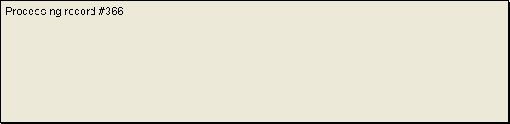
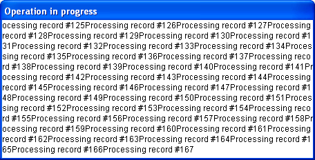
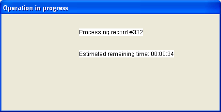

<!--REF #_command_.MESSAGE.Syntax-->**MESSAGE** ( *message* )<!-- END REF-->
<!--REF #_command_.MESSAGE.Params-->
| 引数 | 型 |  | 説明 |
| --- | --- | --- | --- |
| message | Text | &#8594;  | 表示するメッセージ |

<!-- END REF-->

*このコマンドはスレッドセーフではないため、プリエンプティブなコードには使えません。*


#### 説明 

<!--REF #_command_.MESSAGE.Summary-->MESSAGE コマンドは、通常ユーザに対して何らかの動作を知らせるために使用します。<!-- END REF-->このコマンドは画面上の特別なメッセージウィンドウに *message* を表示します。このメッセージウィンドウは、 [Open window](open-window.md) を使って（後述）あらかじめ開かれたウィンドウを使用していないかぎり、MESSAGE コマンドをコールするたびに表示されたり閉じられたりします。このメッセージは一時的なもので、フォームを表示する、またはメソッドの実行が終了するとすぐに消去されます。別のMESSAGE コマンドを実行すると古いメッセージは、消去されます。 

[Open window](open-window.md) でウィンドウを開いている場合、続く MESSAGE コマンドの呼び出しはすべてそのウィンドウにメッセージを表示します。ウィンドウはターミナルのようなに振舞います:

* 一連のメッセージがこのウィンドウで表示されると、前のメッセージを消去しません。その代わりに、新しいメッセージは既存のメッセージに続けて表示されます。
* メッセージがウィンドウの幅よりも長い場合、4Dは自動的に改行を行います。
* メッセージの行がウィンドウの高さより高い場合、4Dは自動的にメッセージウィンドウをスクロールします。
* 行の制御を行うには、メッセージ中にキャリッジリターン (Char(13) または "\\r") を挿入します。
* ウィンドウの特定の位置にメッセージを表示するには、[GOTO XY](goto-xy.md)コマンドを使用します。
* ウィンドウの内容を消去するには、[ERASE WINDOW](erase-window.md)コマンドを使用します。
* このウィンドウは単なる出力用ウィンドウであり、別のウィンドウがオーバーラップしても再描画されません。
* ウィンドウに表示される文字のフォントとサイズは、データベース設定"インターフェース"ページ内にて変更することができます。

**注:** **MESSAGE** は[Open form window](open-form-window.md) コマンドと互換性がありますが、このコンテキストでは、[Open form window](open-form-window.md)コマンドの、ウィンドウのサイズと位置を保存する第2*\** 引数はサポートされません。

#### 例題 1 

以下の例は、レコードセレクションを処理し、MESSAGEコマンドをコールしてユーザに処理の進捗状況を知らせます:

```4d
 For($vlRecord;1;Records in selection([anyTable]))
    MESSAGE("Processing record #"+String($vlRecord))
  // Do Something with the record
    NEXT RECORD([anyTable])
 End for
```

MESSAGEをコールするたびに、以下のウィンドウが表示されては消えます:



#### 例題 2 

ウィンドウのちらつきを避けるため、以下の例題のように[Open window](open-window.md "Open window")で開いたウィンドウにメッセージを表示することができます: 

```4d
 Open window(50;50;500;250;5;"Operation in Progress")
 For($vlRecord;1;Records in selection([anyTable]))
    MESSAGE("Processing record #"+String($vlRecord))
  // Do Something with the record
    NEXT RECORD([anyTable])
 End for
 CLOSE WINDOW
```

結果は以下の通り:



#### 例題 3 

改行を追加し、見やすくします: 

```4d
 Open window(50;50;500;250;5;"Operation in Progress")
 For($vlRecord;1;Records in selection([anyTable]))
    MESSAGE("Processing record #"+String($vlRecord)+Char(Carriage return))
  // Do Something with the record
    NEXT RECORD([anyTable])
 End for
 CLOSE WINDOW
```

結果は以下の通り:


#### 例題 4 

[GOTO XY](goto-xy.md) コマンドを使用し、何行か追加します:  

```4d
 Open window(50;50;500;250;5;"Operation in Progress")
 $vlNbRecords:=Records in selection([anyTable])
 $vhStartTime:=Current time
 For($vlRecord;1;$vlNbRecords)
    GOTO XY(5;2)
    MESSAGE("Processing record #"+String($vlRecord)+Char(Carriage return))
  // Do Something with the record
    NEXT RECORD([anyTable])
    GOTO XY(5;5)
    $vlRemaining:=(($vlNbRecords/$vlRecord)-1)*(Current time-$vhStartTime)
    MESSAGE("Estimated remaining 時間: "+Time string($vlRemaining))
 End for
 CLOSE WINDOW
```

結果は以下の通り:



#### 参照 

[CLOSE WINDOW](close-window.md)  
[ERASE WINDOW](erase-window.md)  
[GOTO XY](goto-xy.md)  
[Open window](open-window.md)  