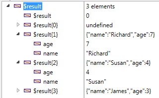

<!--REF #_command_.OB GET ARRAY.Syntax-->**OB GET ARRAY** ( *object* ; *property* ; *array* )<!-- END REF-->
<!--REF #_command_.OB GET ARRAY.Params-->
| 引数 | 型 |  | 説明 |
| --- | --- | --- | --- |
| object | Object, Object | &#8594;  | 構造化されたオブジェクト |
| property | Text | &#8594;  | 情報を取得したいプロパティ名 |
| array | Text array, Real array, Boolean array, Object array, Pointer array, Integer array | &#8592; | プロパティの値の配列 |

<!-- END REF-->

#### 説明 

<!--REF #_command_.OB GET ARRAY.Summary-->**OB GET ARRAY**コマンドは、 *object* 引数で指定したランゲージオブジェクトの、*property* 引数で指定したプロパティの中に保存されている値の配列を *array* という配列に返します。<!-- END REF-->で指定するオブジェクトは、 [C\_OBJECT](c-object.md) コマンドを使用して作成されている、あるいはオブジェクトフィールドが選択されている必要があります。

*property* 引数には、値を取得したいプロパティのラベルを渡します。*property* 引数では、大文字と小文字は区別されることに注意して下さい。

#### 例題 1 

[OB SET ARRAY](ob-set-array.md) コマンドの例示で定義された以下のオブジェクトにおいて:


以下の値を取得したい場合は以下の様になります:

```4d
 ARRAY OBJECT($result;0)
 OB GET ARRAY($Children;"Children";$result)
```



#### 例題 2 

配列の第一要素の値を変更したい場合、以下の様になります:

```4d
  // "age" の値を変更:
 ARRAY OBJECT($refs)
 OB GET ARRAY($refEmployees;"__ENTITIES";$refs)
 OB SET($refs{1};"age";25)
```

#### 参照 

[OB SET ARRAY](ob-set-array.md)  
*コレクションと4D配列間での型の変換*  

#### プロパティ
|  |  |
| --- | --- |
| コマンド番号 | 1229 |
| スレッドセーフである | &check; |
| サーバー上での使用は不可 ||


