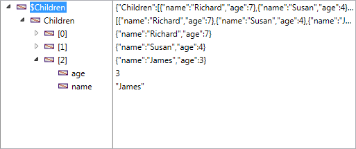

<!--REF #_command_.OB SET ARRAY.Syntax-->**OB SET ARRAY** ( *object* ; *property* ; *array* )<!-- END REF-->
<!--REF #_command_.OB SET ARRAY.Params-->
| 引数 | 型 |  | 説明 |
| --- | --- | --- | --- |
| object | Object, Object | &#8594;  | 構造化されたオブジェクト |
| property | Text | &#8594;  | 設定したいプロパティ名 |
| array | Array, Variable | &#8594;  | プロパティに保存したい配列 |

<!-- END REF-->

#### 説明 

<!--REF #_command_.OB SET ARRAY.Summary-->**OB SET ARRAY**コマンドは、 *object* 引数で指定したランゲージオブジェクトの中の *property* と関連付ける配列 *array* を定義します。<!-- END REF-->で指定するオブジェクトは、 [C\_OBJECT](c-object.md) コマンドを使用して作成されている、あるいはオブジェクトフィールドが選択されている必要があります。

*property* 引数には、作成または修正したいプロパティのラベル(名前)を渡して下さい。オブジェクト内に指定されたプロパティが存在する場合、その値は指定した値で上書きされます。プロパティが存在しない場合、新たにプロパティが作成されます。  
*property* 引数では、大文字と小文字は区別されることに注意して下さい。

*array* 引数には、プロパティの値として関連付けたい配列を渡して下さい。渡せる配列の型としては複数の型がサポートされています: 実数、倍長整数、テキスト、ブール、オブジェクト、ポインター。4D v16 R4以降はピクチャー配列もサポートされます。

****注:** 

* *array* 引数には単純な変数もサポートされます。単純な変数を渡した場合、単一の値を持つ配列が作成され、*property* 引数のプロパティに割り当てられます。
* 二次元配列を使用することはできません。

#### 例題 1 

テキスト配列を使用する場合:

```4d
 var $Children : Object
 ARRAY TEXT($arrChildren;3)
 $arrChildren{1}:="Richard"
 $arrChildren{2}:="Susan"
 $arrChildren{3}:="James"
 
 OB SET ARRAY($Children;"Children";$arrChildren)
  // Value of $Children = {"Children":["Richard","Susan","James"]}
```

#### 例題 2 

配列に要素を追加する場合:

```4d
 ARRAY TEXT($arrText;2)
 $arrText{1}:="Smith"
 $arrText{2}:="White"
 var $Employees : Object
 OB SET ARRAY($Employees;"Employees";$arrText)
 APPEND TO ARRAY($arrText;"Brown") // 4D 配列に追加する
  // $Employees = {"Employees":["Smith","White"]}
 
 OB SET ARRAY($Employees;"Employees";$arrText)
  // $Employees = {"Employees":["Smith","White","Brown"]}
```

#### 例題 3 

テキスト配列の一要素を配列として使用する場合:

```4d
  // $Employees = {"Employees":["Smith","White","Brown"]}
 OB SET ARRAY($Employees ;"Manager";$arrText{1})
  // $Employees = {"Employees":["Smith","White","Brown"],"Manager":["Smith"]}
```

#### 例題 4 

オブジェクト配列を使用する場合:

```4d
 var $Children;$ref_richard;$ref_susan;$ref_james : Object
 ARRAY OBJECT($arrChildren;0)
 OB SET($ref_richard;"nom";"Richard";"age";7)
 APPEND TO ARRAY($arrChildren;$ref_richard)
 OB SET($ref_susan;"name";"Susan";"age";4)
 APPEND TO ARRAY($arrChildren;$ref_susan)
 OB SET($ref_james;"name";"James";"age";3)
 
 APPEND TO ARRAY($arrChildren;$ref_james)
 
  // $arrChildren {1} = {"name":"Richard","age":7}
  // $arrChildren {2} = {"name":"Susan","age":4}
  // $arrChildren {3} = {"name":"James","age":3}
 
 OB SET ARRAY($Children;"Children";$arrChildren)
 
  // $Children = {"Children":[{"name":"Richard","age":7},{"name":"Susan",
  // "age":4},{"name":"James","age":3}]}
```

オブジェクトはデバッガ内では以下の様に表示されます:



#### 例題 5 

オブジェクトフィールドを使用する場合を考えます:

```4d
 ARRAY TEXT($arrGirls;3)
 $arrGirls{1}:="Emma"
 $arrGirls{2}:="Susan"
 $arrGirls{3}:="Jamie"
 OB SET ARRAY([People]Children;"Girls";$arrGirls)
```


#### 例題 6 

ピクチャー配列を使用する場合:

```4d
 ARRAY PICTURE($arrPhotos;3)
 READ PICTURE FILE("pict1.jpg";$arrPhotos{1})
 READ PICTURE FILE("pict2.jpg";$arrPhotos{2})
 READ PICTURE FILE("pict3.jpg";$arrPhotos{3})
 
 OB SET ARRAY([Cities]Places;"Photoset";$arrPhotos)
```

#### 参照 

[OB GET ARRAY](ob-get-array.md)  
[OB SET](ob-set.md)  
*コレクションと4D配列間での型の変換*  

#### プロパティ
|  |  |
| --- | --- |
| コマンド番号 | 1227 |
| スレッドセーフである | &check; |
| サーバー上での使用は不可 ||


