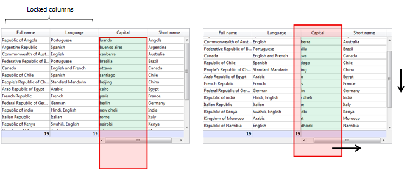
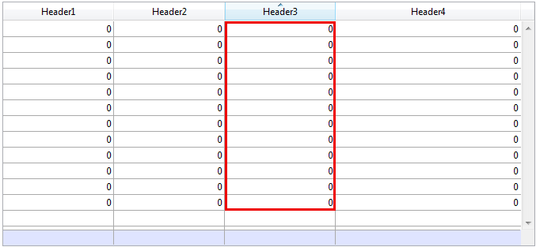

<!--REF #_command_.OBJECT GET COORDINATES.Syntax-->**OBJECT GET COORDINATES** ( {* ;} *object* ; *left* ; *top* ; *right* ; *bottom* )<!-- END REF-->
<!--REF #_command_.OBJECT GET COORDINATES.Params-->
| 引数 | 型 |  | 説明 |
| --- | --- | --- | --- |
| * | 演算子 | &#8594;  | 指定時, Objectはオブジェクト名 (文字列) 省略時, Objectはフィールドまたは変数 |
| object | any | &#8594;  | オブジェクト名 (* 指定時), または フィールドまたは変数 (* 省略時) |
| left | Integer | &#8592; | オブジェクトの左座標 |
| top | Integer | &#8592; | オブジェクトの上座標 |
| right | Integer | &#8592; | オブジェクトの右座標 |
| bottom | Integer | &#8592; | オブジェクトの下座標 |

<!-- END REF-->

#### 説明 

<!--REF #_command_.OBJECT GET COORDINATES.Summary-->OBJECT GET COORDINATES コマンドは、引数 *\** および*object*によって指定された、現在のフォームのオブジェクトの*left*, *top*, *right* および *bottom*の座標 (ポイント) を返します。<!-- END REF-->

オプションの *\** 引数を指定した場合、*object*はオブジェクト名です (文字列) 。オプションの \* 引数を省略すると、*object*はフィールドまたは変数です。この場合、文字列ではなくフィールドまたは変数参照 (フィールドまたは変数のみ) を指定します。

*object* にオブジェクト名を渡し、そこでワイルドカード文字 (“@”) を使用して1つ以上のオブジェクトを指定する場合、返される座標は関連するすべてのオブジェクトで構成される四角の座標となります。

**Note:** バージョン6.5からは、文字列に含まれるワイルドカード文字（@）の取り扱い方を設定することができます。このオプションは、"オブジェクトプロパティ"コマンドに影響を与えます。4D Design Referenceマニュアルを参照してください。

オブジェクトが存在しない場合やコマンドがフォーム内で呼び出されていない場合、座標(0;0;0;0)が返されます。

リストボックスのコンテキストにおいては、**OBJECT GET COORDINATES** コマンドはリストボックスの親オブジェクトの座標だけではなく、特定のリストボックスのパーツ、つまりカラム、ヘッダー、フッターなどの座標も返す事ができます。v14 R5以前のバージョンの4Dにおいては。このコマンドは引数として渡されたエリアに関係なく、常に親リストボックスの座標のみを返してきました。今後は、*object* 引数で参照されたオブジェクトがリストボックスのヘッダー、カラム、フッターなどのサブオブジェクトである場合には、返される座標はそれらの指定されたサブオブジェクトの座標となります。この新機能を使用して例えば、リストボックスヘッダーにマウスオーバーしたときに小さなアイコンを表示し、ユーザーがそれをクリックするとコンテキストメニューが表示される、というような事ができるようになります。  
統一性のために、オブジェクトがリストボックスサブオブジェクトまたはリストボックスオブジェクトの場合には、使用される参照フレームは同じになります。つまり原点はオブジェクトを含むフォームの左上端の角になります。リストサブオブジェクトの場合、返される座標は理論値になります。つまり、クリッピングが起こるまではリストボックスのスクロール状態を考慮するという事です(親リストボックスの座標によるカッティングは継続されるという事です)。結果として、サブオブジェクトはその座標において(一部または全体が)非表示になっていることもあり、またそれらの座標はフォームの限界の外側(あるいは負の値)になることもあります。サブオブジェクトが表示されているかどうか(そして表示されているのであればどの部分が表示されているのか)を調べたい場合、返された座標とリストボックスの座標を比較する必要があります。その際、以下のルールが適用されます:

* 全てのサブオブジェクトは、親リストボックスの座標(リストボックスに対して**OBJECT GET COORDINATES** を使用して返された値)に基づいてクリップされます。
* ヘッダーとフッターサブオブジェクトはカラムの中身の上に表示されます。カラムの座標がヘッダーとフッターの線の座標と交差した場合、カラムはその交点では表示されません。
* ロックされたカラムの要素はスクロール可能なカラムの要素の上に表示されます。スクロール可能なカラム内の要素の座標がロックされたカラムの要素の座標と交差した場合、スクロール可能なカラムの要素はその交点では表示されません。

例えば、以下の画像のように、座標が赤い長方形で縁どられた*Capital* カラムの場合を考えます:



1枚目の画像のように、カラムはリストボックスより大きいので、その座標はフッターを含めてリストボックスの下限を越えています。2枚目の画像では、リストボックスはスクロールしており、カラムはヘッダーエリアと*Language* カラムの"下"へと移動しています。どの場合においても、実際に表示されている部分(緑の部分)を計算するためには、赤の領域の部分を差し引く必要があります。

#### 例題 1 

"button"で始まるすべてのオブジェクトによって形成される長方形の座標を得たい場合を仮定します:

```4d
 OBJECT GET COORDINATES(*;"button@";vLeft;vTop;vRight;vBottom)
```

#### 例題 2 

インターフェースのために、クリックされたエリアを赤い四角で囲いたい場合を考えます:



リストボックスのオブジェクトメソッドにおいて、以下の様に記述します:

```4d
 OBJECT SET VISIBLE(*;"rectangleInfo";False) //赤い四角を初期化
 $ptr:=OBJECT Get pointer(Object current)
 OBJECT GET COORDINATES($ptr->;$x1;$y1;$x2;$y2)
 OBJECT SET VISIBLE(*;"RedRect";True)
 OBJECT SET COORDINATES(*;"RedRect";$x1;$y1;$x2;$y2)
 
 OBJECT GET COORDINATES(*;"LB1";$lbx1;$lby1;$lbx2;$lby2)
 If($lby1>$y1)|($lby2<$y2) // クリックされたエリアがリストボックスの外側にある場合、
    OBJECT SET VISIBLE(*;"Alert";True) //警告を表示します
 Else
    OBJECT SET VISIBLE(*;"Alert";False)
 End if
```

メソッドは座標の理論値を返します。リストボックスがリサイズされた場合、どの部分が表示されているのかを調べるためにクリッピングを再計算が必要になる場合もあります:


#### 参照 

[CONVERT COORDINATES](convert-coordinates.md)  
[LISTBOX GET CELL COORDINATES](listbox-get-cell-coordinates.md)  
[OBJECT MOVE](object-move.md)  
[OBJECT SET COORDINATES](object-set-coordinates.md)  

#### プロパティ
|  |  |
| --- | --- |
| コマンド番号 | 663 |
| スレッドセーフである | &check; |
| サーバー上での使用は不可 ||


