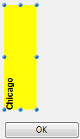
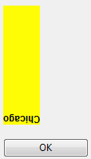

<!--REF #_command_.OBJECT Get text orientation.Syntax-->**OBJECT Get text orientation** ( {* ;} *object* ) : Integer<!-- END REF-->
<!--REF #_command_.OBJECT Get text orientation.Params-->
| 引数 | 型 |  | 説明 |
| --- | --- | --- | --- |
| * | 演算子 | &#8594;  | 指定時: object はオブジェクト名(文字列)、 省略時: object は変数またはフィールド |
| object | any | &#8594;  | オブジェクト名( * 指定時)、または変数やフィールド( * 省略時) |
| 戻り値 | Integer | &#8592; | テキストの回転角度 |

<!-- END REF-->

*このコマンドはスレッドセーフではないため、プリエンプティブなコードには使えません。*


#### 説明 

<!--REF #_command_.OBJECT Get text orientation.Summary-->**OBJECT Get text orientation**コマンドは、引数 *object* と *\** で指定したオブジェクトのテキストに適用されたカレントの方向の値を返します。<!-- END REF-->

「方向」のオプションは、デザインモードのプロパティリストを使用するか、 [OBJECT SET TEXT ORIENTATION](object-set-text-orientation.md) という新しいコマンドを使用して設定することができます。

任意の *\** 演算子を渡した場合、 *object* 引数でオブジェクト名を文字列で指定します。省略時には *object* 引数でフィールドまたは変数を指定します。

返ってきた値は "*Form Objects (Properties)*" テーマ内にある以下の定数と対応しています:

| 定数                    | 型    | 値   | コメント                |
| --------------------- | ---- | --- | ------------------- |
| Orientation 0°        | 倍長整数 | 0   | 回転なし(デフォルト値)        |
| Orientation 180°      | 倍長整数 | 180 | テキストの方向を時計回りに180°回転 |
| Orientation 90° left  | 倍長整数 | 270 | テキストの方向を反時計回りに90°回転 |
| Orientation 90° right | 倍長整数 | 90  | テキストの方向を時計回りに90°回転  |

#### 例題 

以下の様な、フォームエディターで"90°反時計回り"が適用されているオブジェクトがあるとき:



フォームを実行した際、以下のコマンドを実行すると:

```4d
 OBJECT SET TEXT ORIENTATION(*;"myText";Orientation 180°)
```

... オブジェクトは以下のように表示されます。:



```4d
 $vOrt:=OBJECT Get text orientation(*;"myText") //$vOrt=180
```

#### 参照 

[OBJECT SET TEXT ORIENTATION](object-set-text-orientation.md)  