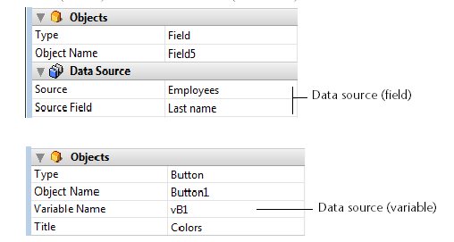

<!--REF #_command_.OBJECT SET DATA SOURCE.Syntax-->**OBJECT SET DATA SOURCE** ( {* ;} *object* ; *dataSource* )<!-- END REF-->
<!--REF #_command_.OBJECT SET DATA SOURCE.Params-->
| 引数 | 型 |  | 説明 |
| --- | --- | --- | --- |
| * | 演算子 | &#8594;  | 指定時: object はオブジェクト名(文字列)<br/>省略時: object は変数またはフィールド |
| object | any | &#8594;  | オブジェクト名( * 指定時)、<br/>または変数やフィールド( * 省略時) |
| dataSource | Pointer | &#8594;  | オブジェクトの新しいデータソースへのポインター |

<!-- END REF-->

*このコマンドはスレッドセーフではないため、プリエンプティブなコードには使えません。*


#### 説明 

<!--REF #_command_.OBJECT SET DATA SOURCE.Summary-->**OBJECT SET DATA SOURCE**コマンドは、引数 *object* と *\** で指定したオブジェクトのデータソースを変更します。<!-- END REF-->

任意の *\** 演算子を渡した場合、 *object* 引数でオブジェクト名を文字列で指定します。省略時には *object* 引数でフィールドまたは変数を指定します。

データソースとは、フォームを実行した際に、オブジェクトに表示される値を持っているフィールドまたは変数のことです。デザインモードでは、通常データソースはプロパティリスト内でソースとソースフィールド(フィールド)または変数名(変数)として定義されています: 



リストボックスを除き(後述)、フォーム内のすべてのデータソースはこのコマンドで変更することができます。データソースを変更することによって、アプリケーションの一貫性が損なわれないように気を付けてください。

リストボックスの場合は、以下の点に注意して下さい:

* データソースを変更する場合はリストボックスの型に注意する必要があります。たとえば、配列型のリストボックスの列のデータソースとして、フィールドを指定することはできない、ということです。
* セレクション型のリストボックスの場合、リストボックスオブジェクトそのもののデータソースを読み取ったり変更したりはできません。セレクション型のリストボックスの変数は、データソースではなくて内部参照として扱っているからです。
* このコマンドは主に配列型のリストボックスに対して使用されるものです。セレクション型のリストボックスに対しては、このコマンドの代わりに [LISTBOX SET COLUMN FORMULA](listbox-set-column-formula.md) コマンドを使用することができます。

変更不可能なデータソースに対してこのコマンドが使用された場合、何も起こりません。

#### 例題 

入力エリアに対してデータソースを変更する場合:

```4d
 var $ptrField : Pointer
 $ptrField:=Field(3;2)
 OBJECT SET DATA SOURCE(*;"Input";$ptrField)
```

#### 参照 

[LISTBOX SET COLUMN FORMULA](listbox-set-column-formula.md)  
[OBJECT Get data source](object-get-data-source.md)  