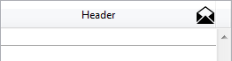

<!--REF #_command_.OBJECT SET FORMAT.Syntax-->**OBJECT SET FORMAT** ( {* ;} *object* ; *displayFormat* )<!-- END REF-->
<!--REF #_command_.OBJECT SET FORMAT.Params-->
| 引数 | 型 |  | 説明 |
| --- | --- | --- | --- |
| * | 演算子 | &#8594;  | 指定時, Objectはオブジェクト名 (文字列) 省略時, Objectはフィールドまたは変数 |
| object | any | &#8594;  | オブジェクト名 (* 指定時), または フィールドまたは変数 (* 省略時) |
| displayFormat | Text | &#8594;  | オブジェクトに設定する表示フォーマット |

<!-- END REF-->

*このコマンドはスレッドセーフではないため、プリエンプティブなコードには使えません。*


#### 説明 

<!--REF #_command_.OBJECT SET FORMAT.Summary-->**OBJECT SET FORMAT** は、*object*で指定したオブジェクトの表示フォーマットを*displayFormat*で渡したフォーマットに設定します。<!-- END REF-->新しいフォーマットは現在の表示にのみ有効です。フォームには保存されません。

オプションの *\** 引数を指定した場合、*object*はオブジェクト名です (文字列) 。オプションの \* 引数を省略すると、*object*はフィールドまたは変数です。この場合、文字列ではなくフィールドまたは変数参照 (フィールドまたは変数のみ) を指定します。オブジェクト名に関する詳細は*オブジェクトプロパティ* を参照してください。

**OBJECT SET FORMAT** は入力および出力フォーム (表示または印刷) 両方で使用でき、(入力可/不可) フィールドや変数に適用できます。

必然的に、オブジェクト内のデータ、またはオブジェクト自体のデータタイプに適応する表示フォーマットを使用しなければなりません。

詳細については、[例題データベース](https://download.4d.com/Demos/4D%5Fv15%5FR5/HDI%5FListBox%5FOBJECT%5FSET%5FFORMAT.zip) をダウンロードして参照してください。

##### ブール 

ブールフィールドをフォーマットするには以下の方法があります:

* (全バージョン) 一つの値を*displayFormat* 引数に渡す。この場合、フィールドはチェックボックスとして表示され、指定した値がラベルになります。
* (バイナリーデータベースのみ) セミコロン (*;*) で区切った二つの値を*displayFormat* 引数に渡す。この場合フィールドは2つのラジオボタンとして表示されます。

##### 日付 

日付フィールドや変数をフォーマットするには、Char(n)を*displayFormat*に渡します。このとき*n*は4Dにより提供される以下の定義済み定数のうちいずれかです: 

| 定数                          | 型    | 値   | コメント                                     |
| --------------------------- | ---- | --- | ---------------------------------------- |
| Blank if null date          | 倍長整数 | 100 | 0の代わりに""                                 |
| Date RFC 1123               | 倍長整数 | 10  | Fri, 10 Sep 2010 13:07:20 GMT            |
| Internal date abbreviated   | 倍長整数 | 6   | Dec 29, 2006                             |
| Internal date long          | 倍長整数 | 5   | December 29, 2006                        |
| Internal date short         | 倍長整数 | 7   | 2006/12/29                               |
| Internal date short special | 倍長整数 | 4   | 06/12/29 (しかし 1986/12/29 または 2096/12/29) |
| ISO Date                    | 倍長整数 | 8   | 2006-12-29T00:00:00                      |
| ISO Date GMT                | 倍長整数 | 9   | 2010-09-13T16:11:53Z                     |
| System date abbreviated     | 倍長整数 | 2   |                                          |
| System date long            | 倍長整数 | 3   |                                          |
| System date short           | 倍長整数 | 1   |                                          |

  
**Note:** Blank if null は他の定数に加算されなければなりません。この定数は日付がヌル値の時、00/00/00ではなく空のエリアとして表示するよう4Dに指示します。

##### ピクチャ 

ピクチャフィールドや変数をフォーマットするには、Char(n)を*displayFormat*に渡します。このとき*n*は4Dにより提供される以下の定義済み定数のうちいずれかです: 

| 定数                          | 型    | 値 |
| --------------------------- | ---- | - |
| On background               | 倍長整数 | 3 |
| Replicated                  | 倍長整数 | 7 |
| Scaled to fit               | 倍長整数 | 2 |
| Scaled to fit prop centered | 倍長整数 | 6 |
| Scaled to fit proportional  | 倍長整数 | 5 |
| Truncated centered          | 倍長整数 | 1 |
| Truncated non centered      | 倍長整数 | 4 |

##### 文字と数値 

文字や数値のフィールドや変数をフォーマットするには、*displayFormat* 引数に直接フォーマットラベルを渡します。 

表示フォーマットに関する詳細は4D Design Referenceマニュアルの*数値フォーマット*や*文字フォーマット*を参照してください。

**Note:** ツールボックスであらかじめ定義した表示フォーマットを*displayFormat*に使用するには、表示フォーマット名の前に縦棒(|)を挿入します。

##### ピクチャボタン 

ピクチャボタンをフォーマットするには、*displayFormat* 引数に以下のシンタックスを使用した文字列を渡します:  
*cols;lines;picture;flags{;ticks}*

* *cols* \= ピクチャの列数
* *lines* \= ピクチャの行数
* *picture* \= 使用するピクチャ (ピクチャライブラリ、ピクチャ変数、またはResources フォルダ内のファイル):  
   * ピクチャライブラリのピクチャを使用する場合、クエスチョンマークの後にその番号を指定します (例: "?250")。  
   * ピクチャ変数のピクチャを使用する場合、変数名を指定します。  
   * ピクチャがデータベースのResources フォルダ内のファイルに保存されているものである場合、"#{folder/}picturename" または "file:{folder/}picturename" という形式のパスを入力してください。
* *flags* \= ピクチャボタンの表示モードと処理。この引数には以下の値を指定できます: 0, 1, 2, 16, 32, 64, 128。これらの値はそれぞれ表示モードと処理モードを表します。これらの値は累計することができます。例えばモード1と64を有効にするには、65を*flags* 引数に渡します。それぞれの値の意味は以下のとおりです:  
   * *flags* \= 0 (オプションなし)  
   ユーザがピクチャをクリックすると、順番に次のピクチャを表示します。Shiftキーを押しながらクリックすると、前のピクチャを順に表示します。最後のピクチャに達すると、クリックしてもピクチャは変更されません。つまり最初のピクチャには戻りません。  
   * *flags* \= 1 (連続してスイッチ)  
   前のオプションと同様ですが、ユーザがマウスを押したままにするとピクチャは連続して (アニメーションのように) 変更されます。最後のピクチャに到達すると、そこでピクチャの変更は停止します。  
   * *flags* \= 2 (最初のフレームにループバック)  
   前のオプションと同様ですが、ピクチャが連続したループで表示される点が異なります。最後のピクチャに達っし、さらにクリックすると、最初のピクチャが表示されます。  
   * *flags* \= 16 (ロールオーバー時にスイッチ)  
   ピ クチャボタンのコンテンツは、マウスカーソルがボタンの上に来たときに変更されます。マウスがボタンエリアから離れると、最初のピクチャに戻ります。この モードはマルチメディアアプリケーションやHTMLドキュメントでしばしば使用されます。ロールオーバー時に表示されるピクチャはサムネールテーブルの最 後のピクチャです。ただし最後のフレームを無効として使用オプション (128) を使用した場合は、最後の前のフレームがロールオーバー時に使用されます。  
   * *flags* \= 32 (リリース後に元に戻す)  
   このモードは2つのピクチャで動作します。これはユーザがクリックしたときを除き、常に最初のピクチャを表示します。この場合2番目のピクチャがマウスク リックの間表示され、マウスがリリースされると一番目のピクチャに戻ります。このモードを使用すれば、アイドルとクリック状態を表示するアクションボタン を作成できます。このモードを3D効果を作成したり、アクションを表現するピクチャを表示するために使用できます。  
   * *flags* \= 64 (透過)  
   バックグランドピクチャを透過させるために使用します。  
   * *flags* \= 128 (最後のフレームを無効として使用)  
   このモードは、最後のサムネールフレームをボタンが無効時に表示させるために使用します。このモードが選択されているとき、4Dは最後のサムネールを、ボタ ンが無効にされているときに表示します。このモードが、モード0, 1 および 2とともに使用されていると、最後のサムネールは一連の表示には組み込まれません。子のサムネールはボタンが無効のときにのみ表示されます。
* *ticks* \= “n チック毎に表示”モードを有効にし、それぞれのピクチャを表示する間隔を設定します。このオプション引数が渡されると、指定された速度でピクチャボタンの コンテンツが繰り返し表示されます。例えば"2;3;?16807;0;10"と指定すると、ピクチャボタンは10tickごとに異なるピクチャを表示し ます。このモードが有効の時は透過モード (64) のみが使用できます。

##### ピクチャポップアップメニュー 

ピクチャポップアップメニューをフォーマットするには、*displayFormat* 引数に以下のシンタックスを使用した文字列を渡します:  
*cols;lines;picture;hMargin;vMargin;flags*  

* *cols* \= ピクチャの列数
* *lines* \= ピクチャの行数
* *picture* \= 使用するピクチャ (ピクチャライブラリ、ピクチャ変数):  
   * ピクチャライブラリのピクチャを使用する場合、クエスチョンマークの後にその番号を指定します (例: "?250")。  
   * ピクチャ変数ののピクチャを使用する場合、変数名を指定します。
* *hMargin* \= メニューの水平境界とピクチャの間のマージン (ピクセル)
* *vMargin* \= メニューの垂直境界とピクチャの間のマージン (ピクセル)
* *flags* \= ピクチャポップアップメニューの透過モード (0 または 64):  
   * *mode* \= 0: ピクチャポップアップメニューは透過でない  
   * *mode* \= 64: ピクチャポップアップメニューは透過

##### サーモメーターおよびルーラー 

サーモメータやルーラーをフォーマットするには、*displayFormat* 引数に以下のシンタックスを使用した文字列を渡します:  
*min;max;unit;step;flags{;format{;display}}*  

* *min* \= インジケータの最初の目盛り値
* *max* \= インジケータの最後の目盛り値
* *unit* \= インジケータの目盛りの間隔
* *step* \= インジケータ中でカーソル移動の最小間隔
* *flags* \= インジケータの表示モードと動作。この引数は0, 2, 3, 16, 32, 128を受け入れます。これらの値は128を除き、加算して複数のオプションを設定できます:  
   * *flags* \= 0: 単位を表示しない  
   * *flags* \= 2: インジケータの右または下に単位を表示  
   * *flags* \= 3: インジケータの左または上に単位を表示  
   * *flags* \= 16: 単位に隣接して目盛りを表示  
   * *flags* \= 32: ユーザがインジケータを調整している間、On Data Changeを実行する。この値が使用されない場合、On Data Changeはユーザがインジケータの調整を終了したときにのみ発生します。  
   * *flags* \= 128: "バーバーショップ" (連続したアニメーション) モードを有効にします。この値をほかの値と一緒に使用することはできません。このモードでは、他の引数は無視されます (*display*引数が渡された場合を除く)。このモードに関する詳細は、 *Design Reference*マニュアルを参照してください。
* *format* \= インジケータの目盛りの表示フォーマット  
インジケータオブジェクトのサイズが小さいため単位やメモリが正しく表示できない場合、それらは隠されます。
* *display* \= 特別な表示オプション。サーモメーターの場合、この引数は*flags*サブ引数が128のときにのみ考慮されます。  
   * *display* \= 0 (または省略時): 標準のルーラを表示 / "バーバーショップ"タイプの連続したアニメーションを表示。  
   * *display* \= 1 : ルーラーの"ステッパー"モードを有効にする / サーモメーターの"非同期進捗"モードを有効にする。これらのオプションに関する詳細は*Design Reference*マニュアルを参照してください。

##### ダイアル 

ダイアルをフォーマットするには、*displayFormat* 引数に以下のシンタックスを使用した文字列を渡します:  
*min;max;unit;step{;flags}*  

* *min* \= インジケータの最初の目盛り値
* *max* \= インジケータの最後の目盛り値
* *unit* \= インジケータの目盛りの間隔
* *step* \= インジケータ中でカーソル移動の最小間隔
* *flags* \= ダイアルの処理モード (オプション)。この引数は32鑿を受け入れます: ユーザがインジケータを調整している間、On Data Changeを実行する。この値が使用されない場合、On Data Changeはユーザがインジケータの調整を終了したときにのみ発生します。

##### ボタングリッド 

ボタングリッドをフォーマットするには、*displayFormat* 引数に以下のシンタックスを使用した文字列を渡します:  
*cols;lines*

* *cols* \= グリッドの列数
* *lines* \= グリッドの行数

**Note:** フォームオブジェクトの表示フォーマットに関する詳細は、4D Design Referenceマニュアルを参照してください。

##### 3D buttons 

  
3Dボタンをフォーマットするには、*displayFormat* 引数に以下のシンタックスを使用した文字列を渡します:  
*title;picture;background;titlePos;titleVisible;iconVisible;style;horMargin;vertMargin;* *iconOffset;popupMenu* *;* *hyperlink;numStates;imageHugsTitle*

* *title* \= ボタンタイトル。この値はテキストまたはリソース番号 (例: “:16800,1”) で指定できます。
* *picture* \= ボタンにリンクするピクチャ。ピクチャライブラリ、ピクチャ変数、またはResourcesフォルダのピクチャを使用できます:  
   * ピクチャライブラリのピクチャを使用する場合、クエスチョンマークの後にその番号を指定します (例: "?250")。  
   * ピクチャ変数ののピクチャを使用する場合、変数名を指定します。  
   * データベースのResourcesフォルダのピクチャを使用する場合、"#{folder/}picturename" または "file:{folder/}picturename"タイプのURLを指定します。
* *background* \= ボタンにリンクするバックグランドピクチャ (カスタムスタイル)。ピクチャライブラリ、ピクチャ変数、PICTリソース、Resourcesフォルダのファイル (上記参照) を使用できます。
* *titlePos* \= ボタンタイトルの位置:  
   * *titlePos* \= 1: 左  
   * *titlePos* \= 2: 上  
   * *titlePos* \= 3: 右  
   * *titlePos* \= 4: 下  
   * *titlePos* \= 5: 中央
* *titleVisible* \= タイトルの表示/非表示:  
   * *titleVisible* \= 0: タイトルを非表示  
   * *titleVisible* \= 1: タイトルを表示
* *iconVisible* \= アイコンの表示/非表示:  
   * *iconVisible* \= 0 : アイコンを非表示  
   * *iconVisible* \= 1 : アイコンを表示
* *style* \= ボタンスタイル。このオプションで指定したスタイルにより、バックグランドなど他のオプションが有効になるかどうかが決まります。以下の値が使用できます:  
   * *style* \= 0: なし  
   * *style* \= 1: バックグランドオフセット  
   * *style* \= 2: プッシュボタン  
   * *style* \= 3: ツールバーボタン  
   * *style* \= 4: カスタム  
   * *style* \= 5: サークル  
   * *style* \= 6: システムスクエア (小)  
   * *style* \= 7: Office XP  
   * *style* \= 8: べベル  
   * *style* \= 9: 角の丸いべベル  
   * *style* \= 10: 折り畳む/展開  
   * *style* \= 11: ヘルプ  
   * *style* \= 12: OS X テクスチャー  
   * *style* \= 13: OS X グラデーション
* *horMargin* \= 水平マージン。ボタン内部の左右マージン (アイコンやテキストが描画されないエリア) をピクセル単位で指定します。
* *vertMargin* \= 垂直マージン。ボタン内部の上下マージン (アイコンやテキストが描画されないエリア) をピクセル単位で指定します。
* *iconOffset* \= 右および下方向へのアイコンのシフト。ピクセル単位で指定されるこの値は、ボタンがクリックされた際のボタンアイコンの右下方向へのシフトを指定します (同じ値が両方向に使用されます)。
* *popupMenu* \= ボタンへのポップアップメニューの関連付け:  
   * *popupMenu* \= 0: ポップアップメニューなし  
   * *popupMenu* \= 1: リンクしたポップアップメニュー  
   * *popupMenu* \= 2: 分離したポップアップメニュー
* *hyperlink* \= タイトルはマウスオーバー時にハイパーリンクである事を強調するために下線が付けられます(廃止予定の機構)。二つの値が使用可能です:  
   * *hyperlink* \= 0: タイトルはマウスオーバー時でも下線がつかない  
   * *hyperlink* \= 1: タイトルはマウスオーバー時に下線がつく
* *numStates* \= 3Dボタンのアイコンとして使用しているピクチャー内に存在する状態の数。この数字はまた、標準のボタンの状態を表示するために4Dによって使用されます。
* *imageHugsTitle* \= アイコンとタイトルが分離するか隣接するかを設定します。2つの値を取り得ます:  
   * *imageHugsTitle* \= 0 : アイコンとタイトルは互いに離れて表示されます。  
   * *imageHugsTitle* \= 1 : アイコンとタイトルは隣あって表示されます。

いくつかのオプションは、すべての3Dボタンで有効というわけではありません。また特定のオプションを設定したくない場合もあるでしょう。あるオプションを渡さないようにするには、対応する値を省略します。例えば*titleVisible*と*vertMargin*オプションを省略するには、以下のように書きます:

```4d
 OBJECT SET FORMAT(myVar;"NiceButton;?256;:562;1;;1;4;5;;5;0;;2")
```

##### リストボックスヘッダー 

リストボックス内でのアイコンをフォーマットする場合、以下のシンタックスに従う文字列を*displayFormat*引数に渡します:  
*picture;iconPos*

* *picture* \= ヘッダーのピクチャー。ピクチャーライブラリー、ピクチャー変数、ピクチャーファイルから取得可能:  
   * ピクチャーライブラリーから取得する場合、"?"に続けてその番号を入力します(例: "?250")。  
   * ピクチャー変数から取得する場合、その変数名を入力します。  
   * データベースのResourcesフォルダーから取得する場合、そのURLを"#{folder/}picturename" あるいは "file:{folder/}picturename"という形式で入力します。
* *iconPos* \= ヘッダー内でのアイコンの位置。二つの値がサポートされます:  
   * *iconPos* \= 1: 左  
   * *iconPos* \= 2: 右

この機能は例えば、カスタマイズされた並び替えアイコンを使用したい場合などに有効です。

#### 例題 1 

以下のコードは\[Employee\]DateHired フィールドをInternal date longにフォーマットします。  
  
```4d
 OBJECT SET FORMAT([Employee]DateHired;Char(Internal date long))
```

#### 例題 2 

This example formats a date variable and a time variable using [customized formats](https://developer.4d.com/docs/Project/date-time-formats.md): 

```4d
 OBJECT SET FORMAT(*;"mydate";"(yyyy) MMM dd") // (2023) Dec 12
 OBJECT SET FORMAT(*;"mytime";"hh'h' mm'mn' ss'sec.'") // 15h 12mn 17sec.
```

#### 例題 3 

  
以下のコードは *\[Company\]ZIP Code* フィールドのフォーマットを、フィールドデータ長に基づいて変更します: 

```4d
 If(Length([Company]ZIP Code)=9)
    OBJECT SET FORMAT([Company]ZIP Code;"#####-####")
 Else
    OBJECT SET FORMAT([Company]ZIP Code;"#####")
 End if
```

#### 例題 4 

以下のコードは *\[Stats\]Results* フィールド値を、値の正負およびゼロであるかに応じてフォーマットします:

```4d
 OBJECT SET FORMAT([Stats]Results;"### ##0.00;(### ##0.00);")
```

#### 例題 5 

  
以下のコードはブールフィールドのフォーマットを変更して、Married または Unmarriedが表示されるようにします: 

```4d
 OBJECT SET FORMAT([Employee]Marital Status;"Married;Unmarried")
```

#### 例題 6 

データベースのResourcesフォルダーに"envelope\_open.png"という名前のピクチャーファイルを保存してあった場合、以下のように書く事ができます:

```4d
 vIcon:="#envelope_open.png"
 vPos:="2" // 位置は右
 OBJECT SET FORMAT(*;"Header1";vIcon+";"+vPos)
```



#### 例題 7 

以下のコードはブールフィールドのフォーマットを変更して、"Classified"というラベルのチェックボックスが表示されるようにします: 

```4d
 SET FORMAT([Folder]Classification;"Classified")
```

#### 例題 8 

1行4列のサムネイルがあります。このサムネイルをピクチャボタンに使用します (“デフォルト”, “クリック”, “ロールローバー” そして “無効時”)。ロールオーバー時にスイッチとリリース後に元に戻す、そして最後のフレームを無効として使用オプションを有効にします: 

```4d
 OBJECT SET FORMAT(*;"Picture Button";"4;1;?15000;176")
```

#### 例題 9 

サーモメータをバーバーショップモードにします: 

```4d
 OBJECT SET FORMAT($Mythermo;";;;;128")
 $Mythermo:=1 //Start animation
```

#### 参照 

  
[GET SYSTEM FORMAT](get-system-format.md)  
[OBJECT Get format](object-get-format.md)  
[OBJECT SET FILTER](object-set-filter.md)  