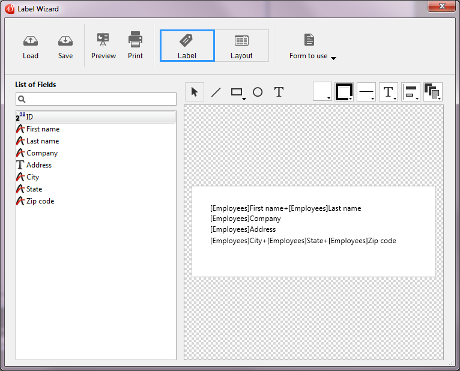

<!--REF #_command_.PRINT LABEL.Syntax-->**PRINT LABEL** ( {*aTable* }{;}{ *document* {; * | >}} )<!-- END REF-->
<!--REF #_command_.PRINT LABEL.Params-->
| 引数 | 型 |  | 説明 |
| --- | --- | --- | --- |
| aTable | Table | &#8594;  | 印刷するテーブル, または 省略した場合、デフォルトテーブル |
| document | Text | &#8594;  | ディスクに保存したラベルドキュメント名 |
| * &#124; > | &#8594;  | *: 印刷ダイアログを省略, または >:  印刷設定の再初期化をしない |

<!-- END REF-->

#### 説明 

<!--REF #_command_.PRINT LABEL.Summary-->**PRINT LABEL** は、*aTable*のセレクションのデータを使用してラベルを印刷します。<!-- END REF-->

*document* パラメーターを指定しない場合、**PRINT LABEL** はカレント出力フォームを使用して、*aTable*のカレントセレクションをラベル印刷します。サブフォームの印刷にこのコマンドを使用することはできません。ラベルのフォーム作成に関する詳細は *4D Design Reference* マニュアルを参照してください。

*document* を指定すると、**PRINT LABEL** コマンドは、ラベルウィザード（下図）を表示するか、またはディスクに保存された既存のラベルドキュメントを印刷します。以下の説明を参照してください。



デフォルトで、**PRINT LABEL** は印刷の前にプリントジョブダイアログボックスを表示します。 ユーザーが印刷ダイアログボックスを取消すと、コマンドはキャンセルされラベルは印刷されません。  
オプションの *\** または *\>* 引数を使用することで、印刷ダイアログボックスを抑制することが出来ます:

* *\** 引数は、現在の印刷設定 に従い、印刷処理を行います。
* *\>* 引数は上記に加え、現在の印刷設定を再初期化することなく印刷を行います。この設定は、以前に設定した内容を継続し、(例えばループ中で) 連続した**PRINT LABEL** コマンドを使用する時に役立ちます。この引数の使用例は [PRINT RECORD](print-record.md) コマンドの例を参照してください。

これらの引数はラベルウィザード使用時には効果を持たないことに注意してください。

ラベルウィザードを使用しない場合、ラベルがすべてプリントされるとシステム変数OKに1が代入されます。それ以外の場合には0が代入されます (印刷ダイアログボックスでキャンセルがクリックされた場合等)。

*document* 引数を指定すると、ラベルは*document*に定義されたラベル設定情報に従って印刷されます。*document* に空の文字列 ("") を指定すると、**PRINT LABEL** はファイルを開くダイアログボックスが表示し、ユーザーはラベル設定として使用するファイルを指定することができます。*document*に存在しないドキュメント名を指定すると (例えば*char(1)*を*document*に渡す) 、ラベルウィザードが表示され、ユーザーはラベル設定を定義することができます。

**Note:** デザインモードで、*table*が非表示に設定されている場合、ラベルウィザードは表示されません。

**4D Server:** このコマンドは、ストアドプロシージャー内にて4D Server上で実行することができます。この状況では、次の制約があります:

* サーバーマシン上ではダイアログボックスを一切表示しないでください (特定の必要性がある場合を除く)。そのためにはこのコマンドを *\** または *\>* 引数付きで呼び出さなければなりません。
* ラベルエディターが表示されるシンタックスは4D Serverでは動作しません。この場合システム変数OKは0に設定されます。
* プリンター関連の問題が発生しても (用紙切れ、プリンター接続切断等) 、エラーメッセージは生成されません。

#### 例題 1 

以下の例は、テーブルの出力フォームを使用してラベルを印刷します。この例では2つのメソッドを使用します。最初のプロジェクトメソッドは正しい出力フォームを設定し、ラベルを印刷します: 

```4d
 ALL RECORDS([Addresses]) // 全レコードを選択
 FORM SET OUTPUT([Addresses];"Label Out") // 出力フォームを選択
 PRINT LABEL([Addresses]) // ラベルを印刷
 FORM SET OUTPUT([Addresses];"Output") // デフォルトの出力フォームに戻す
```

2つ目のメソッドはフォーム“**Label Out**”のフォームメソッドです。このフォームは、各フィールドの内容を連結した結果を格納するための1つの変数*vLabel*を含みます。フィールドAddr2が空の場合、メソッドにより取り除かれます。ラベルウィザードを使用しても、この処理が自動的に実行される点に注意してください。フォームメソッドは、各レコードに対して1つずつラベルを作成します:

```4d
  // [Addresses]; "Label Out" フォームメソッド
 Case of
    :(Form event code=On Load) //v17 以前ではForm event を使用すること
       vLabel:=[Addresses]Name1+" "+[Addresses]Name2+Char(13)+[Addresses]Addr1+Char(13)
       If([Addresses]Addr2 #"")
          vLabel:=vLabel+[Addresses]Addr2+Char(13)
       End if
       vLabel:=vLabel+[Addresses]City+", "+[Addresses]State+" "+[Addresses]ZipCode
 End case
```

#### 例題 2 

以下の例では、ユーザが\[People\]テーブルを検索し、自動で“My Labels”ラベルを印刷します:

```4d
 QUERY([People])
 If(OK=1)
    PRINT LABEL([People];"My Labels";*)
 End if
```

#### 例題 3 

以下の例では、ユーザが\[People\]テーブルを検索し、印刷するラベルを選択します:

```4d
 QUERY([People])
 If(OK=1)
    PRINT LABEL([People];"")
 End if
```

#### 例題 4 

以下の例では、ユーザが\[People\]テーブルを検索し、ラベルウィザードを表示して任意のラベルの設計、保存、ロード、印刷を行います:

```4d
 QUERY([People])
 If(OK=1)
    PRINT LABEL([People];Char(1))
 End if
```

#### 参照 

[PRINT SELECTION](print-selection.md)  
[QR REPORT](qr-report.md)  

#### プロパティ

|  |  |
| --- | --- |
| コマンド番号 | 39 |
| スレッドセーフである | &cross; |
| システム変数を更新する | OK |


