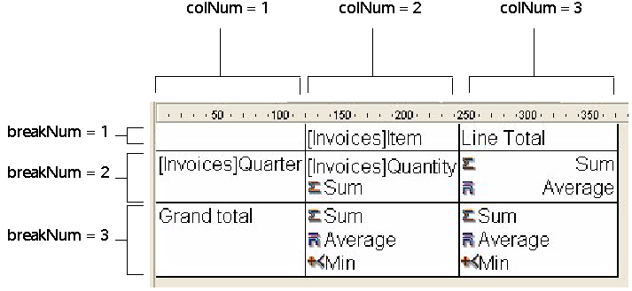

<!--REF #_command_.QR GET TOTALS DATA.Syntax-->**QR GET TOTALS DATA** ( *area* ; *colNum* ; *breakNum* ; *operator* ; *text* )<!-- END REF-->
<!--REF #_command_.QR GET TOTALS DATA.Params-->
| 引数 | 型 |  | 説明 |
| --- | --- | --- | --- |
| area | Integer | &#8594;  | エリア参照 |
| colNum | Integer | &#8594;  | カラム番号 |
| breakNum | Integer | &#8594;  | ブレーク番号 |
| operator | Integer | &#8592; | セルの演算名 |
| text | Text | &#8592; | セルの内容 |

<!-- END REF-->

#### 説明 

<!--REF #_command_.QR GET TOTALS DATA.Summary-->##### リストモード 

QR GET TOTALS DATA コマンドを使用し、指定するブレークに関する詳細を取得できます。<!-- END REF--> 

*area*にはクイックレポートエリアの参照を渡します。

*colNum*にはデータを取得するカラムの番号を渡します。

*breakNum*には、データを取得するブレーク番号 (小計または総計) を渡します。  
\- 小計：1から小計/ソート項目数までの数字  
\- 総計：-3または定数*qr grand total* (テーマ)

*operator*には、セル内に存在するすべての演算子の和が返されます。テーマの定数を使用して値を処理できます:

| 定数                    | 型    | 値  |
| --------------------- | ---- | -- |
| qr average            | 倍長整数 | 2  |
| qr count              | 倍長整数 | 16 |
| qr max                | 倍長整数 | 8  |
| qr min                | 倍長整数 | 4  |
| qr standard deviation | 倍長整数 | 32 |
| qr sum                | 倍長整数 | 1  |

  
返された値が0の場合、演算子は存在しません。

*text*にはセル内のテキストが返されます。

**Note:** *operator*と*text*は相互に排他的な引数です、したがって*operator*または*text*のいずれか一方にしか結果が返されません。

##### クロステーブルモード 

QR GET TOTALS DATA コマンドを使用し、指定したセルの詳細を取得できます。 

*area*にはクイックレポートエリアの参照を渡します。

*colNum*には、データを取得するセルのカラム番号を渡します。

*breakNum*には、データを取得するセルの行番号を渡します。

*operator*には、セル内に存在するすべての演算子の和が返されます。テーマの定数を使用し、返された値を処理することができます (上記参照)。

*text*にはセル内のテキストが返されます。

次の図は、クロステーブルモードでの*colNum*と*breakNum*の組み合わせ方について示しています:

  
無効な*area*番号を渡した場合、エラー番号-9850が生成されます。  
無効な*colNum*引数を渡した場合、エラー番号-9852が生成されます。  
無効な*breakNum*引数を渡した場合、エラー番号-9853が生成されます。

#### 参照 

[QR SET TOTALS DATA](qr-set-totals-data.md)  

#### プロパティ

|  |  |
| --- | --- |
| コマンド番号 | 768 |
| スレッドセーフである | &cross; |
| システム変数を更新する | error |

