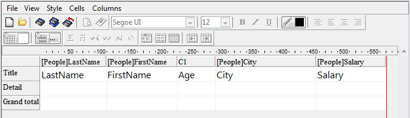

<!--REF #_command_.QR MOVE COLUMN.Syntax-->**QR MOVE COLUMN** ( *area* ; *column* ; *newPos* )<!-- END REF-->
<!--REF #_command_.QR MOVE COLUMN.Params-->
| 引数 | 型 |  | 説明 |
| --- | --- | --- | --- |
| area | Integer | &#8594;  | Reference of the area |
| column | Integer | &#8594;  | Column number |
| newPos | Integer | &#8594;  | New position for column |

<!-- END REF-->

#### 説明 

<!--REF #_command_.QR MOVE COLUMN.Summary-->**QR MOVE COLUMN**コマンドは、*column* 変数の位置にあるカラムを*newPos* 変数で指定した位置へと移動させます。<!-- END REF-->

*column* と*newPos* 変数はどちらも有効なカラム位置(1とレポート内にあるカラムの総数の間の数)でなければなりません。そうでない場合にはエラー-9852が返されます。

**注:** このコマンドはリスト型のレポートに対してのみ使用できます。

#### 例題 

以下のようなレポートをデザインした場合を考えます:



以下のコードを実行した場合:

```4d
 QR MOVE COLUMN(area;3;4)
```

結果は以下のようになります:


#### プロパティ

|  |  |
| --- | --- |
| コマンド番号 | 1325 |
| スレッドセーフである | &cross; |


