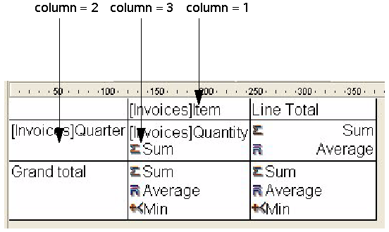

<!--REF #_command_.QR SET INFO COLUMN.Syntax-->**QR SET INFO COLUMN** ( *area* ; *colNum* ; *title* ; *object* ; *hide* ; *size* ; *repeatedValue* ; *displayFormat* )<!-- END REF-->
<!--REF #_command_.QR SET INFO COLUMN.Params-->
| 引数 | 型 |  | 説明 |
| --- | --- | --- | --- |
| area | Integer | &#8594;  | エリア参照 |
| colNum | Integer | &#8594;  | カラム番号 |
| title | Text | &#8594;  | カラムタイトル |
| object | Field, Variable | &#8594;  | カラムに割り当てられたオブジェクト |
| hide | Integer | &#8594;  | 0 = 表示, 1 = 非表示 |
| size | Integer | &#8594;  | カラムサイズ |
| repeatedValue | Integer | &#8594;  | 0 = 繰り返ししない, 1 = 繰り返す |
| displayFormat | Text | &#8594;  | データの表示フォーマット |

<!-- END REF-->

#### 説明 

<!--REF #_command_.QR SET INFO COLUMN.Summary-->##### リストモード 

QR SET INFO COLUMN コマンドを使用して、既存のカラムに関するパラメタを設定できます。<!-- END REF-->

*area*には、クイックレポートエリアの参照を指定します。

*colNum*には、修正するカラムの番号を指定します。

*title*には、カラムのヘッダに表示されるタイトルを指定します。

*object*には、そのカラムの実際のオブジェクト (変数、フィールド、またはフォーミュラ) を指定します。

*hide*には、カラムを表示するか、あるいは非表示にするかを指定します。

* 1を指定すると、カラムは非表示に設定されます。
* 0を指定すると、カラムは表示に設定されます。

*size*には、カラムに割り当てるサイズをピクセル単位で指定します。-1はカラムのサイズを自動設定にします。

*repeatedValue*には、同一値印刷の有無を指定します。これは、フィールドまたは変数の値が連続するレコード間で同一値であった場合、同じ値を印刷するか、しないかを表します。

* *repeatedValue*が0の場合、同一値は印刷されません。
* *repeatedValue*が1の場合、常に印刷します。

*displayFormat*には、表示フォーマットを指定します。この表示フォーマットは、表示されるデータに対応した4Dフォーマットです。

次のコードは、カラム番号1のタイトルとしてTitleをセットし、カラムの内容としてField2をセットし、幅150ピクセルでカラムを表示してフォーマットを###.##に設定します。

```4d
 QR SET INFO COLUMN(area;1;"Title";"[Table1]Field2";0;150;0;"###,##")
```
  
  
##### クロステーブルモード 

QR SET INFO COLUMN コマンドを使用して同様のパラメタを設定できますが、設定しようとするパラメタにより、適用するエリアの参照が異なります。  
第一に、このコマンドをクロステーブルモードで用いた場合、引数*title*、*hide*、*repeatedValue*は使用されません。設定したい値がカラムサイズ、データソース、表示フォーマットのいずれであるかによって、*colNum*に使用する値が変わります。 

* カラムサイズ  
これは“視覚的”な属性であり、下図のようにカラムは左から右へと番号が付けられています。


次のコードは、クロステーブルレポートのすべてのカラムに対してサイズを自動に設定し、その他の要素は以前のまま変更しません:

```4d
 For($i;1;3)
    QR GET INFO COLUMN(qr_area;$i;$title;$obj;$hide;$size;$rep;$format)
    QR SET INFO COLUMN(qr_area;$i;$title;$obj;$hide;0;$rep;$format)
 End for
```

カラムサイズだけを変更したいため、[QR GET INFO COLUMN](qr-get-info-column.md "QR GET INFO COLUMN")を使用してカラムのプロパティを取得し、それをQR SET INFO COLUMNに渡してカラムサイズ以外の項目は変更していません。

* データソース (オブジェクト) と表示フォーマット  
この場合、カラム番号は次の図のように作用します:



QR SET INFO COLUMNコマンドを使用しても、すべてのセルに対応できないことにお気付きでしょう。上図の中で番号が付けられていないセルに関しては、[QR SET TOTALS DATA](qr-set-totals-data.md "QR SET TOTALS DATA")コマンドを用いて対処します。

次のコードは、基本的なクロステーブルレポートの作成に必要となる3つのセルに対し、データソースを割り当てます:

```4d
 QR SET REPORT TABLE(qr_area;Table(->[Invoices]))
 ALL RECORDS([Invoices])
 QR SET REPORT KIND(qr_area;2)
 QR SET INFO COLUMN(qr_area;1;"";->[Invoices]Item;1;-1;1;"")
 QR SET INFO COLUMN(qr_area;2;"";->[Invoices]Quarter;1;-1;1;"")
 QR SET INFO COLUMN(qr_area;3;"";->[Invoices]Quantity;1;-1;1;"")
```

この結果、レポートエリアは次のようになります:


  
無効な*area*番号を渡した場合、エラー番号-9850が生成されます。  
無効な*colNum*引数を渡した場合、エラー番号-9852が生成されます。

#### 参照 

[QR GET INFO COLUMN](qr-get-info-column.md)  
[QR Get info row](qr-get-info-row.md)  
[QR SET INFO ROW](qr-set-info-row.md)  

#### プロパティ
|  |  |
| --- | --- |
| コマンド番号 | 765 |
| スレッドセーフである | &check; |
| システム変数を更新する | error |
| サーバー上での使用は不可 ||


