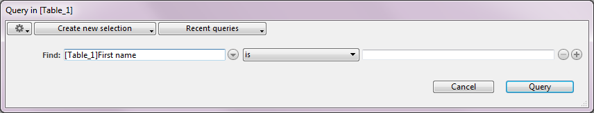

<!--REF #_command_.QUERY.Syntax-->**QUERY** ( {*aTable* }{;}{ *queryArgument* {; *}} )<!-- END REF-->
<!--REF #_command_.QUERY.Params-->
| 引数 | 型 |  | 説明 |
| --- | --- | --- | --- |
| aTable | Table | &#8594;  | レコードのセレクションを求めるテーブル, または 省略した場合、デフォルトテーブル |
| queryArgument | Expression | &#8594;  | 検索条件 |
| * | 演算子 | &#8594;  | 検索継続フラグ |

<!-- END REF-->

#### 説明 

<!--REF #_command_.QUERY.Summary-->**QUERY** は、*aTable*に対して*queryArgument*に指定した条件に一致するレコードを検索し、検索結果をセレクションとして返します。<!-- END REF-->**QUERY**は、カレントプロセスの*aTable*のカレントセレクションを変更し、セレクションの先頭のレコ－ドをカレントレコ－ドにします。 

*aTable*引数を省略した場合、コマンドはデフォルトテーブルに対して適用されます。デフォルトテーブルが設定されていない場合には、エラーが発生します。

*queryArgument*または *\** を指定しない場合、**QUERY**は*aTable* 用のクエリエディタを表示します (複数クエリの最後の行である場合を除く、例題 2参照):



クエリエディタについての詳細は4D Design Referenceマニュアルを参照してください。

ユーザはクエリを作成し、クエリボタンをクリックするか、絞り込みクエリボタンをクリックして検索を実行します。検索が中断されずに実行された場合、システム変数OKには1が代入されます。ユーザが「キャンセル」をクリックするか、**QUERY**コマンドが中断されて実際には検索が行われなかった場合には、システム変数OKに0が代入されます。

#### 例題 1 

以下の例は、\[Products\]テーブルに対するクエリエディタを表示します:

```4d
 QUERY([Products])
```

#### 例題 2 

以下の例は、デフォルトテーブル (設定されている場合) に対するクエリエディタを表示します:

```4d
 QUERY
```

*queryArgument*引数を指定すると、標準のクエリエディタは表示されず、クエリはプログラムから定義されます。単一クエリの場合 (1つのフィールドだけを検索)、*queryArgument*をもとにQUERYコマンドを1回コールします。複合検索の場合 (複数フィールドに対する検索、または複合条件による検索)、*queryArgument*を用いて必要な回数だけQUERYコマンドをコールします。そして、最後のQUERYコマンドのコール以外のQUERYコマンドに対してオプション引数 \* を指定します。\* を含まない最後のコールの後、実際の検索処理が実行されます。引数*queryArgument*については、この節で更に詳しく説明します。

#### 例題 3 

以下の例は、\[People\]テーブルの名前が“a”で始まる人のレコードを検索します:

```4d
 QUERY([People];[People]Last name="a@")
```

#### 例題 4 

以下の例は、\[People\]テーブルの名字フィールドが“a”または“b”で始まる人のレコードを検索します:

```4d
 QUERY([People];[People]Name="a@";*) // * は追加の検索条件があることを示します
 QUERY([People];|;[People]Name="b@") // * を指定しないことでクエリ条件のスタックが終了したことを示します
```

**注:** @ 文字の解釈ルールは環境設定で変更できます。詳細は*比較演算子*を参照してください。

#### 検索条件の指定 

*queryArgument* 引数には以下のシンタックスを指定できます:

*{ 論理演算子 ; } フィールド 比較演算子 値*

 論理演算子は**QUERY**呼び出しを結合するために使用します。使用できる論理演算子はクエリエディタで使用できるものと同じです:  

| **論理演算子** | QUERYで使用する記号 |
| --------- | ------------ |
| AND       | &            |
| OR        | \|           |
| Except    | #            |

*論理演算子*はオプションで、複合検索の最初の**QUERY**コマンドおよび**QUERY**コマンドが1つしかない場合には使用されません。複合検索クエリで論理演算子を省略した場合、デフォルトで**AND** (&) が使用されます。

*field*は検索対象となるフィールドです。*aTable*が1テーブルへの自動リレートまたはマニュアルリレートを持つ場合、*field*はリレート先の1テーブルのフィールドも使用可能です。  
  
*比較演算子*は*フィールド*と*値*とを比較するために使用します。*比較演算子*を次に示します:  

| **比較演算子** | QUERYで使用する記号 |
| --------- | ------------ |
| 等しい       | \=           |
| 等しくない     | #            |
| より少ない     | <            |
| より多い      | \>           |
| 以下        | <=           |
| 以上        | \>=          |
| キーワードを含む  | %            |

**Note:** 比較演算子を記号ではなく文字式でも指定できます。この場合、クエリ文字列の項目を区切るためにセミコロンを使用しなければなりません。この方法を使用すれば、例えばカスタムクエリのユーザインタフェースを作成することができます。例題 21を参照してください。

*値*は*フィールド*と比較するためのデータです。*値*は、評価結果が*フィールド*と同じデータタイプである式です。*値*は検索の初めに一度だけ評価されます。各レコードに対して評価されるわけではありません。文字列中に特定の文字列を含んでいるかどうかを検索する場合 (包含検索) には、*値*にワイルドカード記号 (@) を使用することができます。

キーワードによる検索は文字やテキスト型のフィールドに対してのみ可能です。このタイプのクエリに関する詳細は*比較演算子*を参照してください。

複合条件検索を実行するための規則を次に示します:

* 最初の**QUERY**は論理演算子を含んではいけません。
* 最初以外の**QUERY**は論理演算子から始めることができます。論理演算子を省略した場合、デフォルトでAND (&) が使用されます。
* 最後の**QUERY**以外は引数 \* を指定しなければいけません。
* 複合検索を実行するためには、最後の**QUERY**で引数 \* を指定してはいけません。代りに最後の**QUERY**で、テーブル以外に引数のない**QUERY**コマンドを実行することができます (クエリエディタは表示されず、前の行までに定義した複合検索が実行されます)。

**注:** 作成したカレントクエリは各テーブル毎に管理されます。つまり各テーブルに1つの複合検索を同時に作成できます。*aTable*引数を指定するかデフォルトテーブルを指定することで、検索対象テーブルを明確に特定する必要があります。

検索の定義方法に関係なく、以下の処理が行われます:

* 実際の検索処理に時間がかかる場合、4Dは自動的にサーモメータで進捗状況のメッセージを表示します。[MESSAGES ON](messages-on.md)コマンドと[MESSAGES OFF](messages-off.md)コマンドを使用して、メッセージを表示または非表示にすることができます。進捗サーモメータが表示された場合、ユーザは中止ボタンをクリックして検索を中断することができます。検索が正常に終了すると、システム変数OKには1がセットされ、それ以外の場合には0がセットされます。
* インデックスフィールドが指定された場合、検索処理は毎回最適化され (最初にインデックスフィールドが検索される)、検索は最小の時間で終了します。コマンドは**AND** (&) を使用するクエリでは、複合インデックスを使用できます。

#### 例題 5 

以下の例は、Smithという名の人のレコードをすべて検索します:

```4d
 QUERY([People];[People]Last Name="Smith")
```

**Note:** Last Nameのフィールドにインデックスが設定されている場合、QUERYコマンドは高速な検索のために、自動的にインデックスを使用します。

**Reminder:** この検索では、“Smith”、“smith”、“SMITH”等のレコードを検索します。大文字と小文字を区別するには、文字コードを使用した検索を行ってください。

#### 例題 6 

以下の例はJohn Smithという名前の人のレコードをすべて検索します。Last Nameのフィールドにはインデックスが設定されていますが、First Nameのフィールドにはインデックスが設定されていません。  

```4d
 QUERY([People];[People]Last Name="smith";*) // Find every person named Smith
 QUERY([People]; & ;[People]First Name="john") // with John as first name
```

検索を実行すると、まず最初にインデックスを持ったLast Nameのフィールドを検索し、Smithという名前の人のレコードのみに検索対象を絞ります。次に、このレコードセレクションの中からFirst Nameのフィールドに対してシーケンシャルな検索を行います。

**Note:** このクエリはデータベースに\[People\]Last Name+\[People\]First Nameの複合インデックスが設定されていると特に最適化されます。この場合コマンドはインデックスを使用できます。

#### 例題 7 

以下の例では、*\[People\]First Name*+*\[People\]Last Name* フィールド(あれば)の複合インデックスの利点を自動的に用いて、John Smithという名前の人間のレコードを全て検索します。

```4d
 QUERY([People];[People]First Name="john";*) // Johnという名前の人間を全て探す
 QUERY([People];&;[People]Last Name="smith") // 名字がSmithであるものを全て探す
```

詳細な情報については、*複合インデックス* を参照してください。

#### 例題 8 

以下の例はSmithまたはJonesという名字の人のレコードをすべて検索します。名字 (Last Name) のフィールドにはインデックスが設定されています。

```4d
 QUERY([People];[People]Last Name="smith";*) // Find every person named Smith…
 QUERY([People];|;[People]Last Name="jones") // ...or Jones
```

QUERYコマンドは両方の検索にLast Nameインデックスを使用します。2つの検索が実行され、その結果が内部セットに納められて、結合されます。

#### 例題 9 

以下の例は、会社名が設定されていないレコードをすべて検索します。これは空のフィールド(空の文字列)を検索することによって行います。

```4d
 QUERY([People];[People]Company="") // Find every person with no company
```

#### 例題 10 

以下の例は、Smithという名字でNew Yorkに会社のある人のレコードをすべて検索します。2番目のQUERYコマンドは、他のテーブルのフィールドを使用しています。これは、\[People\]テーブルから\[Company\]テーブルへN対1リレートされているために可能になっています:

```4d
 QUERY([People];[People]Last Name="smith";*) // Find every person named Smith…
 QUERY([People];&;[Company]State="NY") // ... who works for a company based in NY
```

#### 例題 11 

以下の例は、名前のイニシャルがAからMの人のレコードをすべて検索します:

```4d
 QUERY([People];[People]Name<"n") // Find every person from A to M
```

#### 例題 12 

以下の例は、郵便番号がが“94” (サンフランシスコ) または“90” (ロサンゼルス) の人のレコードをすべて検索します:

```4d
 QUERY([People];[People]ZIP Code ="94@";*) // Find every person in the SF…
 QUERY([People];|;[People]ZIP Code ="90@") // ...or Los Angeles areas
```

#### 例題 13 

キーワードによる検索: 以下の例題は\[Products\] テーブルのdescriptionフィールドに単語“easy”が含まれるレコードを検索します: 

```4d
 QUERY([Products];[Products]description%"easy")
  // Find products whose 説明 contains the keyword easy
```

#### 例題 14 

以下の例題は、リクエストダイアログに入力したインボイス参照と等しい請求書を検索します:

```4d
 vFind:=Request("Find invoice reference:") // Get an invoice reference from the user
 If(OK=1) // If the user pressed OK
    QUERY([Invoice];[Invoice]Ref=vFind) // Find the invoice reference that matches vFind
 End if
```

#### 例題 15 

以下の例は、1996年に作成された請求書のレコードをすべて検索します。これは、1995年12月31日よりあとで1997年1月1日より前のレコードをすべて検索します:

```4d
 QUERY([Invoice];[Invoice]In>!12/31/95!;*) // Find invoices after 12/31/95…
 QUERY([Invoice];&;[Invoice]In
```

#### 例題 16 

以下の例は、給与が$10,000以上で、$50,000未満の条件に当てはまる従業員のレコードをすべて検索します:

```4d
 QUERY([Employee];[Employee]Salary >=10000;*) // Find employees who make between…
 QUERY([Employee];&;[Employee]Salary <50000) // ...$10,000 and $50,000
```

#### 例題 17 

以下の例は、$20,000以上の給与を得ているマーケティング部に所属する従業員のレコードをすべて検索します。Salaryフィールドにはインデックスが設定されているため最初に検索されます。2番目のQUERYコマンドが、他のテーブルのフィールドを使用している点に注意してください。\[Employee\]テーブルから\[Dept\]テーブルへn対1の自動リレートが設定されているためにこのようなことが可能になっています:

```4d
 QUERY([Employee];[Employee]Salary >20000;*) // Find employees with salaries over $20,000 and...
 QUERY([Employee];&;[Dept]Name="marketing") // ...who are in the marketing department
```

#### 例題 18 

N対1でリレートされた3つのテーブルがあります: \[City\] -> \[Department\] -> \[Region\]。以下のクエリは市の名前が"Saint"で始まるRegionを検索します:

```4d
 QUERY([Region];[City]Name="Saint@") // Find all the regions with cities beginning with "Saint"
```

#### 例題 19 

以下は*myVar*変数の値を使用して情報を検索します。 

```4d
 QUERY([Laws];[Laws]Text =myVar) // Find all laws that match myVar
```

*myVar*の値により、クエリは様々な結果になります。例えば:

* *myVar*が*"Copyright@"*のとき、Copyrightで始まる文字列を検索します。
* *myVar*が*"@Copyright@"*のとき、Copyright文字列を含むレコードを検索します。

#### 例題 20 

以下の例題では、変数の値に基づき複合クエリを組み立てます。この方法で、有効な条件のみを検索に使用することができます: 

```4d
 QUERY([Invoice];[Invoice]Paid=False;*)
 If($city#"") // if a city name has been specified
    QUERY([Invoice];[Invoice]Delivery_city=$city;*)
 End if
 If($zipcode#"") // If a zip code has been specified
    QUERY([Invoice];[Invoice]ZipCode=$zipcode;*)
 End if
 QUERY([Invoice]) // Execution of query on the criteria
```

#### 例題 21 

この例題では比較演算子に文字式を使用する方法を示します。比較演算子はポップアップメニューでカスタムクエリダイアログボックスに置かれています:

```4d
 var $oper : Text
 $oper:=_popup_operator{_popup_operator} //$oper equals for example "#" or "="
 If(OK=1)
    QUERY(Invoice];[Invoice]Amount;$oper;$amount)
 End if
```

#### 例題 22 

ピクチャーフィールドのキーワードインデックスを使用すると、アプリケーションの速度を劇的に向上できます。

```4d
 QUERY([PICTURES];[PICTURES]Photos %"cats") // "cats"キーワードが割り当てられた画像を検索する
```

#### システム変数およびセット 

クエリが正しく実行されると、OKシステム変数が1に設定されます。以下の場合は0に設定されます:  

* クエリダイアログボックスでユーザがキャンセルボタンをクリックした。
* "QUERY and LOCK"モード ([SET QUERY AND LOCK](set-query-and-lock.md "SET QUERY AND LOCK")コマンド参照)、クエリが一つ以上のロックされたレコードを見つけた。この場合、LockedSetシステムセットが更新されます。

#### 参照 

[QUERY SELECTION](query-selection.md)  

#### プロパティ
|  |  |
| --- | --- |
| コマンド番号 | 277 |
| スレッドセーフである | &check; |
| システム変数を更新する | OK |
| カレントレコードを変更する ||
| カレントセレクションを変更する ||
| サーバー上での使用は不可 ||


