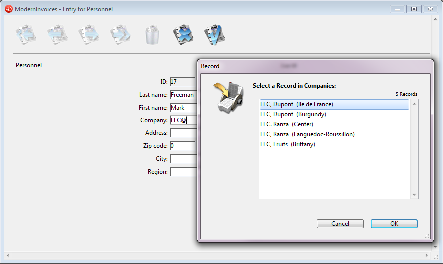

<!--REF #_command_.RELATE ONE.Syntax-->**RELATE ONE** ( manyTable | Field {; *choiceField*} )<!-- END REF-->
<!--REF #_command_.RELATE ONE.Params-->
| 引数 | 型 |  | 説明 |
| --- | --- | --- | --- |
| manyTable &#124; Field | テーブル, フィールド | &#8594;  | すべての自動リレーションを実行するテーブル, または1テーブルへのマニュアルリレーションが引かれたフィールド |
| choiceField | Field | &#8594;  | 1テーブルの選択フィールド |

<!-- END REF-->

*このコマンドはスレッドセーフではないため、プリエンプティブなコードには使えません。*


#### 説明 

<!--REF #_command_.RELATE ONE.Summary-->**RELATE ONE** には2つの形式があります。<!-- END REF--> 

一番目の形式、**RELATE ONE** **(manyTable)**は、カレントプロセスの*manyTable*に対しすべての自動n対1リレーションを実行します。これはつまり、*manyTable*の自動n対1リレーションを持つフィールドごとに、コマンドはリレートしたテーブルのリレートしたレコードを選択します。これはプロセスにおいて、リレートしたテーブルのカレントレコードを変更します。

二番目形式**RELATE ONE** **(manyField{;choiceField})**は、*manyField*に関連するレコードを検索します。自動リレートである必要はありません。レコードが存在する場合、**RELATE ONE** はリレート先レコードをメモリにロードし、これをそのテーブルのカレントレコードおよびカレントセレクションにします。

任意の引数の*choiceField*は、リレート先テーブルのフィールドでなければなりません。*choiceField*は文字、テキスト、数値、日付、時間、またはブ－ルフィールドでなければなりません。具体的には、ピクチャまたはBLOB 型フィールドを選択することはできません。

*choiceField*が指定され、リレート先テーブルで複数のレコードを発見した場合、**RELATE ONE** は*manyField*の内容と一致するレコードをリストに表示します。この選択リストは、左の欄にリレート先フィールドの内容を、右の欄に*choiceField*の内容を表示します。

*manyField*の内容がワイルドカード記号 (@) で終了する場合、複数のレコードが見つかることがあります。一致するレコードが1件しかなければ、リストは表示されません。

以下の画像には、レコードが入力中で、選択リストが前面に表示されています。



選択リストを表示させるには以下のコマンドが使用されました: 

```4d
 RELATE ONE([Personnel]Company;[Companies]Region)
```

ここではユーザーは、LLCで名前が始まる会社を探すために"LLC@"と入力し、またその場所についても調べています。

*choiceField*を指定することは、テーブルのリレートを設定する時点でワイルドカード選択を指定するのと同じことです。ワイルドカード選択に関する詳細は、4D Design Referenceマニュアルを参照してください。

##### 

**注:** このコマンドはオブジェクト型フィールドをサポートしません。

#### 例題 

ここに *\[Invoice\]* テーブルと*\[Customers\]* テーブルが２つのマニュアルリレートにより関連づけられています。ひとつは *\[Invoice\]Bill to* から*\[Customers\]Number* へ、もうひとつは*\[Invoice\]Ship to* から*\[Customers\]Number* にリレートされています。 


以下は、\[Invoice\] テーブルのフォームが"Bill to"と "Send to"の情報を表示している様子です:


両方のリレート先は同じ\[Customers\]テーブルになっており、同時に請求先と発送先の情報を得ることは出来ません。フォームに両方の住所を表示するためには、変数とRELATE ONEコマンドを使用します。 もし、\[Customers\]フィールドを表示に使用したなら、一方のリレートから得られたデータしか表示されません。

以下は\[Invoice\]Bill toと\[Invoice\]Ship toフィールドのオブジェクトメソッドです。これらはフィールドに入力されると実行されます。

*\[Invoice\]Bill to* フィールドのオブジェクトメソッド:

```4d
 RELATE ONE([Invoice]Bill to)
 vAddress1:=[Customers]Address
 vCity1:=[Customers]City
 vState1:=[Customers]State
 vZIP1:=[Customers]ZIP
```

*\[Invoice\]Ship to* フィールドのオブジェクトメソッド:

```4d
 RELATE ONE([Invoice]Ship to)
 vAddress2:=[Customers]Address
 vCity2:=[Customers]City
 vState2:=[Customers]State
 vZIP2:=[Customers]ZIP
```

#### システム変数およびセット 

コマンドが正しく実行されリレーとされたレコードがロードされると、OKシステム変数は1に設定されます。ユーザが(リレートされたレコードが更新されたときに表示される) レコード選択ダイアログボックスで**キャンセル**をクリックすると、OK変数は0に設定されます。

#### 参照 

[OLD RELATED ONE](old-related-one.md)  
[RELATE MANY](relate-many.md)  