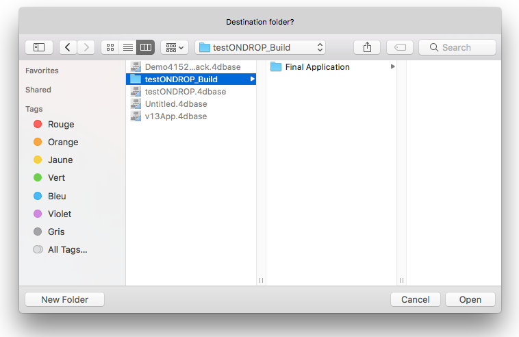
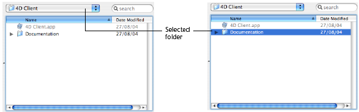

<!--REF #_command_.Select folder.Syntax-->**Select folder** ( {*message* }{;}{ *defaultPath* {; *options*}} ) : Text<!-- END REF-->
<!--REF #_command_.Select folder.Params-->
| 引数 | 型 |  | 説明 |
| --- | --- | --- | --- |
| message | Text | &#8594;  | ウィンドウのタイトル |
| defaultPath | Text, Integer | &#8594;  | デフォルトのパス名、 または、デフォルトのユーザフォルダを表示する空の文字列 (Windowsでは"My documents"、 Mac OSでは"Documents")、 または記憶されたパス名の番号 |
| options | Integer | &#8594;  | Mac OS上での選択オプション |
| 戻り値 | Text | &#8592; | 選択されたフォルダへのアクセスパス |

<!-- END REF-->

#### 説明 

<!--REF #_command_.Select folder.Summary-->**Select folder** コマンドは、フォルダを選択するダイアログボックスを表示し、フォルダへの完全なアクセスパスを検索します。<!-- END REF-->オプションの引数*defaultPath*を使用して、フォルダの場所を指定します。そのフォルダは最初にフォルダ選択ダイアログボックスに表示されます。 

**Note:** このコマンドは、4Dのカレントフォルダを変更しません。

**Select folder** コマンドはワークステーションのボリュームおよびフォルダ内をナビゲートするための標準のダイアログボックスを表示します。  
オプションの引数*message*を指定すると、ダイアログボックス内に表示されます。以下の例では "Select a destination folder" を表示しています。

**Windows**  


**macOS** 


 引数*defaultPath*を使用して、フォルダ選択ダイアログボックスにあるデフォルトフォルダの場所を表示します。3タイプの値をこの引数に渡します:  
* カレントプラットフォームのシンタックスを使用している有効なフォルダのパス名。
* システムのデフォルトユーザフォルダを表示する空の文字列(“”) (デフォルトユーザフォルダは、Windowsでは"My documents” 、 macOSでは“Documents”になります) 。
* 記憶されたパス名の番号 (1から32,000) 。それに結び付いているフォルダを表示します。これは、選択ボタンをクリックすると開いているフォルダのパス名が記憶されることを意味します。つまり、 ユーザによって選択されたフォルダを指します。このコマンドの最初の呼び出し時に任意の数字 (例えば5) を渡すと、コマンドはシステムのデフォルトユーザフォルダを表示します(空の文字列を渡すことに対応する) 。ユーザはハードディスク上の複数のフォルダをブラウズし、選択ボタンをクリックすると、パス名が番号5に結び付けられます。次に数値の5を渡してこのコ マンドを呼び出すと、記録されたパス名がデフォルトで使用されます。新しい場所が選択されると、5に対応するパスが更新されます。  
    
このメカニズムを利用して、32,000までのパス名を記憶できます。Windowsではセッションの間のみパスが保持ます。macOSでは、一つのセッションから次のセッションまで、パスが保持されています。パス名が正しくないと、引数*defaultPath*は無視されます。

**Note:** このメカニズムは、[Select document](select-document.md) コマンドで使用しているメカニズムと同じです。記憶されたパス名の数は、この二つのコマンド間で共有されます。

*options*引数はmacOSにおいて追加の機能を使用できるようにします。この引数に、*System Documents* テーマ中、以下のいずれかの定数を渡すことができます: 

| 定数               | 型    | 値  | コメント                                                                                                                                                                                                                  |
| ---------------- | ---- | -- | --------------------------------------------------------------------------------------------------------------------------------------------------------------------------------------------------------------------- |
| Package open     | 倍長整数 | 2  | (Mac OSのみ): パッケージをフォルダとして開きその内容を閲覧できます。この定数が使用されないと、コマンドはパッケージの開封を許可しません。                                                                                                                                             |
| Use sheet window | 倍長整数 | 16 | (Mac OSのみ): 選択ダイアログボックスをシートウィンドウで表示します(Windowsでは、このオプションは無効です)。シートウィンドウはMac OS Xインタフェースに特有なもので、グラフィックアニメーションを伴います (詳細については、[DISPLAY SELECTION](display-selection.md)を参照してください) 。この定数が使用されないと、コマンドは標準なダイアログボックスを表示します。 |

1つあるいは両方を合計した値を渡すことができます。このオプションはmacOSでのみ使用できます。Windowsでは*options*引数は渡されても無視されます。

ユーザがフォルダを選択して**フォルダを選択**ボタン(Windows)または開くボタン(macOS)をクリックすると、フォルダへのアクセスパスが返されます。

* Windowsでは、アクセスパスは、次のフォーマットで返されます:  
“C:\\Folder1\\Folder2\\SelectedFolder\\”
* macOSでは、アクセスパスは、次のフォーマットで返されます:  
“Hard Disk:Folder1:Folder2:SelectedFolder:”

**Note:** macOSでは、ダイアログボックス内でフォルダの名前を選択しているかどうかで、返ってくるパスは違うものになる場合があります。




**4D Server:** この関数は、クライアントワークステーションに接続されているボリュームを見ることができるようにするものです。ストアードプロシージャからこの関数を呼び出すことはできません。

ユーザがダイアログボックスを受け入れるとシステム変数OKは1になります。**Cancel** ボタンをクリックすると、システム変数OKは0になり、関数は空文字を返します。

**Note:** Windowsでは、ユーザが"ワークステーション" や "ごみ箱" のような何らかの誤った要素を選択すると、ユーザがダイアログボックスを受け入れてもシステム変数OKは0になります。

#### 例題 

次の例ではフォルダを選択し、そこにピクチャライブラリ内のピクチャを保存する場合を考えます:

```4d
 $PictFolder:=Select folder("Select a folder for your pictures.")
 PICTURE LIBRARY LIST(pictRefs;pictNames)
 For($n;1;Size of array(pictNames))
    GET PICTURE FROM LIBRARY(pictRefs{$n};$vStoredPict)
    WRITE PICTURE FILE($PictFolder+pictNames{$n};$vStoredPict)
 End for
```

#### 参照 

[CREATE FOLDER](create-folder.md)  
[FOLDER LIST](folder-list.md)  
[Select document](select-document.md)  